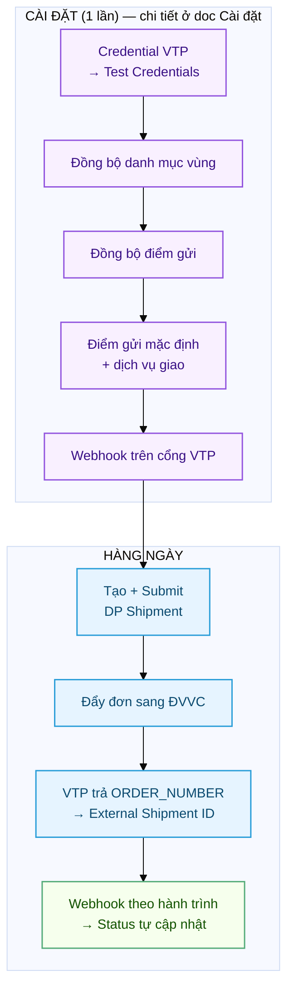
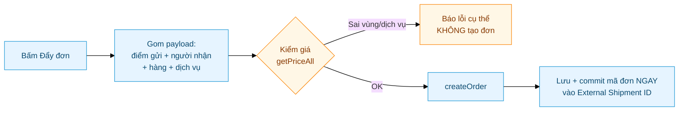
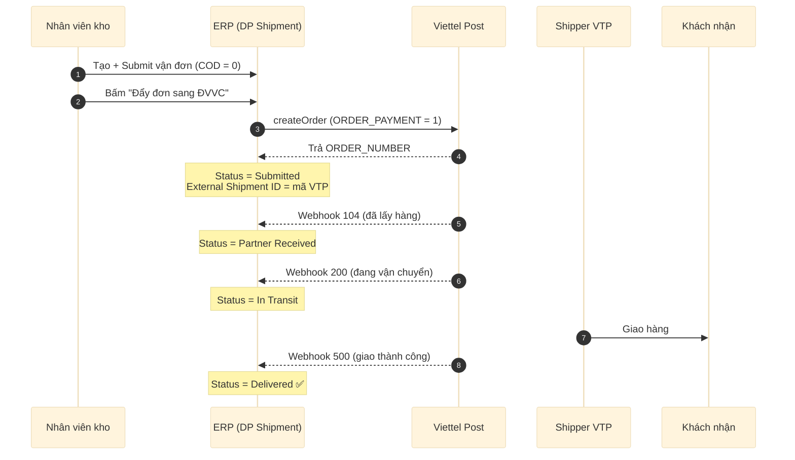
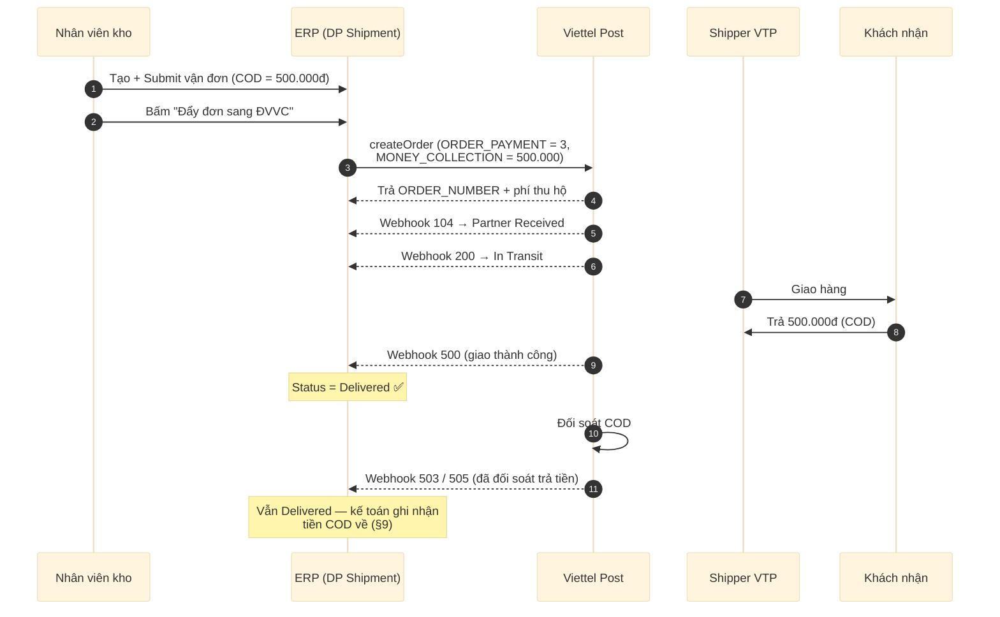
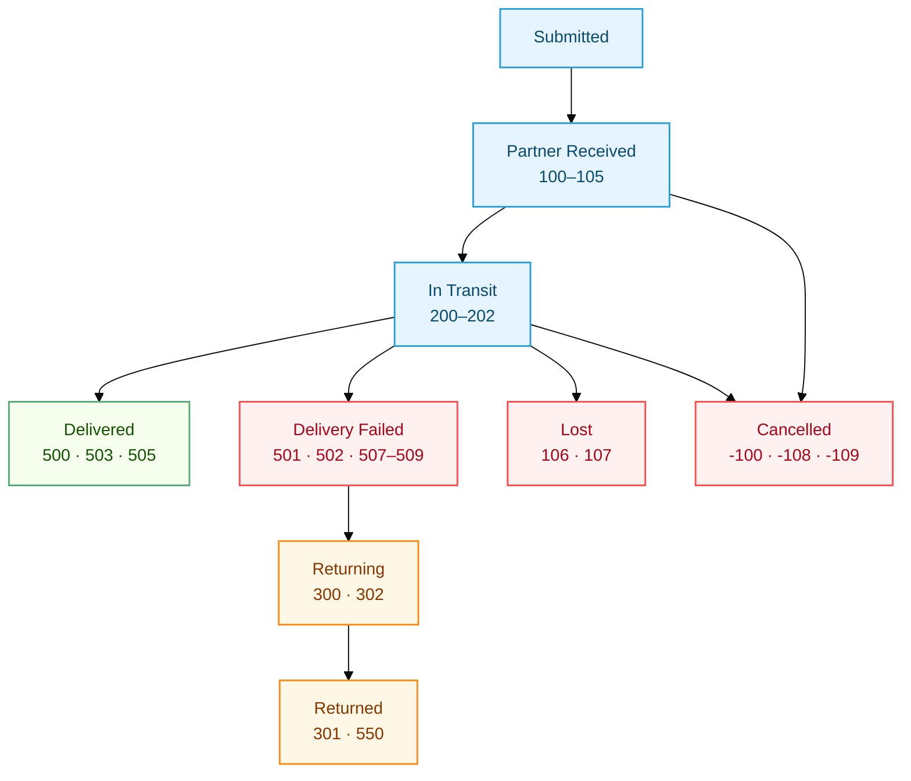

# Viettel Post — Tham chiếu kỹ thuật

Tài liệu **tham chiếu** cho developer / quản trị viên: cơ chế auth, đồng bộ danh mục,
payload đẩy đơn, bảng mã trạng thái, webhook, test và kế toán COD của carrier **Viettel Post (VTP)**.

> 📘 **Cần hướng dẫn thao tác từng bước (có ảnh Desk)?** Xem
> [Viettel Post — Cài đặt & sử dụng](../users/Delivery_Partner-Viettel_Post-Cai-Dat.html).
> Bản này **không lặp** phần click-by-click — chỉ đi sâu cơ chế + tham chiếu.

> **Thông tin VTP trong hệ thống:**
> - Partner name: `Viettel Post` · code: `vtp`
> - Auth: **Token Exchange** (`POST /v2/user/Login` → JWT, cache theo `token_ttl`)
> - Production: `https://partner.viettelpost.vn` · Sandbox: `https://partnerdev.viettelpost.vn`
> - Client: `api_client/viettelpost.py` · Handler: `handlers/viettelpost.py`

---

## 1. Tổng quan luồng



---

## 2. Cấu hình — tham chiếu

Thao tác từng bước (có ảnh) ở [doc Cài đặt](../users/Delivery_Partner-Viettel_Post-Cai-Dat.html).
Bảng dưới tóm tắt **cơ chế + nơi lưu** cho từng phần.

| Bước | Cơ chế kỹ thuật | Nơi lưu / API |
|---|---|---|
| **Credential** | `POST /v2/user/Login` (username/password) → JWT, cache theo `token_ttl`, gửi `Authorization: Bearer <token>` các request sau | DP Partner Account · `test_connection()` |
| **Đồng bộ vùng** | Kéo `listProvinceById` / `listDistrict` / `listWards` (**API công khai, không cần token**) → chuẩn hoá tên + alias → `DP Carrier Region` (~16.000 bản ghi: 63 tỉnh · 746 huyện · 15.660 xã). **Toàn cục, 1 lần** — địa chỉ mới KHÔNG cần sync lại. Quyền theo **DocPerm Create trên DP Carrier Region** (mặc định SM/Stock Manager/DP Manager, chỉnh qua Role Permission Manager) | `api/region.py` · doctype **DP Carrier Region** |
| **Tự dò mã vùng Address** | `doc_events Address.validate → autofill_address_region`: lưu Address là tự dò + điền `vtp_*_id` (êm — lỗi chỉ log, không chặn lưu). Re-resolve chỉ khi 3 Link tỉnh/huyện/xã **đổi** (so thẳng DB); chỉ ghi cấp dò RA → override tay được bảo toàn. Lúc đẩy đơn còn thiếu thì dò lại lần nữa | `api/region.py` · hook trong `hooks.py` (**deploy nhớ clear-cache**) |
| **Đồng bộ điểm gửi** | `listInventory` (cần token) → tạo **DP Pickup Point** (mã `GROUPADDRESS_ID` + `CUS_ID`) | `api/pickup_point.py` |
| **Điểm gửi mặc định** | Nếu account >1 điểm gửi mà không tick `Is Default` → đẩy đơn báo lỗi. 1 điểm gửi → auto dùng | DP Pickup Point · `get_default_pickup_point()` |
| **Dịch vụ giao** | Mã dịch vụ **cấp theo hợp đồng account** + **đổi theo tuyến** + **khung cân riêng từng mã** (`STK`/`SCN`... max ~10–15kg; `BTK` hàng nặng min ~15kg — sai khung là VTP báo *"Price does not apply to this itinerary!"*). `_resolve_service` ưu tiên: ô **Dịch vụ giao** trên vận đơn (Link **DP Account Service**) → dòng `is_default` của account → **hết** (Extra Params `ORDER_SERVICE` ĐÃ GỠ — param Body từng bị merge đè lên payload, tráo dịch vụ user chọn). Cả hai trống → server throw; UI guard (`_ensure_service_then` + `route_services_supported`) **tự mở dialog xem cước** cho chọn rồi đẩy tiếp. Danh mục DP Account Service **tự học** từ dialog "Xem cước theo dịch vụ" (get-or-create từ response getPriceAll, `ignore_permissions` sau khi check quyền write trên vận đơn) | doctype **DP Account Service** · `api/shipment.py: list_route_services / ensure_account_service / route_services_supported` |
| **Webhook** | Cổng VTP bắn `POST` về endpoint; verify header `X-VTP-Token == webhook_secret` | `handlers/viettelpost.py` |

### 2.1. Mã dịch vụ (ORDER_SERVICE)

| Mã | Tên | Đặc điểm |
|---|---|---|
| `VTK` | CP tiết kiệm thỏa thuận | Rẻ nhất, ~72h |
| `STK` | Chuyển phát tiêu chuẩn | ~72h |
| `LCOD` | TMĐT Tiết Kiệm | ~72h |
| `SCN` | Chuyển phát nhanh | ~36h |
| `VCN` | CP nhanh thỏa thuận | ~36h |
| `NCOD` | TMĐT Nhanh | ~36h |
| `SHT` | Chuyển phát hỏa tốc | ~24h |
| `VHT` | Hỏa tốc thỏa thuận | ~24h |
| `PHS` | Nội tỉnh tiết kiệm | Chỉ dùng nội tỉnh |

> **Không chắc account có mã nào?** Bấm **"Xem cước theo dịch vụ"** trên vận đơn — dialog liệt kê
> mã + tên + phí đúng tuyến (cùng `getPriceAll`, §3); chọn 1 dòng là tự ghi vào danh mục
> DP Account Service + set vào đơn. Đẩy đơn với mã sai vẫn bị chặn kèm danh sách mã hợp lệ.
>
> Ô Dịch vụ giao `allow_on_submit` (đổi được sau Submit tới khi có mã đơn), khoá khi đã đẩy
> (`external_shipment_id`); server chặn chọn chéo account + chặn đổi sau khi đẩy.

> ⚠️ **Extra Parameters kiểu Body đã bị gỡ toàn bộ** (kể cả `ORDER_SERVICE`, `ORDER_PAYMENT`,
> `ORDER_SERVICE_ADD`, `SENDER_*`, `PRODUCT_LENGTH/WIDTH/HEIGHT`): trước đây chúng bị merge
> `dict.update()` **đè lên payload** — dòng `ORDER_SERVICE=STK` từng âm thầm tráo dịch vụ user
> chọn, làm đơn nặng chết *"Price does not apply to this itinerary!"* trong khi pre-validate pass.
> Payload giờ build 100% từ dữ liệu có chủ đích (điểm gửi sync, ô Dịch vụ giao, tab Parcels/Charges).
> Extra Params chỉ còn dùng cho **Header/Query** (VD ShopId của GHN sau này). Thấy dòng
> `ORDER_SERVICE` còn sót trong account thì xoá.

### 2.2. Webhook

| Ô trên cổng VTP | Giá trị |
|---|---|
| **Webhook Endpoints** | `https://<domain>/api/method/delivery_partner.api.webhook.handle?partner=Viettel+Post` |
| **Secret parameter** | 1 chuỗi bí mật — điền **trùng** vào field `Webhook Secret` của DP Partner `Viettel Post` |

- `partner=Viettel+Post` **bắt buộc khớp** tên `Viettel Post` (dấu cách encode `+`).
- Handler xác thực bằng header **`X-VTP-Token` == `Webhook Secret`**.
- Để **trống** `Webhook Secret` → bỏ qua verify (nhận mọi request) — tiện test, kém an toàn.

---

## 3. Đẩy đơn — cơ chế

Sau khi Submit và **chưa có** External Shipment ID, menu **Actions** có 2 lựa chọn.

**a) "Đẩy đơn sang ĐVVC"** — tạo đơn thật:



**Payload `createOrder` — các field quan trọng:**

| Field | Ý nghĩa |
|---|---|
| `ORDER_NUMBER` | = `shipment.name` — **bắt buộc**, thiếu → VTP báo *"Price does not apply to this itinerary"* |
| `GROUPADDRESS_ID` / `CUS_ID` | Từ điểm gửi mặc định (DP Pickup Point) |
| `SENDER_WARD` / `RECEIVER_WARD` | Mã vùng (RECEIVER_WARD tuỳ chọn) |
| `ORDER_PAYMENT` | Map từ COD + **Charges Paid By**: `1` không thu · `2` người nhận trả cước · `3` COD (cước người gửi) · `4` COD + người nhận trả cước |
| `ORDER_SERVICE` | Mã dịch vụ — `_resolve_service`: đơn → default account (hết — Extra Params đã gỡ) |
| `MONEY_COLLECTION` | = COD Amount khi có COD |
| `PRODUCT_QUANTITY` | **SỐ KIỆN** = tổng `count` tab Parcels (KHÔNG phải tổng qty item — gửi qty là cổng VTP hiểu nhầm số kiện) |
| `PRODUCT_LENGTH/WIDTH/HEIGHT` | Từ **tab Parcels**: max dài/rộng + cộng dồn cao×count (thể tích quy đổi); mặc định 10cm khi trống. Cũng gửi kèm ở getPriceAll pre-check để giá sát thật |
| `LIST_ITEM` | Danh sách hàng |

**Phí trả về (`createOrder` response)** — lưu `MONEY_TOTAL` (**tổng phải trả** = cước gốc
`MONEY_TOTAL_FEE` + phụ phí `MONEY_FEE`/`MONEY_OTHER_FEE`/`MONEY_VAS` + `MONEY_VAT`) vào
**Shipping Fee** — trùng đúng `GIA_CUOC` mà getPriceAll/dialog xem cước hiển thị (đo thật:
15.278 + 764 + 1.283 = 17.325). Cấu phần ghi vào comment Activity (`_fee_breakdown`).
Đừng lưu `MONEY_TOTAL_FEE` — chưa VAT/phụ phí, sẽ lệch với giá đã báo user.

**Trình tự & an toàn:**

1. **Kiểm giá trước** (`getPriceAll`): sai mã vùng / dịch vụ không áp tuyến → **báo lỗi rõ, KHÔNG tạo đơn** (tránh đơn rác).
2. Qua kiểm → `createOrder` → **`db_set("external_shipment_id", ..., commit=True)` ngay** khi VTP trả về, rồi mới ghi các phụ (phí, comment, status) trong try/except riêng → lỗi phụ **không làm mất mã** (chống đơn mồ côi).
3. Lỗi API / **timeout**: cảnh báo *"đơn CÓ THỂ đã được tạo — kiểm cổng VTP TRƯỚC khi đẩy lại"*.

**b) "Đã tạo đơn ở ngoài"** — nhập `ORDER_NUMBER` tạo trên cổng VTP vào External Shipment ID.

**Chống trùng:** hễ đã có External Shipment ID → cả 2 nút **biến mất**.

**Huỷ đơn:** `UpdateOrder` với `TYPE=4` (không phải `STATUS:4`). VTP có **độ trễ propagation** →
`cancel_order_for_shipment` retry (thường thành công ở lần 2, ~3s sau).

> **Tự động khi Cancel vận đơn:** bấm **Cancel** trên DP Shipment → `DPShipment.before_cancel` gọi
> `cancel_order_for_shipment` huỷ đơn VTP TRƯỚC. **VTP từ chối** (đơn đã lấy hàng / đang giao / đã giao)
> → **CHẶN Cancel**, báo lỗi rõ (đơn ERP vẫn Submitted, ERP ↔ VTP luôn khớp). Hàng đã đi mà cần huỷ →
> dùng luồng **hoàn hàng** thay vì Cancel.

---

## 4. Hành trình một đơn — KHÔNG COD

`COD Amount = 0` → `ORDER_PAYMENT = 1` (hoặc `2` nếu Charges Paid By = Receiver).



| Bước | Sự kiện VTP | Status ERP |
|---|---|---|
| Đẩy đơn xong | — | `Submitted` (đã có mã đơn) |
| VTP lấy hàng | webhook `104` | `Partner Received` |
| Trên đường | webhook `200` | `In Transit` |
| Giao xong | webhook `500` | `Delivered` ✅ |

---

## 5. Hành trình một đơn — CÓ COD

`COD Amount > 0` → `ORDER_PAYMENT = 3` (hoặc `4` nếu Charges Paid By = Receiver), `MONEY_COLLECTION = COD`.



| Điểm | Không COD | Có COD |
|---|---|---|
| `COD Amount` | 0 | > 0 (VD 500.000) |
| `ORDER_PAYMENT` (tự set) | `1` (·`2` nếu Receiver trả cước) | `3` (·`4` nếu Receiver trả cước) |
| VTP thu tiền khách | Không | Có, khi giao |
| Phí thu hộ | 0 | VTP tính thêm |
| Trạng thái cuối | `Delivered` (500) | `Delivered` (500) → **503/505** khi đối soát COD |
| Kế toán | Không | Ghi nhận tiền COD về (§9) |

> Mã `503` / `505` (đã đối soát trả tiền / COD) **vẫn map về `Delivered`** — đơn đã hoàn tất.

---

## 6. Bảng map trạng thái (27 dòng, có sẵn)



| ORDER_STATUS | Mô tả VTP | DP Shipment Status |
|---|---|---|
| 100–105 | Tạo đơn → duyệt → lấy hàng → nhập kho | Partner Received |
| 200–202 | Đang vận chuyển / giao | In Transit |
| 500 | Giao hàng thành công | Delivered |
| 503 / 505 | Đã đối soát trả tiền / COD | Delivered |
| 504 | Đã đối soát công nợ | Delivered |
| 501 · 502 · 507 · 508 · 509 | Giao thất bại (các lý do) | Delivery Failed |
| 300 · 302 | Đang / chờ chuyển hoàn | Returning |
| 301 · 550 | Chuyển hoàn thành công / đối soát hoàn | Returned |
| 106 · 107 | Hư hỏng / mất hàng | Lost |
| -100 · -108 · -109 | Hủy đơn (các loại) | Cancelled |

> Mã **không có** trong bảng → log cảnh báo + bỏ qua (không đổi status). Cần thì thêm dòng vào
> **Status Mappings** của DP Partner `Viettel Post`.

Các field tra cứu ở **tab Tracking**: `Status` (chuẩn hoá) · `External Shipment ID` (`ORDER_NUMBER`) ·
`Tracking Status` (mã thô gần nhất) · `Tracking Status Info` · `Tracking URL`. Mỗi webhook ghi thêm 1
**Comment** để truy vết.

---

## 7. Test luồng trạng thái không cần đơn thật

Mô phỏng webhook trên một DP Shipment đã Submit (chỉ môi trường dev có console):

```python
# bench --site <site> console
from delivery_partner.scripts.simulate_webhooks import *
vtp_full_flow("SHIP-DP-2026-00001", external_id="<mã đơn>", flow="happy")   # 104 → ... → 500
vtp_full_flow("SHIP-DP-2026-00001", external_id="<mã đơn>", flow="cancel")  # → Cancelled
```

Hoặc qua HTTP (test đường webhook thật):

```bash
curl -s -X POST "https://<domain>/api/method/delivery_partner.api.webhook.handle?partner=Viettel+Post" \
  -H "Content-Type: application/json" \
  -H "X-VTP-Token: <webhook_secret>" \
  -d '{"ORDER_NUMBER": "<external_shipment_id>", "ORDER_STATUS": 500, "NOTE": "Giao thanh cong"}'
```

> Chi tiết framework simulate (GHN/VTP, step-by-step, `print_curl_commands`) xem
> [Tài liệu kỹ thuật app gốc §8](Delivery_Partner-Tech.html#8-setup-scripts).

---

## 8. Troubleshooting (kỹ thuật)

### Test Credentials báo đỏ
- Username/Password đúng môi trường (Use Sandbox khớp production/sandbox)?
- Password trên site vừa restore từ backup có thể **chưa nhập lại** → gõ lại rồi Save.

### Bấm "Đẩy đơn" báo lỗi

| Lỗi | Nguyên nhân & cách xử lý |
|---|---|
| *"chưa đặt điểm gửi mặc định"* | Vào DP Pickup Point tick **Is Default** cho 1 kho |
| *"Chưa chọn dịch vụ giao"* | Chọn ô **Dịch vụ giao** trên vận đơn (nút "Xem cước theo dịch vụ"), hoặc đặt `is_default` trong DP Account Service của account |
| *"Mã dịch vụ X không khả dụng… Mã hợp lệ: …"* | Tuyến không có mã đó — "Xem cước theo dịch vụ" chọn lại; mặc định account/Extra Params chỉ là fallback |
| *"Không xác định được mã vùng người nhận"* | Address thiếu/không khớp Tỉnh-Huyện → chọn đúng Tỉnh/Huyện/Phường rồi Lưu (tự dò lại). Quận sáp nhập (Quận 2/9 → Thủ Đức) resolver tự suy quận mới từ phường (`_district_via_ward`: phường khớp duy nhất trong tỉnh, loại quận-giả "Bỏ qua - địa chỉ 2 cấp" id ≥ 100000000; phường trùng tên nhiều quận thì không đoán). Chỉ còn trượt khi phường mơ hồ → "Dò mã vùng VTP" + nhập ID tay. **KHÔNG cần re-sync danh mục** — chỉ sync khi danh mục rỗng (có message riêng) |
| *"đơn CÓ THỂ đã được tạo…"* | Lỗi mạng/timeout — **kiểm cổng VTP** xem đơn đã tạo chưa TRƯỚC khi đẩy lại |
| Không thấy nút | Vận đơn phải **đã Submit** và **chưa** có External Shipment ID |
| *"Price does not apply to this itinerary"* | Lỗi catch-all của VTP = "không tra được giá cho bộ (tuyến + dịch vụ + cân nặng + payload)". Các nguyên nhân đã gặp thật: **(1) dịch vụ sai khung cân** — mỗi mã có khung riêng (`STK` max ~10–15kg, `BTK` min ~15kg; đo bằng `getPrice` public); **(2)** dịch vụ bị **Extra Param Body `ORDER_SERVICE` đè** (bug đã gỡ 24/07 — pre-validate pass mã user chọn nhưng payload gửi mã khác); **(3)** thiếu `ORDER_NUMBER` / sai `ORDER_PAYMENT` / thiếu `LIST_ITEM`. Debug: gọi `POST /v2/order/getPrice` (public) với đúng SENDER/RECEIVER + ORDER_SERVICE + PRODUCT_WEIGHT của đơn — tái hiện được ngay mã nào áp/không áp |

### Webhook không cập nhật trạng thái
1. Webhook trên cổng VTP đúng endpoint (`?partner=Viettel+Post`)?
2. DP Partner `Viettel Post` có `is_active = 1`?
3. `External Shipment ID` khớp `ORDER_NUMBER` VTP gửi?
4. Mã `ORDER_STATUS` có trong Status Mapping? Xem **Error Log**.
5. **Đã fix**: `frappe.request.data` là bytes trên request thật → handler decode bytes trước khi parse JSON (bản cũ parse rỗng → không cập nhật).

### Verify webhook fail (Invalid signature)
- `Webhook Secret` bên ERP trùng "Secret parameter" trên cổng VTP?
- Tạm để trống `Webhook Secret` để bỏ qua verify khi test nhanh.

---

## 9. Kế toán COD

Với đơn có COD, VTP thu tiền hộ rồi đối soát trả về. Cấu hình hạch toán trên **DP Partner Account**:

| Field | Loại account | Ghi chú |
|---|---|---|
| **Partner Warehouse** | Warehouse leaf (kho ảo "hàng đang ở carrier") | mỗi công ty 1 kho |
| **COD Receivable Account** | **`account_type = Receivable`** (BẮT BUỘC) | giữ tiền COD carrier thu hộ |

> 🔴 **BẪY prod:** script setup / tạo tay hay để COD account thành **`Cash`**. Khi giao COD, extension
> tạo Sales Invoice với `debit_to = cod_account` rồi Payment Entry cấn trừ — nếu account **không phải
> `Receivable`** → ValidationError, **đơn COD chết ở bước hoá đơn/thu tiền**. Kiểm Chart of Accounts,
> đảm bảo `account_type = Receivable` trước khi chạy đơn COD thật.

**Vì sao COD phải là `Receivable`:** extension đặt `si.debit_to = cod_account` (SI ghi thẳng vào COD
receivable thay vì Debtors) để Payment Entry kiểu **"Receive"** (`paid_from = cod_account`, `party = Customer`)
cấn trừ được — 2 lệnh phải cùng account, mà account party của "Receive" bắt buộc `Receivable`.

**COD một phần (COD < tổng SI):** PE chỉ cấn đúng số COD → SI thành **"Partly Paid"**,
`outstanding = tổng − COD` — đúng kế toán (verify bằng test 21/07). Lưu ý: phần khách còn nợ khi đó
**treo trên COD account** (vì `debit_to` là COD account, không phải Debtors) — hiếm gặp vì COD thường
= tổng đơn; kế toán cần biết khi đối chiếu công nợ.

> ⚠️ **Đích đến tiền COD** (`paid_to`) resolve theo: *Bank Account trên Sales Order → account của
> pickup warehouse → Company default cash account*, và **phải là Bank/Cash**. Đặt **Bank Account
> trên Sales Order** hoặc đảm bảo **Company có Default Cash Account**, tránh rơi vào account `Stock`
> của warehouse.

Chi tiết chuỗi tạo chứng từ ERP (MR/SE/DN/SI/PE): [Lifecycle & Doc Events](Delivery_Partner-Lifecycle.html).

---

## Liên quan

- [Viettel Post — Cài đặt & sử dụng (end-user, có ảnh)](../users/Delivery_Partner-Viettel_Post-Cai-Dat.html)
- [Delivery Partner — Tài liệu kỹ thuật (app gốc)](Delivery_Partner-Tech.html)
- [Delivery Partner — Lifecycle & Doc Events](Delivery_Partner-Lifecycle.html)
