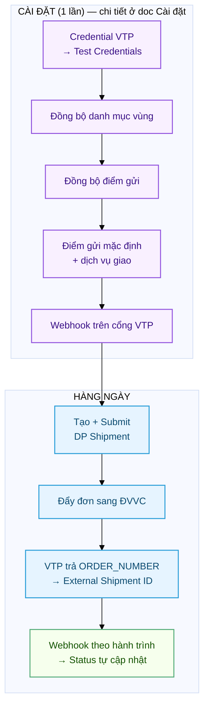
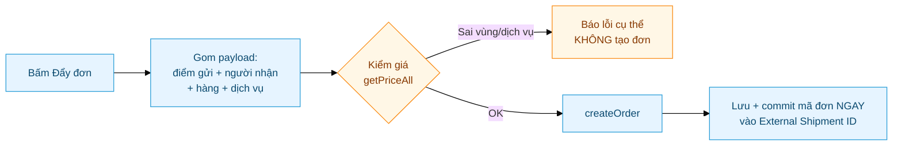
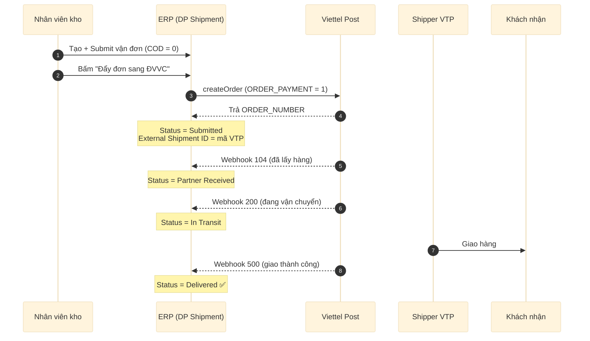
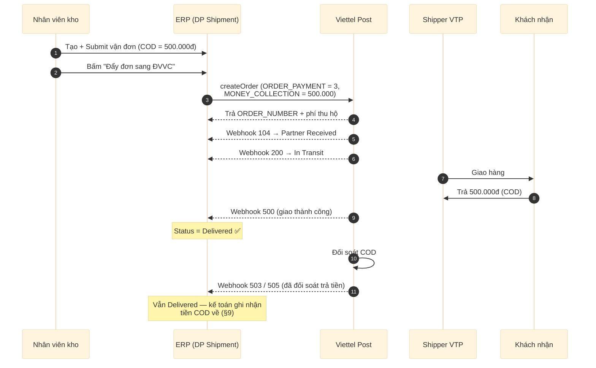
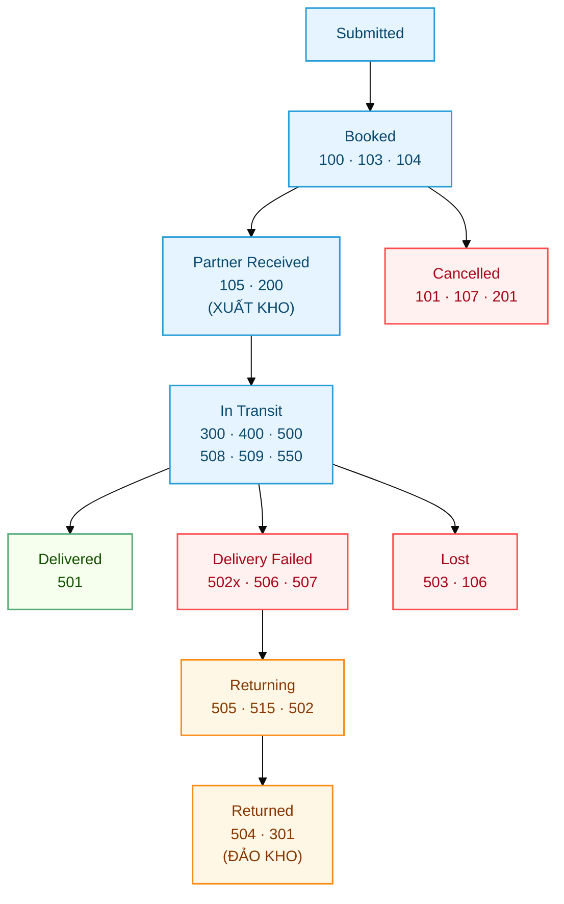

# Viettel Post — Tham chiếu kỹ thuật

Tài liệu **tham chiếu** cho developer / quản trị viên: cơ chế auth, đồng bộ danh mục,
payload đẩy đơn, bảng mã trạng thái, webhook, test và kế toán COD của carrier **Viettel Post (VTP)**.

> 📘 **Cần hướng dẫn thao tác từng bước (có ảnh Desk)?** Xem
> [Viettel Post — Cài đặt & sử dụng](../users/Delivery_Partner-Viettel_Post-Cai-Dat.html).
> Bản này **không lặp** phần click-by-click — chỉ đi sâu cơ chế + tham chiếu.

> **Thông tin VTP trong hệ thống:**
> - Partner name: `Viettel Post` · code: `vtp`
> - Auth: **Token Exchange** (`POST /v2/user/Login` → JWT, cache theo `token_ttl`)
> - Production: `https://partner.viettelpost.vn` · Sandbox: `https://partnerdev.viettelpost.vn`
> - Client: `api_client/viettelpost.py` · Handler: `handlers/viettelpost.py`

---

## 1. Tổng quan luồng



---

## 2. Cấu hình — tham chiếu

Thao tác từng bước (có ảnh) ở [doc Cài đặt](../users/Delivery_Partner-Viettel_Post-Cai-Dat.html).
Bảng dưới tóm tắt **cơ chế + nơi lưu** cho từng phần.

| Bước | Cơ chế kỹ thuật | Nơi lưu / API |
|---|---|---|
| **Credential** | `POST /v2/user/Login` (username/password) → JWT, cache theo `token_ttl`, gửi `Authorization: Bearer <token>` các request sau | DP Partner Account · `test_connection()` |
| **Đồng bộ vùng** | Kéo `listProvinceById` / `listDistrict` / `listWards` (**API công khai, không cần token**) → chuẩn hoá tên + alias → `DP Carrier Region` (~16.000 bản ghi: 63 tỉnh · 746 huyện · 15.660 xã). **Toàn cục, 1 lần** — địa chỉ mới KHÔNG cần sync lại. Quyền theo **DocPerm Create trên DP Carrier Region** (mặc định SM/Stock Manager/DP Manager, chỉnh qua Role Permission Manager) | `api/region.py` · doctype **DP Carrier Region** |
| **Tự dò mã vùng Address** | `doc_events Address.validate → autofill_address_region`: lưu Address là tự dò + điền `vtp_*_id` (êm — lỗi chỉ log, không chặn lưu). Re-resolve chỉ khi 3 Link tỉnh/huyện/xã **đổi** (so thẳng DB); chỉ ghi cấp dò RA → override tay được bảo toàn. Lúc đẩy đơn còn thiếu thì dò lại lần nữa | `api/region.py` · hook trong `hooks.py` (**deploy nhớ clear-cache**) |
| **Đồng bộ điểm gửi** | `listInventory` (cần token) → tạo **DP Pickup Point** (mã `GROUPADDRESS_ID` + `CUS_ID`) | `api/pickup_point.py` |
| **Điểm gửi mặc định** | Nếu account >1 điểm gửi mà không tick `Is Default` → đẩy đơn báo lỗi. 1 điểm gửi → auto dùng | DP Pickup Point · `get_default_pickup_point()` |
| **Dịch vụ giao** | Mã dịch vụ **cấp theo hợp đồng account** + **đổi theo tuyến** + **khung cân riêng từng mã** (`STK`/`SCN`... max ~10–15kg; `BTK` hàng nặng min ~15kg — sai khung là VTP báo *"Price does not apply to this itinerary!"*). `_resolve_service` ưu tiên: ô **Dịch vụ giao** trên vận đơn (Link **DP Account Service**) → dòng `is_default` của account → **hết** (Extra Params `ORDER_SERVICE` ĐÃ GỠ — param Body từng bị merge đè lên payload, tráo dịch vụ user chọn). Cả hai trống → server throw; UI guard (`_ensure_service_then` + `route_services_supported`) **tự mở dialog xem cước** cho chọn rồi đẩy tiếp. Danh mục DP Account Service **tự học** từ dialog "Xem cước theo dịch vụ" (get-or-create từ response getPriceAll, `ignore_permissions` sau khi check quyền write trên vận đơn) | doctype **DP Account Service** · `api/shipment.py: list_route_services / ensure_account_service / route_services_supported` |
| **Webhook** | Cổng VTP bắn `POST` về endpoint; verify `TOKEN` **trong body** `== webhook_secret`; xử lý ở **job nền** | `handlers/viettelpost.py` |

### 2.1. Mã dịch vụ (ORDER_SERVICE)

| Mã | Tên | Đặc điểm |
|---|---|---|
| `VTK` | CP tiết kiệm thỏa thuận | Rẻ nhất, ~72h |
| `STK` | Chuyển phát tiêu chuẩn | ~72h |
| `LCOD` | TMĐT Tiết Kiệm | ~72h |
| `SCN` | Chuyển phát nhanh | ~36h |
| `VCN` | CP nhanh thỏa thuận | ~36h |
| `NCOD` | TMĐT Nhanh | ~36h |
| `SHT` | Chuyển phát hỏa tốc | ~24h |
| `VHT` | Hỏa tốc thỏa thuận | ~24h |
| `PHS` | Nội tỉnh tiết kiệm | Chỉ dùng nội tỉnh |

> **Không chắc account có mã nào?** Bấm **"Xem cước theo dịch vụ"** trên vận đơn — dialog liệt kê
> mã + tên + phí đúng tuyến (cùng `getPriceAll`, §3); chọn 1 dòng là tự ghi vào danh mục
> DP Account Service + set vào đơn. Đẩy đơn với mã sai vẫn bị chặn kèm danh sách mã hợp lệ.
>
> Ô Dịch vụ giao `allow_on_submit` (đổi được sau Submit tới khi có mã đơn), khoá khi đã đẩy
> (`external_shipment_id`); server chặn chọn chéo account + chặn đổi sau khi đẩy.

> ⚠️ **Extra Parameters kiểu Body đã bị gỡ toàn bộ** (kể cả `ORDER_SERVICE`, `ORDER_PAYMENT`,
> `ORDER_SERVICE_ADD`, `SENDER_*`, `PRODUCT_LENGTH/WIDTH/HEIGHT`): trước đây chúng bị merge
> `dict.update()` **đè lên payload** — dòng `ORDER_SERVICE=STK` từng âm thầm tráo dịch vụ user
> chọn, làm đơn nặng chết *"Price does not apply to this itinerary!"* trong khi pre-validate pass.
> Payload giờ build 100% từ dữ liệu có chủ đích (điểm gửi sync, ô Dịch vụ giao, tab Parcels/Charges).
> Extra Params chỉ còn dùng cho **Header/Query** (VD ShopId của GHN sau này). Thấy dòng
> `ORDER_SERVICE` còn sót trong account thì xoá.

### 2.2. Webhook

| Ô trên cổng VTP | Giá trị |
|---|---|
| **Webhook Endpoints** | `https://<domain>/api/method/delivery_partner.api.webhook.handle?partner=Viettel+Post` |
| **Secret parameter** | 1 chuỗi bí mật — điền **trùng** vào field `Webhook Secret` của DP Partner `Viettel Post` |

- `partner=Viettel+Post` **bắt buộc khớp** tên `Viettel Post` (dấu cách encode `+`).
- **Mỗi tài khoản VTP chỉ cấu hình được 1 endpoint.** Dùng cơ chế uỷ quyền thì hành trình về endpoint
  của tài khoản uỷ quyền, tài khoản được uỷ quyền (client) không cần khai.

#### Chữ ký nằm TRONG BODY, không phải header

```json
{ "DATA": { "ORDER_NUMBER": "...", "ORDER_STATUS": 104, ... }, "TOKEN": "<Webhook Secret>" }
```

VTP gọi `TOKEN` là *"Token bảo mật (Secret Key) do đối tác cung cấp để VTP xác thực nguồn gốc webhook"*.
Handler so `envelope["TOKEN"]` với `Webhook Secret` bằng `hmac.compare_digest`; header `X-VTP-Token`
chỉ còn là fallback cho cấu hình cũ.

> 🔴 **Đừng nhầm với header `Authorization`.** VTP có gửi header `Authorization: eyJhbGci...` — đó là
> **JWT của chính VTP**, KHÔNG phải secret của mình. Đem nó đi so với `Webhook Secret` là chặn sạch webhook.
> Header VTP gửi **không có** `X-VTP-Token` (đo thật từ log prod 30/07).

- Để **trống** `Webhook Secret` → bỏ qua verify (nhận mọi request) — tiện test, kém an toàn.
- Không xem lại được secret đã lưu (Password field). Dùng nút **DP Partner → Chẩn đoán → "Kiểm chữ ký
  webhook"**: dán chuỗi `TOKEN` lấy từ Error Log, hệ thống chỉ trả *Khớp / KHÔNG khớp*, **không bao giờ
  hiện secret**. Trên site vừa restore từ nơi khác sẽ báo *"Không đọc được secret"* (lệch encryption key)
  — đúng như thiết kế, phải bấm trên site gốc.

#### VTP đòi phản hồi DƯỚI 1 GIÂY

Tài liệu VTP quy định rõ, kèm 3 điều ràng buộc thiết kế:

| Quy định VTP | Hệ quả với ERP |
|---|---|
| Phản hồi **< 1 giây**; chưa nhận HTTP 200 thì **retry tối đa 5 lần** | Nhánh Delivered submit SE+DN+SI+PE — không thể xong trong 1s → **phải xử lý nền** |
| Hành trình gửi **tuần tự**, mỗi bản ghi chỉ tính thành công khi nhận HTTP 200 | Chậm là **nghẽn pipeline của CẢ tài khoản**, không riêng đơn mình |
| Hành trình **có thể TRÙNG hoặc THỪA** do logic core VTP — "ghi log và trả HTTP 200 để bypass" | Trùng là **bình thường**, không phải lỗi; guard idempotent là bắt buộc |
| Đơn đã có **trạng thái cuối** (`101 · 107 · 201 · 501 · 503 · 504`) thì không phát sinh thêm | Phải **chốt**, không thì 1 bản ghi `500` thừa về sau `501` lật Delivered → In Transit |

Kiến trúc hiện tại (chi tiết §6.6):

```
request  : verify chữ ký → tra vận đơn → chuẩn hoá trạng thái → enqueue → TRẢ 200
job nền  : khoá dòng → kiểm lại 2 chốt → handle_event → sinh chứng từ
```

---

## 3. Đẩy đơn — cơ chế

Sau khi Submit và **chưa có** External Shipment ID, menu **Actions** có 2 lựa chọn.

**a) "Đẩy đơn sang ĐVVC"** — tạo đơn thật:



**Payload `createOrder` — các field quan trọng:**

| Field | Ý nghĩa |
|---|---|
| `ORDER_NUMBER` | = `shipment.name` — **bắt buộc**, thiếu → VTP báo *"Price does not apply to this itinerary"* |
| `GROUPADDRESS_ID` / `CUS_ID` | Từ điểm gửi mặc định (DP Pickup Point) |
| `SENDER_WARD` / `RECEIVER_WARD` | Mã vùng (RECEIVER_WARD tuỳ chọn) |
| `ORDER_PAYMENT` | Map từ COD + **Charges Paid By**: `1` không thu · `2` người nhận trả cước · `3` COD (cước người gửi) · `4` COD + người nhận trả cước |
| `ORDER_SERVICE` | Mã dịch vụ — `_resolve_service`: đơn → default account (hết — Extra Params đã gỡ) |
| `MONEY_COLLECTION` | = COD Amount khi có COD |
| `PRODUCT_QUANTITY` | **SỐ KIỆN** = tổng `count` tab Parcels (KHÔNG phải tổng qty item — gửi qty là cổng VTP hiểu nhầm số kiện) |
| `PRODUCT_LENGTH/WIDTH/HEIGHT` | Từ **tab Parcels**: max dài/rộng + cộng dồn cao×count (thể tích quy đổi); mặc định 10cm khi trống. Cũng gửi kèm ở getPriceAll pre-check để giá sát thật |
| `LIST_ITEM` | Danh sách hàng |

**Phí trả về (`createOrder` response)** — lưu `MONEY_TOTAL` (**tổng phải trả** = cước gốc
`MONEY_TOTAL_FEE` + phụ phí `MONEY_FEE`/`MONEY_OTHER_FEE`/`MONEY_VAS` + `MONEY_VAT`) vào
**Shipping Fee** — trùng đúng `GIA_CUOC` mà getPriceAll/dialog xem cước hiển thị (đo thật:
15.278 + 764 + 1.283 = 17.325). Cấu phần ghi vào comment Activity (`_fee_breakdown`).
Đừng lưu `MONEY_TOTAL_FEE` — chưa VAT/phụ phí, sẽ lệch với giá đã báo user.

**Trình tự & an toàn:**

1. **Kiểm giá trước** (`getPriceAll`): sai mã vùng / dịch vụ không áp tuyến → **báo lỗi rõ, KHÔNG tạo đơn** (tránh đơn rác).
2. Qua kiểm → `createOrder` → **`db_set("external_shipment_id", ..., commit=True)` ngay** khi VTP trả về, rồi mới ghi các phụ (phí, comment, status) trong try/except riêng → lỗi phụ **không làm mất mã** (chống đơn mồ côi).
3. Lỗi API / **timeout**: cảnh báo *"đơn CÓ THỂ đã được tạo — kiểm cổng VTP TRƯỚC khi đẩy lại"*.

**b) "Đã tạo đơn ở ngoài"** — nhập `ORDER_NUMBER` tạo trên cổng VTP vào External Shipment ID.

**Chống trùng:** hễ đã có External Shipment ID → cả 2 nút **biến mất**.

**Huỷ đơn:** `UpdateOrder` với `TYPE=4` (không phải `STATUS:4`). VTP có **độ trễ propagation** →
`cancel_order_for_shipment` retry (thường thành công ở lần 2, ~3s sau).

> **Tự động khi Cancel vận đơn:** bấm **Cancel** trên DP Shipment → `DPShipment.before_cancel` gọi
> `cancel_order_for_shipment` huỷ đơn VTP TRƯỚC. **VTP từ chối** (đơn đã lấy hàng / đang giao / đã giao)
> → **CHẶN Cancel**, báo lỗi rõ (đơn ERP vẫn Submitted, ERP ↔ VTP luôn khớp). Hàng đã đi mà cần huỷ →
> dùng luồng **hoàn hàng** thay vì Cancel.

---

## 4. Hành trình một đơn — KHÔNG COD

`COD Amount = 0` → `ORDER_PAYMENT = 1` (hoặc `2` nếu Charges Paid By = Receiver).



| Bước | Sự kiện VTP | Status ERP |
|---|---|---|
| Đẩy đơn xong | — | `Submitted` (đã có mã đơn) |
| VTP lấy hàng | webhook `104` | `Partner Received` |
| Trên đường | webhook `200` | `In Transit` |
| Giao xong | webhook `500` | `Delivered` ✅ |

---

## 5. Hành trình một đơn — CÓ COD

`COD Amount > 0` → `ORDER_PAYMENT = 3` (hoặc `4` nếu Charges Paid By = Receiver), `MONEY_COLLECTION = COD`.



| Điểm | Không COD | Có COD |
|---|---|---|
| `COD Amount` | 0 | > 0 (VD 500.000) |
| `ORDER_PAYMENT` (tự set) | `1` (·`2` nếu Receiver trả cước) | `3` (·`4` nếu Receiver trả cước) |
| VTP thu tiền khách | Không | Có, khi giao |
| Phí thu hộ | 0 | VTP tính thêm |
| Trạng thái cuối | `Delivered` (500) | `Delivered` (500) → **503/505** khi đối soát COD |
| Kế toán | Không | Ghi nhận tiền COD về (§9) |

> Mã `503` / `505` (đã đối soát trả tiền / COD) **vẫn map về `Delivered`** — đơn đã hoàn tất.

---

## 6. Bảng map trạng thái (30 dòng — theo tài liệu chính thức VTP)

> 🔴 **Bảng này đã bị viết SAI 2 lần.** Đừng suy mapping từ tên trạng thái đang lưu trong DB —
> tên đó cũng là suy đoán. Nguồn duy nhất đúng: **bảng mã của VTP** (portal
> [partner2.viettelpost.vn/document](https://partner2.viettelpost.vn/document), mục *Webhook*;
> là SPA nên phải mở bằng browser). Xem §6.2 để biết cái sai cũ hại gì.



### 6.1. Bảng tra

Cột **Chốt** = trạng thái cuối theo tài liệu webhook VTP: sau nó mọi hành trình đều bị bỏ qua.

| ORDER_STATUS | Tên VTP | Event | DP Shipment Status | Chốt |
|---|---|---|---|---|
| 103 · 104 | Điều phối bưu cục / bưu tá lấy hàng | `booked` | Booked | |
| **105 · 200** | Nhập kho khai thác / **Lấy hàng thành công** | `picked_up` | Partner Received | |
| 102 | Lấy hàng thất bại | `no_change` | *(chỉ ghi tracking)* | |
| 202 | Sửa phiếu gửi | `no_change` | *(chỉ ghi tracking)* | |
| 300 · 400 · 500 | Khai thác đi / đến · giao bưu tá đi phát | `in_transit` | In Transit | |
| 508 · 509 · 550 | Phát tiếp · chuyển tiếp bưu cục khác | `in_transit` | In Transit | |
| **501** | Thành công — Phát thành công | `delivered` | Delivered | ✔ |
| 506 · 507 | Phát thất bại · khách đến bưu cục nhận | `delivery_failed` | Delivery Failed | |
| **505** | **Yêu cầu chuyển hoàn** (khách từ chối nhận) | `returning` | Returning | |
| 515 | Duyệt hoàn | `returning` | Returning | |
| 502 | Chuyển hoàn | `returning` | Returning | |
| **504** | Thành công — Chuyển trả người gửi | `returned` | Returned | ✔ |
| **503** | Tiêu hủy — theo yêu cầu khách hàng | `lost` | Lost | ✔ |
| 101 | Viettel Post hủy lấy hàng | `cancelled` | Cancelled | ✔ |
| 201 | Viettel Post hủy đơn hàng | `cancelled` | Cancelled | ✔ |
| 107 | Đối tác yêu cầu hủy qua API | `cancelled` | Cancelled | ✔ |
| *(đời cũ)* 100 | Tiếp nhận đơn từ đối tác | `booked` | Booked | |
| *(đời cũ)* 106 | Hàng bị hư hỏng | `lost` | Lost | |
| *(đời cũ)* 301 · 302 | Chuyển hoàn thành công / chờ xác nhận | `returned` · `returning` | Returned · Returning | |
| *(đời cũ)* −100 · −108 · −109 | Hủy đơn (các loại) | `cancelled` | Cancelled | |

**`no_change`** = ghi `Tracking Status` + `Tracking Info` nhưng **không đổi** `Status` (mốc hành chính).
`normalized_event` là field bắt buộc nên không để rỗng được.

> ⚠️ **`105` và `200` là 2 mốc DUY NHẤT xuất kho.** Gộp `100–104` vào `picked_up` là xuất kho khi
> **chưa ai cầm hàng** (`104` mới chỉ *phân công* bưu tá đi nhận).

> ⚠️ **`503 "Tiêu hủy"` map `lost`** → sinh phiếu đảo kho đưa hàng từ kho ảo ĐVVC về kho gốc. Hàng đã
> tiêu huỷ nên **không về thật** — mục đích chỉ là dọn tồn ảo khỏi kho ĐVVC, **kế toán vẫn phải xuất huỷ
> tay ở kho gốc**. Mô hình chưa có event "ghi giảm"; muốn khác thì sửa dòng đó trên form DP Partner
> (patch chạy 1 lần nên không đè lại).

> **Tài liệu VTP tự mâu thuẫn ở `104`:** bảng danh sách trạng thái đánh dấu nó là trạng thái cuối,
> phần webhook thì không. **Tin phần webhook** — `104` rõ ràng là mốc giữa.

### 6.2. Chặng HOÀN dùng lại mã của chặng đi

Lưu đồ VTP: `505` → `515` → `502` → **`300`/`400`** → **`500`** → `504`. Tức `300 · 400 · 500 · 506`
xuất hiện ở **cả hai chặng**. Bảng mapping là tra cứu phẳng theo mã nên chặng hoàn cũng ra `in_transit`
→ đơn hiển thị *"đang giao cho khách"* trong khi hàng **đang quay về kho**.

Cờ **`IS_RETURNING`** là thứ duy nhất phân biệt. `ViettelpostWebhookHandler.adjust_normalized_event()`
nắn `in_transit → returning` khi cờ bật. Cố ý **không** nắn `delivery_failed`: thất bại chặng hoàn vẫn
phải hiện ra là thất bại.

### 6.3. Cái sai cũ hại gì (để không lặp lại)

Patch `fix_vtp_status_mapping_official` sửa **10 dòng**, trong đó 3 dòng sinh chứng từ **tiền** cho đơn
không hề được giao:

| Mã | Nghĩa thật | Map cũ | Thiệt hại nếu webhook chạy |
|---|---|---|---|
| **505** | Khách **từ chối nhận** (VTP treo 15 mã lý do dưới nó: sai màu, sai số lượng, **sai tiền thu hộ**, khách không có nhu cầu…) | `delivered` | **Mọi đơn COD bị từ chối** đều ra DN + hoá đơn + phiếu thu ghi "đã thu tiền" |
| **504** | Chuyển trả người gửi (hàng đã về) | `delivered` | Ra DN + hoá đơn COD cho hàng **đang về kho**; kho không được nhập lại |
| **503** | Tiêu hủy theo yêu cầu khách | `delivered` | Ra DN + hoá đơn COD cho hàng **đã bị tiêu huỷ** |
| **550** | Phát tiếp (khách yêu cầu) | `returned` | **Đảo kho khi hàng vẫn đang đi** → `501` về sau đó thì DN xuất từ kho ảo đã rỗng = **TỒN ÂM** |
| 201 · 101 | VTP hủy đơn / hủy lấy hàng | `in_transit` · `booked` | Đơn đã huỷ mà ERP báo đang giao / đã tiếp nhận |
| 508 · 509 | Phát tiếp · chuyển tiếp bưu cục | `delivery_failed` | Đang trung chuyển mà báo thất bại |
| 102 | Lấy hàng thất bại | `booked` | Hiểu thành "đã tiếp nhận" |
| 515 | Duyệt hoàn | **thiếu hẳn** | Rơi vào nhánh mã lạ, chỉ ghi Error Log |

May là **webhook chưa từng chạy** trước 30/07 nên chưa sinh chứng từ sai nào.

### 6.4. Field tra cứu

Ở **tab Tracking**: `Status` (chuẩn hoá) · `External Shipment ID` (`ORDER_NUMBER`) · `Tracking Status`
(mã thô gần nhất) · `Tracking Status Info` · **`Tracking Status Date`** (mốc `ORDER_STATUSDATE`, dùng
làm mốc đơn điệu) · `Tracking URL`. Mỗi webhook ghi thêm 1 **Comment** để truy vết.

`Tracking Info` gộp một dòng: *tên trạng thái — ghi chú — mã lý do — hàng hoàn — vị trí — thời điểm*.

> **`REASON_CODE`** là mã lý do thất bại của VTP (`26` = sai tiền thu hộ · `30` = khách không có nhu cầu
> nhận · `43` = người gửi yêu cầu hoàn · `35/37/46` = hẹn phát lại · `36/47` = không liên lạc được).
> Thiếu nó thì nhìn "Phát thất bại" mà không biết vì sao.

> 🔴 **`Tracking Info` phải là `Small Text`, KHÔNG được là `Data`.** `Data` = `varchar(140)`, mà chuỗi
> gộp có mã lý do + vị trí là vượt; MariaDB ở đây chạy `STRICT_TRANS_TABLES` nên vượt là **THROW, giết
> cả webhook** chứ không cắt ngắn.

### 6.5. Mã lạ

Mã **không có** trong bảng → ghi **Error Log** `DP Webhook payload lạ` (kèm body thô đã che secret) +
bỏ qua, không đổi status. Cần thì thêm dòng vào **Status Mappings** của DP Partner `Viettel Post`.

### 6.6. Xử lý nền — 2 chốt và các bẫy {#xu-ly-nen}

**Phần nào ở đâu:**

| Chạy trong REQUEST | Chạy trong JOB nền |
|---|---|
| Bóc vỏ `DATA`/`TOKEN`, verify chữ ký | Khoá dòng `SELECT … FOR UPDATE` |
| Tra vận đơn (`ORDER_NUMBER`, fallback `ORDER_REFERENCE`) | Kiểm lại **chốt trạng thái-cuối** |
| Tra `DP Status Mapping` + nắn `IS_RETURNING` | Kiểm **mốc đơn điệu** |
| `frappe.enqueue` → **trả 200** | `handle_event` → sinh SE/DN/SI/PE |

Verify chữ ký **cố ý ở trong request**: enqueue trước khi xác thực là ai biết URL cũng bơm được job
vào hàng đợi.

**Hai chốt phải kiểm LẠI trong job**, không tin kết quả đã kiểm lúc nhận request — hàng đợi **không
bảo đảm thứ tự**, giữa lúc nhận và lúc áp có thể có sự kiện khác của cùng vận đơn chạy trước:

1. **Chốt trạng thái-cuối** — đơn đã ở `101/107/201/501/503/504` thì bỏ qua.
2. **Mốc đơn điệu** — sự kiện có `ORDER_STATUSDATE` **cũ hơn** `Tracking Status Date` đã ghi thì bỏ.

**4 bẫy, thiếu cái nào cũng hỏng im lặng:**

| Bẫy | Vì sao |
|---|---|
| **`enqueue_after_commit=True`** | Thiếu nó, RQ chạy job **trước** khi request commit → job đọc DB chưa thấy dữ liệu vừa ghi (vd bản vá `external_shipment_id`), hoặc request rollback mà job **vẫn chạy trên dữ liệu chưa từng tồn tại** |
| **`ORDER_STATUSDATE` là `dd/mm/yyyy`** | `"10/11/2025"` là **10 tháng 11**. Mọi parser đoán định dạng — kể cả `frappe.utils.get_datetime` — đọc thành **11 tháng 10** với mọi ngày ≤ 12. Mốc sai làm guard **bỏ sự kiện MỚI và giữ sự kiện CŨ** = tệ hơn không có guard. Phải `datetime.strptime` khai tường minh; parse không ra thì **fail-open** (cho qua), tuyệt đối đừng đoán |
| **So sánh mốc phải `<` chặt** | Hai bản ghi hành trình khác nhau có thể **cùng một giây** trong lô burst; `<=` là drop oan |
| **`except Exception` quanh `enqueue` → chạy INLINE** | Hàng đợi đầy (`QueueOverloaded`) hay Redis chết thì chậm còn hơn **mất hẳn** — mình luôn trả 200 nên VTP không gửi lại. `_check_queue_size` chạy **trước** nhánh `after_commit` nên `try/except` bắt được |
| **Tên tham số job KHÔNG được trùng tham số của `frappe.enqueue`** | Chỉ phần `**kwargs` mới xuống tới job. Đặt tên `event` (hoặc `queue`, `timeout`, `now`, `job_name`, `is_async`, `at_front`…) là bị `enqueue` **nuốt**, job nhận thiếu tham số → chết `TypeError` **trong worker** trong khi web vẫn trả 200 và Error Log **trống**. Đây là bug thật đã xảy ra: job chưa từng chạy lần nào mà nhìn hoàn toàn khoẻ mạnh |

> 🔴 **Bẫy cuối cùng đó mock KHÔNG bắt được.** Mock `frappe.enqueue` bằng `lambda m, **kw` hứng sạch
> mọi tên tham số nên luôn pass. **Bắt buộc phải có test bắn HTTP thật rồi chờ worker**, cộng một phép
> kiểm đối chiếu tên tham số job với `inspect.signature(frappe.enqueue)`.

**Chốt trùng y hệt:** cùng mã **và** cùng mốc = cùng một bản ghi hành trình → bỏ qua. Cần vì mốc đơn
điệu so sánh **chặt** (`<`) nên bản trùng có mốc BẰNG nhau vẫn lọt, áp lại không sinh chứng từ trùng
nhưng đẻ thêm một Comment mỗi lần. Chỉ chặn khi ĐVVC **có gửi mốc** — không mốc thì hai lần cùng mã có
thể là hai sự kiện thật khác nhau (VD `506` thất bại nhiều lần), chặn là mất dữ liệu.

`job_id` tất định `dp-webhook::{đơn}::{mã}::{mốc}` + `deduplicate=True` → **5 lần retry của VTP gộp
thành 1 job** thay vì 5.

---

## 7. Test luồng trạng thái không cần đơn thật

> 🔴 **ĐỪNG tin `simulate_webhooks` một mình.** `MockRequest` của nó tự `json.dumps(payload)` **theo
> đúng giả định của code** + stub luôn `verify_signature` + **không đi qua HTTP** → vòng tròn tự khẳng
> định. Nó pass suốt trong khi webhook thật chết 1.994 request liên tiếp, mù với cả 2 lớp lỗi (body là
> bytes, và vỏ `{DATA, TOKEN}`). Test đường webhook **phải bắn HTTP thật với body nguyên văn của VTP.**

**Cách đúng — bắn HTTP với đúng vỏ `{DATA, TOKEN}`:**

```bash
curl -s -X POST "https://<domain>/api/method/delivery_partner.api.webhook.handle?partner=Viettel+Post" \
  -H "Content-Type: application/json;charset=UTF-8" \
  -d '{
        "DATA": {
          "ORDER_NUMBER": "<external_shipment_id>",
          "ORDER_REFERENCE": "SHIP-DP-2026-00001",
          "ORDER_STATUS": 501,
          "STATUS_NAME": "Thành công - Phát thành công",
          "ORDER_STATUSDATE": "30/07/2026 11:07:16",
          "IS_RETURNING": false,
          "REASON_CODE": null
        },
        "TOKEN": "<webhook_secret>"
      }'
```

- `TOKEN` **trong body**, không phải header (xem §2.2).
- `ORDER_STATUSDATE` là `dd/mm/yyyy` — muốn test mốc đơn điệu thì bắn 1 mốc cũ hơn, phải bị **bỏ qua**.
- Bắn lại `500` sau khi đã `501` → phải bị **chốt trạng thái-cuối** bỏ qua.
- Đơn không thuộc ERP → bỏ qua êm (chỉ `logger().info`), **không** đẻ Error Log: VTP đẩy webhook cho
  **mọi** đơn của tài khoản, kể cả đơn tạo tay trên cổng (đo 30/07: 53/64 mã đơn trong log không thuộc ERP).

Mô phỏng nhanh khi chỉ cần kiểm chuỗi chứng từ (dev, có console):

```python
# bench --site <site> console
from delivery_partner.scripts.simulate_webhooks import *
vtp_full_flow("SHIP-DP-2026-00001", external_id="<mã đơn>", flow="happy")
vtp_full_flow("SHIP-DP-2026-00001", external_id="<mã đơn>", flow="cancel")
```

> ⚠️ **Test tự động phải stub cả `handle_event` LẪN `frappe.db.commit`.** `ap_dung_webhook` có
> `frappe.db.commit()` bên trong → gọi thật một lần là `rollback()` **không cứu được**, DB bẩn vĩnh viễn
> (đã dính 3 lần, phải dọn tay bằng SQL rồi đếm lại dòng).

> Chi tiết framework simulate (GHN/VTP, step-by-step, `print_curl_commands`) xem
> [Tài liệu kỹ thuật app gốc §8](Delivery_Partner-Tech.html#8-setup-scripts).

---

## 8. Troubleshooting (kỹ thuật)

### Test Credentials báo đỏ
- Username/Password đúng môi trường (Use Sandbox khớp production/sandbox)?
- Password trên site vừa restore từ backup có thể **chưa nhập lại** → gõ lại rồi Save.

### Bấm "Đẩy đơn" báo lỗi

| Lỗi | Nguyên nhân & cách xử lý |
|---|---|
| *"chưa đặt điểm gửi mặc định"* | Vào DP Pickup Point tick **Is Default** cho 1 kho |
| *"Chưa chọn dịch vụ giao"* | Chọn ô **Dịch vụ giao** trên vận đơn (nút "Xem cước theo dịch vụ"), hoặc đặt `is_default` trong DP Account Service của account |
| *"Mã dịch vụ X không khả dụng… Mã hợp lệ: …"* | Tuyến không có mã đó — "Xem cước theo dịch vụ" chọn lại; mặc định account/Extra Params chỉ là fallback |
| *"Không xác định được mã vùng người nhận"* | Address thiếu/không khớp Tỉnh-Huyện → chọn đúng Tỉnh/Huyện/Phường rồi Lưu (tự dò lại). Quận sáp nhập (Quận 2/9 → Thủ Đức) resolver tự suy quận mới từ phường (`_district_via_ward`: phường khớp duy nhất trong tỉnh, loại quận-giả "Bỏ qua - địa chỉ 2 cấp" id ≥ 100000000; phường trùng tên nhiều quận thì không đoán). Chỉ còn trượt khi phường mơ hồ → "Dò mã vùng VTP" + nhập ID tay. **KHÔNG cần re-sync danh mục** — chỉ sync khi danh mục rỗng (có message riêng) |
| *"đơn CÓ THỂ đã được tạo…"* | Lỗi mạng/timeout — **kiểm cổng VTP** xem đơn đã tạo chưa TRƯỚC khi đẩy lại |
| Không thấy nút | Vận đơn phải **đã Submit** và **chưa** có External Shipment ID |
| *"Price does not apply to this itinerary"* | Lỗi catch-all của VTP = "không tra được giá cho bộ (tuyến + dịch vụ + cân nặng + payload)". Các nguyên nhân đã gặp thật: **(1) dịch vụ sai khung cân** — mỗi mã có khung riêng (`STK` max ~10–15kg, `BTK` min ~15kg; đo bằng `getPrice` public); **(2)** dịch vụ bị **Extra Param Body `ORDER_SERVICE` đè** (bug đã gỡ 24/07 — pre-validate pass mã user chọn nhưng payload gửi mã khác); **(3)** thiếu `ORDER_NUMBER` / sai `ORDER_PAYMENT` / thiếu `LIST_ITEM`. Debug: gọi `POST /v2/order/getPrice` (public) với đúng SENDER/RECEIVER + ORDER_SERVICE + PRODUCT_WEIGHT của đơn — tái hiện được ngay mã nào áp/không áp |

### Webhook không cập nhật trạng thái

Thứ tự kiểm, từ rẻ tới đắt:

1. **`Webhook Secret` có khớp?** → DP Partner → **Chẩn đoán → "Kiểm chữ ký webhook"**, dán `TOKEN` lấy
   từ Error Log. Lệch 1 ký tự là **chặn sạch**. Đây là lỗi số 1.
2. Webhook trên cổng VTP đúng endpoint (`?partner=Viettel+Post`, dấu cách encode `+`)?
3. DP Partner `Viettel Post` có `is_active = 1`?
4. `External Shipment ID` khớp `ORDER_NUMBER` VTP gửi? (không khớp thì còn fallback `ORDER_REFERENCE`)
5. Đơn đã ở **trạng thái cuối** chưa? Sau `501/503/504/101/107/201` mọi hành trình đều **bị bỏ qua có
   chủ ý** — không phải lỗi.
6. Sự kiện có bị **mốc đơn điệu** loại? Xem `Tracking Status Date` so với `ORDER_STATUSDATE` trong log.
7. Mã `ORDER_STATUS` có trong Status Mapping? Xem Error Log **`DP Webhook payload lạ`** — nó ghi **body
   thô** (đã che secret), lý do, Content-Type và danh sách tên header.
8. **Job nền có chạy?** Xem **Background Jobs** / RQ: `dp-webhook::<đơn>::<mã>::<mốc>`. Không có worker
   thì request vẫn trả 200 nhưng **không gì được áp**.

**Lịch sử 3 lớp lỗi đã vá** (biết để không chẩn đoán lại):

| Lớp | Triệu chứng | Số request bị vứt |
|---|---|---|
| `frappe.request.data` là **bytes** trên request thật | `'bytes' object has no attribute 'get'` | 723 (13→19/07) |
| `_parse_payload` chỉ nhận **dict JSON phẳng**, mọi dạng khác `return {}` | `Webhook payload missing shipment ID` | 914 (19→28/07) |
| Vỏ `{DATA, TOKEN}` **2 key** nên guard "đúng 1 key vỏ" không bóc; và **TOKEN ở body** chứ không phải header | `DP Webhook payload lạ` | 357 (28→30/07) |

> **Bằng chứng loại trừ dùng khi soi:** `0` comment *"Webhook event"*, `0` đơn có `tracking_status`, và
> **`0` lỗi *"No DP Shipment found"*** — nếu parse ra được mã vận đơn thì phải có lỗi đó. Không có = chưa
> lần nào parse tới bước tra đơn.

### Verify webhook fail (Invalid signature)
- So bằng nút **"Kiểm chữ ký webhook"** (§2.2) — không xem lại được Password field đã lưu.
- Nhớ `TOKEN` nằm **trong body**; header `Authorization` là **JWT của VTP**, không phải secret của mình.
- Copy-paste chuỗi, đừng gõ tay: ô là Password nên gõ vào hiện dấu chấm, không soát được. Coi cả khoảng
  trắng cuối — token nhận vào có `.strip()` nhưng secret lưu trong DB thì **không**.
- Tạm để trống `Webhook Secret` để bỏ qua verify khi test nhanh.

> 🔴 **Nợ bảo mật:** bản `_log_raw` đầu tiên ghi **secret dạng plaintext** vào 357 dòng Error Log trên
> prod. Đã vá bằng `_che_secret` (che token/signature ở mọi độ sâu, kèm regex fallback cho query-string).
> **Sau khi webhook chạy ổn phải đổi secret ở CẢ 2 đầu** (cổng VTP + DP Partner) **rồi xoá 357 dòng đó.**

---

## 9. Kế toán COD

Với đơn có COD, VTP thu tiền hộ rồi đối soát trả về. Cấu hình hạch toán trên **DP Partner Account**:

| Field | Loại account | Ghi chú |
|---|---|---|
| **Partner Warehouse** | Warehouse leaf (kho ảo "hàng đang ở carrier") | mỗi công ty 1 kho |
| **COD Receivable Account** | **`account_type = Receivable`** (BẮT BUỘC) | giữ tiền COD carrier thu hộ |

> 🔴 **BẪY prod:** script setup / tạo tay hay để COD account thành **`Cash`**. Khi giao COD, extension
> tạo Sales Invoice với `debit_to = cod_account` rồi Payment Entry cấn trừ — nếu account **không phải
> `Receivable`** → ValidationError, **đơn COD chết ở bước hoá đơn/thu tiền**. Kiểm Chart of Accounts,
> đảm bảo `account_type = Receivable` trước khi chạy đơn COD thật.

**Vì sao COD phải là `Receivable`:** extension đặt `si.debit_to = cod_account` (SI ghi thẳng vào COD
receivable thay vì Debtors) để Payment Entry kiểu **"Receive"** (`paid_from = cod_account`, `party = Customer`)
cấn trừ được — 2 lệnh phải cùng account, mà account party của "Receive" bắt buộc `Receivable`.

**COD một phần (COD < tổng SI):** PE chỉ cấn đúng số COD → SI thành **"Partly Paid"**,
`outstanding = tổng − COD` — đúng kế toán (verify bằng test 21/07). Lưu ý: phần khách còn nợ khi đó
**treo trên COD account** (vì `debit_to` là COD account, không phải Debtors) — hiếm gặp vì COD thường
= tổng đơn; kế toán cần biết khi đối chiếu công nợ.

> ⚠️ **Đích đến tiền COD** (`paid_to`) resolve theo: *Bank Account trên Sales Order → account của
> pickup warehouse → Company default cash account*, và **phải là Bank/Cash**. Đặt **Bank Account
> trên Sales Order** hoặc đảm bảo **Company có Default Cash Account**, tránh rơi vào account `Stock`
> của warehouse.

Chi tiết chuỗi tạo chứng từ ERP (MR/SE/DN/SI/PE): [Lifecycle & Doc Events](Delivery_Partner-Lifecycle.html).

---

## Liên quan

- [Viettel Post — Cài đặt & sử dụng (end-user, có ảnh)](../users/Delivery_Partner-Viettel_Post-Cai-Dat.html)
- [Delivery Partner — Tài liệu kỹ thuật (app gốc)](Delivery_Partner-Tech.html)
- [Delivery Partner — Lifecycle & Doc Events](Delivery_Partner-Lifecycle.html)
