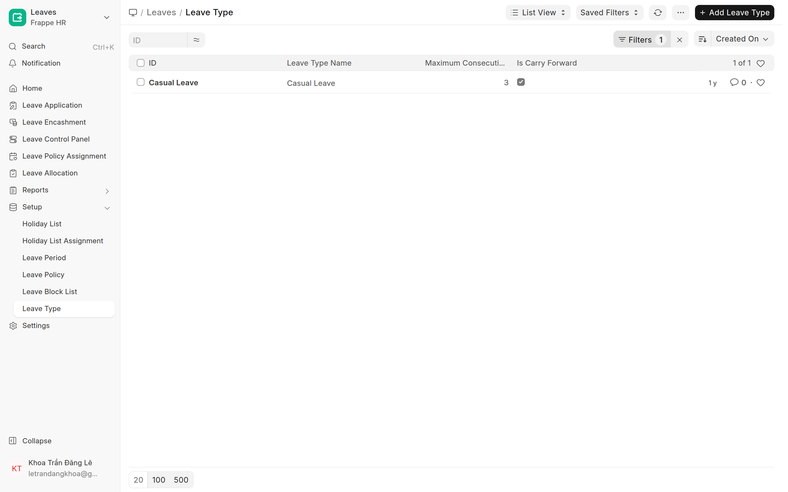

# Làm quen ERP (Desk) — cho người mới bắt đầu
{: .no_toc }

> Tài liệu nền cho người **lần đầu dùng ERP**: đăng nhập, giao diện Desk, thanh tìm kiếm, khái niệm doctype/danh sách, lọc dữ liệu, đổi mật khẩu, đăng xuất. Đọc cái này trước khi vào các hướng dẫn nghiệp vụ.

Mục lục

{: .text-delta }
1. TOC
{:toc}

---

## 1. ERP / Desk là gì?

**ERP** là hệ thống quản trị tập trung của công ty (nhân sự, kho, bán hàng, kế toán…). Bản web quản trị gọi là **Desk**, mở ở đường dẫn **`/app`** (vd `working.thegioidiengiai.com/app`).

Màn hình **Desk** đầu tiên là lưới các **ứng dụng/phân hệ** (HR, Accounting, Stock…). Trên cùng có **thanh tìm kiếm**, chuông thông báo, và **avatar tài khoản** (góc phải).

> Mỗi phân hệ (vd **Frappe HR**) chứa nhiều **danh sách dữ liệu** (Employee, Leave Application…). Hướng dẫn nghiệp vụ sẽ chỉ đường dẫn cụ thể như `/app/employee`.

---

## 2. Đăng nhập

1. Mở đường dẫn hệ thống (vd `working.thegioidiengiai.com`).
2. Nhập **Email** (tài khoản công ty cấp) + **Mật khẩu** → bấm **Login**.
3. Quên mật khẩu → bấm **Forgot Password?** để đặt lại qua email.

> Tài khoản (User) do **Quản trị/HR cấp**. Chưa đăng nhập được → báo người cấp tài khoản.

---

## 3. Thanh tìm kiếm (Search) — đi nhanh tới mọi thứ

Cách nhanh nhất để mở bất cứ gì: bấm **Search** trên cùng (hoặc phím tắt **Ctrl + K** / **⌘ + K**) → gõ tên.

Gõ tên một loại dữ liệu (vd "Leave Type") → gợi ý:
- **… List** → mở **danh sách** loại đó.
- **… Report** → mở báo cáo.
- **New …** → tạo mới.

> Dùng phím **↑ ↓** chọn, **Enter** mở, **Esc** đóng. Có thể gõ cả **mã/tên 1 bản ghi** (vd "HR-EMP-00001") để nhảy thẳng.

---

## 4. Khái niệm: Doctype · Bản ghi · Danh sách · Form

| Khái niệm | Nghĩa |
|---|---|
| **Doctype** | Một **loại dữ liệu** (vd Employee, Leave Application, Department). Mỗi doctype có 1 đường dẫn `/app/<tên>`. |
| **Record (bản ghi)** | Một **mục cụ thể** trong doctype (vd nhân viên "HR-EMP-00001"). |
| **List view (danh sách)** | Bảng liệt kê các bản ghi của 1 doctype. |
| **Form** | Màn hình **xem/sửa 1 bản ghi**. |

---

## 5. Mở danh sách → Lọc (Filter) & sắp xếp

1. Mở danh sách (Search → "… List", hoặc `/app/<doctype>`).
2. Bấm **Filter** (phễu, góc trên phải) → chọn **trường + điều kiện** (vd `Is Carry Forward = Yes`) → danh sách lọc lại + hiện huy hiệu **Filters 1**. Bấm **×** để xoá lọc.
3. Đổi cột sắp xếp ở nút bên cạnh (vd **Created On**).

> Mở 1 bản ghi: **click vào dòng**. Tạo mới: nút **+ Add …** góc phải.

---

## 6. Tạo mới / Lưu / Gửi duyệt

- **+ Add / New** → mở form trống → điền → **Save** (Ctrl + S). Bản ghi mới ở trạng thái **Draft (nháp)**.
- Doctype có duyệt (Submittable) → sau Save có nút **Submit** (chốt). Trạng thái: **Draft → Submitted → Cancelled**.
- Đa số ô **bắt buộc** có dấu **\***; thiếu sẽ bị viền đỏ khi Save.

---

## 7. Tài khoản: hồ sơ · đổi mật khẩu · giao diện · đăng xuất

Bấm **avatar (góc phải trên)** → menu:

| Mục | Để làm gì |
|---|---|
| **Edit Profile** | Mở **hồ sơ tài khoản** (My Settings) |
| **Toggle Theme** | Đổi **giao diện sáng / tối** |
| **Logout** | **Đăng xuất** |

### Đổi mật khẩu

**Edit Profile** → ở form tài khoản, bấm nút **Password** (góc trên phải) → đặt mật khẩu mới.

---

## 8. Mẹo điều hướng

- **Ctrl/⌘ + K**: tìm & nhảy nhanh (dùng nhiều nhất).
- **Breadcrumb** trên cùng (vd `Leaves / Leave Type`): bấm để quay lại.
- **Esc**: đóng popup/tìm kiếm.
- Lạc đường → bấm logo góc trái trên để về **Desk home**.

## Tiếp theo
Đã quen Desk? Vào hướng dẫn theo vai trò của bạn ở **[Chấm công & HR](00-cham-cong.html)** (👤 Nhân viên · 👔 Trưởng Bộ Phận · 👩‍💼 HR · 🛠️ Quản trị).
