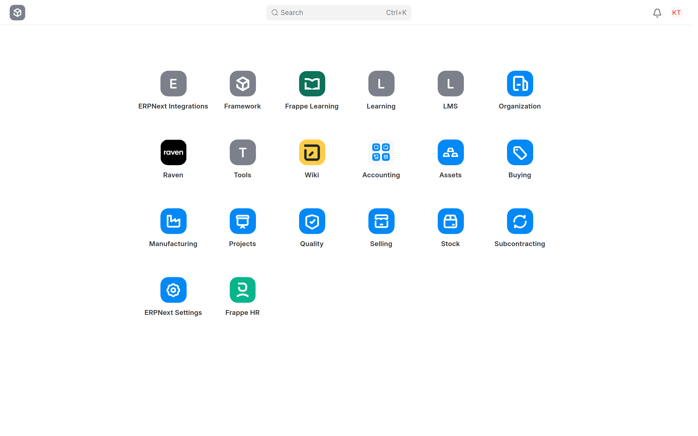
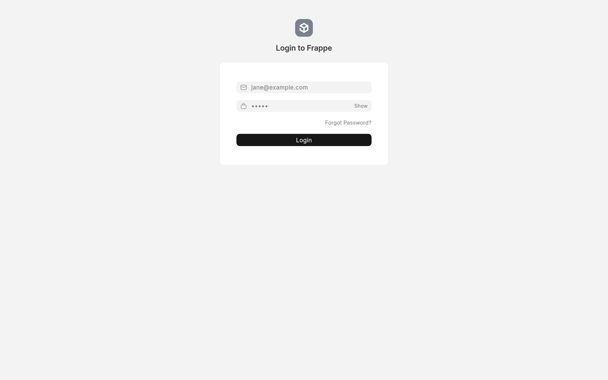
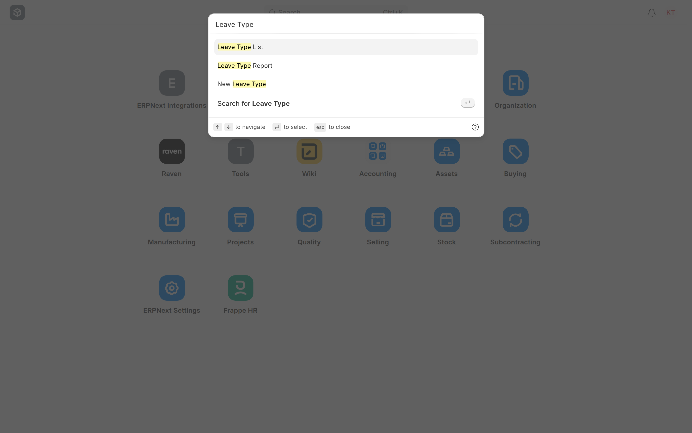
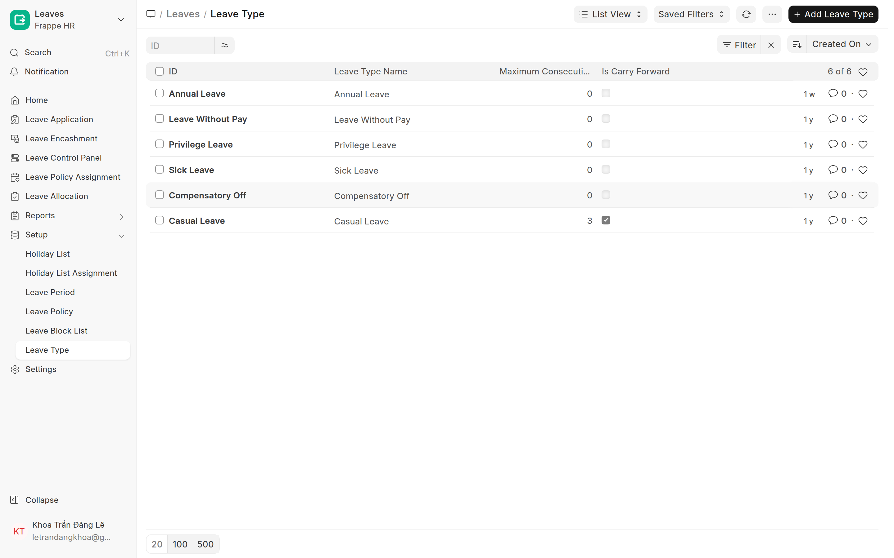
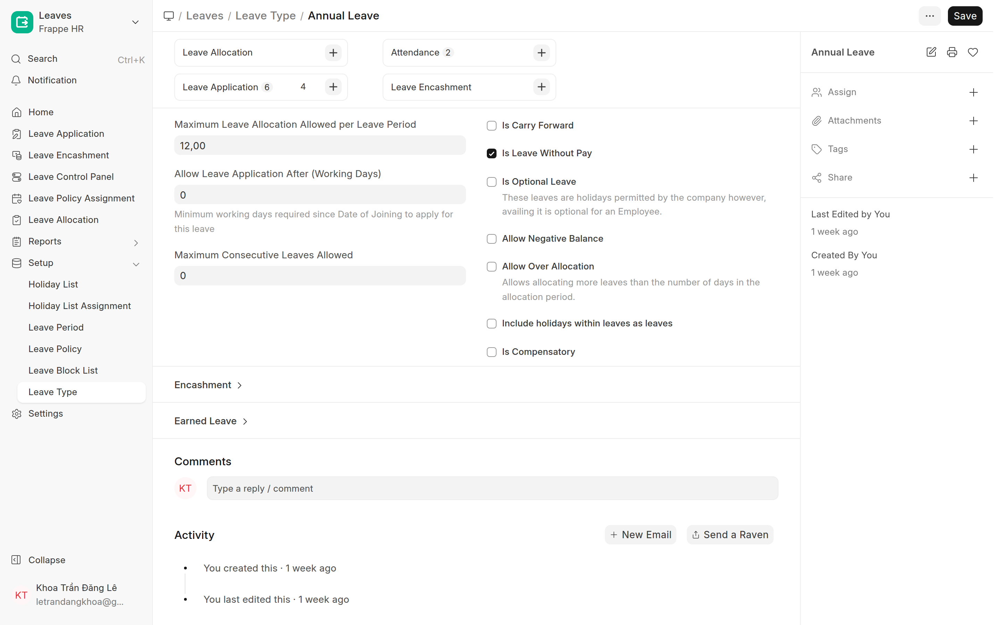
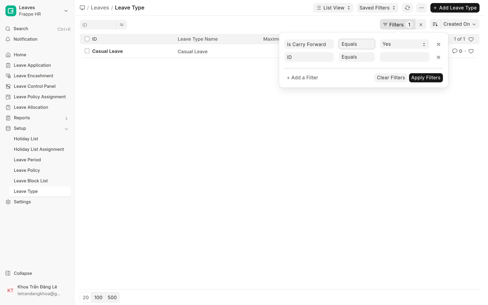
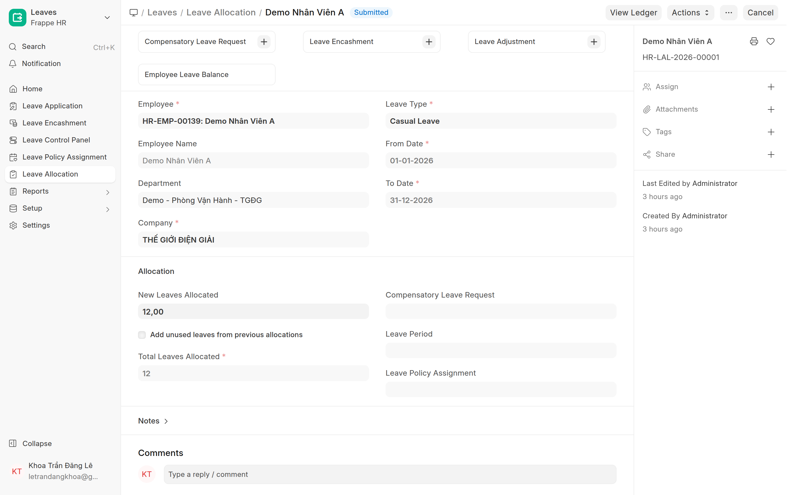
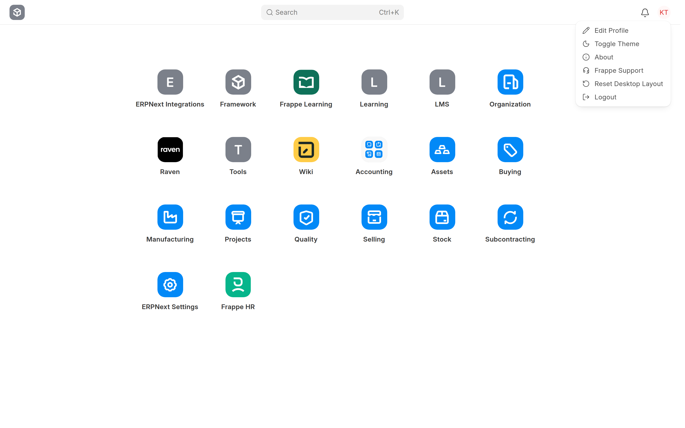
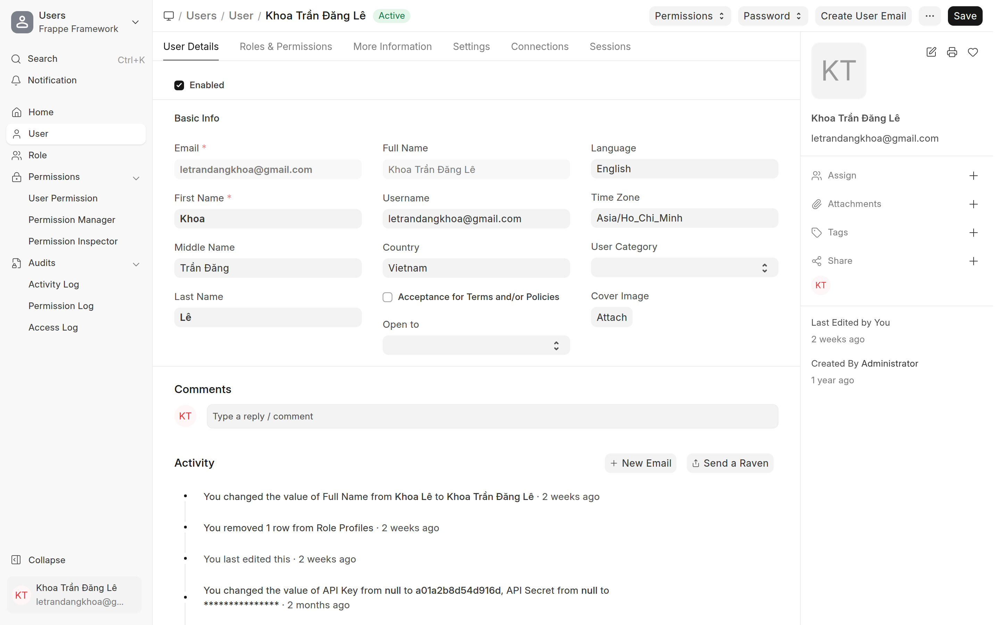

# Làm quen ERP (Desk) — cho người mới bắt đầu
{: .no_toc }

> Tài liệu nền cho người **lần đầu dùng ERP**: đăng nhập, giao diện Desk, thanh tìm kiếm, khái niệm doctype/danh sách, lọc dữ liệu, đổi mật khẩu, đăng xuất. Đọc cái này trước khi vào các hướng dẫn nghiệp vụ.

<details open markdown="block">
<summary>Mục lục</summary>
{: .text-delta }
1. TOC
{:toc}
</details>

---

## 1. ERP / Desk là gì?

**ERP** là hệ thống quản trị tập trung của công ty (nhân sự, kho, bán hàng, kế toán…). Bản web quản trị gọi là **Desk**, mở ở đường dẫn **`/app`** (vd `working.thegioidiengiai.com/app`).

Màn hình **Desk** đầu tiên là lưới các **ứng dụng/phân hệ** (HR, Accounting, Stock…). Trên cùng có **thanh tìm kiếm**, chuông thông báo, và **avatar tài khoản** (góc phải).



> Mỗi phân hệ (vd **Frappe HR**) chứa nhiều **danh sách dữ liệu** (Employee, Leave Application…). Hướng dẫn nghiệp vụ sẽ chỉ đường dẫn cụ thể như `/app/employee`.

---

## 2. Đăng nhập

1. Mở đường dẫn hệ thống (vd `working.thegioidiengiai.com`).
2. Nhập **Email** (tài khoản công ty cấp) + **Mật khẩu** → bấm **Login**.
3. Quên mật khẩu → bấm **Forgot Password?** để đặt lại qua email.



> Tài khoản (User) do **Quản trị/HR cấp**. Chưa đăng nhập được → báo người cấp tài khoản.

---

## 3. Thanh tìm kiếm (Search) — đi nhanh tới mọi thứ

Cách nhanh nhất để mở bất cứ gì: bấm **Search** trên cùng (hoặc phím tắt **Ctrl + K** / **⌘ + K**) → gõ tên.

Gõ tên một loại dữ liệu (vd "Leave Type") → gợi ý:
- **… List** → mở **danh sách** loại đó.
- **… Report** → mở báo cáo.
- **New …** → tạo mới.



> Dùng phím **↑ ↓** chọn, **Enter** mở, **Esc** đóng. Có thể gõ cả **mã/tên 1 bản ghi** (vd "HR-EMP-00001") để nhảy thẳng.

---

## 4. Khái niệm: Doctype · Bản ghi · Danh sách · Form

| Khái niệm | Nghĩa |
|---|---|
| **Doctype** | Một **loại dữ liệu** (vd Employee, Leave Application, Department). Mỗi doctype có 1 đường dẫn `/app/<tên>`. |
| **Record (bản ghi)** | Một **mục cụ thể** trong doctype (vd nhân viên "HR-EMP-00001"). |
| **List view (danh sách)** | Bảng liệt kê các bản ghi của 1 doctype. |
| **Form** | Màn hình **xem/sửa 1 bản ghi**. |

> 🧭 **Xem bằng ví dụ** — doctype **Leave Type** (loại nghỉ phép):

**① Danh sách (List view)** — mở `/app/leave-type` thấy **tất cả bản ghi** của doctype này. **Mỗi dòng = một bản ghi** (Annual Leave, Sick Leave, Casual Leave…):



**② Form** — bấm vào một dòng (vd *Annual Leave*) → mở **đúng bản ghi đó** ra để xem/sửa. Đây là **Form**:



> Tóm: **Doctype** "Leave Type" gom **6 bản ghi**; xem cả 6 ở **Danh sách**; mở 1 cái ra là **Form**. Bấm vào ảnh để phóng to.

---

## 5. Lọc dữ liệu (Filter)

Trong danh sách, bấm **Filter** (phễu, góc trên phải) → **+ Add a Filter**. Mỗi điều kiện gồm **3 phần**: **Trường** · **Điều kiện** · **Giá trị**. Bấm **Apply Filters** để áp.



- Thêm **nhiều dòng** = các điều kiện phải **CÙNG đúng** (VÀ / AND).
- **×** xoá 1 điều kiện · **Clear Filters** xoá hết · huy hiệu **Filters N** cho biết đang có N điều kiện.

### Các điều kiện (operator) hay dùng

| Điều kiện | Nghĩa | Ví dụ |
|---|---|---|
| **Equals** ( = ) | bằng đúng | Status = Active |
| **Not Equals** ( ≠ ) | khác | Status ≠ Cancelled |
| **Like** | **chứa** chuỗi | Tên *like* "Nguyễn" |
| **Not Like** | **không chứa** | |
| **In** | thuộc **danh sách** (chọn nhiều giá trị) | Status *in* [Open, Pending] |
| **Not In** | không thuộc danh sách | |
| **>**, **<**, **≥**, **≤** | lớn / nhỏ hơn (số, ngày) | Ngày > 01-01-2026 |
| **Between** | trong **khoảng** (từ–đến) | Ngày *between* 01-01 → 31-01 |
| **Is Set** | **có** giá trị (khác trống) | Approver *is set* |
| **Is Not Set** | **trống** | Approver *is not set* |
| **Timespan** (cho ngày) | mốc thời gian sẵn | Today · This Week · This Month · Last Month… |

> 💡 **Lọc nhanh:** ngay dưới tiêu đề danh sách có ô lọc nhanh (vd **ID**); biểu tượng **≈** = bật/tắt chế độ "chứa" (Like).
> **Saved Filters:** lưu bộ lọc hay dùng để mở lại nhanh lần sau.

---

## 6. Sắp xếp danh sách (Sort)

Cạnh nút Filter có nút **sắp xếp** (mặc định hiện **Created On** ▼):
- Chọn **trường** muốn sắp theo: *Created On* (ngày tạo) · *Last Updated On* (sửa gần nhất) · *Name* · hoặc bất kỳ cột nào.
- Bấm mũi tên đổi **tăng dần ▲ / giảm dần ▼**.
- Cuối danh sách: đổi **số dòng/trang** (20 / 100 / 500).

---

## 7. Các ô trong form: bắt buộc · tự điền · chỉ đọc

| Dấu hiệu | Loại ô | Ý nghĩa |
|---|---|---|
| **\*** (sao đỏ) cạnh nhãn | **Bắt buộc** | Phải điền; bỏ trống → **viền đỏ**, không Save được |
| Nhãn thường, **không sao** | **Tuỳ chọn** | Điền hay không tuỳ |
| Ô **xám / mờ, không gõ được** | **Tự điền / chỉ đọc (read-only)** | Hệ thống tự lấy (vd *Employee Name*, *Department* lấy theo Employee) — không sửa tay |



> Sau khi **Submit**, hầu hết ô chuyển **xám (chỉ đọc)** — không sửa trực tiếp được nữa (xem §8).

---

## 8. Vòng đời bản ghi: Lưu · Submit · Cancel · Draft

Có **2 loại doctype:**

**a) Loại chỉ Lưu** (master — vd Employee, Department, Leave Type): chỉ có **Save** (Ctrl + S). Sửa / xoá bất cứ lúc nào. **Không** có Submit.

**b) Loại có duyệt** (submittable — vd Leave Application, Leave Allocation, Attendance): có vòng đời theo **trạng thái (docstatus):**

| Trạng thái | Tới bằng cách | Ý nghĩa |
|---|---|---|
| **Draft (nháp)** | bấm **Save** | Đã lưu nhưng **chưa có hiệu lực**, còn sửa được |
| **Submitted (đã chốt)** | bấm **Submit** | **Chốt + có hiệu lực** (vd đơn nghỉ submit → trừ phép). Form thành **chỉ đọc** |
| **Cancelled (đã huỷ)** | bấm **Cancel** trên doc đã Submit | **Đảo hiệu lực** (hoàn lại). Bản ghi **vẫn còn** để lưu vết |

```
Draft  --Submit-->  Submitted  --Cancel-->  Cancelled  --Amend-->  Draft mới
```

- **Save vs Submit:** Save = lưu nháp; Submit = chốt (chỉ loại b).
- **Cancel ≠ Delete:** **Cancel** = huỷ hiệu lực doc đã submit (vẫn giữ bản ghi); **Delete** = xoá hẳn khỏi hệ thống (chỉ làm được với **Draft** hoặc loại chỉ-Lưu).
- **Amend:** từ doc đã **Cancelled** → bấm **Amend** → tạo bản **nháp mới** để sửa + submit lại (gắn "Amended From").
- **Close ( × ):** chỉ **đóng màn hình**, KHÔNG xoá/huỷ. Còn thay đổi chưa lưu → hỏi xác nhận; badge **"Not Saved"** nhắc bạn chưa Save.


---

## 9. Tài khoản & giao diện (dark mode)

Bấm **avatar (góc phải trên)** → menu:



| Mục | Để làm gì |
|---|---|
| **Edit Profile** | Mở hồ sơ tài khoản (My Settings) |
| **Toggle Theme** | **Đổi giao diện Sáng / Tối (dark mode)** — bấm để chuyển qua lại |
| **Logout** | Đăng xuất |

### Đổi mật khẩu

**Edit Profile** → ở form tài khoản, bấm nút **Password** (góc trên phải) → đặt mật khẩu mới.



---

## 10. Phím tắt hữu ích

| Phím | Tác dụng |
|---|---|
| **Ctrl/⌘ + K** (hoặc **Ctrl + G**) | Mở **tìm kiếm** (Awesomebar) |
| **Ctrl/⌘ + S** | **Hành động chính** — Lưu; nếu doc đã save & submittable → **Submit** |
| **Alt + S** | Mở **Settings** |
| **? (Shift + /)** | **Hiện bảng phím tắt đầy đủ** |
| **Alt + H** | Mở Help |
| **Esc** | Đóng popup / huỷ |
| **Shift + Ctrl/⌘ + R** | **Clear cache + tải lại** (khi giao diện lỗi) |

> Quên phím? Bấm **?** (Shift + /) bất cứ lúc nào để xem danh sách đầy đủ.

---

## 11. Mẹo điều hướng

- **Ctrl/⌘ + K**: tìm & nhảy nhanh (dùng nhiều nhất).
- **Breadcrumb** trên cùng (vd `Leaves / Leave Type`): bấm để quay lại cấp trên.
- **Esc**: đóng popup / tìm kiếm.
- Lạc đường → bấm **logo góc trái trên** để về **Desk home**.

## Tiếp theo
Đã quen Desk? Vào hướng dẫn theo vai trò của bạn ở **[Chấm công & HR](00-cham-cong.html)** (👤 Nhân viên · 👔 Trưởng Bộ Phận · 👩‍💼 HR · 🛠️ Quản trị).
