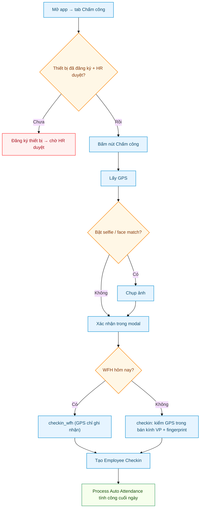

# Hướng dẫn vận hành — HR Attendance phone-only

> Đối tượng: **HR Manager**, **System Manager**, **manager phòng ban**.
> Code trong `apps/hr_for_cobegroup/`.

Tài liệu đầu-đến-cuối: cài app, setup văn phòng, duyệt phone nhân viên, bật/tắt feature flag, vận hành thường ngày, audit khi nghi cheat.

---

## Sơ đồ quy trình chấm công



---

## Mục lục

1. [Hệ thống làm gì](#1-hệ-thống-làm-gì)
2. [Cài đặt app](#2-cài-đặt-app)
3. [Cấu hình lần đầu](#3-cấu-hình-lần-đầu)
4. [Quy trình chấm công thường ngày](#4-quy-trình-chấm-công-thường-ngày)
5. [Vận hành & audit](#5-vận-hành--audit)
6. [Sự cố thường gặp](#6-sự-cố-thường-gặp)

---

## 1. Hệ thống làm gì

Nhân viên chấm công IN/OUT bằng PWA cài trên phone. Mỗi lần chấm công:
- Phone tự lấy GPS → server check trong bán kính của văn phòng gần nhất
- Phone gửi device fingerprint → server kiểm tra phone đã được duyệt
- (Tuỳ chọn, theo Policy của Company) Phone chụp selfie audit, gửi WiFi BSSID / WebRTC local IP để chống fake GPS
- (Tuỳ chọn) Cho check-out, server enforce cùng văn phòng với check-in cùng ngày

Sau khi pass hết các check, server tạo bản ghi `Employee Checkin` chuẩn HRMS (Hồ sơ chấm công Frappe HRMS), tự động `log_type=IN` hoặc `OUT` tuỳ trạng thái trước đó.

**Nhân viên không cần** mua thiết bị, không đặt máy chấm công vật lý ở cửa, không cần ID card.

**Guardrail `/hrms`**: app HRMS gốc (`/hrms`, Frappe HR mobile) cho phép tạo Employee Checkin / Attendance Request không qua luật GPS/selfie/thiết bị. Vì vậy hook `before_request` (`utils.hrms_gate`) **tự redirect nhân viên thường** mở `/hrms` về `/my-workspace` (embed-safe: chỉ chặn điều hướng top-level, bỏ qua iframe + API). HR/Admin (System Manager / HR Manager / HR User) vẫn vào `/hrms` bình thường. Đồng thời role *Employee* bị **khóa quyền create `Employee Checkin`** ở Desk → mọi check-in của nhân viên thường buộc đi qua endpoint PWA có luật GPS.

**Phép năm**: dùng **HRMS Earned Leave native** (Leave Type `is_earned_leave`), **không** còn tự cấp phép theo số giờ chấm công.

---

## 2. Cài đặt app

### 2.1. Cài backend (System Manager)

```bash
cd /path/to/bench
bench get-app https://github.com/cobegroup/hr_for_cobegroup    # nếu chưa có
bench --site <site_name> install-app hr_for_cobegroup
bench --site <site_name> migrate
```

App này yêu cầu `frappe` + `hrms` đã cài trước. Sau migrate sẽ có:
- 5 doctype mới trong module **Attendance**
- 10 custom field thêm vào `Employee Checkin`
- 1 doctype **HR Policy** (per-Company)

### 2.2. Build & deploy PWA

```bash
cd apps/hr_for_cobegroup/frontend/attendance-pwa
yarn install
yarn build   # output sang ../../hr_for_cobegroup/public/attendance-pwa/
bench build --app hr_for_cobegroup
```

PWA truy cập tại `https://working.thegioidiengiai.com/my-workspace`.

### 2.3. Nhân viên cài PWA trên phone

Quét QR (hoặc vào link) để mở my-workspace:


`https://working.thegioidiengiai.com/my-workspace`

1. Mở Safari (iOS) hoặc Chrome (Android), vào link trên (hoặc quét QR)
2. Login bằng tài khoản Frappe của mình
3. Trên iOS: tap nút **Share** → "Add to Home Screen"
4. Trên Android: trình duyệt sẽ tự prompt "Install app"
5. Sau khi cài, icon **"TGDG - MyWorkspace"** hiện như app thường

---

## 3. Cấu hình lần đầu

Sau khi cài, làm theo thứ tự:

### 3.1. Bật/tắt feature flag toàn cục

Mở Frappe Desk → search **"HR Policy"**. Bật/tắt từng tính năng theo nhu cầu — chi tiết từng field tại [HR Policy](HR-Policy.html).

**Mặc định**: tất cả feature optional đều **TẮT**. Chỉ bật khi đã sẵn sàng test.

### 3.2. Tạo HR Office Location cho từng chi nhánh

Mỗi VP một record. Cần: tọa độ GPS (lấy từ Google Maps right-click → copy lat/lng) + bán kính cho phép. Chi tiết tại [HR Office Location](HR-Office-Location.html).

### 3.3. Duyệt phone nhân viên

Nhân viên mở PWA lần đầu → PWA tự tạo `HR Checkin Phone Registration` ở trạng thái **Draft**. HR Manager vào duyệt từng record. Chi tiết tại [HR Checkin Phone Registration](HR-Checkin-Phone-Registration.html).

### 3.4. (Nếu bật WFH) Duyệt WFH qua Attendance Request

WFH đi qua **HRMS Attendance Request** với `reason = Work From Home` (doctype custom `HR WFH Approval` đã deprecated). Nhân viên tạo đơn (PWA/Desk) → Manager duyệt (Submit). Khi đơn đã duyệt (docstatus=1) phủ ngày hôm nay + Policy bật `enable_wfh_mode`, PWA hiện banner WFH và cho phép chấm công không enforce GPS radius.

### 3.5. Holiday List + Shift Type (BẮT BUỘC để có Attendance & báo cáo)

Cấu hình **HRMS chuẩn** quyết định check-in có biến thành bản ghi **Attendance** hay không:
- **Holiday List** (Desk → Holiday List): khai cuối tuần (`weekly_off` + Get Weekly Off Dates) + ngày lễ → ngày trong list **không bị mark Absent**. Gán Default Holiday List cho Company / Shift / Employee.
- **Shift Type**: giờ vào–ra, gán Holiday List, bật **`Enable Auto Attendance`**, ngưỡng half-day/absent, grace period.
- **Shift Assignment / Default Shift**: gán ca cho từng NV — NV **phải có ca** thì check-in mới sinh Attendance + mới vào danh sách "nhắc quên chấm công".

→ Thiếu phần này: check-in vẫn ghi log nhưng **không thành Attendance** → báo cáo tháng trống; cuối tuần/lễ bị tính Absent. Chi tiết: **[HR Holiday & Shift Setup](HR-Holiday-Shift-Setup.html)**.

---

## 4. Quy trình chấm công thường ngày

PWA serve tại **`/my-workspace`** — shell chung React Router, bottom nav thích ứng theo role/employee:
- **Chấm công** — luôn có
- **Nghỉ phép** — luôn có (đăng ký + theo dõi đơn phép)
- **Cần duyệt** — chỉ hiện cho user có quyền trong **HR Approval Inbox Settings** (mặc định role *Leave Approver* / *HR Manager* / *System Manager*); là inbox duyệt đơn (Leave 2 bước + Attendance Request). Xem [§5.5](#55-tab-cần-duyệt--inbox-duyệt-đơn).
- **Chi phí** — luôn có (đề nghị tạm ứng / hoàn ứng / claim chi phí).
- **FSM** — chỉ hiện cho nhân viên có `FS Service Resource` (KTV fsmnext); nhúng app `/technician` fullscreen.
- **Thêm** — các mục phụ (hướng dẫn sử dụng, v.v.)

> Thứ tự tab: Chấm công · Nghỉ phép · [Cần duyệt] · **Chi phí** · [FSM] · Thêm.
> **System Manager thấy TẤT CẢ tab** (gồm Cần duyệt + FSM) bất kể điều kiện trên.

Trang Chấm công có 2 tab:
- **Chấm công** — nút check-in/out + danh sách lượt Employee Checkin trong khoảng đã chọn
- **Bảng công** — **một danh sách hợp nhất**: bản ghi `Attendance` HRMS (status + giờ công +
  cảnh báo) **kèm đơn đề xuất chưa duyệt** (Chấm công bù / WFH); nút **"Đề xuất"** để tạo đơn.

> **Bấm vào item bất kỳ** (Bảng công / Chấm công / Nghỉ phép / Thông báo / Cần duyệt) để
> **xem chi tiết** qua Modal in-app.

### 4.1. Nhân viên onsite (98% case)

Khi Policy có `enable_selfie_capture = 0` (mặc định):
1. Đến VP, mở PWA → tab **Chấm công**
2. Tap nút **"Chấm công (Vào)"** hoặc **"Chấm công (Ra)"** (PWA tự detect tiếp theo)
3. PWA hỏi quyền GPS lần đầu → cho phép
4. Sau khi có GPS → tap nút "Xác nhận chấm công"
5. PWA POST checkin → server validate (radius + same-office cho OUT)
6. Thông báo "✓ Đã chấm công vào ca" hoặc "✓ Đã chấm công ra ca"

Tổng thời gian: **5-8 giây**.

Khi Policy có `enable_selfie_capture = 1`:
1. Bước 1-3 như trên
4. PWA hỏi quyền camera → cho phép
5. Nhìn camera, chụp selfie (tự động hoặc tap)
6. PWA upload selfie → POST checkin
7. Thông báo kết quả

Tổng thời gian: **10-15 giây**.

### 4.2. Nhân viên WFH/công tác (nếu `enable_wfh_mode` ON + có Attendance Request WFH đã duyệt hôm nay)

1. Manager đã duyệt `Attendance Request` (reason=WFH) phủ hôm nay → PWA tự detect
2. Sáng mở PWA → trang chủ hiện banner "Hôm nay bạn đăng ký WFH"
3. Tap "Bắt đầu ca WFH"
   - Nếu `enable_selfie_capture = 0`: tap "Xác nhận WFH" → submit
   - Nếu `enable_selfie_capture = 1`: chụp selfie → submit
4. Cuối ngày tap "Kết thúc ca WFH"

Không enforce GPS radius (vì đang ở nhà / nơi công tác). GPS chỉ lưu audit.

### 4.3. Manual checkin (khi có sự cố)

HR Manager mở `Employee Checkin` → New → điền:
- Employee
- Log type (IN/OUT)
- Time
- `custom_checkin_source = "Manual-Desk"`
- Lưu

Trường hợp dùng: phone hỏng, mất internet, nhân viên quên.

---

## 5. Vận hành & audit

### 5.1. Báo cáo chấm công định kỳ

Dùng built-in **Monthly Attendance Sheet** của HRMS — đã hoạt động vì ta extend `Employee Checkin` chứ không thay thế.

### 5.2. Audit selfie khi nghi cheat (chỉ khi `enable_selfie_capture` ON)

1. Mở danh sách `Employee Checkin` của nhân viên đó
2. Click bản ghi → field `custom_selfie` có ảnh
3. So sánh với ảnh chuẩn của nhân viên trong `Employee → Personal Details`

Nếu Policy chưa bật `enable_selfie_capture` → field này trống cho mọi record → không có cách audit selfie hồi tố. Cần bật flag trước khi cần audit.

### 5.3. Audit GPS distance

Mỗi bản ghi `Employee Checkin` lưu:
- `custom_gps_latitude`, `custom_gps_longitude` — tọa độ phone lúc chấm
- `custom_gps_distance_m` — khoảng cách tính được từ VP (m)

Distance > 0 nghĩa là phone không sát tâm VP (bình thường < 100m).

### 5.4. Audit device fingerprint

`custom_phone_device_fingerprint` là SHA256 hash. So sánh với `HR Checkin Phone Registration` (Active) của nhân viên đó:
- Khớp → phone đúng đã duyệt
- Khác → nhân viên đã đổi phone (hoặc người khác mượn) — cần điều tra

Lưu ý device-aware: việc "đã đăng ký" tính theo đúng máy hiện tại. Nhân viên đổi máy phải đăng ký lại máy mới và HR deactivate máy cũ (chi tiết tại [HR Checkin Phone Registration](HR-Checkin-Phone-Registration.html)).

### 5.5. Tab "Cần duyệt" — inbox duyệt đơn

Trên `/my-workspace`, user có quyền (theo **HR Approval Inbox Settings**, mặc định role *Leave Approver* / *HR Manager* / *System Manager*) thấy tab **Cần duyệt** — gom đơn đang chờ:
- **Leave Application** (workflow `HR Leave Approval 2-Step`)
- **Attendance Request** (gồm WFH / On Duty)

Manager Approve/Reject ngay trên mobile. Manager chỉ thao tác được đơn mình là leave_approver (trừ khi có role HR Manager / System Manager override).

### 5.6. Phép năm — Earned Leave

Phép năm dùng cơ chế **Earned Leave native của HRMS** (Leave Type bật `is_earned_leave`), HRMS tự cộng dồn theo lịch. App **không** tự cấp phép theo số giờ chấm công nữa. Báo cáo/điều chỉnh số dư làm qua HRMS (`Leave Allocation`, `Leave Ledger Entry`).

---

## 6. Sự cố thường gặp

| Triệu chứng | Nguyên nhân / khắc phục |
|---|---|
| PWA hiện "Phone chưa được duyệt" / bị đẩy sang trang đăng ký thiết bị | HR Manager chưa submit `HR Checkin Phone Registration` cho **đúng máy** nhân viên đang dùng. Lưu ý device-aware: máy mới chưa duyệt vẫn bị chặn dù máy cũ Active. Mở Desk → submit record của máy đó (deactivate máy cũ trước nếu cần). |
| Đổi máy nhưng vẫn bị chặn dù máy cũ đang Active | Đúng thiết kế — mỗi nhân viên 1 máy Active. Báo HR deactivate máy cũ rồi submit máy mới (UI nhắc qua cờ `other_active`). |
| "Bạn đang ở ngoài vùng văn phòng (cách 250m)" | Kiểm tra tọa độ `HR Office Location` đặt đúng chưa. Hoặc tăng `allowed_radius_m`. |
| "Vui lòng kết nối wifi văn phòng" | Feature `enable_wifi_bssid_check` bật + nhân viên ngoài wifi VP. Hoặc BSSID list chưa enroll wifi này. |
| Selfie bị quay ngang/lộn | Quay phone về portrait. Một số phone cũ Android có vấn đề camera orientation — đợi phase 2 fix. |
| Phone iOS không cho mở camera | Vào Settings → Safari → Camera → Allow. PWA nên đã có hướng dẫn trong-app. |
| Không thấy WFH banner dù đã duyệt | Check feature flag `enable_wfh_mode` đã bật + `Attendance Request` (reason=WFH) đã Submit (docstatus=1) phủ đúng ngày hôm nay. |
| Báo cáo Attendance Sheet không hiện checkin mới | Bench restart sau migrate. Hoặc clear cache. |

---

## Liên quan

- [HR Policy](HR-Policy.html) — feature flag
- [HR Office Location](HR-Office-Location.html) — danh sách VP
- [HR Checkin Phone Registration](HR-Checkin-Phone-Registration.html)
- WFH: dùng HRMS **Attendance Request** (reason = Work From Home) — doctype `HR WFH Approval` đã deprecated
- [Tài liệu kỹ thuật HR Attendance](../tech/HR-Attendance-Tech.html)
