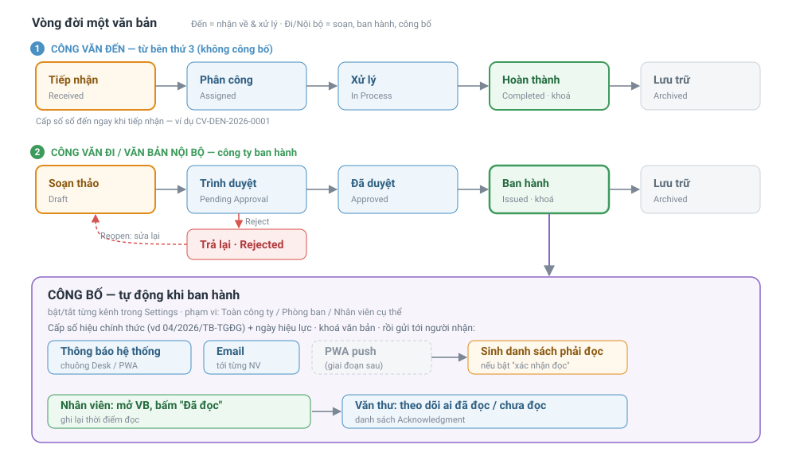

# Vòng đời một văn bản
{: .no_toc }

Trọn vòng đời từ lúc tạo tới khi lưu kho, cho cả **công văn đến** (bên thứ 3 gửi tới) và
**công văn đi / văn bản nội bộ** (công ty ban hành). Điểm khác biệt lớn nhất: văn bản
**đi/nội bộ** có bước **Ban hành + Công bố** tới nhân viên; văn bản **đến** thì không.

- TOC
{: toc }

---

## Toàn cảnh

---

## Chuẩn bị một lần (danh mục)

Trước khi chạy quy trình, khai sẵn trong **Desk**:

- **Loại Văn Bản** — Thông báo, Quyết định, Công văn, Quy chế… mỗi loại có **mã** (`TB`, `QĐ`, `QC`…) dùng ghép số hiệu.
- **Cơ quan / Đối tác** — các tổ chức bên ngoài (nơi gửi công văn đến, nơi nhận công văn đi).
- **Document Management Settings** — series mặc định, mã đơn vị theo công ty (TGĐG/AKW/DR), bật/tắt kênh công bố, mặc định "bắt xác nhận đọc".

**Ba vai:** **Văn thư** tạo – cấp số – ban hành – lưu · **Người duyệt** ký duyệt · **Người dùng** xử lý & đọc.

---

## Nhánh A — Công văn ĐẾN (từ bên thứ 3)

Bản chất: *nhận về → giao việc → xử lý → lưu*. **Không có công bố** vì công ty không phát ra.

| Bước | Trạng thái | Ai | Làm gì |
|---|---|---|---|
| 1. Tiếp nhận | `Received` | Văn thư | Tạo record `Đến`, nhập nơi gửi, **số bên gửi**, trích yếu, ngày nhận, độ mật/khẩn, đính kèm bản scan. **Cấp số** `CV-DEN-2026-####` |
| 2. Phân công | `Assigned` | Văn thư / Lãnh đạo | Giao người xử lý + hạn |
| 3. Xử lý | `In Process` → `Completed` | Người xử lý | Làm, ghi kết quả, hoàn thành (khoá) |
| 4. Lưu | `Archived` | Văn thư | Lưu trữ |

---

## Nhánh B — Công văn ĐI / Văn bản NỘI BỘ (công ty ban hành)

Bản chất: *soạn → trình ký → **ban hành + công bố** → lưu*. Đây là nhánh của một **Thông báo**
hay **Quyết định** nội bộ.

### 1. Soạn thảo — `Draft`
Người soạn nhập: loại VB, trích yếu, **nội dung**, **nơi nhận**, **người ký**, biểu mẫu đính kèm.
Và khai sẵn phần công bố: **phạm vi** (Toàn công ty / Phòng ban / Nhân viên cụ thể) và
**có bắt xác nhận đọc không** (mặc định lấy từ Settings, sửa được).

### 2. Trình ký — `Pending Approval`
Trình lên người duyệt; ghi nhận ở bảng *Người duyệt*.

### 3. Duyệt / Trả lại
- Duyệt → `Approved`.
- Trả lại → `Rejected` → người soạn **Reopen** về `Draft` sửa → trình lại.

### 4. ⭐ Ban hành — `Issued` (trái tim của quy trình)
Khi Văn thư bấm **Issue**, hệ thống tự động:

1. **Cấp số hiệu chính thức** kiểu VN: `04/2026/TB-TGĐG` (số/năm/mã loại–mã đơn vị, đếm lại theo năm + loại + đơn vị).
2. **Đóng dấu ngày ban hành**.
3. **CÔNG BỐ** — dựng danh sách người nhận theo phạm vi đã chọn, rồi gửi qua các kênh **bật trong Settings**:
   - **Thông báo trong hệ thống** (chuông Desk / PWA).
   - **Email** tới từng nhân viên.
   - *(PWA push — giai đoạn sau)*.
   - Nếu bật **xác nhận đọc** → sinh mỗi người một dòng theo dõi trạng thái **"chưa đọc"**.
4. Văn bản **khoá** (không sửa được nữa).

### 5. Nhân viên nhận & đọc
Nhân viên thấy thông báo + email → mở văn bản → bấm **"Đã đọc"**. Hệ thống ghi lại **thời điểm đọc**.
Văn thư/lãnh đạo tra được **ai đã đọc / ai chưa**.

### 6. Lưu — `Archived`
Xử lý xong → lưu trữ.

---

## Khác biệt hai nhánh

| | **Đến** | **Đi / Nội bộ** |
|---|---|---|
| Nguồn | Bên thứ 3 gửi tới | Công ty phát ra |
| Số hiệu cấp khi | **Tiếp nhận** (sổ đến) | **Ban hành** |
| Trình ký | Không | Có |
| **Công bố tới nhân viên** | Không | **Có** (khi ban hành) |
| Xác nhận đọc | Không | Có (tuỳ chọn, bật/tắt) |
| Kết thúc | Xử lý xong → Lưu | Ban hành → Nhân viên đọc → Lưu |
