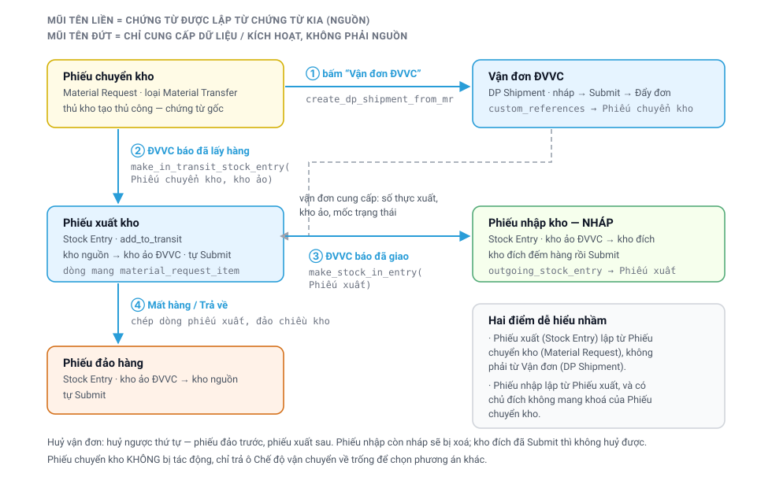

# Chuyển kho qua ĐVVC — từ phiếu chuyển kho đến khi kho đích nhận hàng

> Đối tượng: **thủ kho** hai đầu tuyến, **quản lý kho**.
> Chuyển hàng giữa hai kho của **cùng một công ty** — để cân đối tồn kho, hoặc bổ sung hàng cho
> kho đang thiếu. Bán hàng cho khách thì xem
> [Vận đơn từ Sales Order](Delivery_Partner_Extension.html).

---

## Toàn cảnh

Điểm quan trọng nhất trong sơ đồ trên: **thao tác đặt đơn không tác động tới tồn kho**. Hàng
vẫn nằm tại kho nguồn cho tới khi ĐVVC thực sự tới lấy. Nhờ vậy ngày xuất kho luôn trùng với
ngày hàng rời kho, không phải ngày người dùng bấm nút.

---

## Chuỗi chứng từ — chứng từ nào sinh ra chứng từ nào {#chuoi-chung-tu}

Tên tiếng Việt trên màn hình ↔ tên doctype thật trong hệ thống (gõ tên tiếng Anh vào ô tìm kiếm
là ra đúng danh sách):

| Gọi trong tài liệu | Doctype | Ghi chú |
|---|---|---|
| Phiếu chuyển kho | `Material Request` | loại *Material Transfer*, có khai Kho nguồn ở đầu phiếu |
| Vận đơn | `DP Shipment` | bảng *Chứng từ nguồn* bên trong là `DP Shipment Reference` |
| Phiếu xuất kho / Phiếu nhập kho / Phiếu đảo hàng | `Stock Entry` | cùng một doctype, khác chiều kho |
| Kho, Kho ảo ĐVVC, Goods In Transit | `Warehouse` | kho ảo khai ở `DP Partner Account` |
| Đơn vị vận chuyển (hãng) | `DP Partner` | |
| Tài khoản ĐVVC | `DP Partner Account` | |
| Điểm gửi ĐVVC | `DP Pickup Point` | mã kho đăng ký bên hãng |
| Dịch vụ giao | `DP Account Service` | |
| Địa chỉ | `Address` | |
| Việc cần làm | `ToDo` | |

Một chuyến chuyển kho qua ĐVVC để lại **bốn chứng từ**; chuyến không phát sinh sự cố chỉ còn ba.
Bảng dưới liệt kê theo thứ tự thời gian:

| # | Chứng từ | Thời điểm phát sinh | Được lập từ | Người xác nhận |
|---|---|---|---|---|
| 1 | **Phiếu chuyển kho** (`Material Request`) | thủ kho tạo thủ công | — chứng từ gốc của cả chuỗi | thủ kho |
| 2 | **Vận đơn** (`DP Shipment`) | chọn *Tạo → Vận đơn ĐVVC* | **Phiếu chuyển kho** | người đặt đơn (nháp → Submit) |
| 3 | **Phiếu xuất kho** (`Stock Entry`) | ĐVVC báo **đã lấy hàng** | **Phiếu chuyển kho** — *không phải vận đơn* | hệ thống tự Submit |
| 4 | **Phiếu nhập kho** (`Stock Entry`) | ĐVVC báo **đã giao tới nơi** | **Phiếu xuất kho** | **kho đích tự Submit** |
| 4' | **Phiếu đảo hàng** (`Stock Entry`) | ĐVVC báo **mất / trả về** | **Phiếu xuất kho** | hệ thống tự Submit |

Hai điểm thường bị hiểu ngược:

- **Phiếu xuất kho không sinh ra từ vận đơn.** Phiếu này được lập từ *phiếu chuyển kho*, nhờ đó
  số lượng đã chuyển của phiếu chuyển kho tự cập nhật và phiếu tự chuyển sang trạng thái
  *In Transit*. Vận đơn giữ hai vai trò: xác định **thời điểm** (mốc ĐVVC lấy hàng) và cung cấp
  **số thực xuất** — vì vậy việc kho xuất thiếu so với yêu cầu là bình thường, phiếu xuất căn cứ
  số lượng trên vận đơn chứ không căn cứ số lượng trên phiếu chuyển kho.
- **Phiếu nhập kho được lập từ phiếu xuất kho**, không phải từ phiếu chuyển kho. Kho đích được
  xác định gián tiếp thông qua phiếu xuất. Đây là thiết kế có chủ đích: nếu phiếu nhập tham chiếu
  trực tiếp tới phiếu chuyển kho thì một chuyến hàng sẽ bị tính thành **hai lần chuyển**.

Ngoài chứng từ kho, hệ thống còn ghi nhận hai dấu vết khác:

- **Việc cần làm** (`ToDo`) giao cho người phụ trách kho đích, gắn trực tiếp vào phiếu nhập ở
  trạng thái nháp — mọi người dùng có quyền trên kho đích đều nhận được.
- Ô **Chế độ vận chuyển** trên phiếu chuyển kho được ghi *"Đơn vị vận chuyển"* ngay khi vận đơn
  được Submit. Đây là chốt chặn không cho xuất kho thủ công thêm lần nữa.

Xem lại toàn bộ chuỗi của một chuyến: mở vận đơn → tab **Tracking** → mục **ERP Linked Documents**,
ở đó có sẵn link *Stock Entry (Transfer Out)*, *Phiếu nhập kho đích* và *Stock Entry (Return)*; chứng từ
nguồn thì nằm ở bảng **Chứng từ nguồn** đầu vận đơn. Đi ngược lại: mở phiếu chuyển kho, nút **Vận đơn**
dẫn tới vận đơn của nó.

---

## 1. Thủ kho kho nguồn — tạo phiếu và đặt đơn

Vẫn tạo **Phiếu chuyển kho** (`Material Request`, loại *Material Transfer*) như trước nay, chỉ
cần lưu ý **khai Kho nguồn ở đầu phiếu** — đây là dấu hiệu để hệ thống nhận biết đây là chuyển
kho thật, không phải phiếu cấp vật tư cho kỹ thuật viên.

Sau khi Submit phiếu, nút **Tạo → Vận đơn ĐVVC** sẽ hiển thị.

> **Nút không hiển thị?** Kiểm tra ba điều: phiếu đã Submit chưa, đầu phiếu đã khai Kho nguồn
> chưa, và phiếu này có phải do vận đơn bán hàng sinh ra không — loại đó không đặt ĐVVC được
> vì hàng đang được soạn để giao cho khách.

Khi bấm nút, hộp thoại sau hiện ra:

| Ô | Ý nghĩa |
|---|---|
| **Tài khoản ĐVVC** (`DP Partner Account`) | Hệ thống tự chọn theo công ty của phiếu và điểm gửi khai trên kho nguồn. **Có thể đổi** — ô chỉ hiển thị các tài khoản dùng được cho công ty của phiếu; sau khi đổi, điểm gửi và cảnh báo được tính lại theo tài khoản mới |
| **Giá trị hàng khai với ĐVVC** | Tính sẵn theo giá vốn tồn kho. **Đây là căn cứ tính phí bảo hiểm và mức bồi thường nếu ĐVVC làm mất hàng** — điều chỉnh lại nếu chưa phù hợp |
| **Số thực xuất** | Mặc định lấy đúng số lượng trên phiếu. Nếu xuất thiếu, sửa lại dòng tương ứng |
| **Số kiện, cân nặng, kích thước** | Cân nặng suy ra từ khối lượng khai trên Item — **cân lại và sửa cho đúng**, khai sai dẫn tới sai cước |

Sau khi xác nhận, hệ thống lập một **vận đơn ở trạng thái nháp** và mở ngay chứng từ đó.

### Cảnh báo trong hộp thoại

Hộp thoại có thể hiển thị dải cảnh báo màu vàng. Cần đọc kỹ, không bỏ qua:

- *"Kho nguồn chưa khai Điểm gửi ĐVVC"* — ĐVVC sẽ tới lấy hàng ở **điểm mặc định của
  tài khoản** (kho TP.HCM) chứ không tới kho của bạn. Đề nghị quản lý khai điểm gửi cho kho
  trước khi đẩy đơn.
- *"Điểm gửi khai trên kho … thuộc tài khoản khác"* — điểm gửi là mã kho đăng ký bên ĐVVC, mỗi mã
  thuộc đúng một tài khoản. Đổi tài khoản đồng nghĩa mất điểm gửi của kho và ĐVVC sẽ tới điểm
  mặc định. Nếu cần lấy hàng đúng tại kho, hãy quay lại tài khoản cũ, hoặc đăng ký kho đó cho tài
  khoản mới trên cổng ĐVVC rồi đồng bộ lại.
- *"Kho đích chưa có địa chỉ"* — thiếu địa chỉ thì không tạo được vận đơn, hệ thống chặn ngay
  khi xác nhận. Cần khai địa chỉ cho kho đích và **điền cả số điện thoại** trên địa chỉ đó.

### Kiểm tra trước khi đẩy đơn

Vận đơn nháp là để kiểm tra lại trước khi đặt: địa chỉ nhận đã đúng chưa, cước của tuyến này là
bao nhiêu (nút **Xem cước theo dịch vụ** — mã dịch vụ lưu ở `DP Account Service`), các dòng hàng
có cùng một kho nguồn hay không.

Khi đã kiểm tra xong: **Submit** → chọn **Đẩy đơn sang ĐVVC**.

> Hai nút này khác nhau hoàn toàn:
> **“Vận đơn ĐVVC”** chỉ lập chứng từ nháp, phía ĐVVC chưa nhận được thông tin nào.
> **“Đẩy đơn sang ĐVVC”** mới là lúc ĐVVC nhận đơn và cử người tới lấy hàng.
> Nếu chỉ dùng nút đầu rồi đóng gói chờ, sẽ không có ai tới lấy hàng.

---

## 2. Sau khi đẩy đơn — hệ thống tự làm

**ĐVVC báo đã lấy hàng** → hệ thống tự lập và Submit **Phiếu xuất kho** (`Stock Entry`): hàng rời
kho nguồn và chuyển sang **kho ảo của ĐVVC** (`Warehouse` khai trên `DP Partner Account`). Nhìn vào
tồn kho là biết ĐVVC đang giữ bao nhiêu hàng của công ty.

**ĐVVC báo đã giao tới nơi** → hệ thống lập sẵn **Phiếu nhập kho** (`Stock Entry`) **ở trạng thái
nháp** cho kho đích và giao việc (`ToDo`) cho người phụ trách kho đó.

**Hàng mất giữa đường** → hệ thống tự lập **Phiếu đảo hàng** (`Stock Entry`) đưa hàng từ kho ảo
ĐVVC về lại kho nguồn, tránh để tồn kho bị treo.

---

## 3. Thủ kho kho đích — đếm hàng và xác nhận

Khi hàng tới nơi, mở **Phiếu nhập kho** (`Stock Entry`) đang ở trạng thái nháp, **đếm hàng thực
tế** rồi **Submit**. Hàng chỉ chính thức vào kho đích sau bước này.

Việc để phiếu ở trạng thái nháp thay vì tự Submit là có chủ đích: thiếu hàng hoặc vỡ hàng được
phát hiện ngay lúc đếm, thay vì tới kỳ kiểm kê ba tháng sau.

---

## 4. Trường hợp không đi ĐVVC

Với chuyến hàng tự vận chuyển — nhà xe hoặc xe công ty — thủ kho thực hiện **như trước nay**:
tạo phiếu xuất kho (`Stock Entry`) thủ công từ phiếu chuyển kho (`Material Request`). Hệ thống tự ghi vào ô **Chế độ vận chuyển**
là *"Tự vận chuyển"*, và hàng đi qua kho trung chuyển **Goods In Transit** (`Warehouse` sẵn có của
ERPNext) thay vì kho ảo của ĐVVC.

Hai kho trung chuyển này được tách riêng có chủ đích, nhìn vào là biết **ai đang giữ hàng và ai
chịu trách nhiệm bồi thường nếu mất**:

| Hàng nằm ở | Ai đang giữ | Có mã vận đơn / cước |
|---|---|---|
| **Kho ảo ĐVVC** | đơn vị vận chuyển | có |
| **Goods In Transit** | mình (nhà xe, xe công ty) | không |

---

## 5. Không xuất kho hai lần

Đây là điểm dễ sai nhất khi mới chuyển sang cách làm mới, nên hệ thống chặn cả hai chiều:

- **Đã đặt ĐVVC** → việc tạo phiếu xuất thủ công bị chặn, kèm giải thích và số vận đơn. Muốn
  quay lại tự vận chuyển thì **huỷ vận đơn trước**.
- **Đã tự xuất kho thủ công** → nút đặt ĐVVC không còn hiển thị. Muốn chuyển sang đi ĐVVC thì
  huỷ phiếu xuất đó trước.

Ô **Chế độ vận chuyển** trên phiếu chuyển kho là ô **chỉ đọc**, hệ thống tự ghi theo thao tác
thực tế — người dùng không phải nhập.

---

## 6. Huỷ vận đơn

Huỷ vận đơn **không tác động tới phiếu chuyển kho** — phiếu đó thuộc về kho, phát sinh trước
vận đơn và tồn tại độc lập. Chế độ vận chuyển chỉ được trả về trống để chọn phương án khác.

- **Chưa lấy hàng** → huỷ hoàn toàn, không để lại dấu vết nào trong kho.
- **Đã lấy hàng, chưa tới nơi** → hệ thống **huỷ phiếu xuất kho**, hàng quay về kho nguồn.
  Phiếu chuyển kho được **mở lại như chưa từng đi**, đặt ĐVVC khác được ngay — không phải tạo
  phiếu chuyển kho mới.
- **Kho đích đã ký phiếu nhập** → hệ thống **chặn huỷ**. Hàng đã vào kho rồi, muốn huỷ
  thì phải huỷ phiếu nhập trước và cân nhắc kỹ.

---

## 7. Điều kiện cần khai trước khi sử dụng

| Việc cần khai | Khai ở đâu | Hậu quả nếu không khai | Hiện trạng |
|---|---|---|---|
| **Địa chỉ** (`Address`) cho từng kho đích, có số điện thoại | `Warehouse` → thêm Address | **Không tạo được vận đơn** | ⛔ **28/29 kho đích chưa có** — xem dưới |
| **Điểm gửi ĐVVC** (`DP Pickup Point`) cho từng kho nguồn | Form `Warehouse`, ô *Điểm gửi ĐVVC* | ĐVVC tới lấy hàng ở TP.HCM chứ không tới kho tỉnh | 10/20 kho nguồn đã có, phủ 720/824 lượt |
| **Đồng bộ điểm gửi** cho từng tài khoản ĐVVC | `DP Partner Account` → *Đồng bộ điểm gửi* | Danh sách điểm gửi trống | tài khoản AKW chưa đồng bộ |

> ⛔ **Chốt chặn lớn nhất trước khi dùng thật: cả hệ thống mới có ĐÚNG MỘT kho khai địa chỉ**
> (KHO HỒ CHÍ MINH - TGĐG). Đối chiếu 824 lượt chuyển kho một năm qua: **764 lượt (93%) sẽ bị
> chặn ngay** vì kho đích chưa có địa chỉ. Nặng nhất theo lượt: HÀ NỘI KHO (164), Thanh Hoá (93),
> Đà Nẵng (66), Hạ Long (54), Biên Hoà (49), Vũng Tàu (46), Quy Nhơn (42), Cần Thơ (42).
> Khai xong 8 kho này là phủ hơn nửa lượng chuyển kho.

Điểm gửi phải được **đăng ký trước trên cổng ĐVVC** rồi mới đồng bộ về được — tạo thủ công bản
ghi trong hệ thống là vô nghĩa, vì mã điểm do ĐVVC cấp.

Công ty chưa có tài khoản ĐVVC thì hệ thống báo rõ khi bấm nút, và chuyển kho của công ty đó
vẫn đi theo hướng tự vận chuyển như trước.
