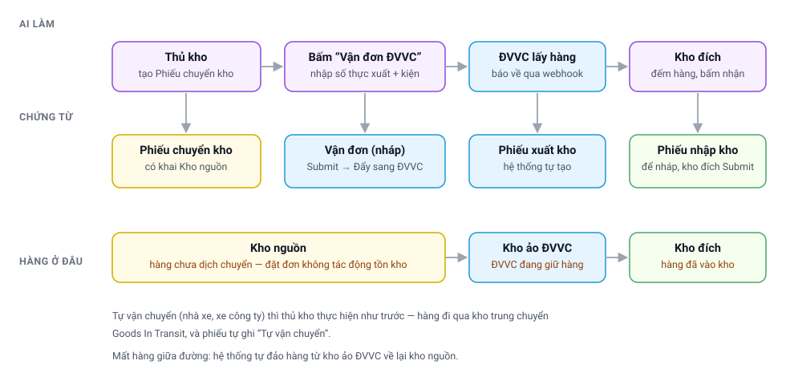

# Chuyển kho qua ĐVVC — từ phiếu chuyển kho tới lúc kho đích nhận hàng

> Đối tượng: **thủ kho** hai đầu tuyến, **quản lý kho**.
> Chuyển hàng giữa hai kho của **cùng một công ty** — cân đối tồn, hoặc tiếp hàng cho
> kho đang thiếu. Bán hàng cho khách thì xem
> [Vận đơn từ Sales Order](Delivery_Partner_Extension.html).

---

## Toàn cảnh

Điều quan trọng nhất trong sơ đồ trên: **bấm nút đặt đơn không đụng tới tồn kho**. Hàng
vẫn nằm nguyên ở kho nguồn cho tới khi ĐVVC thật sự tới lấy. Nhờ vậy ngày xuất kho luôn
bám đúng ngày hàng rời kho, không phải ngày ai đó bấm nút.

---

## 1. Thủ kho kho nguồn — tạo phiếu và đặt đơn

Vẫn tạo **Phiếu chuyển kho** (Material Request) như từ trước tới nay. Chỉ cần nhớ **khai
Kho nguồn ở đầu phiếu** — đó chính là dấu hiệu để hệ thống biết đây là chuyển kho thật,
chứ không phải phiếu cấp vật tư cho kỹ thuật viên.

Submit phiếu xong, nút **Tạo → Vận đơn ĐVVC** sẽ hiện lên.

> **Nút không hiện?** Kiểm ba thứ: phiếu đã Submit chưa, đầu phiếu đã khai Kho nguồn
> chưa, và phiếu này có phải do vận đơn bán hàng sinh ra không (loại đó không đặt ĐVVC
> được — hàng đang được soạn cho khách).

Bấm nút, một hộp thoại mở ra:

| Ô | Ý nghĩa |
|---|---|
| **Tài khoản ĐVVC** | Hệ thống tự chọn theo công ty của phiếu và điểm gửi khai trên kho nguồn |
| **Giá trị hàng khai với ĐVVC** | Tính sẵn theo giá vốn tồn kho. **Con số này ăn vào phí bảo hiểm và mức đền nếu ĐVVC làm mất hàng** — sửa nếu thấy chưa đúng |
| **Số thực xuất** | Mặc định lấy y số trên phiếu. Xuất thiếu thì sửa dòng đó |
| **Số kiện, cân nặng, kích thước** | Cân nặng suy từ khối lượng khai trên Item — **cân lại rồi sửa cho đúng**, khai sai là cước sai |

Xác nhận xong, hệ thống dựng ra một **vận đơn ở trạng thái nháp** và mở luôn ra cho bạn.

### Cảnh báo trong hộp thoại

Hộp thoại có thể hiện vệt vàng cảnh báo. Đọc kỹ, đừng bỏ qua:

- *"Kho nguồn chưa khai Điểm gửi ĐVVC"* — ĐVVC sẽ tới lấy hàng ở **điểm mặc định của
  tài khoản** (kho TP.HCM) chứ không tới kho của bạn. Báo quản lý khai điểm gửi cho kho
  trước khi đẩy đơn.
- *"Kho đích chưa có địa chỉ"* — thiếu địa chỉ thì không tạo được vận đơn, hệ thống sẽ
  chặn ngay khi bấm xác nhận. Phải khai địa chỉ cho kho đích, **nhớ điền cả số điện
  thoại** trên địa chỉ đó.

### Kiểm lại rồi mới đẩy đơn

Vận đơn nháp là để bạn xem lại: địa chỉ nhận có đúng không, cước tuyến này bao nhiêu
(nút **Xem cước theo dịch vụ**), các dòng hàng có cùng một kho nguồn không.

Ưng rồi thì **Submit** → bấm **Đẩy đơn sang ĐVVC**.

> Hai nút này khác nhau hẳn, đừng nhầm:
> **“Vận đơn ĐVVC”** chỉ dựng chứng từ nháp, bên ngoài chưa ai biết gì.
> **“Đẩy đơn sang ĐVVC”** mới là lúc ĐVVC nhận đơn và cử người tới lấy hàng.
> Bấm cái đầu rồi đóng gói ngồi chờ thì sẽ không có ai tới.

---

## 2. Sau khi đẩy đơn — hệ thống tự làm

**ĐVVC báo đã lấy hàng** → hệ thống tự tạo và ký **Phiếu xuất kho**: hàng rời kho nguồn,
sang nằm ở **kho ảo của ĐVVC**. Nhìn tồn kho là biết ĐVVC đang giữ bao nhiêu hàng của
mình.

**ĐVVC báo đã giao tới nơi** → hệ thống dựng sẵn **Phiếu nhập kho ở trạng thái nháp** cho
kho đích, và giao việc cho người phụ trách kho đó.

**Hàng mất giữa đường** → hệ thống tự đảo hàng từ kho ảo ĐVVC về lại kho nguồn, để tồn
kho không treo lơ lửng.

---

## 3. Thủ kho kho đích — đếm hàng rồi ký

Hàng tới nơi, mở **Phiếu nhập kho** đang ở trạng thái nháp, **đếm hàng thật** rồi bấm
**Submit**. Lúc đó hàng mới chính thức vào kho đích.

Phiếu để nháp chứ không tự ký là cố ý: thiếu hàng, vỡ hàng thì phát hiện ngay lúc đếm,
chứ không phải ba tháng sau lúc kiểm kê.

---

## 4. Không đi ĐVVC thì sao?

Chuyến nào tự chở — nhà xe, xe công ty — thì thủ kho làm **y như từ trước tới nay**:
tạo phiếu xuất kho tay từ phiếu chuyển kho. Hệ thống tự ghi vào ô **Chế độ vận chuyển**
là *"Tự vận chuyển"*, và hàng đi qua kho trung chuyển **Goods In Transit** thay vì kho ảo
của ĐVVC.

Hai kho trung chuyển này tách nhau có chủ đích, nhìn vào là biết **ai đang giữ hàng và ai
đền nếu mất**:

| Hàng nằm ở | Ai đang giữ | Có mã vận đơn / cước |
|---|---|---|
| **Kho ảo ĐVVC** | đơn vị vận chuyển | có |
| **Goods In Transit** | mình (nhà xe, xe công ty) | không |

---

## 5. Không xuất kho hai lần

Đây là chỗ dễ sai nhất khi mới đổi cách làm, nên hệ thống chặn cứng cả hai chiều:

- **Đã đặt ĐVVC** → tạo phiếu xuất tay bị chặn, kèm câu giải thích và số vận đơn. Muốn
  quay lại tự chở thì **huỷ vận đơn trước**.
- **Đã tự xuất kho tay** → nút đặt ĐVVC không hiện nữa. Muốn đổi sang đi ĐVVC thì huỷ
  phiếu xuất đó trước.

Ô **Chế độ vận chuyển** trên phiếu chuyển kho là ô **chỉ đọc**, hệ thống tự ghi theo việc
bạn làm — không ai phải nhập.

---

## 6. Huỷ vận đơn

Huỷ vận đơn **không đụng tới phiếu chuyển kho** — phiếu đó là của kho, có trước vận đơn
và sống độc lập. Chế độ vận chuyển chỉ được trả về trống để chọn đường khác.

- **Chưa lấy hàng** → huỷ sạch, không để lại dấu vết gì trong kho.
- **Đã lấy hàng, chưa tới nơi** → hệ thống **huỷ luôn phiếu xuất kho**, hàng về lại kho nguồn.
  Phiếu chuyển kho được **mở lại như chưa từng đi**, đặt ĐVVC khác được ngay — không phải tạo
  phiếu chuyển kho mới.
- **Kho đích đã ký phiếu nhập** → hệ thống **chặn huỷ**. Hàng đã vào kho rồi, muốn huỷ
  thì phải huỷ phiếu nhập trước và cân nhắc kỹ.

---

## 7. Trước khi dùng — quản lý kho cần khai

| Việc | Ở đâu | Không khai thì sao | Hiện trạng |
|---|---|---|---|
| **Địa chỉ** cho từng kho đích, có số điện thoại | Kho → thêm Address | **Không tạo được vận đơn** | ⛔ **28/29 kho đích chưa có** — xem dưới |
| **Điểm gửi ĐVVC** cho từng kho nguồn | Form Kho, ô *Điểm gửi ĐVVC* | ĐVVC tới lấy hàng ở TP.HCM chứ không tới kho tỉnh | 10/20 kho nguồn đã có, phủ 720/824 lượt |
| **Đồng bộ điểm gửi** cho từng tài khoản ĐVVC | DP Partner Account → *Đồng bộ điểm gửi* | Danh sách điểm gửi trống | tài khoản AKW chưa đồng bộ |

> ⛔ **Chốt chặn lớn nhất trước khi dùng thật: cả hệ thống mới có ĐÚNG MỘT kho khai địa chỉ**
> (KHO HỒ CHÍ MINH - TGĐG). Đối chiếu 824 lượt chuyển kho một năm qua: **764 lượt (93%) sẽ bị
> chặn ngay** vì kho đích chưa có địa chỉ. Nặng nhất theo lượt: HÀ NỘI KHO (164), Thanh Hoá (93),
> Đà Nẵng (66), Hạ Long (54), Biên Hoà (49), Vũng Tàu (46), Quy Nhơn (42), Cần Thơ (42).
> Khai xong 8 kho này là phủ hơn nửa lượng chuyển kho.

Điểm gửi phải **đăng ký trước trên cổng ĐVVC** rồi mới đồng bộ về được — tạo tay bản ghi
trong hệ thống là vô nghĩa, vì mã điểm do ĐVVC cấp.

Công ty nào chưa có tài khoản ĐVVC thì nút vẫn báo rõ, và chuyển kho của công ty đó đi
đường tự vận chuyển như cũ.
