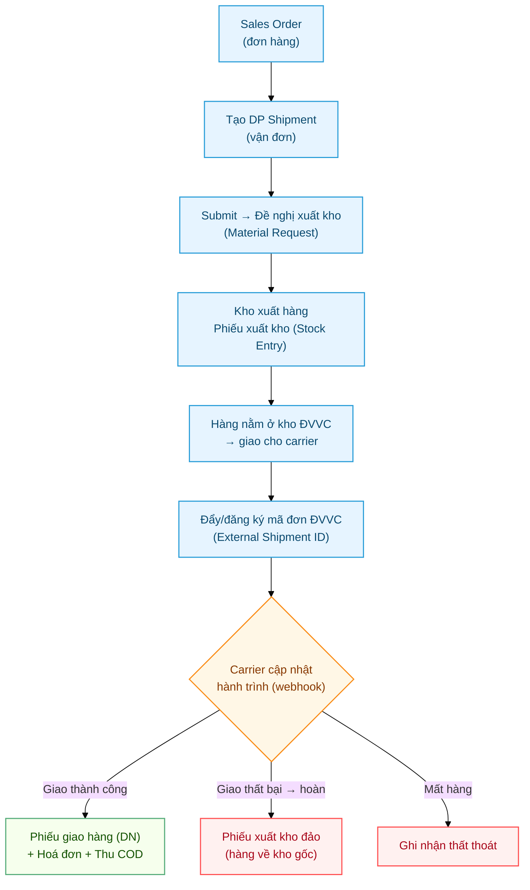

# Quy trình vận đơn — từ đơn hàng đến giao nhận & COD

> Đối tượng: **nhân viên kho**, **sales/CSKH**, **kế toán**, **quản lý vận hành**.
> Tài liệu mô tả luồng nghiệp vụ đầu-đến-cuối của một vận đơn (DP Shipment) khi kết nối
> đơn vị vận chuyển (ĐVVC) — không đi vào chi tiết kỹ thuật (xem
> [Tài liệu kỹ thuật](../tech/Delivery_Partner-Lifecycle.html)).

---

## Sơ đồ quy trình

---

## Mục lục

1. [Hệ thống làm gì](#1-hệ-thống-làm-gì)
2. [Tạo vận đơn](#2-tạo-vận-đơn)
3. [Submit — đề nghị xuất kho](#3-submit--đề-nghị-xuất-kho)
4. [Kho xuất hàng](#4-kho-xuất-hàng)
5. [Gắn mã đơn ĐVVC & theo dõi hành trình](#5-gắn-mã-đơn-đvvc--theo-dõi-hành-trình)
6. [Giao thành công — phiếu giao, hoá đơn, COD](#6-giao-thành-công--phiếu-giao-hoá-đơn-cod)
7. [Hoàn hàng / mất hàng](#7-hoàn-hàng--mất-hàng)
8. [Các chứng từ liên quan](#8-các-chứng-từ-liên-quan)
9. [Sự cố thường gặp](#9-sự-cố-thường-gặp)

---

## 1. Hệ thống làm gì

Một **vận đơn (DP Shipment)** theo dõi một lô hàng từ lúc xuất kho đến lúc ĐVVC giao xong (hoặc hoàn/mất).
Trong quá trình đó hệ thống tự sinh các chứng từ kho & kế toán tương ứng, và cập nhật **trạng thái**
theo hành trình mà ĐVVC báo về.

- **Sales/CSKH**: tạo vận đơn (thường từ Sales Order), chọn ĐVVC, người nhận, hàng hoá, COD.
- **Kho**: xuất hàng giao cho ĐVVC (sinh Phiếu xuất kho — `Stock Entry`) và nhận hàng hoàn.
- **Kế toán**: theo dõi hoá đơn + tiền COD do ĐVVC thu hộ.
- **Vận hành**: theo dõi trạng thái giao nhận của từng đơn.

> Trạng thái vận đơn được ĐVVC đẩy về tự động qua **webhook** (xem
> [Viettel Post — Cài đặt & sử dụng](Delivery_Partner-Viettel_Post-Cai-Dat.html) để cấu hình).

---

## 2. Tạo vận đơn

Bốn cách. Ba cách đầu đều bấm **Tạo → Vận đơn ĐVVC** ngay trên chứng từ gốc:

- **Từ Đơn bán hàng** (bán hàng cho khách): hệ thống tự điền hàng hoá, khách hàng, giá trị. Vận đơn
  giữ liên kết về đơn để sau này khớp số lượng giao + hoá đơn.
  Xem [Vận đơn từ Sales Order](Delivery_Partner_Extension.html).
- **Từ Phiếu chuyển kho** (chuyển hàng giữa hai kho cùng công ty): phiếu phải đã Submit và có khai
  Kho nguồn. Xem [Chuyển kho qua ĐVVC](Delivery_Partner-Chuyen-Kho.html).
- **Từ Phiếu yêu cầu xét nghiệm** (lấy mẫu nước ở chỗ khách về lab): phiếu phải khai Hình thức lấy
  mẫu là *Đơn vị vận chuyển*. Xem [Gửi mẫu nước về lab](Delivery_Partner-Gui-Mau.html).
- **Thủ công**: vào **Vận đơn → New**, tự chọn ĐVVC, người nhận, hàng hoá. (Chi tiết thao tác form
  có ảnh: [Viettel Post — Cài đặt & sử dụng, Phần B](Delivery_Partner-Viettel_Post-Cai-Dat.html#phần-b--tạo-đơn-hàng-ngày).)

### Tài khoản ĐVVC chọn ở đâu

Mỗi công ty có **tài khoản ĐVVC riêng**, gắn với kho ảo riêng. Chọn sai tài khoản thì vận đơn vẫn
dựng ra bình thường nhưng tắc ở bước sau — nên biết chỗ chọn là ở đâu:

| Đặt đơn từ | Chọn tài khoản ở đâu | Hệ thống có lọc theo công ty không |
|---|---|---|
| Phiếu chuyển kho | trong **hộp thoại** đặt đơn | ✅ có — chỉ hiện tài khoản đi được |
| Đơn bán hàng | **trên form vận đơn** (*Partner* → *Partner Account*) | ⚠️ **không** — tự nhìn cho khớp |
| Phiếu yêu cầu xét nghiệm | không chọn — lấy từ cấu hình `DP Cobe Settings` | — |
| Tạo thủ công | trên form vận đơn | ⚠️ không |

Mẹo nhanh cho hai dòng ⚠️: **hậu tố tên tài khoản phải khớp công ty của chứng từ** — `- TGDG`,
`- AKW`, `- DR`.

Đổi tài khoản trên form thì **Dịch vụ giao** và **Điểm gửi** bị xoá trắng — cố ý, vì cả hai đăng ký
riêng theo từng tài khoản.

Chi tiết đầy đủ: [Tài khoản ĐVVC & Điểm gửi](Delivery_Partner-Tai-Khoan-Diem-Gui.html).

### Ô "Mục đích" quyết định chuyện gì xảy ra sau đó

Ô **Mục đích** quyết định hệ thống sinh ra chuỗi chứng từ nào:

| Mục đích | Hàng đi đâu | Chứng từ sinh ra |
|---|---|---|
| **Bán hàng** | kho → kho ảo ĐVVC → khách | Đề nghị xuất kho (`Material Request`), Phiếu xuất (`Stock Entry`), Phiếu giao (`Delivery Note`), Hoá đơn (`Sales Invoice`) + Thu COD (`Payment Entry`) |
| **Chuyển kho** | kho nguồn → kho ảo ĐVVC → kho đích | Phiếu xuất rồi Phiếu nhập (cùng là `Stock Entry`), kho đích ký |
| **Gửi mẫu về lab** | chỗ khách → lab | **không sinh gì** — mẫu nước không phải hàng tồn kho |
| **để trống** | ĐVVC chở, hệ thống không theo dõi tồn | không sinh gì |

**Không ai nhập ô này** — nó chỉ đọc, hệ thống tự điền theo bảng **Chứng từ nguồn** ngay dưới:
có dòng trỏ về Đơn bán hàng (`Sales Order`) thì là *Bán hàng*, trỏ về Phiếu chuyển kho
(`Material Request`) thì là *Chuyển kho*, trỏ về Phiếu yêu cầu xét nghiệm (`Water Analysis Request`)
thì là *Gửi mẫu về lab*.

Do đó, vận đơn **tạo thủ công** trên Desk mà không gắn chứng từ nguồn sẽ để trống Mục đích và
**không kèm chứng từ ERP nào** — đó chỉ là một lần đặt xe: gửi hợp đồng cho khách, gửi trả một
món cho nhà cung cấp, chuyển đồ giữa hai văn phòng. Muốn có chuỗi chứng từ thì phải tạo từ nút
trên chứng từ gốc; tạo thủ công rồi tự khai mục đích không còn được chấp nhận.

Bảng **Chứng từ nguồn** (`DP Shipment Reference`) ghi vận đơn này phục vụ chứng từ nào — một vận đơn có thể gom
nhiều chứng từ, và một chứng từ có thể sinh ra nhiều vận đơn. Ba trường hợp hệ thống chặn:

- Trộn **khác loại** chứng từ trong một vận đơn (Đơn bán hàng lẫn Phiếu chuyển kho) → chặn lúc Lưu.
- **Hai Đơn bán hàng** trong một vận đơn → chặn lúc Lưu, vì chưa có quy tắc phân chia Phiếu giao
  hàng và hoá đơn COD cho từng đơn.
- Gắn một **Phiếu chuyển kho không hợp lệ** (phiếu cấp vật tư cho KTV, phiếu chưa Submit, phiếu
  đã có vận đơn khác, phiếu đã xuất kho thủ công) → chặn lúc **Submit**, kèm lý do cụ thể.

Cần điền: **Partner** (ĐVVC) + **Partner Account**, **Dịch vụ giao** (menu **Actions → "Xem cước
theo dịch vụ"** hiện mã + phí thật của tuyến để chọn; bỏ trống thì lúc bấm Đẩy đơn hộp thoại
chọn tự bật lên), **người nhận**
(tab Delivery), **hàng hoá** + **Value of Goods**, **COD Amount** (nếu thu hộ), **kiện hàng**
(tab Parcels), **người trả cước** (tab Charges).

> ⚠️ 3 ô quyết định đơn bên ĐVVC đúng hay sai — nhập theo **thực tế đóng gói**, không phải theo số lượng bán:
>
> | Ô | Vì sao quan trọng |
> |---|---|
> | Tab **Parcels** — kích thước (dài×rộng×cao) + cột **Count** | Đây là **số kiện** và kích thước gửi sang ĐVVC để **tính cước** (theo khối lượng quy đổi). Bán 10 sản phẩm đóng chung 1 thùng → Count = **1** |
> | Tab **Charges** — **Charges Paid By** | *Sender* = mình trả cước, *Receiver* = người nhận trả khi giao. Chọn sai thì ĐVVC thu cước sai người |
> | Tab **Delivery** — SĐT người nhận | Giao cho **Company / không có người liên hệ** → phải có **Phone trên Address** giao hàng, không thì đẩy đơn báo thiếu |

---

## 3. Submit — đề nghị xuất kho

Bấm **Submit** vận đơn:
- Hệ thống kiểm tra (có kiện, có hàng, giá trị > 0, hàng cùng 1 kho nguồn).
- Trạng thái chuyển sang **Submitted**.
- Tự sinh **Đề nghị xuất kho** (Material Request) gửi cho kho: yêu cầu chuyển hàng từ **kho nguồn** sang
  **kho ảo của ĐVVC**.

> ⚠️ Submit **chưa** trừ tồn kho. "Đề nghị xuất kho" chỉ là yêu cầu để kho thực hiện ở bước 4.

---

## 4. Kho xuất hàng

Kho thực hiện xuất hàng theo Đề nghị → sinh **Phiếu xuất kho** (Stock Entry, kiểu chuyển kho):
- Tồn kho **trừ ở kho nguồn**, **cộng ở kho ảo ĐVVC** (thể hiện "hàng đang trong tay ĐVVC").
- Vận đơn cập nhật trạng thái nội bộ **"Transferred"** (đã chuyển hàng cho ĐVVC).

> Đây là thời điểm tồn kho thực sự thay đổi. Sau bước này hàng đã rời kho công ty.

---

## 5. Gắn mã đơn ĐVVC & theo dõi hành trình

Để ĐVVC cập nhật được trạng thái, vận đơn phải có **mã đơn của ĐVVC** (External Shipment ID). Có 2 cách
(gom trong menu **Actions** trên vận đơn):

- **"Đẩy đơn sang ĐVVC"** — tạo đơn trực tiếp qua hệ thống → tự lấy mã đơn về.
- **"Đã tạo đơn ở ngoài"** — nếu đã tạo đơn trên cổng ĐVVC, nhập mã đơn vào đây.

Sau khi có mã đơn, ĐVVC sẽ **đẩy hành trình về tự động**. Ý nghĩa từng trạng thái:

| Trạng thái | Ý nghĩa |
|---|---|
| **Partner Received** | ĐVVC đã nhận hàng |
| **In Transit** | Đang vận chuyển / đang giao |
| **Delivered** | Giao thành công |
| **Delivery Failed** | Giao thất bại |
| **Returning** | Đang hoàn về |
| **Returned** | Đã hoàn về kho |
| **Lost** | Mất / thất lạc |
| **Cancelled** | Đã huỷ |

Xem trạng thái + lịch sử ở **tab Tracking** của vận đơn (kèm dòng ghi chú mỗi lần ĐVVC cập nhật).

---

## 6. Giao thành công — phiếu giao, hoá đơn, COD

Khi trạng thái về **Delivered**, hệ thống tự sinh (nếu vận đơn gắn với Sales Order):

1. **Phiếu giao hàng** (Delivery Note) — xuất hàng khỏi kho ảo ĐVVC, ghi nhận **đã giao** cho khách
   (cập nhật số lượng đã giao trên Sales Order).
2. Nếu có **COD** (thu hộ):
   - **Hoá đơn bán hàng** (Sales Invoice) — ghi doanh thu + công nợ khách.
   - **Phiếu thu COD** (Payment Entry) — ghi nhận tiền ĐVVC thu hộ (từ tài khoản COD của ĐVVC) cấn trừ
     vào hoá đơn.

> ⓘ Việc tự sinh các chứng từ này chạy khi **webhook ĐVVC đã kết nối** và tích hợp ERP đang bật.
> Nếu sau khi đơn "Delivered" mà chưa thấy chứng từ, xem [§9](#9-sự-cố-thường-gặp).

---

## 7. Hoàn hàng / mất hàng

- **Returned** (hoàn về): hệ thống sinh **Phiếu xuất kho đảo** (`Stock Entry`) — chuyển hàng từ kho ảo ĐVVC **về lại kho
  nguồn**, khôi phục tồn.
- **Lost** (mất hàng): ghi nhận thất thoát để kế toán xử lý (không tự hoàn tồn).
- **Delivery Failed / Returning**: chỉ cập nhật trạng thái, chờ kết quả cuối (Returned hoặc giao lại).

---

## 8. Các chứng từ liên quan

Tên tiếng Việt trong tài liệu ↔ **tên doctype thật** (gõ tên tiếng Anh vào ô tìm kiếm là ra đúng
danh sách): Đơn bán hàng = `Sales Order` · Vận đơn = `DP Shipment` · Chứng từ nguồn = `DP Shipment
Reference` · Đề nghị xuất kho / Phiếu chuyển kho = `Material Request` · Phiếu xuất kho, Phiếu nhập
kho, Phiếu đảo = `Stock Entry` · Phiếu giao hàng = `Delivery Note` · Hoá đơn = `Sales Invoice` ·
Phiếu thu COD = `Payment Entry` · Kho & kho ảo ĐVVC = `Warehouse` · Hãng vận chuyển = `DP Partner` ·
Tài khoản ĐVVC = `DP Partner Account` · Điểm gửi = `DP Pickup Point` · Dịch vụ giao =
`DP Account Service` · Địa chỉ = `Address` · Việc cần làm = `ToDo`.

| Chứng từ | Sinh khi | Tác động |
|---|---|---|
| **Vận đơn** (`DP Shipment`) | Tạo tay / từ SO | Hồ sơ trung tâm theo dõi lô hàng + trạng thái |
| **Đề nghị xuất kho** (`Material Request`) | Submit vận đơn | Yêu cầu kho xuất hàng (chưa trừ tồn) |
| **Phiếu xuất kho** (`Stock Entry`) | Kho xuất hàng | Trừ kho nguồn → cộng kho ĐVVC |
| **Phiếu giao hàng** (`Delivery Note`) | Giao thành công | Xuất khỏi kho ĐVVC; tăng SL đã giao của SO |
| **Hoá đơn** (`Sales Invoice`) | Giao thành công + có COD | Doanh thu + công nợ khách |
| **Phiếu thu COD** (`Payment Entry`) | Sau hoá đơn | Ghi tiền ĐVVC thu hộ, cấn trừ hoá đơn |
| **Phiếu xuất kho đảo** (`Stock Entry`) | Hoàn hàng | Hoàn tồn về kho nguồn |

---

## 9. Sự cố thường gặp

| Triệu chứng | Khắc phục |
|---|---|
| Submit xong nhưng tồn kho chưa đổi | Đúng — Submit chỉ tạo **Đề nghị xuất kho**. Kho phải xuất hàng (Phiếu xuất kho) ở bước 4. |
| Trạng thái không tự cập nhật khi ĐVVC giao | Vận đơn chưa có/đúng **External Shipment ID** khớp mã ĐVVC, hoặc webhook chưa kết nối. Xem [Viettel Post — Cài đặt, Bước 5](Delivery_Partner-Viettel_Post-Cai-Dat.html#bước-5--bật-cập-nhật-trạng-thái-tự-động). |
| Đơn "Delivered" nhưng **không thấy Phiếu giao / Hoá đơn / Phiếu thu COD** | Vận đơn không gắn Sales Order, chưa deploy bản vá webhook, hoặc COD account sai loại — báo bộ phận kỹ thuật (xem [Tài liệu kỹ thuật](../tech/Delivery_Partner-Lifecycle.html#status-reactor-fix)). |
| Không thấy nút "Đẩy đơn" / "Đã tạo đơn ở ngoài" | Vận đơn phải **đã Submit** và **chưa** có External Shipment ID (nút ẩn để chống tạo trùng). |
| Không thấy nút **Tạo → Vận đơn ĐVVC** trên Phiếu chuyển kho | Phiếu phải **đã Submit**, có khai **Kho nguồn ở đầu phiếu**, và chưa tự xuất kho tay. Phiếu do vận đơn bán hàng sinh ra thì không có nút này. |
| Vận đơn Submit rồi mà **không sinh Đề nghị xuất kho**, hoặc báo lỗi về kho khi sinh chứng từ | Nhiều khả năng chọn **tài khoản ĐVVC của công ty khác** — kho ảo của tài khoản thuộc công ty A không nhận hàng của công ty B. Kiểm hậu tố tên tài khoản (`- TGDG` / `- AKW` / `- DR`) cho khớp công ty của đơn. Xem [Tài khoản ĐVVC & Điểm gửi](Delivery_Partner-Tai-Khoan-Diem-Gui.html). |
| Đổi tài khoản xong thì **mất Dịch vụ giao / Điểm gửi** đang chọn | Đúng như thiết kế — hai thứ đó đăng ký riêng theo từng tài khoản. Chọn lại từ danh sách của tài khoản mới. |
| ĐVVC tới lấy hàng **nhầm kho** | Kho nguồn chưa khai **Điểm gửi ĐVVC** → ĐVVC dùng điểm mặc định của tài khoản. Xem [Chuyển kho qua ĐVVC, mục 7](Delivery_Partner-Chuyen-Kho.html). |
| Đơn bị **ĐVVC huỷ** mà hàng **đã lấy đi** — có nên Cancel? | ❌ **CHƯA** — chờ kho nhận lại hàng thật rồi mới Cancel, không thì sổ kho lệch. Xem [quy tắc Cancel](Delivery_Partner_Extension.html#cancel-khi-hang-da-di). |
| Bấm "Đẩy đơn" báo thiếu mã vùng / thông tin người nhận | Mở Address người nhận → chọn đúng Tỉnh/Huyện → Lưu (hệ thống tự dò mã vùng). Giao cho Company: điền **Phone trên Address**. Chi tiết: [Viettel Post — Cài đặt, Phần B Bước 2](Delivery_Partner-Viettel_Post-Cai-Dat.html). |
| ĐVVC hiện **sai kích thước / số kiện / người trả cước / cước lệch** | Kiểm tab **Parcels** (kích thước + Count = số kiện thật) và tab **Charges** (Charges Paid By) **trước khi đẩy đơn**. Xem [bảng xử lý ở doc Viettel Post](Delivery_Partner-Viettel_Post-Cai-Dat.html#gặp-trục-trặc). |
| Báo **"Mã dịch vụ không khả dụng"** / **"Price does not apply to this itinerary!"** khi đẩy đơn | Dịch vụ đang chọn không áp được cho tuyến/cân nặng của đơn (mỗi dịch vụ có khung cân — hàng nặng phải đi mã hàng nặng như `BTK`). **Actions → "Xem cước theo dịch vụ"** → chọn một dịch vụ trong danh sách thật của tuyến (kèm phí) — xem [Viettel Post — Cài đặt, Bước 4](Delivery_Partner-Viettel_Post-Cai-Dat.html#bước-4--chọn-dịch-vụ-giao-hàng). Đơn chưa chọn dịch vụ thì hộp thoại này **tự bật** khi bấm Đẩy đơn. |

---

## Liên quan

- [Viettel Post — Cài đặt & sử dụng](Delivery_Partner-Viettel_Post-Cai-Dat.html) — kết nối ĐVVC, đẩy đơn, mã vùng (có ảnh)
- [Vận đơn từ Sales Order (kho & kế toán)](Delivery_Partner_Extension.html) — luồng SO → kho → hoá đơn → COD
- [Chuyển kho qua ĐVVC](Delivery_Partner-Chuyen-Kho.html) — chuyển hàng giữa hai kho cùng công ty
- [Gửi mẫu nước về lab](Delivery_Partner-Gui-Mau.html) — lấy mẫu ở chỗ khách, không sinh chứng từ kho
- [Tài khoản ĐVVC & Điểm gửi](Delivery_Partner-Tai-Khoan-Diem-Gui.html) — chọn tài khoản, khai điểm gửi, đọc cảnh báo
- [Delivery Partner — Tài liệu kỹ thuật (app gốc)](../tech/Delivery_Partner-Tech.html) — kiến trúc, doctype, webhook, test
- [Lifecycle & Doc Events](../tech/Delivery_Partner-Lifecycle.html) — tích hợp ERP
