# Viettel Post — Cài đặt & sử dụng

Hướng dẫn từng bước **có hình minh hoạ** để kết nối Viettel Post và tạo đơn giao hàng.
Làm theo đúng thứ tự là chạy được — không cần biết kỹ thuật.

> Cần chi tiết sâu (mã trạng thái, webhook, payload, xử lý lỗi nâng cao)? Xem
> [Viettel Post — Tham chiếu kỹ thuật](../tech/Delivery_Partner-Viettel_Post-Tech.html).

Toàn bộ chỉ có **2 phần**:

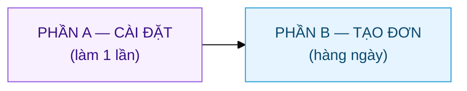

---

# PHẦN A — Cài đặt (làm 1 lần)

## Bước 1 · Kết nối tài khoản Viettel Post

Vào **DP Partner Account** → mở tài khoản của công ty bạn (ví dụ *Viettel Post - TGDG*).

1. Điền **Username** và **Password** — chính là tài khoản đăng nhập `partner.viettelpost.vn`.
2. Bấm nút **Test Credentials** ở góc trên.
   - ✅ Hiện *"Login successful"* màu xanh → kết nối thành công.
   - ❌ Màu đỏ → sai mật khẩu, hoặc tick nhầm **Use Sandbox** (chỉ bật khi dùng tài khoản thử nghiệm).

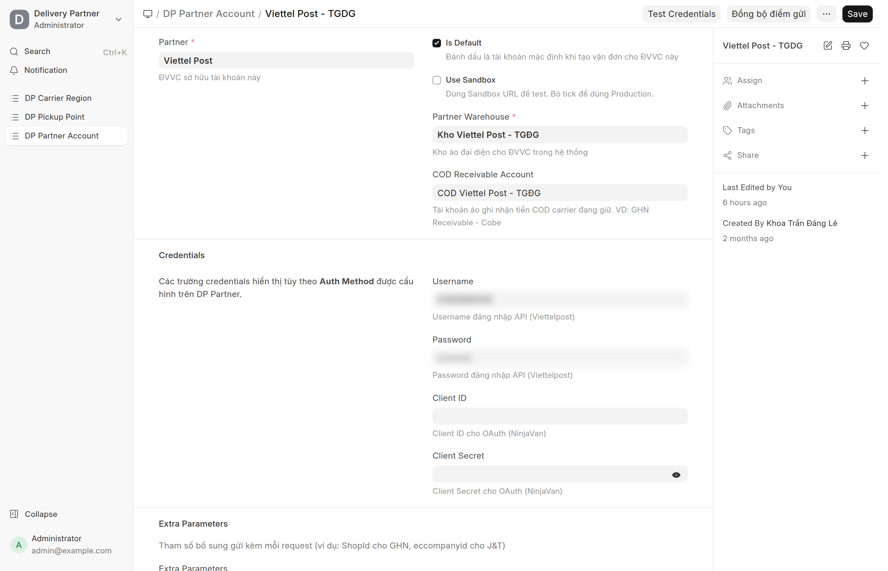

> Mỗi công ty có **một tài khoản kết nối riêng**. Nếu công ty bạn có nhiều tài khoản VTP, làm bước này cho từng cái.

---

## Bước 2 · Tải danh mục địa chỉ Viettel Post

Viettel Post dùng **mã vùng riêng** cho tỉnh/huyện/xã. Bước này tải sẵn danh mục đó về để
hệ thống tự điền mã vùng khi tạo đơn — bạn không phải tra tay.

Vào **DP Partner → Viettel Post** → bấm nút **"Đồng bộ danh mục vùng"** (góc trên bên phải) → xác nhận.

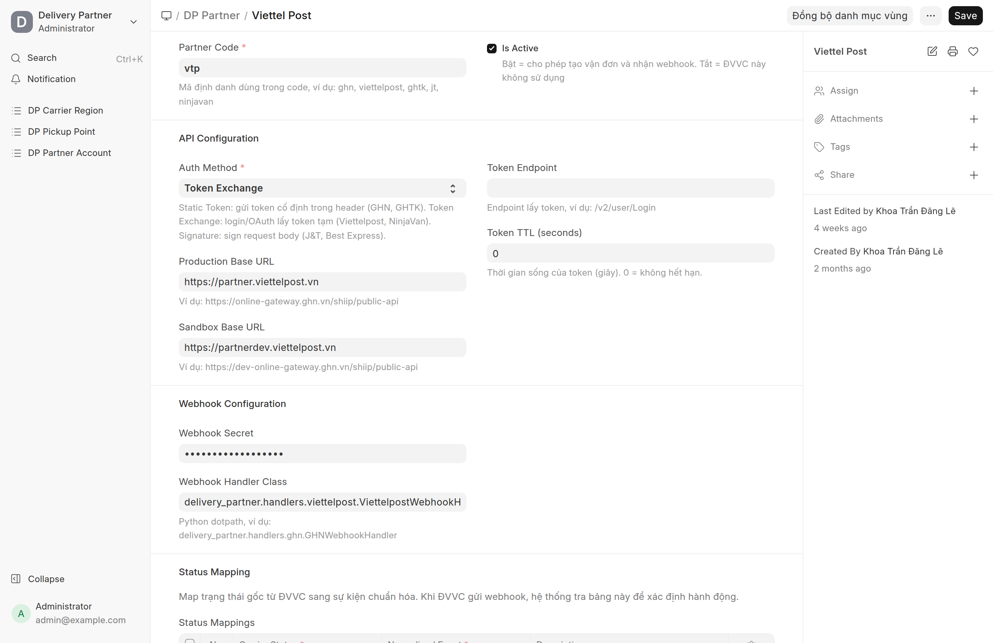

- Chạy nền khoảng **5 phút** (tải hơn 16.000 địa danh). Cứ để đó, làm việc khác.
- Chỉ cần làm **một lần cho cả hệ thống**. Sau này VTP đổi danh mục thì bấm lại để cập nhật.

---

## Bước 3 · Tải kho gửi & chọn kho mặc định

"Kho gửi" là địa điểm bạn đã khai trên cổng Viettel Post để họ đến lấy hàng.

**3.1 — Tải kho về:** Vào **DP Partner Account** → bấm **"Đồng bộ điểm gửi"** → xác nhận.
Hệ thống tạo danh sách kho trong **DP Pickup Point**.

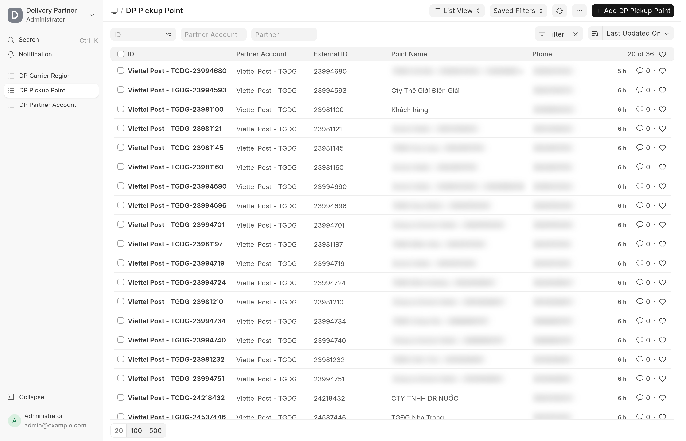

**3.2 — Chọn kho mặc định:** Nếu có **nhiều kho**, mở kho hay dùng nhất → tick **"Is Default"** → Lưu.

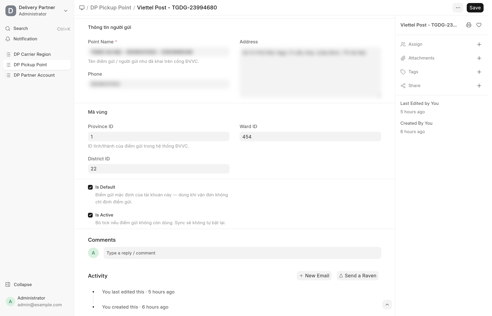

> Chỉ có **một kho** thì bỏ qua bước 3.2 — hệ thống tự dùng kho đó.

---

## Bước 4 · Chọn dịch vụ giao hàng

Chọn loại dịch vụ Viettel Post mặc định (nhanh, tiêu chuẩn, tiết kiệm...).

Vào **DP Partner Account → mục Extra Parameters** → thêm một dòng:

| Ô | Điền |
|---|---|
| **Param Key** | `ORDER_SERVICE` |
| **Param Value** | mã dịch vụ (xem gợi ý bên dưới) |
| **Send As** | `Body` |

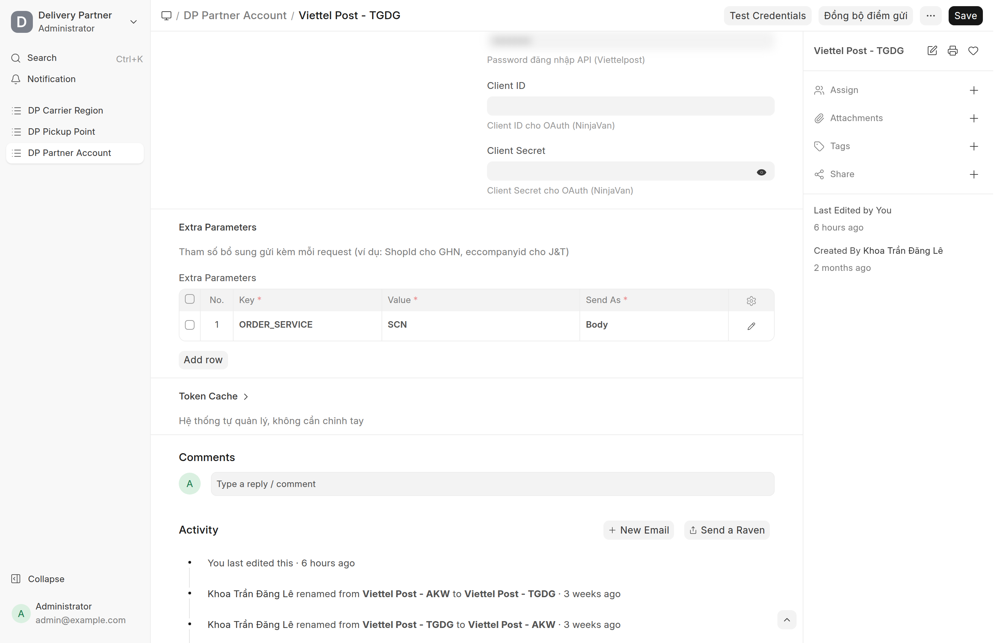

**Các mã dịch vụ thường dùng:**

| Mã | Loại | Tốc độ |
|---|---|---|
| `VTK` | Tiết kiệm | ~72h |
| `STK` | Tiêu chuẩn | ~72h |
| `SCN` | Nhanh | ~36h |
| `VCN` | Nhanh (thoả thuận) | ~36h |
| `SHT` | Hỏa tốc | ~24h |

> **Không chắc dùng mã nào?** Cứ chọn tạm một mã rồi thử tạo đơn (Phần B). Nếu mã không hợp,
> hệ thống sẽ báo ngay **danh sách mã đúng cho tuyến đó** để bạn chọn lại.

---

## Bước 5 · Bật cập nhật trạng thái tự động

Để đơn tự cập nhật "đang giao / đã giao..." mà không phải kiểm tay, khai địa chỉ nhận thông báo
trên **cổng Viettel Post**: *Bảng điều khiển → Thông tin tài khoản → Cấu hình webhook*.

| Ô trên cổng VTP | Điền |
|---|---|
| **Webhook Endpoints** | `https://<tên-miền-của-bạn>/api/method/delivery_partner.api.webhook.handle?partner=Viettel+Post` |
| **Secret parameter** | một chuỗi mật bất kỳ — điền **giống hệt** vào ô `Webhook Secret` của DP Partner *Viettel Post* trong hệ thống |

> Bước này do người quản trị làm một lần. Xong thì mọi đơn sau đều tự cập nhật trạng thái.

---

# PHẦN B — Tạo đơn (hàng ngày)

## Bước 1 · Tạo vận đơn

Vào **DP Shipment → New** và điền theo các tab:

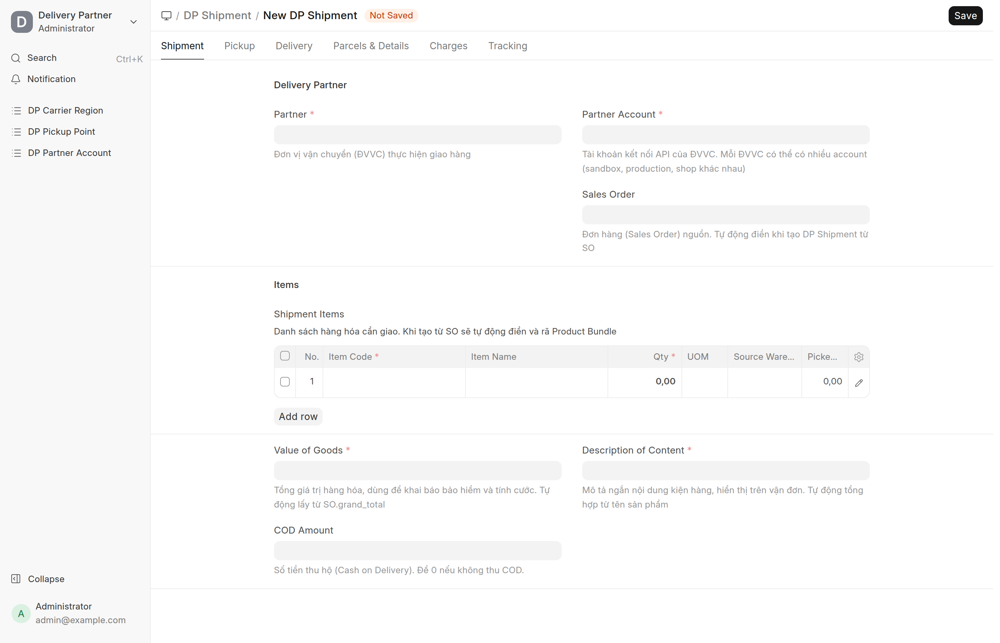

| Tab | Điền gì |
|---|---|
| **Shipment** | Partner = *Viettel Post*, chọn Partner Account; thêm sản phẩm; **Value of Goods**; **COD Amount** (tiền thu hộ — để **0** nếu không thu) |
| **Pickup** | Kho xuất hàng |
| **Delivery** | Khách nhận (địa chỉ, SĐT tự điền theo khách) |
| **Parcels** | Bấm **Auto-calculate Parcel** hoặc thêm tay — mỗi kiện phải có cân nặng |

Xong bấm **Submit**.

---

## Bước 2 · (Nếu cần) Kiểm mã vùng người nhận

Thường hệ thống **tự dò** mã vùng người nhận từ địa chỉ. Nếu muốn kiểm hoặc địa chỉ lạ, mở
**Address** người nhận → bấm nút **"Dò mã vùng VTP"** (nhóm *VTP* ở góc trên).

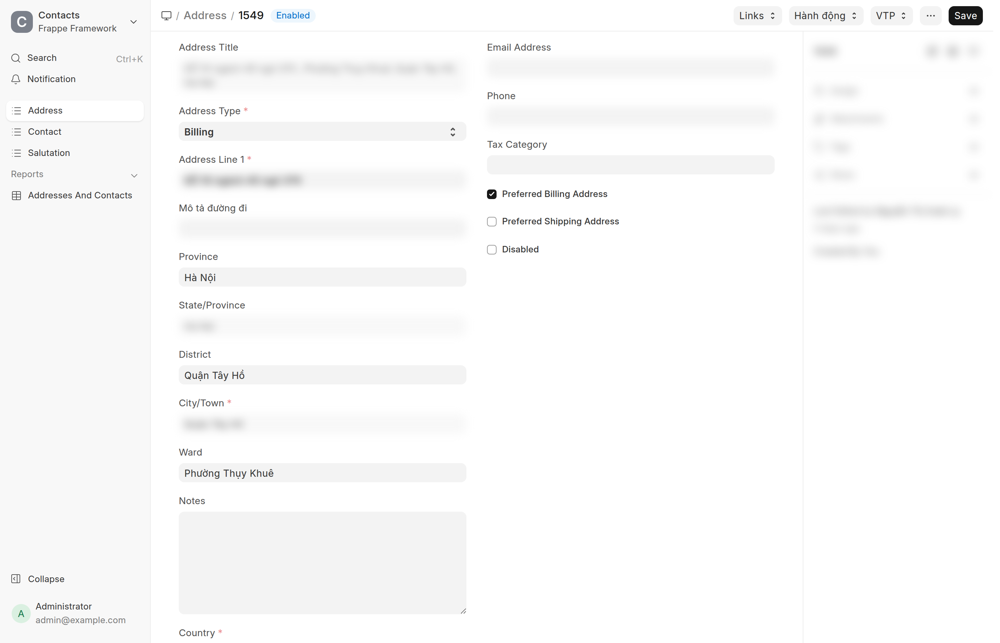

Hệ thống tự điền 3 ô mã vùng. Ô nào báo "chưa khớp" (thường là địa chỉ cũ đã sáp nhập) thì
**nhập tay** rồi Lưu.

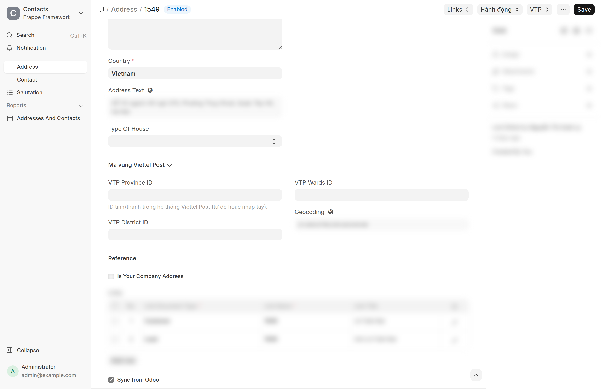

---

## Bước 3 · Đẩy đơn sang Viettel Post

Sau khi Submit, mở menu **Actions → "Đẩy đơn sang ĐVVC"** → xác nhận.

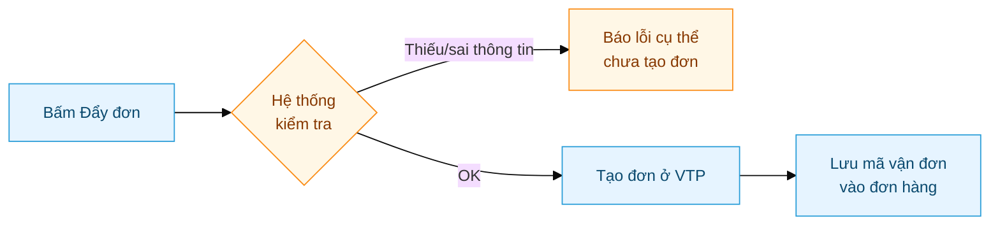

Hệ thống **kiểm tra trước** (mã vùng, dịch vụ, cân nặng): sai thì báo lỗi rõ ràng và **không tạo đơn**.
Đúng thì tạo đơn thật và tự lưu **mã vận đơn** — từ đó trạng thái sẽ tự cập nhật.

> Đã có mã vận đơn thì nút "Đẩy đơn" **biến mất** để tránh tạo trùng.

---

## Bước 4 · Theo dõi đơn

Trạng thái đơn tự đổi theo hành trình Viettel Post báo về (tab **Tracking** của vận đơn).

**Đơn thường (không thu hộ):**

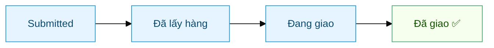

**Đơn có thu hộ (COD):** giống trên, nhưng khi giao thì khách trả tiền cho shipper, sau đó
Viettel Post đối soát và chuyển tiền COD về. Trạng thái cuối vẫn là **Đã giao**, kèm ghi nhận
tiền thu hộ.

> Xem hành trình đầy đủ (kèm mã trạng thái từng bước) trong
> [tài liệu kỹ thuật](../tech/Delivery_Partner-Viettel_Post-Tech.html#4-hành-trình-một-đơn--không-cod).

---

## Gặp trục trặc?

| Tình huống | Cách xử lý |
|---|---|
| Test Credentials đỏ | Kiểm lại mật khẩu; tắt **Use Sandbox** nếu dùng tài khoản thật |
| "Chưa đặt điểm gửi mặc định" | Làm bước 3.2 — tick Is Default cho một kho |
| "Chưa cấu hình dịch vụ" | Làm bước 4 — thêm `ORDER_SERVICE` |
| "Mã dịch vụ không khả dụng" | Đổi sang một mã trong danh sách hệ thống gợi ý |
| "Không xác định được mã vùng" | Làm bước 2 (đồng bộ danh mục), rồi "Dò mã vùng VTP" trên Address |
| Đơn không tự cập nhật trạng thái | Kiểm cấu hình webhook (bước 5) |

Chi tiết hơn xem [tài liệu kỹ thuật](../tech/Delivery_Partner-Viettel_Post-Tech.html#8-troubleshooting-kỹ-thuật).
