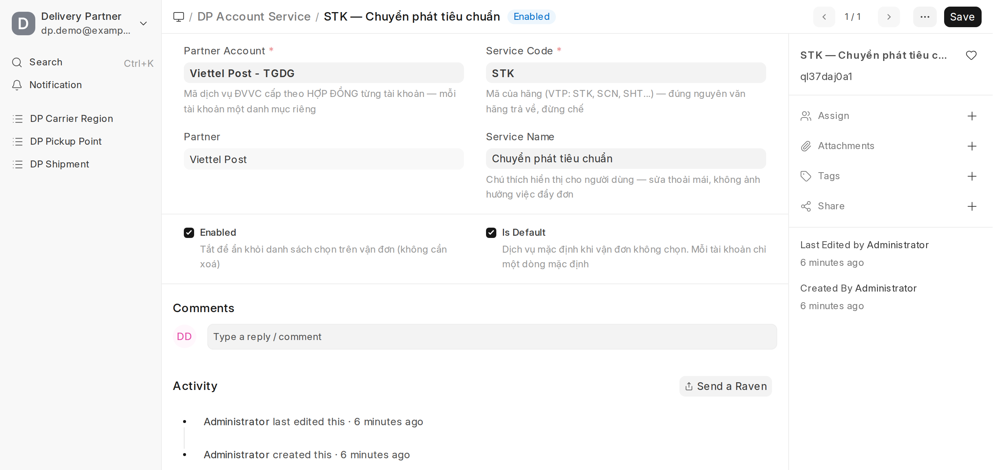
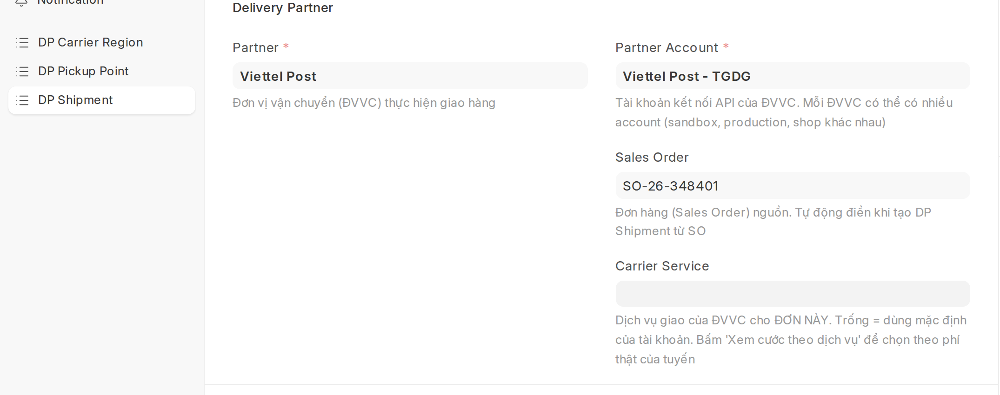
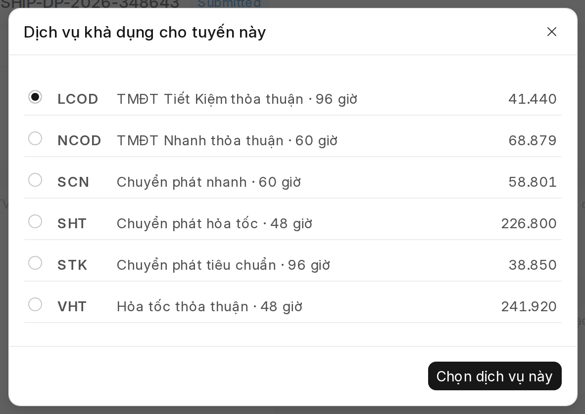
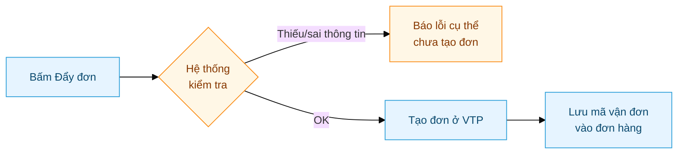

# Viettel Post — Cài đặt & sử dụng

Hướng dẫn từng bước **có hình minh hoạ** để kết nối Viettel Post và tạo đơn giao hàng.
Làm theo đúng thứ tự là chạy được — không cần biết kỹ thuật.

> Cần chi tiết sâu (mã trạng thái, webhook, payload, xử lý lỗi nâng cao)? Xem
> [Viettel Post — Tham chiếu kỹ thuật](../tech/Delivery_Partner-Viettel_Post-Tech.html).

Toàn bộ chỉ có **2 phần**:

---

# PHẦN A — Cài đặt (làm 1 lần)

## Bước 1 · Kết nối tài khoản Viettel Post

Vào **DP Partner Account** → mở tài khoản của công ty bạn (ví dụ *Viettel Post - TGDG*).

1. Điền **Username** và **Password** — chính là tài khoản đăng nhập `partner.viettelpost.vn`.
2. Bấm nút **Test Credentials** ở góc trên.
   - ✅ Hiện *"Login successful"* màu xanh → kết nối thành công.
   - ❌ Màu đỏ → sai mật khẩu, hoặc tick nhầm **Use Sandbox** (chỉ bật khi dùng tài khoản thử nghiệm).

> Mỗi công ty có **một tài khoản kết nối riêng**. Nếu công ty bạn có nhiều tài khoản VTP, làm bước này cho từng cái.

---

## Bước 2 · Tải danh mục địa chỉ Viettel Post

Viettel Post dùng **mã vùng riêng** cho tỉnh/huyện/xã. Bước này tải sẵn danh mục đó về để
hệ thống tự điền mã vùng khi tạo đơn — bạn không phải tra tay.

Vào **DP Partner → Viettel Post** → bấm nút **"Đồng bộ danh mục vùng"** (góc trên bên phải) → xác nhận.

- Chạy nền khoảng **5 phút** (tải hơn 16.000 địa danh). Cứ để đó, làm việc khác.
- Chỉ cần làm **MỘT LẦN cho cả hệ thống** — danh mục này là của VTP, dùng chung cho mọi đơn.
  **Có khách mới / địa chỉ mới KHÔNG cần đồng bộ lại** — hệ thống tự dò mã vùng cho từng địa chỉ
  ngay khi lưu. Chỉ bấm lại khi VTP thay đổi danh mục hành chính (hiếm, vài lần một năm).
- Quyền bấm nút: mặc định **System Manager / Stock Manager / DP Manager** — cấp/thu thêm cho role khác
  qua **Role Permission Manager** (quyền *Create* trên DP Carrier Region / DP Pickup Point), không cần deploy.

---

## Bước 3 · Tải kho gửi & chọn kho mặc định

"Kho gửi" là địa điểm bạn đã khai trên cổng Viettel Post để họ đến lấy hàng.

**3.1 — Tải kho về:** Vào **DP Partner Account** → bấm **"Đồng bộ điểm gửi"** → xác nhận.
Hệ thống tạo danh sách kho trong **DP Pickup Point**.

**3.2 — Chọn kho mặc định:** Nếu có **nhiều kho**, mở kho hay dùng nhất → tick **"Is Default"** → Lưu.

> Chỉ có **một kho** thì bỏ qua bước 3.2 — hệ thống tự dùng kho đó.

---

## Bước 4 · Chọn dịch vụ giao hàng

Dịch vụ giao (nhanh, tiêu chuẩn, tiết kiệm...) chọn được **theo từng vận đơn** ở ô
**Dịch vụ giao** trên DP Shipment — xem Phần B Bước 1. Không cần cài gì trước:
danh mục dịch vụ của tài khoản **tự hình thành** từ những lần bấm menu **Actions →
"Xem cước theo dịch vụ"** trên vận đơn (mã + tên lấy thẳng từ Viettel Post, không ai
phải gõ tay; chọn lại mã đã có thì dùng dòng cũ, không sinh trùng).

**Đặt dịch vụ mặc định** (dùng khi vận đơn không chọn gì) — làm 1 lần theo đúng thứ tự:

1. Mở một vận đơn bất kỳ (đã có tài khoản + địa chỉ giao) → **Actions → Xem cước theo
   dịch vụ** → chọn dịch vụ muốn làm mặc định (bước này tự sinh dòng danh mục).
2. Vào danh sách **DP Account Service** → mở dòng vừa sinh → tick **Is Default** → Save
   (mỗi tài khoản một dòng mặc định — tick dòng mới là dòng cũ tự bỏ tick).

   
3. Vào DP Partner Account → xoá dòng `ORDER_SERVICE` trong **Extra Parameters** (nguồn
   mặc định kiểu cũ — bước 3 làm SAU bước 2, không thì đơn bỏ trống dịch vụ sẽ báo lỗi).

Trong danh mục, cột **Service Name** sửa thoải mái thành chú thích dễ hiểu ("Nhanh ~36h —
đơn gấp"), mã không đổi; dịch vụ không dùng thì bỏ tick **Enabled** để ẩn khỏi danh sách chọn.

**Các mã dịch vụ thường dùng:**

| Mã | Loại | Tốc độ |
|---|---|---|
| `VTK` | Tiết kiệm | ~72h |
| `STK` | Tiêu chuẩn | ~72h |
| `SCN` | Nhanh | ~36h |
| `VCN` | Nhanh (thoả thuận) | ~36h |
| `SHT` | Hỏa tốc | ~24h |

> Mã khả dụng phụ thuộc **hợp đồng tài khoản + từng tuyến** (có tuyến không có VTK/SCN).
> **Actions → "Xem cước theo dịch vụ"** trên vận đơn luôn hiện đúng mã + phí của tuyến đó.

> **Cách cũ vẫn chạy:** dòng `ORDER_SERVICE` trong **Extra Parameters** của tài khoản
> () giờ là mặc định *dự phòng* — chỉ được
> dùng khi vận đơn không chọn và danh mục chưa có dòng mặc định. Khi đã đặt Is Default trong
> DP Account Service thì nên xoá dòng này để khỏi có 2 nguồn mặc định.

---

## Bước 5 · Bật cập nhật trạng thái tự động

Để đơn tự cập nhật "đang giao / đã giao..." mà không phải kiểm tay, khai địa chỉ nhận thông báo
trên **cổng Viettel Post**: *Bảng điều khiển → Thông tin tài khoản → Cấu hình webhook*.

| Ô trên cổng VTP | Điền |
|---|---|
| **Webhook Endpoints** | `https://<tên-miền-của-bạn>/api/method/delivery_partner.api.webhook.handle?partner=Viettel+Post` |
| **Secret parameter** | một chuỗi mật bất kỳ — điền **giống hệt** vào ô `Webhook Secret` của DP Partner *Viettel Post* trong hệ thống |

> Bước này do người quản trị làm một lần. Xong thì mọi đơn sau đều tự cập nhật trạng thái.

---

# PHẦN B — Tạo đơn (hàng ngày)

## Bước 1 · Tạo vận đơn

Vào **DP Shipment → New** và điền theo các tab:

| Tab | Điền gì |
|---|---|
| **Shipment** | Partner = *Viettel Post*, chọn Partner Account; **Dịch vụ giao** (trống = mặc định tài khoản; chọn thẳng từ danh sách, hoặc **Actions → "Xem cước theo dịch vụ"** để xem mã + phí thật của tuyến rồi chọn luôn — đổi được tới khi đơn đã đẩy sang ĐVVC); thêm sản phẩm; **Value of Goods**; **COD Amount** (tiền thu hộ — để **0** nếu không thu) |
| **Pickup** | Kho xuất hàng |
| **Delivery** | Khách nhận (địa chỉ, SĐT tự điền theo khách). Giao cho **Company/không có người liên hệ** → cần **Phone trên Address** giao hàng |
| **Parcels** | Bấm **Auto-calculate Parcel** hoặc thêm tay — mỗi kiện phải có cân nặng. **Kích thước (dài×rộng×cao) và số kiện ở tab này là thứ gửi sang VTP** để tính cước — nhập đúng thực tế |
| **Charges** | **Charges Paid By** = ai trả cước: *Sender* (mình trả) hay *Receiver* (người nhận trả khi giao) — sang VTP đúng theo lựa chọn này |

**Nút "Xem cước theo dịch vụ" hoạt động thế nào** (menu **Actions**):

1. Hệ thống hỏi Viettel Post đúng tuyến của đơn này → hiện danh sách **mã + tên + phí thật**.

   
2. Chọn một dòng → bấm **"Chọn dịch vụ này"** → hệ thống **tự điền vào ô Dịch vụ giao và
   tự Lưu đơn luôn** — không phải bấm Save thêm (có thông báo xanh *"Đã chọn dịch vụ ..."*).
3. Lựa chọn chỉ áp cho **đơn này**, không đổi mặc định của tài khoản, không ảnh hưởng đơn khác.

> - Đơn đang có sửa đổi chưa lưu → nút bắt **Lưu trước** rồi mới tra cước (giá tính theo
>   dữ liệu đã lưu — cân nặng, kiện, địa chỉ).
> - Đổi ý? Bấm lại Xem cước chọn mã khác, hoặc sửa thẳng ô **Dịch vụ giao** — được cả
>   **sau khi Submit**, cho tới khi đơn **đã đẩy sang ĐVVC** thì ô khoá (đổi lúc đó VTP
>   không nhận nữa).

Xong bấm **Submit**.

---

## Bước 2 · (Nếu cần) Kiểm mã vùng người nhận

**Bình thường bạn KHÔNG phải làm gì ở bước này.** Mã vùng VTP được hệ thống **tự dò và điền sẵn
ngay khi lưu địa chỉ** (và tự dò lại lần nữa lúc đẩy đơn nếu còn thiếu). Địa chỉ mới của khách
mới cũng vậy — không cần "đồng bộ" gì thêm.

Địa chỉ cũ đã sáp nhập (Quận 2/Quận 9 → TP Thủ Đức...) hệ thống cũng **tự xử lý**: tên quận cũ
không còn trong danh mục VTP thì tự suy quận mới từ **phường** (phường cũ vẫn nằm dưới quận mới).

Chỉ khi đẩy đơn báo *"Không xác định được mã vùng"* (địa chỉ thiếu Tỉnh/Huyện, hoặc tên phường
trùng ở nhiều quận kiểu "Phường 1" nên không dám đoán): mở **Address** người nhận → chọn đúng
**Tỉnh/Thành + Quận/Huyện + Phường/Xã** → Lưu (hệ thống tự dò lại). Vẫn chưa ra thì bấm nút
**"Dò mã vùng VTP"** (nhóm *VTP* ở góc trên) để xem cấp nào trượt rồi điền tay.

Hệ thống tự điền 3 ô mã vùng. Ô nào báo "chưa khớp" (thường là tên phường trùng ở nhiều quận)
thì **nhập tay** rồi Lưu.

---

## Bước 3 · Đẩy đơn sang Viettel Post

Sau khi Submit, mở menu **Actions → "Đẩy đơn sang ĐVVC"** → xác nhận.

Hệ thống **kiểm tra trước** (mã vùng, dịch vụ, cân nặng): sai thì báo lỗi rõ ràng và **không tạo đơn**.
Đúng thì tạo đơn thật và tự lưu **mã vận đơn** — từ đó trạng thái sẽ tự cập nhật.

> Đã có mã vận đơn thì nút "Đẩy đơn" **biến mất** để tránh tạo trùng.

---

## Bước 4 · Theo dõi đơn

Trạng thái đơn tự đổi theo hành trình Viettel Post báo về (tab **Tracking** của vận đơn).

**Đơn thường (không thu hộ):**

**Đơn có thu hộ (COD):** giống trên, nhưng khi giao thì khách trả tiền cho shipper, sau đó
Viettel Post đối soát và chuyển tiền COD về. Trạng thái cuối vẫn là **Đã giao**, kèm ghi nhận
tiền thu hộ.

> Xem hành trình đầy đủ (kèm mã trạng thái từng bước) trong
> [tài liệu kỹ thuật](../tech/Delivery_Partner-Viettel_Post-Tech.html#4-hành-trình-một-đơn--không-cod).

---

## Gặp trục trặc?

| Tình huống | Cách xử lý |
|---|---|
| Test Credentials đỏ | Kiểm lại mật khẩu; tắt **Use Sandbox** nếu dùng tài khoản thật |
| "Chưa đặt điểm gửi mặc định" | Làm bước 3.2 — tick Is Default cho một kho |
| "Chưa chọn dịch vụ giao" | Chọn ở ô **Dịch vụ giao** trên vận đơn (nút "Xem cước theo dịch vụ"), hoặc đặt Is Default trong DP Account Service — xem bước 4 |
| "Mã dịch vụ không khả dụng" | Tuyến này không có mã đó — bấm **"Xem cước theo dịch vụ"** chọn lại theo danh sách thật của tuyến |
| "Không xác định được mã vùng" | Mở Address người nhận → chọn đúng **Tỉnh/Thành + Quận/Huyện + Phường/Xã** → Lưu (hệ thống tự dò; quận sáp nhập kiểu Quận 2/9 tự suy từ phường). Vẫn trượt (phường trùng tên nhiều quận) → "Dò mã vùng VTP" + điền tay ô trống. **Không cần** đồng bộ danh mục lại — chỉ khi hệ thống báo rõ *"Chưa có danh mục vùng"* mới làm bước 2 |
| Đơn không tự cập nhật trạng thái | Kiểm cấu hình webhook (bước 5) |
| Giao cho **Company** báo *"Thiếu Tên hoặc SĐT người nhận"* | Mở **Address** giao hàng → điền ô **Phone** → Lưu → đẩy đơn lại. (Giao cho Company không có Contact thì hệ thống lấy SĐT từ Address) |
| VTP hiện **kích thước 10×10×10** / **số kiện sai** | Kiểm tab **Parcels**: kích thước dài×rộng×cao và cột **Count** ở đây là thứ gửi sang VTP. Số VTP hiển thị = **số kiện**, không phải số lượng sản phẩm |
| VTP hiện **người trả cước** không đúng lựa chọn | Kiểm tab **Charges** → **Charges Paid By** trước khi đẩy đơn. Đổi sau khi đã đẩy thì phải sửa trực tiếp trên cổng VTP |
| **Cước** trên VTP khác cước ERP báo lúc đẩy đơn | Thường do kích thước/số kiện tab Parcels sai thực tế (VTP tính cước theo **khối lượng quy đổi** dài×rộng×cao). Nhập đúng kích thước rồi so lại |

Chi tiết hơn xem [tài liệu kỹ thuật](../tech/Delivery_Partner-Viettel_Post-Tech.html#8-troubleshooting-kỹ-thuật).
