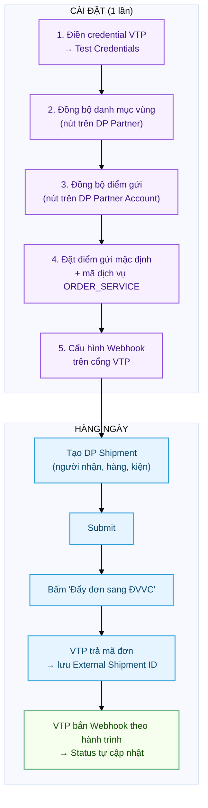
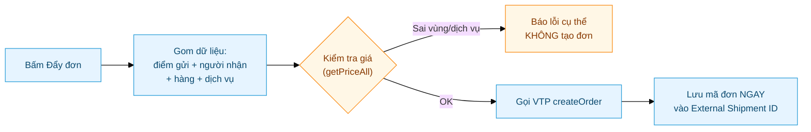
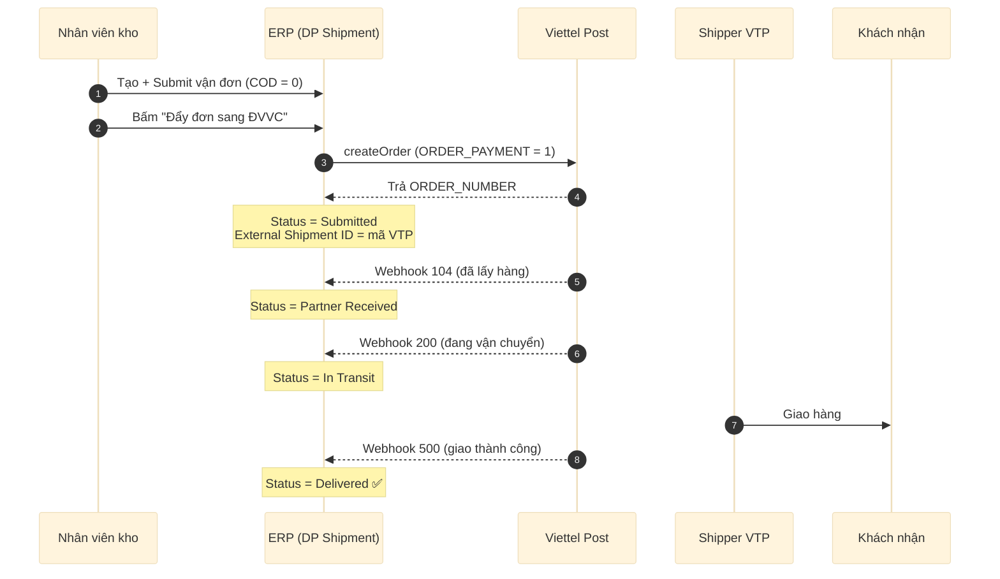
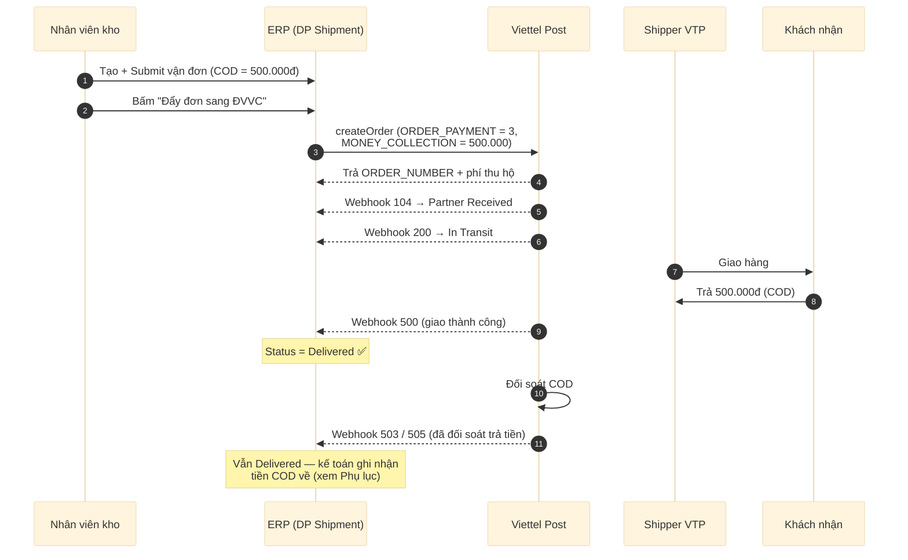
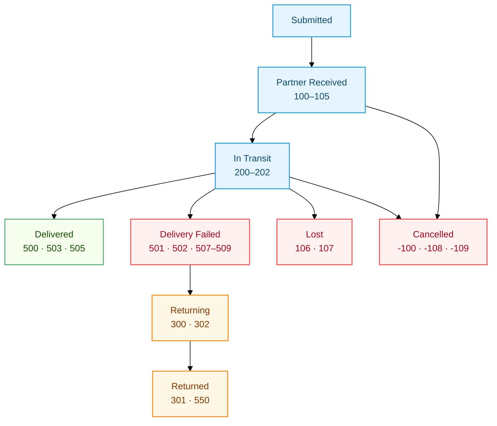

# Viettel Post — Hướng dẫn A → Z

Hướng dẫn đầy đủ cho đơn vị vận chuyển **Viettel Post (VTP)** trên app `delivery_partner`:
từ setup, đồng bộ dữ liệu, tạo đơn, đến theo dõi trạng thái. Kèm **hành trình đầy đủ của
một đơn** (có COD và không COD).

> Khái niệm chung (DP Partner, DP Shipment, Status Mapping, Webhook) xem
> [Hướng dẫn Delivery Partner](Delivery_Partner.md) trước.

> **Thông tin VTP trong hệ thống:**
> - Partner name: `Viettel Post` · code: `vtp`
> - Auth: **Token Exchange** (đăng nhập username/password → JWT token)
> - Production: `https://partner.viettelpost.vn` · Sandbox: `https://partnerdev.viettelpost.vn`
> - **Toàn bộ thao tác đều bấm nút trên giao diện** — không cần dòng lệnh.

---

## Tổng quan luồng

Đọc sơ đồ này trước để nắm bức tranh lớn. Chi tiết từng bước ở các mục bên dưới.



---

## 0. Yêu cầu trước khi bắt đầu

- App `delivery_partner` đã cài + `bench migrate` xong trên site.
- Đã có **DP Partner `Viettel Post`** + **DP Partner Account** cho từng công ty (tạo sẵn khi cài đặt, hoặc chạy `setup_all_carriers`). Kèm kho ảo + COD account — xem [Phụ lục](#phụ-lục-kế-toán-cod).
- Tài khoản đối tác VTP (đăng nhập được `partner.viettelpost.vn`).
- Quyền **System Manager** (để đồng bộ dữ liệu) hoặc **Stock Manager** (để tạo vận đơn).

---

## 1. Điền credential VTP & Test

Vào **DP Partner Account** → mở tài khoản VTP của công ty (VD `Viettel Post - TGDG`):

1. **Auth Method** = `Token Exchange` (đã set sẵn).
2. Điền **Username** + **Password** tài khoản VTP.
3. **Use Sandbox**: tắt = production `partner.viettelpost.vn`; bật = sandbox `partnerdev` (tài khoản dev phải được VTP kích hoạt).
4. Bấm nút **Test Credentials** trên thanh công cụ.

> ✅ Xanh "Login successful" → credential đúng.
> ❌ Đỏ → sai username/password, hoặc sai môi trường (Use Sandbox tick nhầm).

Cơ chế: hệ thống gọi `POST /v2/user/Login`, nhận JWT token, cache lại và gửi kèm các request sau.

> **Nhiều công ty:** mỗi công ty **1 DP Partner Account** riêng (credential + kho + COD account của công ty đó). DP Partner `Viettel Post` thì **dùng chung 1 cái**. Xem [mục Kế toán COD](#phụ-lục-kế-toán-cod) ở cuối.

---

## 2. Đồng bộ danh mục vùng (1 lần, ~5 phút)

VTP yêu cầu **ID số** tỉnh/huyện/xã khi tạo đơn (không nhận địa chỉ dạng chữ). Bước này kéo
toàn bộ danh mục vùng của VTP về hệ thống để **dò mã vùng tự động** khi tạo đơn.

Vào **DP Partner → `Viettel Post`** → bấm nút **"Đồng bộ danh mục vùng"** → xác nhận.

- Chạy nền vài phút (~16.000 bản ghi: 63 tỉnh, 746 huyện, 15.660 xã).
- Dùng API công khai của VTP — **không cần token**, làm được ngay cả khi chưa điền credential.
- Chạy lại bất kỳ lúc nào để cập nhật (không tạo trùng).

> Chỉ cần làm **1 lần cho toàn hệ thống** (danh mục dùng chung mọi công ty). Kết quả lưu ở
> doctype **DP Carrier Region**.

---

## 3. Đồng bộ điểm gửi (kho) & đặt mặc định

"Điểm gửi" = kho/địa điểm gửi hàng đã khai trên cổng VTP (VTP gọi là *inventory*). Mỗi điểm
có mã `GROUPADDRESS_ID` + `CUS_ID` mà VTP bắt buộc khi tạo đơn.

### 3.1. Kéo điểm gửi về

Vào **DP Partner Account** (tài khoản VTP của công ty) → bấm **"Đồng bộ điểm gửi"** → xác nhận.

- Cần credential đã điền (bước 1) vì phải đăng nhập.
- Hệ thống gọi `listInventory`, tạo các bản ghi **DP Pickup Point** (tên kho, SĐT, địa chỉ, mã vùng).

### 3.2. Đặt điểm gửi mặc định (bắt buộc nếu có nhiều kho)

Nếu tài khoản có **nhiều điểm gửi**, phải chọn 1 cái làm mặc định — nếu không, khi đẩy đơn sẽ
báo lỗi *"có nhiều điểm gửi nhưng chưa đặt cái nào mặc định"*.

Vào **DP Pickup Point** → mở điểm gửi muốn dùng → tick **"Is Default"** → Lưu.

> Nếu tài khoản chỉ có **đúng 1 điểm gửi**, hệ thống tự dùng nó — khỏi cần đặt mặc định.

---

## 4. Cấu hình mã dịch vụ (ORDER_SERVICE)

Mã dịch vụ VTP (`ORDER_SERVICE`) **cấp theo hợp đồng của từng tài khoản** và **thay đổi theo tuyến**
gửi → nhận. Đặt mã mặc định vào **Extra Params** của DP Partner Account:

Vào **DP Partner Account → tab Extra Parameters** → thêm 1 dòng:

| Param Key | Param Value | Send As |
|---|---|---|
| `ORDER_SERVICE` | (1 mã hợp lệ, xem bảng) | `Body` |

**Các mã dịch vụ thường gặp** (giá + thời gian tuỳ tuyến, tra bằng nút đẩy đơn):

| Mã | Tên | Đặc điểm |
|---|---|---|
| `VTK` | CP tiết kiệm thỏa thuận | Rẻ nhất, ~72h |
| `STK` | Chuyển phát tiêu chuẩn | ~72h |
| `LCOD` | TMĐT Tiết Kiệm | ~72h |
| `SCN` | Chuyển phát nhanh | ~36h |
| `VCN` | CP nhanh thỏa thuận | ~36h |
| `NCOD` | TMĐT Nhanh | ~36h |
| `SHT` | Chuyển phát hỏa tốc | ~24h |
| `VHT` | Hỏa tốc thỏa thuận | ~24h |
| `PHS` | Nội tỉnh tiết kiệm | Chỉ dùng nội tỉnh |

> **Không chắc account có mã nào?** Cứ bấm "Đẩy đơn" — nếu mã sai, hệ thống báo ngay **danh sách
> mã hợp lệ cho đúng tuyến đó** (nhờ bước kiểm tra giá trước khi tạo, xem mục 6).

Các param **tuỳ chọn** khác: `ORDER_SERVICE_ADD` (dịch vụ cộng thêm), `PRODUCT_LENGTH/WIDTH/HEIGHT`
(kích thước kiện mặc định, cm). **Không cần** khai `GROUPADDRESS_ID`/`SENDER_*` nữa — lấy tự động
từ điểm gửi mặc định (mục 3).

---

## 5. Cấu hình Webhook (để trạng thái tự cập nhật)

Đây là cơ chế **chính** để trạng thái đơn tự cập nhật về ERP. Trên cổng VTP:
**Bảng điều khiển → Thông tin tài khoản → Cấu hình webhook**, điền 2 ô:

| Ô trên cổng VTP | Điền gì |
|---|---|
| **Webhook Endpoints** | `https://<domain>/api/method/delivery_partner.api.webhook.handle?partner=Viettel+Post` |
| **Secret parameter** | 1 chuỗi bí mật tự đặt — điền **trùng** vào field `Webhook Secret` của DP Partner `Viettel Post` |

- `partner=Viettel+Post` **bắt buộc khớp** tên `Viettel Post` (dấu cách encode thành `+`).
- Handler xác thực bằng header **`X-VTP-Token` == `Webhook Secret`**.
- Để **trống** `Webhook Secret` bên ERP → bỏ qua xác thực (nhận mọi request) — tiện test nhanh, kém an toàn.

---

## 6. Tạo đơn hàng

### 6.1. Tạo DP Shipment

Vào **DP Shipment → New**:

1. **Partner** = `Viettel Post`, **Partner Account** = tài khoản của công ty.
2. **Tab Pickup**: Pickup From = `Warehouse` → chọn kho → địa chỉ/liên hệ auto-fill.
3. **Tab Delivery**: Deliver To = `Customer` → chọn khách → địa chỉ/liên hệ auto-fill.
4. **Tab Shipment**: thêm items; điền **Value of Goods** (> 0); điền **COD Amount** nếu thu hộ (không thu thì để 0).
5. **Tab Parcels**: bấm **Auto-calculate Parcel** hoặc thêm tay — mỗi kiện `weight > 0`.
6. **Submit** → status = **`Submitted`**.

### 6.2. Kiểm tra mã vùng người nhận (nếu cần)

Khi tạo đơn, hệ thống **tự dò mã vùng VTP** của người nhận từ địa chỉ (dùng danh mục đã đồng bộ
ở mục 2). Đa số địa chỉ ra đủ tỉnh + huyện tự động.

Muốn kiểm tra/sửa trước: mở **Address** người nhận → bấm nút **"Dò mã vùng VTP"** (nhóm *VTP*):

- Hệ thống dò theo tỉnh/huyện/xã có cấu trúc của Address → tự điền `VTP Province/District/Wards ID`.
- Cấp nào báo "chưa khớp" (VD địa chỉ cũ như *Quận 2* đã sáp nhập) → **nhập ID tay** rồi Lưu. Giá trị nhập tay được **ưu tiên** khi tạo đơn.

### 6.3. Đẩy đơn — menu **Actions**

Sau khi Submit và **chưa có** External Shipment ID, form có menu **Actions**:

**a) "Đẩy đơn sang ĐVVC"** — tạo đơn thật:



1. Bấm → xác nhận.
2. Hệ thống **kiểm tra giá trước** (getPriceAll): nếu sai mã vùng hoặc dịch vụ không áp dụng cho tuyến → **báo lỗi rõ ràng và KHÔNG tạo đơn** (tránh đơn rác).
3. Qua kiểm tra → gọi VTP tạo đơn → **lưu mã đơn ngay** vào **External Shipment ID** (+ phí, link tra cứu), set `Order Source = API`.

**b) "Đã tạo đơn ở ngoài"** — gán mã đơn tạo ở cổng VTP: bấm → nhập **ORDER_NUMBER** → lưu vào External Shipment ID.

**Chống tạo trùng:**
- Hễ đã có **External Shipment ID** → cả 2 nút **biến mất**. Tạo đơn ở cổng VTP thì dùng (b) nhập mã ngay để khoá nút đẩy.
- Nút (a) dùng khoá chống 2 người bấm cùng lúc; mã đơn được **lưu và commit ngay** khi VTP trả về, nên lỗi ở bước ghi chú phụ **không làm mất mã** (không tạo đơn mồ côi).
- Lỗi API (đặc biệt timeout): hệ thống cảnh báo *"đơn CÓ THỂ đã được tạo — kiểm tra cổng VTP trước khi đẩy lại"*.

---

## 7. Hành trình một đơn — KHÔNG COD

Đơn giao thường (khách đã trả tiền trước / không thu hộ). `COD Amount = 0`.



**Diễn giải trạng thái trên DP Shipment:**

| Bước | Sự kiện VTP | Status ERP |
|---|---|---|
| Đẩy đơn xong | — | `Submitted` (đã có mã đơn) |
| VTP lấy hàng | webhook `104` | `Partner Received` |
| Trên đường | webhook `200` | `In Transit` |
| Giao xong | webhook `500` | `Delivered` ✅ |

> `ORDER_PAYMENT = 1` (không thu tiền) được set tự động khi `COD Amount = 0`.

---

## 8. Hành trình một đơn — CÓ COD

Đơn thu hộ tiền hàng: VTP thu tiền của khách khi giao, rồi đối soát trả về. `COD Amount > 0`.



**Khác biệt so với đơn không COD:**

| Điểm | Không COD | Có COD |
|---|---|---|
| `COD Amount` | 0 | > 0 (VD 500.000) |
| `ORDER_PAYMENT` (tự set) | `1` (không thu) | `3` (thu hộ tiền hàng) |
| VTP thu tiền khách | Không | Có, khi giao |
| Phí thu hộ | 0 | VTP tính thêm |
| Trạng thái cuối | `Delivered` (500) | `Delivered` (500) → **503/505** khi đối soát COD |
| Kế toán | Không | Ghi nhận tiền COD về — [Phụ lục](#phụ-lục-kế-toán-cod) |

> Mã `503` (đã đối soát trả tiền) / `505` (đã đối soát COD) **vẫn map về `Delivered`** — đơn đã hoàn tất, chỉ khác là tiền COD đã được VTP đối soát trả về.

---

## 9. Theo dõi trạng thái

### 9.1. Trên DP Shipment → Tab Tracking

| Field | Ý nghĩa |
|-------|---------|
| **Status** | Trạng thái chuẩn hoá (Submitted → Partner Received → In Transit → Delivered/...) |
| **External Shipment ID** | Mã vận đơn VTP (`ORDER_NUMBER`) |
| **Tracking Status** | Mã trạng thái thô VTP gửi gần nhất (VD `500`) |
| **Tracking Status Info** | Ghi chú kèm theo |
| **Tracking URL** | Link tra cứu hành trình trên web VTP |

Mỗi webhook về ghi thêm 1 **Comment** vào DP Shipment để truy vết lịch sử.

### 9.2. Sơ đồ chuyển trạng thái



### 9.3. Bảng map trạng thái VTP (27 dòng, có sẵn)

| ORDER_STATUS | Mô tả VTP | DP Shipment Status |
|---|---|---|
| 100–105 | Tạo đơn → duyệt → lấy hàng → nhập kho | Partner Received |
| 200–202 | Đang vận chuyển / giao | In Transit |
| 500 | Giao hàng thành công | Delivered |
| 503 / 505 | Đã đối soát trả tiền / COD | Delivered |
| 504 | Đã đối soát công nợ | Delivered |
| 501 · 502 · 507 · 508 · 509 | Giao thất bại (các lý do) | Delivery Failed |
| 300 · 302 | Đang / chờ chuyển hoàn | Returning |
| 301 · 550 | Chuyển hoàn thành công / đối soát hoàn | Returned |
| 106 · 107 | Hư hỏng / mất hàng | Lost |
| -100 · -108 · -109 | Hủy đơn (các loại) | Cancelled |

> VTP gửi mã **không có** trong bảng → hệ thống log cảnh báo + bỏ qua (không đổi status). Cần thì thêm dòng vào **Status Mappings** của DP Partner `Viettel Post`.

---

## 10. Test luồng trạng thái không cần đơn thật

Dành cho quản trị viên muốn kiểm tra mapping trạng thái mà không tạo đơn VTP thật. Chạy mô phỏng
webhook trên một DP Shipment đã Submit:

```python
# bench --site <site> console  (chỉ môi trường dev có console)
from delivery_partner.scripts.simulate_webhooks import *
vtp_full_flow("SHIP-DP-2026-00001", external_id="<mã đơn>", flow="happy")   # 104 → ... → 500
vtp_full_flow("SHIP-DP-2026-00001", external_id="<mã đơn>", flow="cancel")  # → Cancelled
```

Hoặc qua HTTP (khi cần test đường webhook thật):

```bash
curl -s -X POST "https://<domain>/api/method/delivery_partner.api.webhook.handle?partner=Viettel+Post" \
  -H "Content-Type: application/json" \
  -H "X-VTP-Token: <webhook_secret>" \
  -d '{"ORDER_NUMBER": "<external_shipment_id>", "ORDER_STATUS": 500, "NOTE": "Giao thanh cong"}'
```

---

## 11. Troubleshooting

### Test Credentials báo đỏ
- Username/Password đúng môi trường (Use Sandbox khớp production/sandbox)?
- Password trên site vừa restore từ backup có thể **chưa nhập lại** → gõ lại rồi Save.

### Bấm "Đẩy đơn" báo lỗi
| Lỗi | Nguyên nhân & cách xử lý |
|---|---|
| *"chưa đặt điểm gửi mặc định"* | Vào DP Pickup Point tick **Is Default** cho 1 kho (mục 3.2) |
| *"chưa cấu hình ORDER_SERVICE"* | Thêm Extra Param `ORDER_SERVICE` (mục 4) |
| *"Mã dịch vụ X không khả dụng… Mã hợp lệ: …"* | Đổi `ORDER_SERVICE` sang 1 mã trong danh sách hệ thống gợi ý |
| *"Không xác định được mã vùng người nhận"* | Mở Address → "Dò mã vùng VTP" hoặc nhập ID tay (mục 6.2). Danh mục chưa sync → làm mục 2 trước |
| *"đơn CÓ THỂ đã được tạo…"* | Lỗi mạng/timeout — **kiểm cổng VTP** xem đơn đã tạo chưa TRƯỚC khi bấm lại (tránh trùng) |
| Không thấy nút | Vận đơn phải **đã Submit** và **chưa** có External Shipment ID |

### Webhook không cập nhật trạng thái
1. Đã cấu hình webhook trên cổng VTP đúng endpoint (mục 5)?
2. DP Partner `Viettel Post` có `is_active = 1`?
3. `External Shipment ID` khớp `ORDER_NUMBER` VTP gửi?
4. Mã `ORDER_STATUS` có trong bảng Status Mapping? Xem **Error Log**.

### Verify webhook fail (Invalid signature)
- `Webhook Secret` bên ERP trùng "Secret parameter" trên cổng VTP?
- Tạm để trống `Webhook Secret` để bỏ qua verify khi test nhanh.

---

## Phụ lục: Kế toán COD

Với đơn có COD, VTP thu tiền hộ rồi đối soát trả về. Phần hạch toán cần cấu hình trên
**DP Partner Account**:

| Field | Loại account | Ghi chú |
|---|---|---|
| **Partner Warehouse** | Warehouse leaf (kho ảo "hàng đang ở carrier") | mỗi công ty 1 kho |
| **COD Receivable Account** | **`Receivable`** (bắt buộc) | giữ tiền COD carrier thu hộ |

**Vì sao COD phải là `Receivable`:** app extension dùng nó làm `paid_from` trong Payment Entry kiểu
**"Receive"** với `party = Customer`. ERPNext bắt buộc account party của lệnh "Receive" là `Receivable`.

> ⚠️ **Đích đến tiền COD** (`paid_to`) resolve theo: *Bank Account trên Sales Order → account của
> pickup warehouse → Company default cash account*, và **phải là Bank/Cash**. Đặt **Bank Account
> trên Sales Order** hoặc đảm bảo **Company có Default Cash Account**, tránh rơi vào account `Stock`
> của warehouse (sẽ lỗi vì Stock ≠ Bank/Cash).
