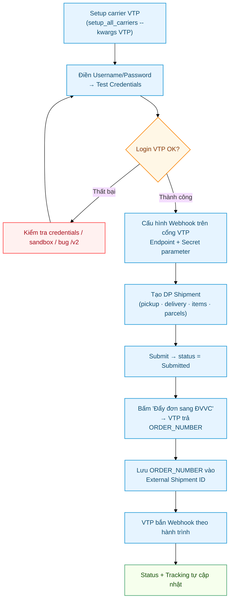
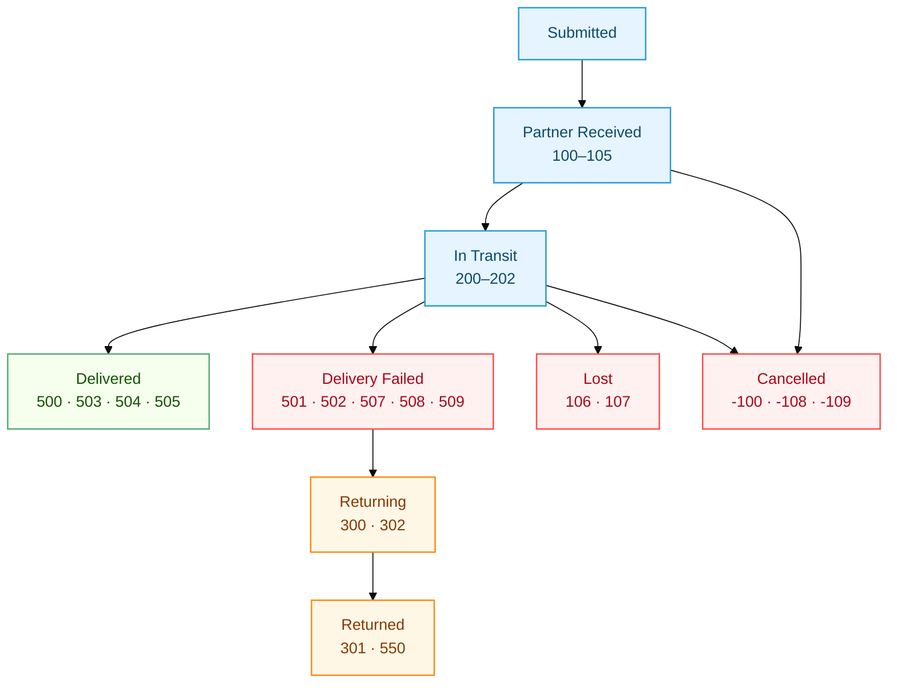

# Viettel Post — Hướng dẫn theo trường hợp cụ thể

Hướng dẫn đi từ **A → Z** cho riêng đơn vị vận chuyển **Viettel Post (VTP)** trên app
`delivery_partner`: từ setup API, điền credentials, cấu hình webhook, tạo đơn, đến theo dõi
trạng thái đơn.

> Đây là tài liệu chuyên sâu cho VTP. Khái niệm chung (DP Partner, DP Shipment, Status Mapping,
> Webhook) xem [Hướng dẫn Delivery Partner](Delivery_Partner.md) trước.

> **Thông tin VTP trong hệ thống** (từ `setup_all_carriers.py`):
> - Partner name: `Viettel Post` · code: `vtp`
> - Auth: **Token Exchange** (đăng nhập username/password → JWT)
> - Production: `https://partner.viettelpost.vn` · Sandbox (dev): `https://partnerdev.viettelpost.vn`
> - Webhook handler: `delivery_partner.handlers.viettelpost.ViettelpostWebhookHandler`

---

## Tổng quan luồng



---

## 0. Yêu cầu trước khi bắt đầu

- App `delivery_partner` đã cài trên site.
- Tài khoản đối tác VTP (đăng nhập được `partner.viettelpost.vn`, hoặc `partnerdev` cho sandbox).
- Quyền **System Manager** (để chạy setup) hoặc **Stock Manager** (để tạo vận đơn).

---

## 1. Setup carrier Viettel Post (1 lần)

Chạy script setup riêng cho VTP:

```bash
bench --site <site> execute delivery_partner.scripts.setup_all_carriers.setup \
  --kwargs '{"carriers": ["VTP"]}'
```

Script tạo sẵn (idempotent — chạy lại không trùng) cho **công ty mặc định** (Global Defaults):

| Tạo ra | Tên | Ghi chú |
|--------|-----|---------|
| DP Partner | `Viettel Post` | Auth Token Exchange, handler VTP, 27 status mapping |
| Warehouse ảo | Kho Viettel Post - `<abbr>` | Kho trung chuyển trong ERPNext |
| DP Partner Account | `Viettel Post Default` | Tài khoản kết nối mặc định (chưa có COD account) |

> Script này **không tạo COD Receivable Account** — phần kế toán do app extension xử lý.
> Xem mục 1.1 (loại tài khoản) và 1.2 (seed tự động).

### 1.1. Loại Warehouse & COD Account phải dùng

Trên **DP Partner Account** có 2 field gắn với 1 công ty cụ thể:

| Field | Loại / account_type | Group (Balance Sheet) | Ghi chú |
|---|---|---|---|
| **Partner Warehouse** | Warehouse leaf (`Is Group = No`) | dưới kho gốc của công ty | kho ảo "hàng đang ở carrier"; mỗi công ty 1 kho |
| → *Account* trong Warehouse | `Stock` | Assets → Stock Assets | để trống cũng được → dùng *Stock In Hand* mặc định của công ty |
| **COD Receivable Account** | **`Receivable`** (bắt buộc) | Assets → Accounts Receivable | giữ tiền COD carrier thu hộ |

**Vì sao COD bắt buộc `Receivable`:** app extension dùng nó làm `paid_from` trong Payment Entry kiểu
**"Receive"** với `party = Customer`. ERPNext bắt buộc tài khoản party của lệnh "Receive" phải là
`Receivable`, đưa loại khác sẽ báo lỗi *"not a valid Receivable account"*.

> ⚠️ **Đích đến tiền COD (`paid_to`)** trong Payment Entry resolve theo: *SO Bank Account → account của
> pickup warehouse → Company default cash account*, và **phải là Bank/Cash**. Nên đặt **Bank Account
> trên Sales Order** hoặc đảm bảo **Company có Default Cash Account**. Đừng để rơi vào fallback "account
> của warehouse" nếu account đó là `Stock` (sẽ lỗi vì Stock ≠ Bank/Cash).

### 1.2. Seed tự động (khỏi nhập tay) — kể cả nhiều công ty

App extension có script seed tạo sẵn **Warehouse ảo + COD Receivable Account + DP Partner Account đã
link** cho 1 hoặc nhiều công ty (idempotent):

```bash
# Tất cả công ty, partner Viettel Post:
bench --site <site> execute \
  delivery_partner_extension_for_cobegroup.scripts.seed_accounts.seed

# Chỉ vài công ty:
bench --site <site> execute \
  delivery_partner_extension_for_cobegroup.scripts.seed_accounts.seed \
  --kwargs '{"partner": "Viettel Post", "companies": ["Công ty A", "Công ty B"]}'
```

Mỗi (carrier × công ty) script tạo: `Kho Viettel Post - <abbr>` (leaf), `COD Viettel Post - <abbr>`
(account_type Receivable), và DP Partner Account đã gắn sẵn warehouse + cod_account. Với công ty mặc định,
nó **tái dùng** account `Viettel Post Default` có sẵn và chỉ điền thêm `cod_account`.

> Script **không seed credentials** (username/password là bí mật) — sau khi seed, vào từng DP Partner
> Account điền credentials rồi Test (mục 2).

### 1.3. Nhiều công ty — cần gì

- **DP Partner** `Viettel Post`: **dùng chung 1 cái** cho mọi công ty (không nhân bản).
- **DP Partner Account**: **mỗi công ty 1 cái** — vì `warehouse` + `cod_account` (và thường cả credentials/shop)
  thuộc về 1 công ty. Khi tạo DP Shipment, **tự chọn đúng Partner Account** của công ty tương ứng.

---

## 2. Điền API credentials & Test

Mở **DP Partner Account → `Viettel Post Default`**:

1. **Auth Method** = `Token Exchange` (đã set sẵn) → điền **Username** + **Password** tài khoản VTP.
2. **Use Sandbox**:
   - Bật → dùng `https://partnerdev.viettelpost.vn` (tài khoản dev, VTP phải kích hoạt trước).
   - Tắt → dùng production `https://partner.viettelpost.vn`.
3. Bấm **Test Credentials**.

Cơ chế: hệ thống gọi `POST /v2/user/Login` với `{USERNAME, PASSWORD}`. Nếu đúng, VTP trả JWT
token → cache lại (theo `token_ttl`) → các request sau gửi kèm header `Authorization: Bearer <token>`.

> ⚠️ **Lưu ý kỹ thuật — cần dev xử lý:** hiện `base_url` của VTP đang để kèm `/v2`
> (`https://partner.viettelpost.vn/v2`) trong khi các method client lại tự thêm `/v2/...`, nên URL
> thực tế bị **lặp `/v2`** (`.../v2/v2/user/Login`) → **Test Credentials và gọi API tạo đơn sẽ lỗi**.
> Cần sửa `base_url`/`sandbox_url` của VTP trong `setup_all_carriers.py` thành dạng **không có `/v2`**.
> Phần **webhook nhận trạng thái (mục 3, 5, 6) không bị ảnh hưởng** bởi bug này.

---

## 3. Cấu hình Webhook (cổng "Cấu hình webhook" của VTP)

Trên trang **Bảng điều khiển → Thông tin tài khoản → Cấu hình webhook** của VTP có 2 ô:

| Ô trên cổng VTP | Điền gì |
|---|---|
| **Webhook Endpoints** | `https://<domain>/api/method/delivery_partner.api.webhook.handle?partner=Viettel+Post` |
| **Secret parameter** | 1 chuỗi bí mật tự đặt — điền **trùng** vào field `Webhook Secret` của DP Partner `Viettel Post` trong ERP |

- `partner=Viettel+Post` **bắt buộc khớp** tên `Viettel Post` (dấu cách encode `+` hoặc `%20`).
- Endpoint cho phép guest, **luôn trả HTTP 200** (VTP không retry).
- Handler xác thực bằng header **`X-VTP-Token` == `webhook_secret`**.

> ⚠️ Cần xác nhận cổng VTP gửi "Secret parameter" qua đúng header `X-VTP-Token`. Nếu VTP gửi
> kiểu khác (header tên khác / trong body) thì phải chỉnh `verify_signature` trong
> `handlers/viettelpost.py`. Nếu **để trống `Webhook Secret`** bên ERP → handler **bỏ qua verify**
> (nhận mọi request) — chạy được ngay để test, kém an toàn.

Nút **Kiểm tra kết nối** trên cổng VTP: hệ thống mình luôn trả 200 kể cả khi payload test không
khớp shipment nào, nên nút này gần như luôn báo OK — đừng coi là bằng chứng secret đã đúng.

---

## 4. Tạo đơn hàng với Viettel Post

### 4.1. Tạo DP Shipment trong ERP

Vào **DP Shipment → New**:

1. **Partner** = `Viettel Post`, **Partner Account** = `Viettel Post Default`.
2. **Tab Pickup**: Pickup From = `Warehouse` → chọn kho xuất → địa chỉ + liên hệ auto-fill.
3. **Tab Delivery**: Deliver To = `Customer` → chọn khách → địa chỉ + liên hệ auto-fill.
4. **Tab Shipment**: thêm items (`item_code`, `qty`, `uom`); điền **Value of Goods** (> 0) và
   **COD Amount** nếu thu hộ.
5. **Tab Parcels & Details**: bấm **Auto-calculate Parcel** (hoặc thêm tay) — mỗi kiện cần `weight > 0`;
   điền **Pickup Date**.
6. **Submit** → hệ thống kiểm tra (có parcel, có item, value > 0, items cùng 1 kho) → **status = `Submitted`**.

### 4.2. Cấu hình 1 lần để đẩy được đơn

Submit chỉ chuyển trạng thái nội bộ; muốn **đẩy đơn sang VTP** (nút ở mục 4.3) cần cấu hình trước 2 thứ:

**a) Extra Params trên DP Partner Account** (người gửi + dịch vụ) — vào DP Partner Account, thêm các row
ở bảng *Extra Parameters* (Send As = `Body`):

| Param Key | Ý nghĩa | Ví dụ |
|---|---|---|
| `GROUPADDRESS_ID` | ID địa chỉ kho gửi (lấy từ tài khoản VTP) | `12345` |
| `SENDER_FULLNAME` / `SENDER_PHONE` | Tên / SĐT người gửi | |
| `SENDER_ADDRESS` | Địa chỉ gửi (chữ) | |
| `SENDER_PROVINCE` / `SENDER_DISTRICT` / `SENDER_WARDS` | Mã vùng VTP của kho gửi (ID số) | |
| `ORDER_SERVICE` | Mã dịch vụ VTP | `VCN` |
| `ORDER_PAYMENT` | Hình thức thanh toán (mặc định `3`) | `3` |

**b) Mã vùng VTP của người nhận** — VTP cần **ID số** tỉnh/huyện/xã, không nhận địa chỉ chữ. Mở **Address**
của người nhận → bấm nút **"Dò mã vùng VTP"** (nhóm nút *VTP*):

- Hệ thống tra danh mục VTP theo `state / city / county` của Address rồi **tự điền** 3 field
  `VTP Province ID / VTP District ID / VTP Wards ID`.
- Kết quả **chỉnh sửa được**: cấp nào báo "chưa khớp" thì nhập ID tay rồi **Lưu**.

### 4.3. Đẩy đơn bằng nút "Đẩy đơn sang ĐVVC"

Sau khi DP Shipment đã **Submit**, trên form xuất hiện nút **"Đẩy đơn sang ĐVVC"** (góc trên phải):

1. Bấm nút → xác nhận.
2. Hệ thống build payload từ vận đơn (người nhận + mã vùng, items, trọng lượng, COD, người gửi/dịch vụ)
   → gọi VTP `/v2/order/createOrder`.
3. VTP trả mã đơn → tự lưu vào **External Shipment ID** (+ phí, link tra cứu) và ghi 1 Comment.

Đặc điểm:
- **Idempotent:** nút **ẩn** khi vận đơn đã có `External Shipment ID` → không tạo trùng.
- **Tách khỏi Submit:** lỗi API hiện rõ, vận đơn giữ nguyên, sửa rồi bấm lại được.
- Thiếu dữ liệu (mã vùng / tên–SĐT người nhận / Extra Params) → báo lỗi cụ thể, **không** gửi request hỏng.

> Sau bước này `External Shipment ID` = `ORDER_NUMBER` của VTP — chính là mắt xích để webhook khớp đơn
> và cập nhật trạng thái (mục 5).

### 4.4. (Nâng cao) Tạo đơn qua bench console

Khi cần thao tác hàng loạt / debug:

```python
from delivery_partner.api_client.viettelpost import ViettelpostClient
c = ViettelpostClient("Viettel Post Default")
resp = c.create_order_for_shipment(frappe.get_doc("DP Shipment", "SHIP-DP-2026-00001"))
# resp = {"external_shipment_id", "fee", "tracking_url", "raw"}
```

Các API VTP khác trong client: `cancel_shipment`, `track_shipment`, `calculate_fee`,
`get_services`, `get_provinces`, `get_districts`, `get_wards`.

---

## 5. Theo dõi trạng thái đơn

### 5.1. Xem trên DP Shipment → Tab Tracking

| Field | Ý nghĩa |
|-------|---------|
| **Status** | Trạng thái chuẩn hoá (Submitted → Partner Received → In Transit → Delivered/...) |
| **External Shipment ID** | Mã vận đơn VTP (`ORDER_NUMBER`) |
| **Tracking Status** | Mã trạng thái thô VTP gửi gần nhất (VD `500`) |
| **Tracking Status Info** | Ghi chú kèm theo (field `NOTE` của VTP) |
| **Tracking URL** | Link tra cứu (nếu có) |

Mỗi webhook về còn ghi 1 **Comment** vào DP Shipment để truy vết lịch sử.

### 5.2. Trạng thái cập nhật như thế nào

VTP bắn webhook `{"ORDER_NUMBER": "...", "ORDER_STATUS": <số>, "NOTE": "..."}` → handler tra
`ORDER_STATUS` trong **DP Status Mapping** của `Viettel Post` → ra event chuẩn hoá → đổi `Status`.



### 5.3. Bảng map trạng thái VTP (27 dòng, có sẵn)

| ORDER_STATUS | Mô tả VTP | Event | DP Shipment Status |
|---|---|---|---|
| 100 | Mới tạo đơn | `picked_up` | Partner Received |
| 101 | Đã tiếp nhận đơn | `picked_up` | Partner Received |
| 102 | Đã duyệt, đợi lấy hàng | `picked_up` | Partner Received |
| 103 | Đã đến địa chỉ lấy hàng | `picked_up` | Partner Received |
| 104 | Nhân viên đã nhận hàng | `picked_up` | Partner Received |
| 105 | Đã nhập kho khai thác | `picked_up` | Partner Received |
| 200 | Đang vận chuyển | `in_transit` | In Transit |
| 201 | Đang giao hàng | `in_transit` | In Transit |
| 202 | Đã chuyển tiếp kho phát | `in_transit` | In Transit |
| 500 | Giao hàng thành công | `delivered` | Delivered |
| 503 | Đã đối soát trả tiền | `delivered` | Delivered |
| 504 | Đã đối soát công nợ | `delivered` | Delivered |
| 505 | Đã đối soát COD trả tiền | `delivered` | Delivered |
| 501 | Giao thất bại — chưa liên lạc được | `delivery_failed` | Delivery Failed |
| 502 | Giao thất bại — hẹn giao lại | `delivery_failed` | Delivery Failed |
| 507 | Giao thất bại — khách từ chối | `delivery_failed` | Delivery Failed |
| 508 | Giao thất bại — sai thông tin | `delivery_failed` | Delivery Failed |
| 509 | Giao thất bại — khác | `delivery_failed` | Delivery Failed |
| 300 | Đang chuyển hoàn | `returning` | Returning |
| 302 | Chờ xác nhận chuyển hoàn | `returning` | Returning |
| 301 | Chuyển hoàn thành công | `returned` | Returned |
| 550 | Đã đối soát hàng hoàn | `returned` | Returned |
| -100 | Hủy đơn từ hệ thống | `cancelled` | Cancelled |
| -108 | Hủy đơn hàng | `cancelled` | Cancelled |
| -109 | Hủy do không lấy được hàng | `cancelled` | Cancelled |
| 106 | Hàng bị hư hỏng | `lost` | Lost |
| 107 | Mất/thất lạc hàng hóa | `lost` | Lost |

> VTP gửi mã không có trong bảng → log warning + bỏ qua (không đổi status). Cần thì thêm row vào
> Status Mappings của DP Partner `Viettel Post`.

---

## 6. Test luồng VTP không cần đơn thật

Không cần carrier thật, không cần bench đang chạy:

```bash
bench --site <site> console
```

```python
from delivery_partner.scripts.simulate_webhooks import *

# Shipment phải đã Submit. Script tự gán external_shipment_id = TEST-<tên> nếu chưa có.
vtp_step_by_step("SHIP-DP-2026-00001", flow="happy")    # 100 → ... → 500
vtp_step_by_step("SHIP-DP-2026-00001", flow="return")   # giao fail → hoàn

# Bắn 1 event lẻ (dùng status code số):
vtp_event("VTP-TEST-001", 500, "Giao thanh cong")
vtp_event("VTP-TEST-001", 301, "Chuyen hoan thanh cong")
vtp_event("VTP-TEST-001", -108, "Huy don hang")

# Chạy nhanh cả flow, không dừng:
vtp_full_flow("SHIP-DP-2026-00001", flow="happy")
```

Hoặc test qua HTTP thật khi bench đang chạy:

```bash
curl -s -X POST "https://<domain>/api/method/delivery_partner.api.webhook.handle?partner=Viettel+Post" \
  -H "Content-Type: application/json" \
  -H "X-VTP-Token: <webhook_secret>" \
  -d '{"ORDER_NUMBER": "<external_shipment_id>", "ORDER_STATUS": 500, "NOTE": "Giao thanh cong"}'
```

---

## 7. Troubleshooting

### Test Credentials báo lỗi / không lấy được token
- Kiểm tra Username/Password VTP đúng môi trường (sandbox vs production khớp với **Use Sandbox**).
- ⚠️ Nếu lỗi kiểu URL `.../v2/v2/...` hoặc 404: dính bug lặp `/v2` ở mục 2 — cần dev sửa `base_url`.
- Tài khoản dev (sandbox) phải được VTP kích hoạt trước.

### Bấm "Đẩy đơn sang ĐVVC" báo lỗi
- *Thiếu mã vùng VTP người nhận* → mở Address người nhận, bấm **"Dò mã vùng VTP"** hoặc nhập ID tay (mục 4.2b).
- *Thiếu Tên/SĐT người nhận* → kiểm tra tab Delivery của vận đơn.
- *VTP tạo đơn thất bại: ...* → đọc message VTP trả về (sai dịch vụ / GROUPADDRESS_ID / số dư...). Kiểm tra Extra Params (mục 4.2a).
- Không thấy nút? → vận đơn phải **đã Submit** và **chưa** có External Shipment ID (nút ẩn để chống tạo trùng).

### Webhook không cập nhật trạng thái
1. DP Partner `Viettel Post` có `is_active = 1`?
2. `External Shipment ID` của DP Shipment có khớp `ORDER_NUMBER` VTP gửi không?
3. Mã `ORDER_STATUS` có trong bảng Status Mapping không? Xem **Error Log**.
4. DP Shipment đã **Submit** (docstatus = 1) chưa? Draft không nhận webhook.

### Verify webhook fail (Invalid signature)
- `Webhook Secret` bên ERP có trùng "Secret parameter" trên cổng VTP không?
- VTP có gửi đúng header `X-VTP-Token` không? Nếu không, sửa `verify_signature`.
- Tạm thời để trống `Webhook Secret` để bỏ qua verify khi cần test nhanh.
