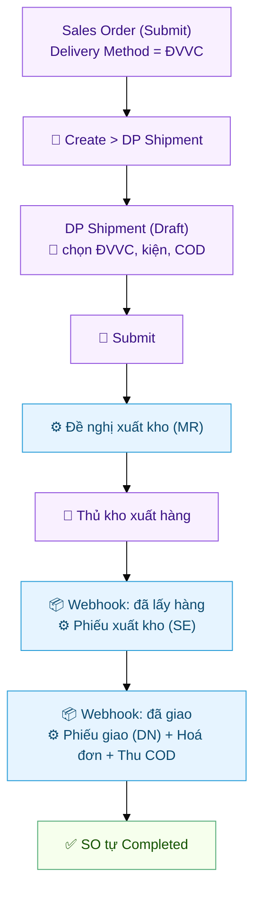

# Vận đơn từ Sales Order — kho & kế toán

Khi bán hàng qua đơn vị vận chuyển, hệ thống tự nối **Đơn hàng (Sales Order) → Vận đơn (DP Shipment)**
và **tự sinh chứng từ kho + kế toán** theo hành trình giao hàng. Tài liệu này mô tả luồng vận hành cho
**sales**, **thủ kho** và **kế toán**.

> Muốn nắm bức tranh tổng quát trước? Đọc [Quy trình vận đơn & giao nhận](Delivery_Partner-Quy-Trinh.html).
> Cấu hình kỹ thuật (custom field, hooks, tài khoản COD) xem
> [Lifecycle & Doc Events](../tech/Delivery_Partner-Lifecycle.html).

---

## Sơ đồ luồng

👤 = người thao tác · ⚙️ = hệ thống tự tạo · 📦 = ĐVVC báo về qua webhook

---

## Bước 1 · Tạo Sales Order (Sales)

1. Tạo SO, thêm items, chỉ định **warehouse** cho mỗi item.
2. Set **Delivery Method** = **"Đơn vị vận chuyển"**.
3. **Submit** SO.

## Bước 2 · Tạo Vận đơn từ SO (Sales / Logistics)

Mở SO → bấm **Create > DP Shipment**.

- **SO có items từ nhiều kho:** hệ thống hỏi chọn kho → mỗi kho ra **1 vận đơn** riêng.
- **Hệ thống tự điền:** người nhận (theo khách của SO), địa chỉ + liên hệ giao, hàng hoá (đã rã Product
  Bundle, trừ phần đã ship), giá trị hàng, ngày lấy hôm nay.
- **Bạn cần làm:**
  - Chọn **Partner** (ĐVVC) + **Partner Account**
  - Kiểm **Pickup Address** đúng kho xuất
  - Nhập **COD Amount** (0 nếu không thu hộ)
  - Chỉnh items nếu chỉ giao 1 phần
  - Tab **Parcels** → **Auto-calculate Parcel** hoặc thêm tay
  - Điền **Pickup Date** + khung giờ lấy

## Bước 3 · Submit Vận đơn (Sales / Logistics)

Bấm **Submit**. Hệ thống kiểm tra (có kiện, có hàng, giá trị > 0, hàng cùng 1 kho) rồi:

- Trạng thái → **Submitted**
- Tự sinh **Đề nghị xuất kho (Material Request)** gửi kho — *chưa* trừ tồn.

> Đẩy đơn sang ĐVVC (lấy mã vận đơn) là thao tác riêng ở menu **Actions** — xem
> [Quy trình §5](Delivery_Partner-Quy-Trinh.html#5-gắn-mã-đơn-đvvc--theo-dõi-hành-trình)
> hoặc [Viettel Post — Cài đặt & sử dụng](Delivery_Partner-Viettel_Post-Cai-Dat.html).

## Bước 4 · Thủ kho chuẩn bị hàng (Thủ kho)

1. Vào **Material Request** list → lọc `Material Transfer` + `Pending`.
2. Mỗi MR có field **DP Shipment** → biết thuộc vận đơn nào.
3. Soạn hàng theo MR. **Không cần** tạo Phiếu xuất kho tay — sẽ tự sinh khi ĐVVC lấy hàng.

## Bước 5 · ĐVVC lấy hàng → tự sinh Phiếu xuất kho

Khi ĐVVC báo **đã lấy hàng** (webhook), hệ thống tự:

- Trạng thái → **Partner Received**
- Sinh **Phiếu xuất kho (Stock Entry)**: kho nguồn → kho ảo ĐVVC → **tồn kho thực sự chuyển đi**.

## Bước 6 · Giao thành công → Phiếu giao, Hoá đơn, COD

Khi ĐVVC báo **đã giao** (webhook), hệ thống tự sinh:

| Chứng từ | Điều kiện | Ý nghĩa |
|---|---|---|
| **Phiếu giao hàng** (Delivery Note) | Luôn | Xuất khỏi kho ảo ĐVVC; tăng SL đã giao trên SO |
| **Hoá đơn** (Sales Invoice) | Chỉ khi COD > 0 | Doanh thu + công nợ khách |
| **Phiếu thu COD** (Payment Entry) | Chỉ khi COD > 0 | Ghi tiền ĐVVC thu hộ, cấn trừ hoá đơn |

**Kết quả:** SO tự chuyển **Completed** khi mọi item đã giao đủ.

---

## Các trường hợp đặc biệt

### Giao thất bại → Hoàn hàng
`Delivery Failed` (chỉ đổi trạng thái) → `Returning` (đang hoàn) → `Returned`: hệ thống sinh **Phiếu
xuất kho đảo** (kho ảo ĐVVC → kho nguồn), tồn hoàn về; items quay lại pool → tạo vận đơn mới được.

### Mất hàng
`Lost`: sinh **Phiếu xuất kho ghi giảm** (trừ khỏi kho ảo ĐVVC). SO vẫn "To Deliver" — sales quyết
định giao lại hay đóng SO.

### Huỷ vận đơn
Mở DP Shipment → **Cancel**. Nếu vận đơn **đã đẩy sang ĐVVC** (có mã vận đơn), hệ thống **tự huỷ đơn
bên ĐVVC trước**:
- ĐVVC **cho huỷ** → huỷ cả 2 phía; rồi xử lý kho: stock chưa chuyển → huỷ Đề nghị xuất kho; stock đã ở
  kho ảo ĐVVC → tạo Phiếu xuất kho đảo + huỷ Đề nghị. Items quay về pool.
- ĐVVC **từ chối huỷ** (đơn đã lấy hàng / đang giao / đã giao) → hệ thống **CHẶN Cancel**, báo lỗi rõ.
  Vận đơn vẫn giữ nguyên. Hàng đã đi mà cần thu về → dùng **luồng hoàn hàng** (đợi trạng thái
  Returning/Returned), đừng Cancel.

> Vận đơn **chưa đẩy** sang ĐVVC (không có mã) → Cancel bình thường, chỉ xử lý nội bộ.

### Giao nhiều lần cho 1 SO (tách đơn)
SO 10 sản phẩm, muốn giao 2 lần: **Lần 1** tạo vận đơn → giảm qty còn 5 → Submit. **Lần 2** tạo lại →
hệ thống tự tính còn 5. Mỗi lần có thể chọn ĐVVC / kho khác nhau.

| Trạng thái vận đơn | Tính là "đã ship"? |
|---|---|
| Submitted / Booked | Có (theo qty khai) |
| Partner Received → Delivered / Lost | Có (theo qty thực lấy) |
| Returned / Cancelled / Draft | Không (về lại pool) |

### Product Bundle
SO có combo → vận đơn tự rã thành item con (VD 3 × Combo A = Item X ×6 + Item Y ×3). Item phi tồn kho
trong bundle bị bỏ qua.

---

## Sự cố thường gặp

| Triệu chứng | Khắc phục |
|---|---|
| Đơn "Delivered" nhưng **không thấy** Phiếu giao / Hoá đơn / Phiếu thu | Vận đơn không gắn SO, chưa deploy bản vá, hoặc COD account chưa đúng loại — báo kỹ thuật ([§3](../tech/Delivery_Partner-Lifecycle.html#status-reactor-fix)) |
| DN qty không khớp SO | DN dùng **qty thực ĐVVC lấy** (picked qty), không phải qty khai — giao 1 phần thì nhỏ hơn |
| SO không tự Completed sau giao | SO chỉ complete khi **tất cả** item đã giao đủ — còn item chưa ship |
| "Partner Account has no warehouse" | DP Partner Account thiếu **Partner Warehouse** — báo quản trị |
| Thu COD nhưng không có Phiếu thu | DP Partner Account thiếu **COD Receivable Account** — báo quản trị |

Chi tiết kỹ thuật (custom field, hooks, ràng buộc tài khoản COD): [Lifecycle & Doc Events](../tech/Delivery_Partner-Lifecycle.html).

---

## Liên quan

- [Quy trình vận đơn & giao nhận](Delivery_Partner-Quy-Trinh.html) — tổng quan
- [Viettel Post — Cài đặt & sử dụng](Delivery_Partner-Viettel_Post-Cai-Dat.html) — kết nối & đẩy đơn VTP
- [Lifecycle & Doc Events](../tech/Delivery_Partner-Lifecycle.html) — kỹ thuật tích hợp ERP
