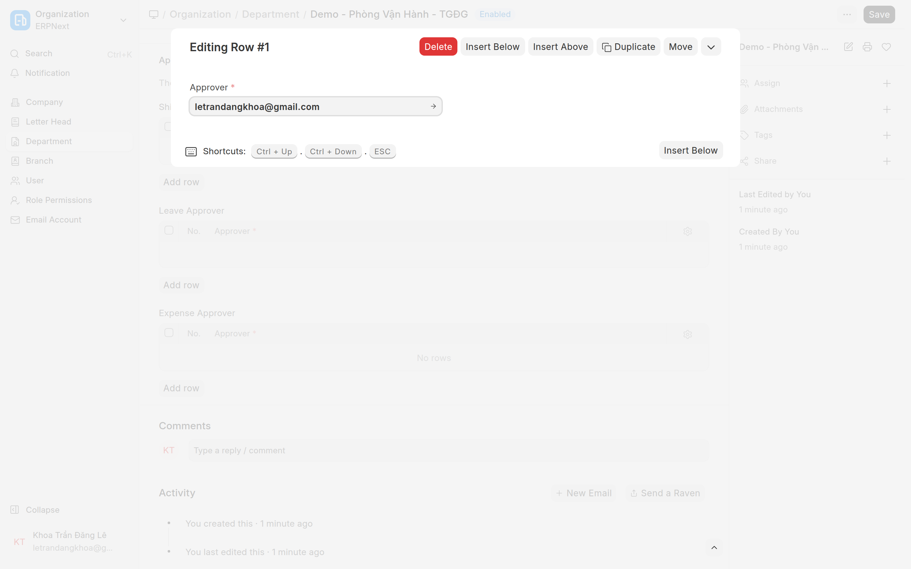
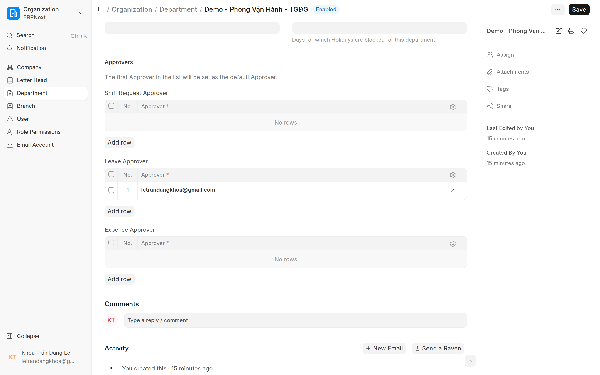
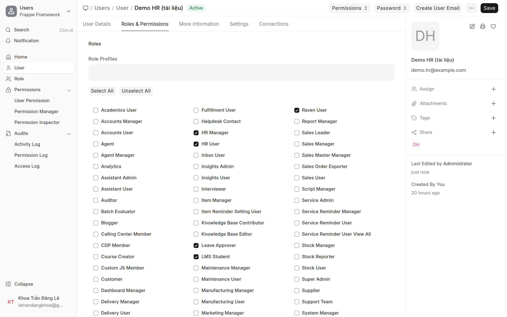

# Phòng ban & người duyệt (Department)
{: .no_toc }

**Dành cho:** HR Manager / System Manager · **Doctype:** Department
{: .fs-3 .text-grey-dk-000 }

> Cơ cấu phòng ban quyết định **ai duyệt** nghỉ phép / chấm công bù. Đặt **người duyệt theo phòng** một lần → cả phòng dùng chung, khỏi set từng người.

---

## 1. Tạo / sửa Department

1. Mở: Desk → Search **"Department"** · URL `/app/department`.
2. Tạo phòng (Department Name) + chọn **Company**.
3. (Tuỳ chọn) chọn **Parent Department** để dựng cây tổ chức.

## 2. Gán người duyệt (Leave Approvers)

1. Trong Department → mục **Approvers** → bảng **Leave Approver** → bấm **Add Row**.
2. Bấm vào dòng vừa thêm để mở chi tiết (**Editing Row**) → ô **Approver**: gõ tên/email user Manager → chọn.
3. Bấm **ESC** đóng dòng → **Save**. **Dòng đầu tiên** chính là người duyệt mặc định của phòng.

→ Mọi Employee thuộc phòng này dùng người đó làm **Manager mặc định** (trừ khi Employee tự đặt `leave_approver` riêng để đè).

> ⚠️ Hệ thống lấy **dòng ĐẦU TIÊN** trong Leave Approvers làm người duyệt mặc định. Các dòng sau chỉ là danh sách approver hợp lệ, không tự luân phiên.

### 🔑 Người duyệt PHẢI có ROLE tương ứng (rất hay quên)

Workflow duyệt phép **chặn theo role**, không chỉ theo bảng Leave Approvers:

| Bước | Người duyệt | **Role bắt buộc** |
|---|---|---|
| **Bước 1 — Manager** | dòng đầu Leave Approvers của phòng | **`Leave Approver`** |
| **Bước 2 — HR** | nhân sự HR | **`HR Manager`** |

→ Đặt user vào bảng Leave Approvers mà user đó **chưa có role `Leave Approver`** thì **bấm duyệt sẽ bị chặn**. Gán role ở **User → Roles & Permissions** (xem [Tạo User & phân quyền](Desk-Admin-User.html)).

> 💡 Department còn 2 bảng approver khác, thêm dòng y hệt:
> - **Shift Request Approver** — người duyệt **chấm công bù / đề xuất công tác / WFH** (Attendance Request). **Tách riêng khỏi Leave Approver** — phòng có nhân viên hay làm ngoài (KTV, Sales) thì **bắt buộc gán**, không thì đơn chấm công bù không ai thấy. Khác Leave: **mọi dòng trong bảng đều duyệt được** (không chỉ dòng đầu); người duyệt cần role **Attendance Request Approver** (hoặc Leave Approver). Xem [Cấp phép & gán người duyệt → B2](Desk-HR-CapPhep.html).
> - **Expense Approver** — chi phí.
>
> Với luồng **nghỉ phép** chỉ **Leave Approver** là bắt buộc.

## 3. Liên quan tới forward (chuyển duyệt)

Người được phép **nhận chuyển duyệt** một đơn được lọc theo **role + cùng phòng/công ty**. Dựng phòng ban đúng giúp danh sách chuyển duyệt gợi ý đúng người.

---

## ⚠️ Lỗi thường gặp

| Hiện tượng | Cách xử |
|---|---|
| NV gửi đơn báo "Chưa có người duyệt phép" | Phòng chưa có Leave Approvers → thêm dòng đầu |
| Đã set approver nhưng **bấm duyệt bị chặn** | Approver **thiếu role `Leave Approver`** (bước 2: thiếu `HR Manager`) → gán role |
| Đổi Manager phòng nhưng NV vẫn ra người cũ | NV bị override ở **Employee.leave_approver** |
| Forward không thấy ai để chọn | Người nhận chưa đúng **role** hoặc khác phòng/công ty |

## Liên quan
- [Employee & Department (kỹ thuật)](HR-Employee-Department-Setup.html) · [Cấp phép & gán người duyệt](Desk-HR-CapPhep.html)
