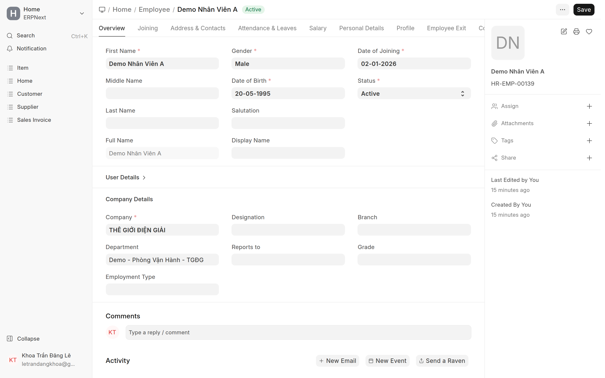

# Tạo & quản lý Employee
{: .no_toc }

**Dành cho:** HR Manager / System Manager · **Doctype:** Employee
{: .fs-3 .text-grey-dk-000 }

> Hồ sơ nhân viên là **gốc** của chấm công, nghỉ phép, ca, thiết bị. Nguyên tắc vàng: **mỗi người = 1 Employee chính + 1 user (login) chính.**

> 💡 **Cách nhanh cho nhân viên mới:** dùng **[Tạo nhân sự nhanh (Admin Console)](Desk-Admin-Onboarding.html)** — 1 form tạo User + Employee + gán ca (+ bộ KTV) cùng lúc, khỏi tạo tay từng bước bên dưới.

---

## 1. Tạo Employee

1. Mở: Desk → Search **"Employee"** · URL `/app/employee/new`.
2. Điền họ tên, ngày vào làm, **Company**.
3. **User ID** — gắn **đúng 1 tài khoản login** của người này. → Tài khoản (User) này phải **do Quản trị tạo trước** + gán role; xem **[Tạo User & phân quyền](Desk-Admin-User.html)**. Chưa có thì báo Quản trị tạo rồi mới link.
4. **Department** — chọn phòng (quyết định người duyệt mặc định).
5. (Tuỳ chọn) **Leave Approver** — chỉ đặt khi cần **đè** người duyệt nghỉ phép của phòng.
6. (Tuỳ chọn) **Shift Request Approver** — người duyệt **chấm công bù / công tác** riêng cho NV này
   (cộng thêm vào danh sách của phòng, không phải override). Tách khỏi Leave Approver — xem
   [Cấp phép & gán người duyệt → B2](Desk-HR-CapPhep.html).
7. Lưu.

> ⚠️ **1 user chỉ gắn 1 Employee Active.** ERPNext chặn cứng: tạo Employee Active thứ 2 cùng `user_id` → lỗi *"User X is already assigned to Employee Y"* (không phân biệt công ty). **Không** dùng chung 1 user cho 2 Employee.

## 2. Gán ca & quyền

- **Gán ca:** tạo **Shift Assignment** cho Employee (xem [Ca làm việc](Desk-Admin-Shift.html)) — bắt buộc để sinh công.
- **Role:** đảm bảo user có role phù hợp (Employee/Manager…) để dùng app + duyệt — gán ở **[Tạo User & phân quyền](Desk-Admin-User.html)** (bên Quản trị).

## 3. Người làm cho 2–3 công ty

Mỗi người vẫn nên có **1 Employee chính + 1 user chính** để tính công/lương chuẩn. Trường hợp đa công ty xử lý theo doc kỹ thuật (tránh tạo Employee Active trùng user).

## 4. Nghỉ việc

- Đặt **Status = Left** + ngày nghỉ → giải phóng `user_id` (cho phép tái dùng nếu cần) và dừng tính công.

---

## ⚠️ Lỗi thường gặp

| Hiện tượng | Cách xử |
|---|---|
| "User X is already assigned to Employee Y" | User đã gắn Employee Active khác → dùng user khác / xử lý Employee cũ |
| NV không chấm công ra công | Thiếu **Shift Assignment** hoặc chưa duyệt thiết bị |
| NV không gửi được đơn nghỉ | Thiếu **Department + Leave Approver** hoặc thiếu số dư phép |

## Liên quan
- [Employee & Department (kỹ thuật)](HR-Employee-Department-Setup.html) · [Ca làm việc & gán ca](Desk-Admin-Shift.html) · [Cấp phép & gán người duyệt](Desk-HR-CapPhep.html)
