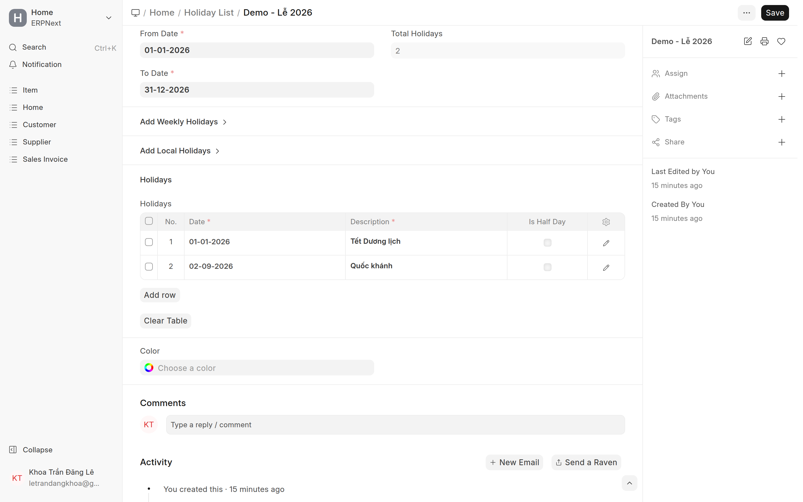
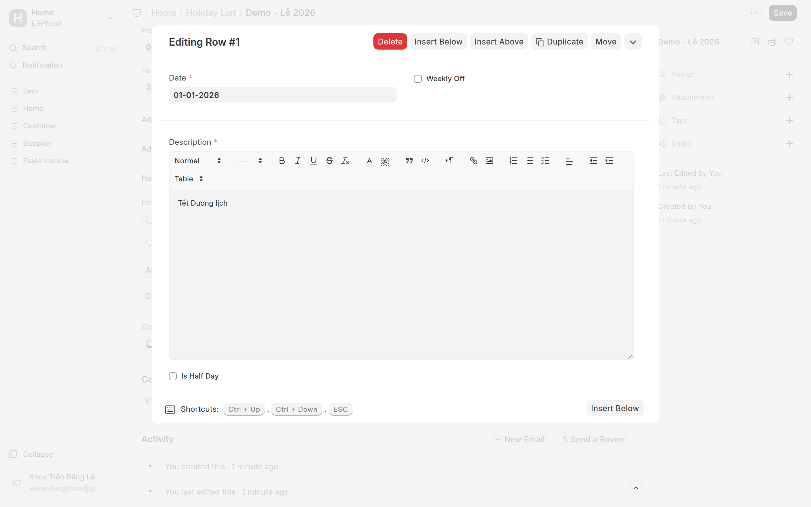

# Ngày lễ (Holiday List)
{: .no_toc }

**Dành cho:** HR Manager / System Manager · **Doctype:** Holiday List, Holiday List Assignment
{: .fs-3 .text-grey-dk-000 }

> ⚠️ **Quan trọng (presence-based):** Holiday List của Cobe chứa **ngày lễ** và **thứ 7 nửa ngày** của khối văn phòng. **KHÔNG** bấm *Get Weekly Off Dates* / không khai nghỉ T7–CN kiểu weekly-off — ngày nghỉ tuần tùy biến theo từng người, và ngày không đi làm đã tự tính là nghỉ.

---

## 1. Ba list đang dùng

| Holiday List | Nội dung | Dùng cho nhóm |
|---|---|---|
| `HL - Lễ VN - CN - 2026` | 51 Chủ nhật + 12 ngày lễ | KTV · Kho · Migunlife · AKW Sáng/Chiều |
| `HL - Lễ VN - CN Và Nửa Ngày Thứ 7 - 2026` | như trên + **52 thứ 7 nửa ngày** | Office · Office Kế Toán · Management |
| `HL - Lễ VN - Thứ 2 - 2026` | 50 thứ 2 + 12 ngày lễ, **không có Chủ nhật** | Khối tỉnh làm **T3–CN** |

Thứ 7 nửa ngày được khai bằng ô **Is Half Day** ✓ (không phải weekly-off): ngày đó vẫn chấm công bình thường, nhưng hệ thống **chia đôi ngưỡng giờ công** → NV làm ~4h sáng thứ 7 vẫn được tính **Present** thay vì Half Day.

> Khối tỉnh nghỉ thứ 2 và **đi làm Chủ nhật** nên list của họ ngược lại: có thứ 2, không có Chủ nhật. Hai ngày lễ rơi đúng thứ 2 (16/02, 27/04) được ghi là **ngày lễ** chứ không phải nghỉ tuần.

## 2. Tạo / sửa Holiday List

1. Mở: Desk → Search **"Holiday List"** · URL `/app/holiday-list/new`.
2. Đặt tên + khoảng ngày (01/01–31/12 của năm).
3. Thêm ngày lễ vào bảng **Holidays**.
4. **KHÔNG** bấm "Add Weekly Holidays" / không chọn Weekly Off.
5. Lưu.

### Thêm từng ngày (chi tiết)

1. Tại bảng **Holidays** → bấm **Add Row**.
2. Bấm vào dòng vừa thêm để mở chi tiết (**Editing Row**) → điền:
   - **Date** — ngày lễ (hoặc ngày thứ 7 với list văn phòng).
   - **Description** — tên lễ (vd "Tết Dương lịch") hoặc "Thứ 7 nửa ngày".
   - **Is Half Day** — tích nếu chỉ nghỉ/làm nửa ngày. Bỏ trống = nghỉ cả ngày.
3. Bấm **ESC** để đóng dòng. Lặp lại → cuối cùng **Save**.

> Ngày lễ VN có thể lấy nhanh: chọn `Country = Vietnam` → **Get Local Holidays**.
> Holiday List sửa được thoải mái, nhưng **không thêm được ngày nằm ngoài khoảng From–To** → muốn nối dài thì nới `To Date` trước.

## 3. Gắn Holiday List — chỉ MỘT chỗ

Từ 29/07/2026, ô `Holiday List` trên **Shift Type đã bỏ trống hẳn** (nhiều nhóm dùng chung một ca nhưng lịch nghỉ khác nhau). Ngày nghỉ giờ đi theo **từng nhân viên**, và chỉ khai ở **một** nơi:

| Chỗ gắn | Chi phối | Thao tác |
|---|---|---|
| **Holiday List Assignment** | Chấm công, nghỉ phép, OT, bảng lương — **tất cả** | `/app/holiday-list-assignment/new` |

> ⚠️ **Đừng gắn lại Holiday List vào Shift Type.** Ô đó **đè lên** Holiday List Assignment ở phần chấm công, trong khi nghỉ phép và lương vẫn đọc Assignment → hai bên tính theo hai lịch khác nhau.

### Còn ô `Holiday List` trên hồ sơ Employee thì sao?

**Bỏ qua nó.** Sửa ô đó **không đổi được lịch nghỉ của ai** — từ HRMS v16 mọi nhánh đều đọc Holiday List Assignment.

Ô này đã **khoá (read-only)** và đổi nhãn thành *"Holiday List (tự đồng bộ từ Holiday List Assignment)"*. Nó là **bản sao**: hệ thống tự chép giá trị từ Assignment đang hiệu lực (ngay khi bạn Submit/Cancel một Assignment, và quét lại lúc 01:05 mỗi ngày cho những Assignment gán trước ngày hiệu lực). Bạn không phải làm gì cả.

> 📌 Nó còn đúng **một** tác dụng nhỏ: Payroll Entry dùng để đếm ngày nghỉ khi **cảnh báo** "nhân viên còn ngày chưa chấm công" (chỉ khi tick *Validate Attendance*). Ô trống thì lùi về `Default Holiday List` của công ty. Cảnh báo thôi, không ảnh hưởng số tiền.

### Holiday List Assignment hoạt động thế nào

Đây là chỗ hệ thống ghi "từ ngày nào thì NV này dùng list nào".

- Điền `Applicable For` (Employee hoặc Company), `Assigned To`, `Holiday List`, và **`From Date`** = ngày bắt đầu áp dụng → **Submit**.
- Bản có `From Date` **mới nhất** (mà đã tới ngày) sẽ thắng. Bản của nhân viên thắng bản của công ty.
- Không có ngày kết thúc → bản mới nhất có hiệu lực **vô hạn về sau**, kể cả sang năm mới. Đây là lý do bắt buộc phải làm [rollover đầu năm](#4-đầu-mỗi-năm-phải-làm-gì).
- **Đã Submit thì không sửa được.** Muốn đổi list cho ai → **tạo bản mới** với `From Date` mới. **Không cancel bản cũ** — cancel là xoá lịch sử, tính lại công/lương giai đoạn cũ sẽ sai.
- Chồng nhiều bản lên nhau là **bình thường và đúng** (mỗi bản là một mốc chuyển). Chỉ cấm **trùng y hệt `From Date`**, và `From Date` phải nằm trong khoảng From–To của Holiday List.

### ⚠️ Bẫy hay gặp khi tạo tay

Khi chọn **Holiday List**, hệ thống **tự điền `From Date` = ngày bắt đầu của list** (01/01). Phải **sửa lại** thành ngày áp dụng thật (vd 01/08/2026) trước khi Save — không thì trùng mốc với bản cũ và bị báo *Duplicate Assignment*.

### Gán cho nhiều người cùng lúc

HRMS **không có công cụ gán hàng loạt** cho Holiday List Assignment (chỉ Shift Assignment mới có). Hai cách:

- **Server Script `cobe_assign_holiday_list`** — tự suy list theo ca của từng người, có chế độ soi trước. Cách chạy và tham số: xem [Holiday & Shift Setup, mục 3.2](HR-Holiday-Shift-Setup.html#32-gán-hàng-loạt).
- **Data Import** — Document Type = `Holiday List Assignment`, Import Type = *Insert New Records*, tick **Submit After Import**, 4 cột: `applicable_for` · `assigned_to` · `holiday_list` · `from_date`.

> Chốt lương kỳ trước xong rồi hãy gán, vì phiếu lương tra ngày nghỉ theo **ngày hôm nay** chứ không theo kỳ lương — tính lại phiếu cũ sau khi đổi sẽ ra số khác.

## 4. Đầu mỗi năm phải làm gì

Holiday List có thời hạn theo năm → **tháng 12 hằng năm**, sau khi đã chốt lương tháng 12:

1. Tạo **3 Holiday List** của năm mới (list CN · list CN + thứ 7 nửa ngày · list thứ 2). Bơm đủ **12 ngày lễ vào cả ba**.
2. Tạo **Holiday List Assignment** mới `From Date = 01/01/<năm>` cho **3 công ty** + **từng NV Active** (140+ bản → chạy bằng script, xem doc kỹ thuật).
3. Cập nhật `Default Holiday List` của 3 công ty. **Không** cần đụng ô Holiday List trên hồ sơ NV — hệ thống tự đồng bộ (xem mục 3).

Không còn bước đổi Holiday List trên Shift Type — ô đó đã bỏ trống hẳn.

> ⚠️ **Quên bước này thì không có lỗi nào hiện ra**, hệ thống chạy tiếp với list năm cũ: 52 thứ 7 nửa ngày biến mất → **~120 NV văn phòng bị Half Day mỗi thứ 7**; ngày lễ không được nhận → OT ngày lễ trả thiếu; đơn nghỉ vắt qua Tết bị trừ cả ngày lễ vào phép năm.

---

## ⚠️ Lỗi thường gặp

| Hiện tượng | Cách xử |
|---|---|
| Lỡ thêm Weekly Off vào list | Xoá các dòng weekly-off (giữ lại dòng thứ 7 có **Is Half Day** ✓ nếu là list văn phòng) |
| NV văn phòng bị Half Day **mỗi thứ 7** | List đang dùng không có thứ 7 nửa ngày, hoặc list đã hết năm — kiểm cả 3 chỗ gắn ở [mục 3](#3-gắn-holiday-list--3-chỗ-không-phải-1) |
| Ngày lễ vẫn bị tính thiếu công | Holiday List chưa gắn vào **Shift Type** của NV |
| Nghỉ phép bị trừ cả Chủ nhật / ngày lễ | Thiếu hoặc sai **Holiday List Assignment** |
| Sửa Holiday List Assignment không được | Đúng thiết kế — tạo bản mới với `From Date` mới |

## Liên quan
- [Holiday & Shift Setup (kỹ thuật)](HR-Holiday-Shift-Setup.html) — đầy đủ, kèm script chuyển năm · [Ca làm việc & gán ca](Desk-Admin-Shift.html)
