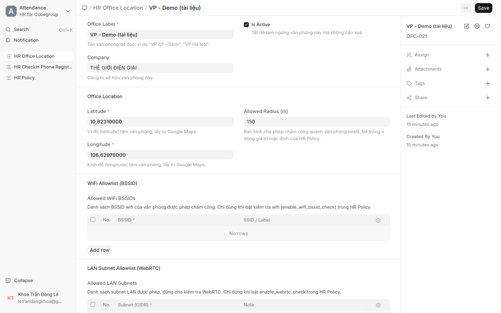
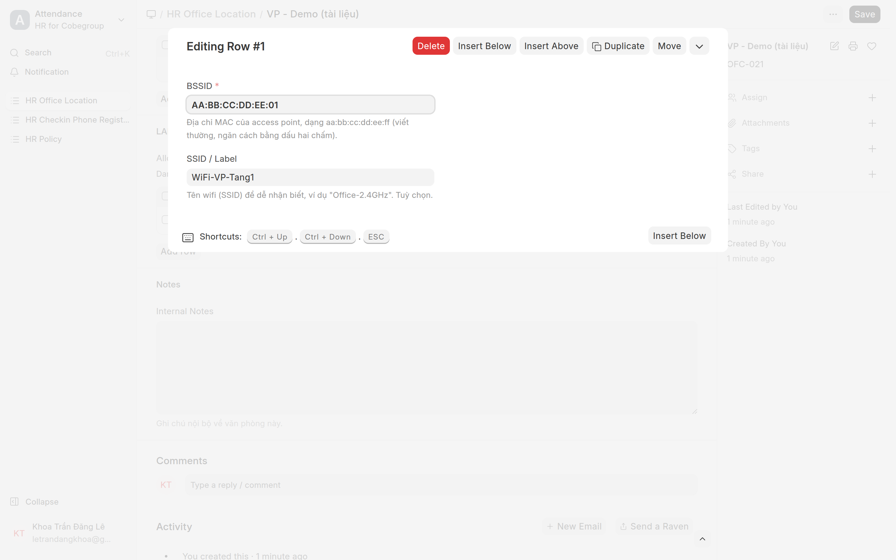
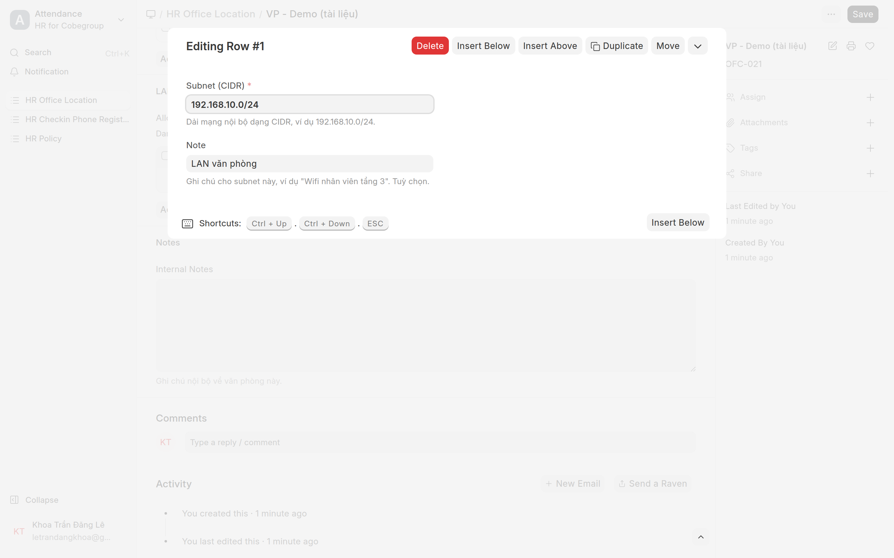

# Vị trí văn phòng (Office Location)
{: .no_toc }

**Dành cho:** HR Manager / System Manager · **Doctype:** HR Office Location
{: .fs-3 .text-grey-dk-000 }

> Mỗi văn phòng/chi nhánh là **1 record** với **toạ độ GPS + bán kính**. Khi nhân viên chấm công, server **tự tìm VP gần nhất** và kiểm có nằm trong bán kính không. **Đây là bước nền — làm trước tiên.**

---

## 1. Tạo văn phòng

- Mở: Desk → Search **"HR Office Location"** · URL `/app/hr-office-location` · tạo mới `/app/hr-office-location/new`.
- Điền:
  - **Tên VP** (office_label) — vd "VP - Tân Bình".
  - **Company**.
  - **Latitude / Longitude** — toạ độ tâm VP.
  - **Bán kính (m)** — phạm vi cho phép chấm công quanh tâm (vd 100–200m).

## 2. Lấy toạ độ GPS

1. Mở **Google Maps**, tìm đúng địa chỉ VP.
2. **Chuột phải vào điểm cần lấy** → bấm dãy số toạ độ đầu tiên (vd `10.8012, 106.6534`) để copy.
3. Dán vào **Latitude** (số đầu) và **Longitude** (số sau).

## 3. (Tùy chọn) Siết bằng WiFi / LAN

Để chống giả GPS, có thể thêm WiFi/LAN của VP. Hai bảng nằm dưới phần toạ độ.

**Thêm WiFi BSSID:**
1. Tại bảng **Allowed WiFi BSSIDs** → bấm **Add Row**.
2. Bấm vào dòng vừa thêm để mở chi tiết (**Editing Row**) → điền:
   - **BSSID** — địa chỉ MAC của access point (dạng `AA:BB:CC:DD:EE:FF`).
   - **SSID / Label** — tên WiFi cho dễ nhận (vd "WiFi-VP-Tang1"). Tuỳ chọn.
3. Bấm **ESC** (hoặc bấm ra ngoài) để đóng dòng → **Save**.

**Thêm dải LAN (subnet):**
1. Tại bảng **Allowed LAN Subnets** → bấm **Add Row** → mở dòng → điền:
   - **Subnet (CIDR)** — dải IP nội bộ (vd `192.168.10.0/24`).
   - **Note** — ghi chú (vd "LAN văn phòng"). Tuỳ chọn.
2. **ESC** → **Save**.

> 💡 Cách thêm dòng ở mọi bảng con của Frappe đều giống nhau: **Add Row → bấm vào dòng để mở chi tiết → điền → ESC → Save**. Chi tiết cách lấy BSSID / subnet xem doc kỹ thuật.

> 💡 **Nhiều VP:** cứ tạo mỗi nơi 1 record. Nhân viên đi giữa các VP vẫn chấm được vì server chọn VP gần nhất. Có sẵn dữ liệu ở **Cobe Branch Location** → có thể seed hàng loạt (xem doc kỹ thuật).

---

## ⚠️ Lỗi thường gặp

| Hiện tượng | Cách xử |
|---|---|
| NV ở VP vẫn báo "ngoài vùng" | Sai toạ độ hoặc **bán kính quá nhỏ** → tăng bán kính / sửa lat-long |
| Lat/long ngược nhau | Latitude (vĩ độ) ~10.x, Longitude (kinh độ) ~106.x ở VN — đừng đảo |
| Quên tạo VP | NV không chấm công được ở đâu cả → tạo VP trước |

## Liên quan
- [HR Office Location (kỹ thuật)](HR-Office-Location.html)
