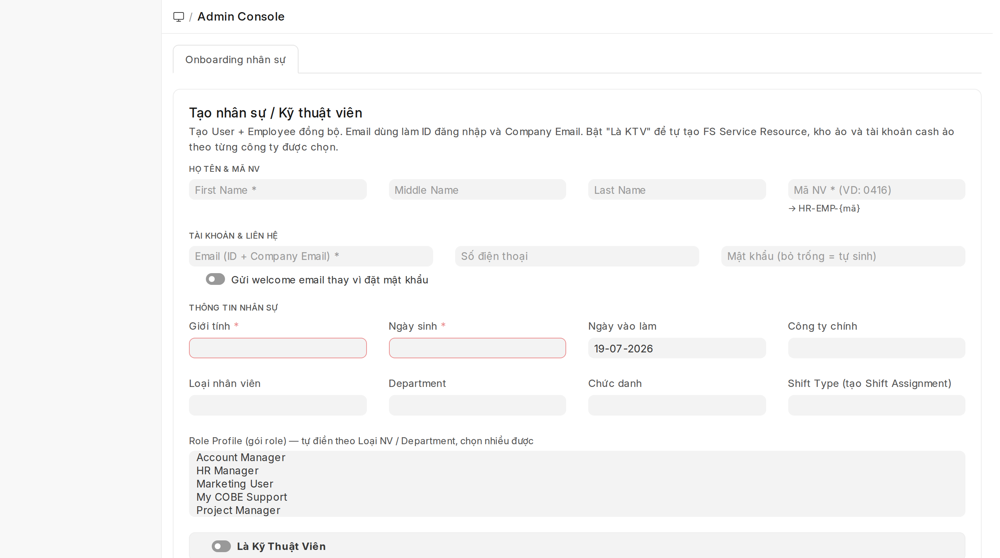
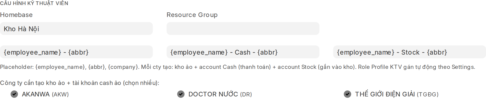
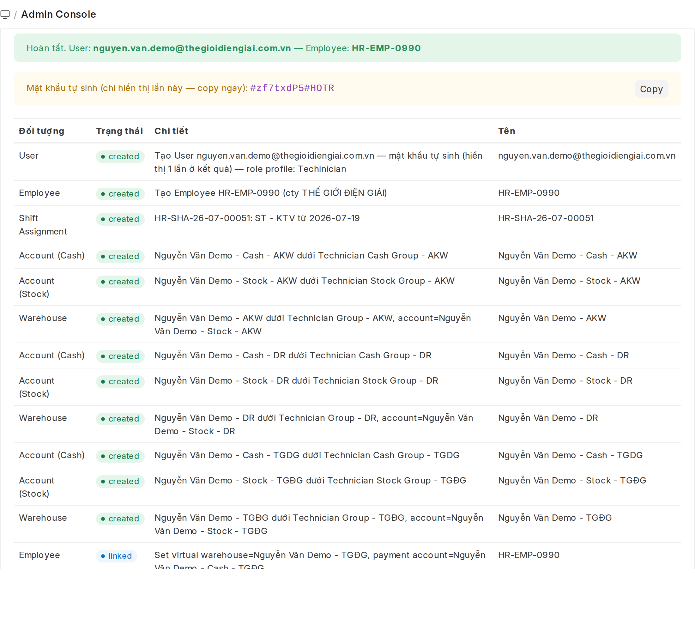
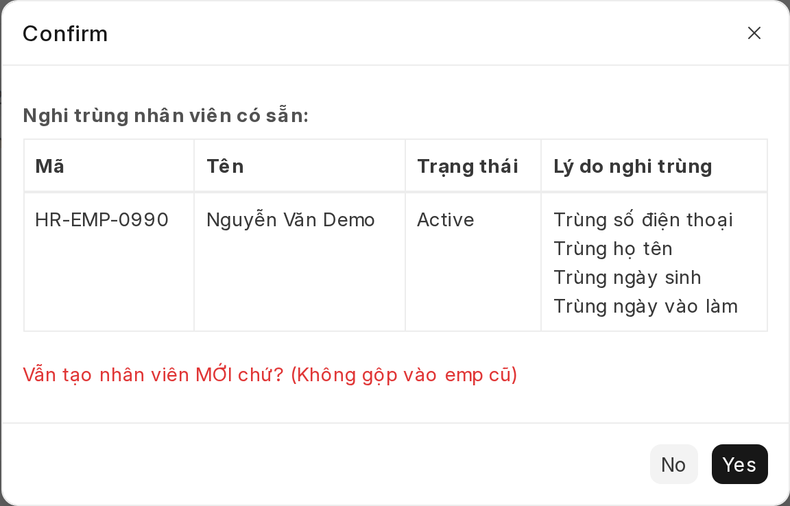

# Tạo nhân sự nhanh (Admin Console)
{: .no_toc }

**Dành cho:** System Manager / HR Manager · **Trang:** Admin Console
{: .fs-3 .text-grey-dk-000 }

> **1 form tạo trọn bộ** khi nhân viên mới vào công ty: **User** (tài khoản đăng nhập) + **Employee** (hồ sơ nhân sự) + **Shift Assignment** (gán ca) — và nếu là **Kỹ thuật viên** thì thêm luôn **FS Service Resource + kho ảo + tài khoản ảo** cho từng công ty. Thay cho việc tạo tay từng thứ ở [Tạo User](Desk-Admin-User.html) rồi [Tạo Employee](Desk-Admin-Employee.html).

---

## Mục lục
{: .no_toc .text-delta }

1. TOC
{:toc}

---

## 1. Mở trang & quyền sử dụng

- Mở: Desk → Search **"Admin Console"** · URL `/app/admin-console` → tab **Onboarding nhân sự**.
- Ai dùng được: **System Manager** và **HR Manager**.
  - HR Manager chỉ thấy tab **Onboarding nhân sự**.
  - Tab **Công cụ Admin** (chạy script, bật/tắt tính năng) chỉ dành cho System Manager.

## 2. Điền thông tin

| Trường | Bắt buộc | Ghi chú |
|---|---|---|
| **First / Middle / Last Name** | First | Tên tách 3 phần như Employee chuẩn |
| **Mã NV** | ✔ | Số cuối của mã nhân viên (VD `0416`) → hệ thống tạo **HR-EMP-0416**. Mã do HR cấp, **không tự sinh**. Trùng mã sẽ báo lỗi ngay |
| **Email** | ✔ | Dùng làm **tài khoản đăng nhập** và **Company Email** luôn |
| **Số điện thoại** | KTV: ✔ | Vào Employee + FS Service Resource |
| **Mật khẩu** | — | **Bỏ trống = hệ thống tự sinh mật khẩu mạnh** và hiện 1 lần ở Kết quả. Hoặc bật **"Gửi welcome email"** để nhân viên tự đặt qua mail |
| **Giới tính, Ngày sinh** | ✔ | Employee bắt buộc |
| **Ngày vào làm** | — | Mặc định hôm nay; cũng là ngày bắt đầu gán ca |
| **Công ty chính, Loại NV, Department, Chức danh** | — | Như Employee chuẩn |
| **Shift Type** | — | Chọn ca → tự tạo + submit **Shift Assignment** từ ngày vào làm |
| **Role Profile** | — | Gói quyền. **Tự điền** theo Loại NV / Department (mapping khai ở Settings), sửa được, chọn nhiều được |

> ⚠️ **Role đi theo Role Profile, không gán role lẻ ở đây.** Nếu user đã tồn tại và từng được gán role lẻ bằng tay, khi thêm Role Profile các role lẻ đó sẽ bị hệ thống gỡ — form sẽ hiện **cảnh báo vàng** liệt kê role bị gỡ để bạn gán lại nếu cần.

## 3. Nếu là Kỹ thuật viên

Bật **"Là Kỹ Thuật Viên"** → hiện thêm phần cấu hình:

- **Homebase** (bắt buộc) — kho/địa bàn xuất phát, VD `Kho Hà Nội`.
- **Chọn công ty** — mỗi công ty tick sẽ được tạo **3 món** đứng tên KTV:
  1. **Kho ảo** `Tên KTV - {viết tắt cty}` (dưới *Technician Group*)
  2. **Tài khoản Cash** — dùng thu tiền dịch vụ (vào FS Service Resource)
  3. **Tài khoản Stock** — định giá tồn kho, gắn thẳng vào kho ảo
- Đồng thời tạo **FS Service Resource** (hồ sơ điều phối KTV) link đủ user, employee, kho + tài khoản của từng công ty.
- 3 ô **template tên** để nguyên mặc định trừ khi biết rõ mình đổi gì.
- Role Profile KTV (`Techinician`) được gán **tự động**.

> Nếu cạnh tên công ty có dấu **⚠** nghĩa là công ty đó chưa được cấu hình parent kho/account trong **Admin Console Settings** — báo System Manager cấu hình trước, nếu không sẽ chỉ link được kho/account có sẵn chứ không tạo mới được.

## 4. Bấm Tạo & đọc kết quả

- Dòng xanh: User + Employee đã tạo xong.
- **Ô vàng "Mật khẩu tự sinh": chỉ hiển thị đúng 1 lần** — bấm **Copy** và gửi cho nhân viên ngay (khuyên nhân viên đổi mật khẩu sau khi đăng nhập lần đầu).
- Bảng bên dưới liệt kê từng đối tượng với trạng thái:
  - `created` — tạo mới · `linked` — đã có sẵn, dùng lại · `skipped` — bỏ qua vì đã đủ · `warning` — cần chú ý (đọc chi tiết).
- Có thể hiện popup **Message** kiểu *"Username already exists — Suggested Username"* hay *"Removed Employee role…"* — đây là thông báo kỹ thuật của hệ thống, **đóng và bỏ qua**, không ảnh hưởng kết quả.

## 5. Cảnh báo nghi trùng nhân viên

Trước khi tạo, hệ thống dò các Employee có sẵn **trùng SĐT / email / họ tên / ngày sinh / ngày vào làm**:

- Bấm **No** → dừng lại, mở mã nhân viên trong bảng để kiểm tra (bấm vào mã để mở hồ sơ). Nếu đúng là người cũ (VD làm lại sau nghỉ việc, hoặc HR đã import hồ sơ trước) thì **đừng tạo mới** — xử lý trên hồ sơ cũ theo [Tạo & quản lý Employee](Desk-Admin-Employee.html).
- Bấm **Yes** → xác nhận đây là người khác thật, tạo nhân viên **mới**.
- Chỉ trùng *ngày vào làm* đơn thuần (tuyển nhiều người cùng ngày) thì thường là trùng vô hại — đọc cột lý do rồi quyết.

## 6. Chạy lại có sao không?

Không sao — form theo nguyên tắc **có rồi thì dùng lại, không ghi đè**:

- User/Employee đã có → **link**, không tạo trùng (Employee nhận diện qua email đăng nhập).
- Mật khẩu user cũ **không bị đổi** trừ khi bạn chủ động nhập ô Mật khẩu.
- KTV đã có FS Service Resource mà tick thêm công ty → **bổ sung** kho/account công ty mới vào hồ sơ cũ, không đụng phần cũ.
- Lỗi giữa chừng → **hủy toàn bộ**, không để lại dữ liệu nửa vời; sửa theo thông báo rồi bấm Tạo lại.

## 7. Lỗi thường gặp

| Thông báo | Nguyên nhân & cách xử lý |
|---|---|
| *Mã HR-EMP-xxxx đã tồn tại (của …)* | Mã NV đã cấp cho người khác — kiểm tra lại với HR, nhập mã khác |
| *Không thể tạo kho/account …: chưa cấu hình … Parent* | Công ty chưa khai parent trong Admin Console Settings — báo System Manager |
| *Account '…' đã tồn tại nhưng type là '…'* | Trùng tên với account khác bản chất — đổi template tên hoặc xử lý account cũ |
| *Kỹ thuật viên cần Homebase / số điện thoại* | Điền thiếu ở phần KTV |

## Liên quan

- [Tạo & quản lý Employee](Desk-Admin-Employee.html) — chi tiết hồ sơ nhân sự, người làm 2–3 công ty
- [Tạo User & phân quyền](Desk-Admin-User.html) — tạo tay từng tài khoản, quản lý role
- [Ca làm việc (Shift)](Desk-Admin-Shift.html) — quản lý Shift Type / Shift Assignment
