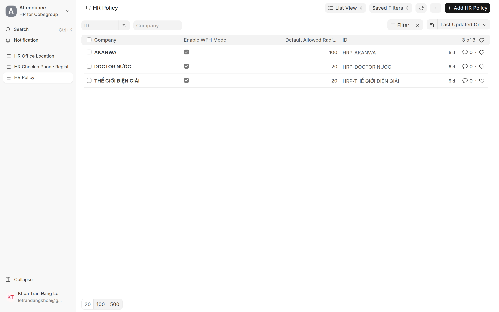
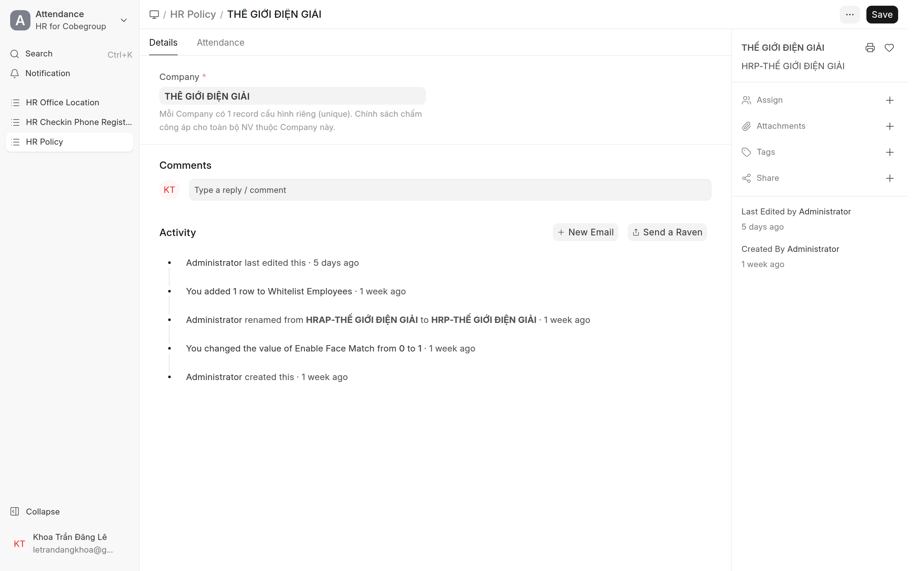

# Chính sách chấm công (HR Policy)
{: .no_toc }

**Dành cho:** HR Manager / System Manager · **Doctype:** HR Policy
{: .fs-3 .text-grey-dk-000 }

> **Mỗi Company 1 record.** Hệ thống tự tạo sẵn record với defaults cho mỗi Company lúc cài. Tạo Company mới thì **tự tạo Policy** cho company đó. Đây là nơi bật/tắt các tính năng chấm công.

---

## 1. Mở

- Desk → Search **"HR Policy"** · URL `/app/hr-policy`.
- Mỗi company 1 record — mở đúng record của company cần chỉnh.

## 2. Các nhóm cấu hình (tab Attendance)

| Nhóm | Để làm gì |
|---|---|
| **Feature Flags** | Bật/tắt: **selfie** (mặc định bật), **face match**, **WFH mode** (`enable_wfh_mode`)… |
| **Defaults** | Giờ vào/ra mặc định, bán kính mặc định, ngưỡng… |
| **Lunch Break** | Khai giờ nghỉ trưa để tính công đúng |
| **Overtime Notification** | Nhắc khi làm quá giờ |
| **Check-in Whitelist** | Danh sách được phép chấm ngoại lệ |

## 3. Vài flag hay dùng

- **Selfie**: mặc định **bật** → nhân viên buộc chụp ảnh khi chấm công.
- **`enable_wfh_mode`**: bật để nhân viên thấy lựa chọn **WFH** trong form "Đề xuất" của app. Tắt → chỉ còn "Chấm công bù / Công tác".

> ⚠️ **Cấp phép năm KHÔNG còn ở HR Policy.** Cơ chế cũ (cấp phép theo số ngày chấm công) đã gỡ. Phép giờ dùng **Earned Leave native** — xem [Cấp phép](Desk-HR-CapPhep.html).

---

## ⚠️ Lỗi thường gặp

| Hiện tượng | Cách xử |
|---|---|
| Company mới không có chính sách | Tự tạo 1 record HR Policy cho company đó |
| Bật/tắt flag không ăn | Sửa **đúng record của company** nhân viên đang thuộc |
| Tìm mục cấp phép trong Policy | Không còn ở đây — dùng Leave Allocation/Policy Assignment |

## Liên quan
- [HR Policy (kỹ thuật)](HR-Policy.html)
