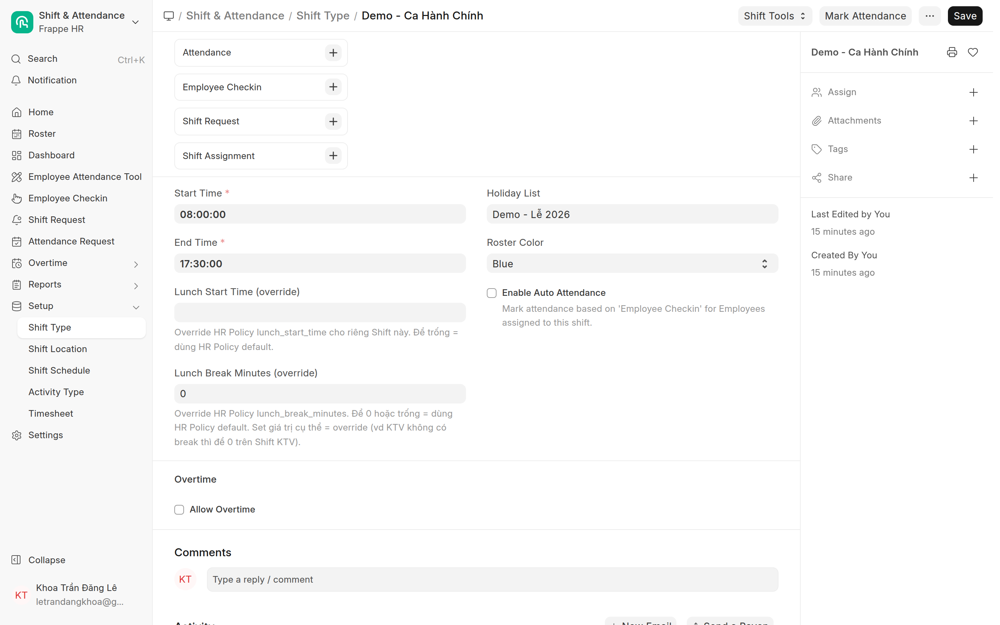
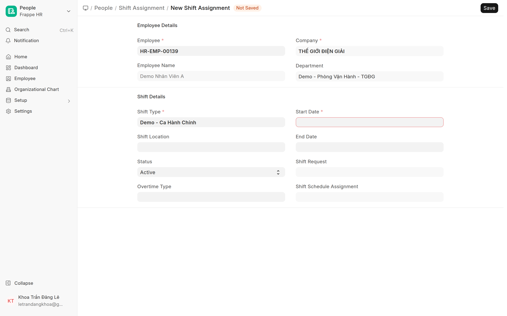

# Ca làm việc & gán ca
{: .no_toc }

**Dành cho:** HR Manager / System Manager · **Doctype:** Shift Type, Shift Assignment, Holiday List Assignment
{: .fs-3 .text-grey-dk-000 }

> **Shift Type** = giờ vào/ra. **Shift Assignment** = gán ca đó cho từng nhân viên. **Holiday List Assignment** = lịch nghỉ của riêng nhân viên đó. Phải có ca thì check-in mới sinh **Attendance** (Present/Half).

---

## 1. Tạo Shift Type

1. Mở: Desk → Search **"Shift Type"** · URL `/app/shift-type/new`.
2. Điền **giờ vào / giờ ra** (Start/End Time).
3. **Để TRỐNG ô Holiday List.**
4. Đặt **ngưỡng half-day** (Working Hours Threshold for Half Day).
5. Lưu.

> ⚠️ **Để trống ô Holiday List là cố ý.** Từ 29/07/2026, ngày nghỉ đi theo **từng nhân viên** qua *Holiday List Assignment*, không theo ca — vì nhiều nhóm dùng chung một ca nhưng lịch nghỉ khác nhau (KTV làm thứ 7 nguyên ngày, khối tỉnh nghỉ thứ 2 làm Chủ nhật). Điền vào ô này sẽ **đè lên** lịch nghỉ của nhân viên ở phần chấm công, trong khi nghỉ phép và lương vẫn tính theo Assignment → hai bên lệch nhau. Xem [Ngày lễ](Desk-Admin-Holiday.html).

> ⚠️ **Đừng sửa giờ vào/ra của ca đang chạy.** Nó ảnh hưởng mọi NV đang gán ca đó, kể cả dữ liệu quá khứ. Cần giờ khác → **tạo Shift Type mới** rồi chuyển ca ([mục 3](#3-đổi-ca-cho-nv-đang-làm)). Bắt buộc phải sửa thì làm **ngoài giờ làm việc**, sau khi mọi người đã check-out.

> 💡 Cobe override Shift Type (**CobeShiftType**) để **vô hiệu phần tự chấm Vắng** của HRMS (presence-based). Bật **Auto Attendance** để check-in tự sinh Present/Half, nhưng sẽ **không** tự chấm Vắng ngày trống.

## 2. Nhân viên mới — 2 món phải làm

Thiếu món nào cũng **không có báo lỗi**, sai sẽ lòi ra ở kỳ lương.

| # | Việc | Thao tác |
|---|---|---|
| 1 | **Shift Assignment** (ca) | `/app/shift-assignment/new` → Employee + Shift Type + `Start Date` = ngày vào làm, `End Date` để trống → **Submit** |
| 2 | **Holiday List Assignment** (ngày nghỉ) | `/app/holiday-list-assignment/new` → `Applicable For = Employee`, chọn NV, **Holiday List đúng nhóm của NV**, `From Date` = ngày vào làm → **Submit** (nhớ sửa lại `From Date`, nó tự điền 01/01) |

> 📌 **Không** phải điền ô *Holiday List* trên hồ sơ Employee (tab **Attendance & Leaves**). Ô đó đã **khoá read-only** và hệ thống **tự chép** theo Holiday List Assignment — xem [Ngày lễ](Desk-Admin-Holiday.html).

Quên món nào thì:

- **Quên ca** → check-in vẫn lưu nhưng **không ra công**, NV bị cờ "Không có ca".
- **Quên Holiday List Assignment** → NV rơi về list chung của công ty (**không có thứ 7 nửa ngày**) → NV văn phòng bị **Half Day mỗi thứ 7**; NV khối tỉnh thì sai cả hai đầu (thứ 2 tính là ngày làm, Chủ nhật tính là nghỉ).

> **Không cần** điền *Default Shift* trên hồ sơ Employee — hiện toàn bộ NV đang để trống. Shift Assignment là nguồn ca duy nhất; điền Default Shift chỉ tạo ca "ma" cho những ngày hở.

Gán nhiều người cùng lúc: **Shift Assignment Tool** (lọc theo phòng ban rồi gán hàng loạt) — nhưng công cụ này **chỉ tạo ca**, Holiday List Assignment vẫn phải làm riêng.

## 3. Đổi ca cho NV đang làm

Gọi **X** = ngày ca mới có hiệu lực. **X phải từ ngày mai trở đi.**

1. **Đóng ca cũ:** mở Shift Assignment đang chạy → sửa **`End Date` = X trừ 1 ngày** → Update. Không cancel, không amend.
2. **Tạo ca mới:** New Shift Assignment → Shift Type mới, `Start Date` = X, `End Date` trống → **Submit**.
3. **Đổi ngày nghỉ** — chỉ khi ca mới **khác nhóm** (VD KTV → Office):
   - Tạo **Holiday List Assignment mới**, `From Date` = X, list của nhóm mới → Submit. **Không sửa, không cancel bản cũ.**
   - Cập nhật Holiday List trên hồ sơ Employee.

Đúng thứ tự 1 → 2, làm ngược sẽ báo lỗi *Overlapping Shifts*.

### Không được làm

| Việc | Vì sao |
|---|---|
| Sửa ô **Shift Type** trên Shift Assignment đã Submit | Sửa không được, phải cancel — mà hệ thống chặn cancel khi đã có check-in / công trong khoảng đó |
| Cancel hoặc xoá Shift Assignment cũ | Chỉ dành cho bản **tạo nhầm, chưa ai check-in**. Còn lại luôn dùng cách đóng `End Date` |
| Đổi ca có hiệu lực **hôm nay** | Log buổi sáng và buổi chiều lệch mốc ca → công ra sai và log bị bỏ qua vĩnh viễn (đã xảy ra 22/07/2026) |
| Backdate ca để sửa công cũ | Không sinh lại công. Vá công quá khứ bằng **Attendance Request** hoặc sửa Attendance tay |

## 4. Sinh công

- Lịch **Process Auto Attendance** chạy → từ check-in tạo **Attendance**.
- Không gán ca → check-in vẫn lưu nhưng **không ra Attendance**.

---

## ⚠️ Lỗi thường gặp

| Hiện tượng | Cách xử |
|---|---|
| Có check-in mà không ra công | NV **chưa được gán Shift Assignment** |
| NV văn phòng bị Half Day **mỗi thứ 7** | Holiday List Assignment đang trỏ list **không có** thứ 7 nửa ngày, hoặc list đã hết năm |
| Ngày lễ vẫn thiếu công | Holiday List Assignment trỏ sai list, hoặc list chưa có ngày lễ đó |
| Lỡ gắn Holiday List vào Shift Type | Xoá trống ô đó — lịch nghỉ chỉ đi qua Holiday List Assignment |
| Không tạo được Shift Assignment mới ("Overlapping Shifts") | Ca cũ chưa đóng `End Date` |
| Không cancel được Shift Assignment | Đã có check-in / công gắn vào — đúng thiết kế, hãy dùng `End Date` |

## Liên quan
- [Holiday & Shift Setup (kỹ thuật)](HR-Holiday-Shift-Setup.html) — đầy đủ, kèm quy trình **chuyển năm** · [Ngày lễ](Desk-Admin-Holiday.html) · [Theo dõi chấm công](Desk-HR-ChamCong.html)
