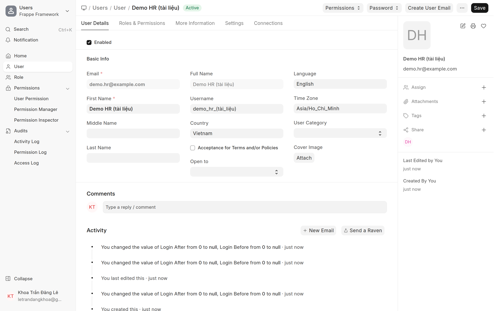

# Tạo User & phân quyền
{: .no_toc }

**Dành cho:** System Manager / Quản trị · **Doctype:** User
{: .fs-3 .text-grey-dk-000 }

> Mỗi người dùng hệ thống cần **1 User (tài khoản đăng nhập)** trước. **Quản trị** tạo User + gán **role** (quyền). Sau đó **HR** mới tạo **Employee** và link tới User này. Người duyệt (approver ở Department/Employee) cũng phải trỏ tới **User đã có**.

---

## 1. Tạo User

- Mở: Desk → Search **"User"** · URL `/app/user/new`.
- Điền:
  - **Email** — chính là **tài khoản đăng nhập**.
  - **First Name** — tên hiển thị.
  - **User Type** — **System User** (nhân sự dùng app/Desk). *Website User chỉ cho khách, không vào được Desk.*
  - **Enabled** — bật.
- Mật khẩu: đặt **New Password**, hoặc tick **Send Welcome Email** để user tự đặt qua email.

## 2. Phân quyền (Roles)

Mở tab **Roles & Permissions** → tick role phù hợp:

- **Employee** — nhân viên thường (dùng PWA chấm công / nghỉ phép / chi phí).
- **HR User** / **HR Manager** — nhân sự xử lý chấm công, duyệt đơn, cấu hình.
- **System Manager** — quản trị hệ thống (cấu hình, tạo user…). Cấp **hạn chế**.

Bấm **Save**.

> 💡 Người **chỉ chấm công bằng điện thoại**: chỉ cần role **Employee**. Manager duyệt phép: thêm vai trò phù hợp **+** được set làm **Leave Approver** ở Department.

## 3. Bàn giao cho HR

Tạo User xong → báo **HR** tạo **Employee** và chọn user này ở field **User ID** (xem **[HR → Tạo & quản lý Employee](Desk-Admin-Employee.html)**).

---

## ⚠️ Lỗi thường gặp

| Hiện tượng | Cách xử |
|---|---|
| User không đăng nhập được | Chưa **Enabled** / chưa đặt mật khẩu |
| Đăng nhập được nhưng không vào Desk | **User Type = Website User** → đổi **System User** |
| Thiếu chức năng trong app | Thiếu **role** tương ứng (Employee / HR User…) |
| Không gán được làm Approver | User **chưa tồn tại** hoặc chưa đúng role |

## Liên quan
- [Tạo & quản lý Employee (HR)](Desk-Admin-Employee.html) · [Phòng ban & người duyệt](Desk-Admin-Department.html)
