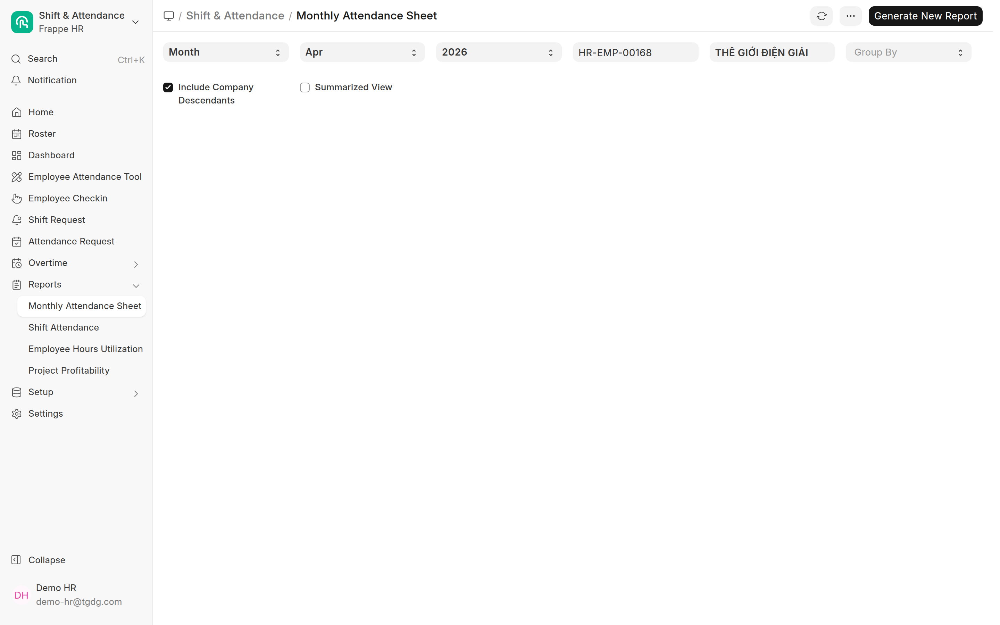
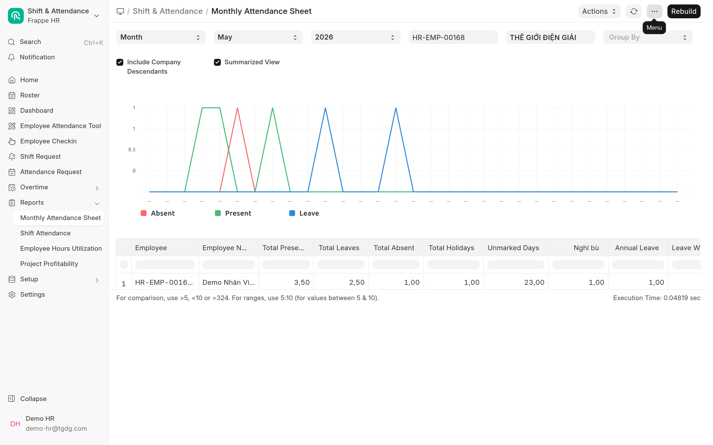
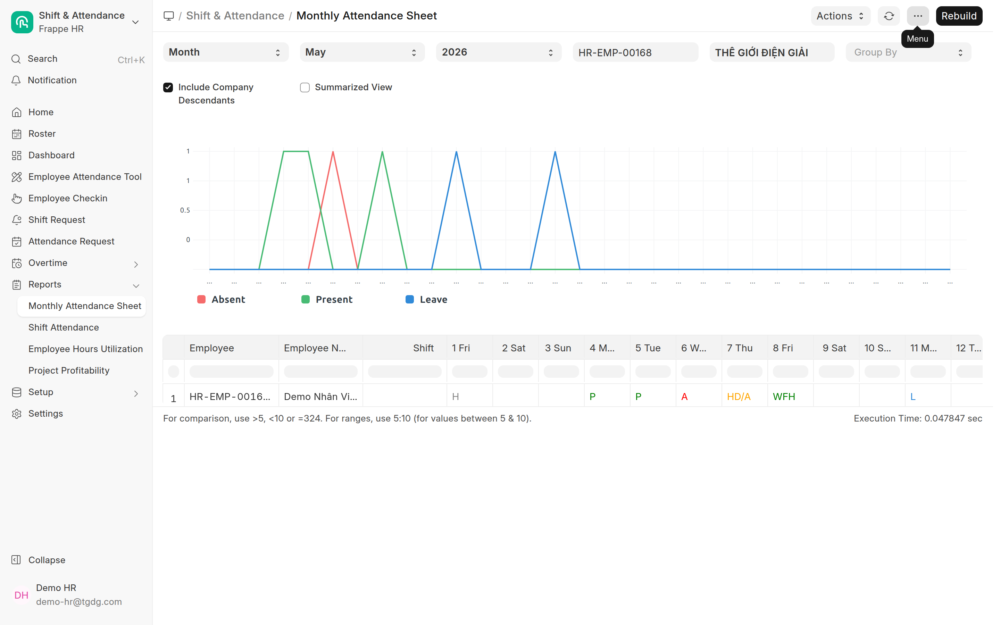

# Bảng công tháng — Monthly Attendance Sheet
{: .no_toc }

**Dành cho:** HR Manager · Trưởng bộ phận · **Nơi xem:** Desk → Search **"Monthly Attendance Sheet Cobe"**
{: .fs-3 .text-grey-dk-000 }

> Báo cáo **một bảng = cả tháng**: mỗi dòng là **một nhân viên**, mỗi cột là **một ngày**, mỗi ô là
> **trạng thái công** ngày đó (P / A / HD / L / WFH / H / WO). Dùng để **đối chiếu công cuối tháng**,
> xuất Excel gửi kế toán.

> 🟢 **Dùng bản Cobe: `Monthly Attendance Sheet Cobe`** (KHÔNG phải bản gốc HRMS "Monthly
> Attendance Sheet"). Bản Cobe thêm **Mã NV**, **Công ty trực thuộc**, **Tổng giờ**, và mỗi ô hiện
> **giờ thực tế** cạnh ký hiệu (vd `P 8.3`) + **ký hiệu tiếng Việt theo loại phép** — xem [mục 0](#0-bản-cobe--khác-gì-bản-gốc).

  
Mục lục

{: .text-delta }
1. TOC
{:toc}

---

## 0. Bản Cobe — khác gì bản gốc

Có **hai** báo cáo trùng ý tưởng; HR Cobe **nên dùng bản Cobe**:

| | **Monthly Attendance Sheet Cobe** *(khuyên dùng)* | Monthly Attendance Sheet *(gốc HRMS)* |
|---|---|---|
| Cột đầu | Employee · **Mã NV** · Tên · **Công ty trực thuộc** · Shift · **Tổng giờ** | Employee · Tên · Shift |
| Ô mỗi ngày | Ký hiệu **+ giờ thực tế**: `P 8.3`, `HD 4.0` | Chỉ ký hiệu: `P`, `HD` |
| Ký hiệu nghỉ | **Theo loại phép** (tiếng Việt): `L` `L/2` `NB` `KL` `WFH` `CĐ` `BH` `H` `WO` | Gộp chung `L` (On Leave) |
| Lọc Company | **Bỏ trống = gộp MỌI công ty** | Bắt buộc chọn |
| Cách chạy | **Chạy thẳng** (bấm là ra) | "Prepared report" — phải **Generate New Report** rồi chờ |
| Summarized View | Dùng chung phần tổng của bản gốc | *(bản gốc)* |

> 💡 **Tổng giờ** = cộng `working_hours` mọi ngày trong kỳ — số giờ làm thực tế cả tháng của mỗi
> người, khỏi tính tay. **Công ty trực thuộc** chỉ có với NV đã **gộp công ty** (lưu công ty gốc);
> NV khác để trống là bình thường.

> ⚠️ Mở đúng tên **`Monthly Attendance Sheet Cobe`**. Bản gốc "Monthly Attendance Sheet" **không**
> có Mã NV / Công ty trực thuộc / Tổng giờ. Các phần dưới (bộ lọc, mã trạng thái, presence-based,
> xuất Excel) áp dụng cho **cả hai** bản.

---

## 1. Mở báo cáo

1. Vào Desk (`/app`) → bấm **Search** (Ctrl/⌘ + K) → gõ **Monthly Attendance Sheet Cobe** → Enter.
   (Hoặc workspace **Shift & Attendance / People** → mục **Reports**.)
2. **Bản Cobe chạy thẳng** — đặt bộ lọc là bảng hiện ngay (không cần Generate). *(Riêng bản gốc
   HRMS là "prepared report": phải bấm **Generate New Report** rồi chờ vài giây, đổi filter →
   generate lại.)*

Lần đầu mở (hoặc đổi bộ lọc sang tháng chưa chạy), bảng trống và góc phải hiện nút
**Generate New Report** — bấm nó rồi chờ:

> ⚙️ Nếu thấy bảng **trống / cũ**, bấm **Generate New Report** lần nữa — bảng được tạo theo **bộ lọc
> hiện tại** chứ không tự cập nhật khi bạn đổi tháng.

---

## 2. Bộ lọc (thanh trên)

| Bộ lọc | Ý nghĩa |
|---|---|
| **Month / Year** | Tháng & năm cần xem (bắt buộc). |
| **Company** | Lọc theo công ty. **Bản Cobe: bỏ trống = gộp TẤT CẢ công ty.** *(Bản gốc bắt buộc chọn.)* |
| **Employee** | Để trống = **tất cả** nhân viên; chọn 1 người = chỉ người đó. |
| **Group By** | Gom nhóm theo **Department / Designation / Branch** (tuỳ chọn). |
| **Summarized View** | Tích để xem **chỉ phần tổng** (không có lưới ngày) — gọn, hợp đối chiếu nhanh. |
| **Include Company Descendants** | Gộp cả các công ty con. |

Tích **Summarized View** → mỗi nhân viên còn 1 dòng tổng: Total Present / Leaves / Absent /
Holidays / Unmarked Days, và **tách cột theo từng loại phép** (ảnh dưới: cột **Nghỉ bù** và
**Annual Leave** riêng nhau):

---

## 3. Đọc lưới ngày — các mã trạng thái

Mỗi ô (giao của **nhân viên × ngày**) hiển thị **một mã**:

> 🟢 **Bản Cobe** hiện thêm **giờ thực tế** cạnh mã (`P 8.3`, `HD 4.0`) và **tách ký hiệu theo loại
> phép**: `L` Phép năm · `L/2` Phép năm nửa ngày · `NB` Nghỉ bù · `KL` Không lương · `CĐ` Chế độ có
> lương · `BH` Chế độ BHXH · `WFH` · `H` Lễ · `WO` Nghỉ tuần · `A` Vắng · `HD/A` nửa ngày còn lại
> vắng. (Bản gốc gộp tất cả loại nghỉ thành `L`.)

| Mã | Đầy đủ | Nghĩa | Tính công |
|---|---|---|---|
| **P** | Present | Có mặt (đã chấm công đủ, **hoặc** đơn chấm công bù / công tác đã duyệt) | 1 ngày |
| **WFH** | Work From Home | Làm việc tại nhà (đơn WFH đã duyệt) | 1 ngày |
| **HD** | Half Day | Nửa ngày (nửa công + nửa nghỉ) | 0,5 ngày |
| **L** | On Leave | Nghỉ phép đã duyệt (**gồm cả "Nghỉ bù"**) | nghỉ |
| **A** | Absent | Vắng (chỉ khi có bản ghi công **Absent** — xem [mục 5](#5-đặc-thù-cobe--chấm-công-presence-based)) | 0 |
| **H** | Holiday | Ngày lễ (theo Holiday List) | nghỉ lễ |
| **WO** | Weekly Off | Ngày nghỉ tuần (vd Chủ nhật) | nghỉ tuần |
| *(trống)* | — | **Chưa có công** ngày đó (không chấm, không đơn) | chưa tính |

Ví dụ một dòng đủ mã — **1/5 = H** (Quốc tế Lao động), **4-5 = P**, **6 = A**, **7 = HD/A** (nửa
ngày), **8 = WFH**, **11 = L** (đơn Nghỉ bù đã duyệt), cuối tuần & ngày chưa chấm để **trống**:

> 🔢 **Cột tổng** (bên phải lưới): **Total Present**, **Total Leaves**, **Total Absent**, **Total
> Holidays**… cộng nhanh số ngày từng loại. Phần **chi tiết phép** tách theo **từng loại phép**
> (Phép năm, **Nghỉ bù**, Không lương…).

---

## 4. Các tính năng mới hiện ở đâu trên bảng?

Đây là cách 3 điều chỉnh chấm công mới **đổ vào** Monthly Attendance Sheet:

| Việc nhân viên làm | Trạng thái Attendance | Ô trên bảng |
|---|---|---|
| **Đề xuất chấm công bù / Công tác** được duyệt | Present | **P** |
| **Check-in ngoài VP** hợp lệ (KTV/Sales whitelist, hoặc ngày có đơn duyệt) | Present | **P** |
| **Đề xuất WFH** được duyệt | Work From Home | **WFH** |
| **Nghỉ bù** (Leave Application loại "Nghỉ bù") được duyệt | On Leave | **L** |
| Nghỉ phép năm / không lương được duyệt | On Leave | **L** |

> 💡 **"P" không phân biệt** chấm tại VP hay chấm ngoài VP — cả hai đều là *Có mặt*. Muốn xem **giờ
> vào/ra thực tế** và **đi trễ/về sớm**, dùng báo cáo **Shift Attendance** hoặc mở **Employee Checkin**
> ([Theo dõi & sửa chấm công](Desk-HR-ChamCong.html)).

> 💰 **"Nghỉ bù" hiện là "L" (nghỉ)** trên bảng — đúng, vì đó là một đơn nghỉ. Nhưng **nghỉ bù KHÔNG
> trừ quỹ phép năm** và **không trừ lương** (xem [Loại phép](Desk-HR-LoaiPhep.html)). Trên phần chi
> tiết phép, ngày này nằm ở cột **"Nghỉ bù"** riêng, không lẫn với Phép năm.

---

## 5. Đặc thù cobe — chấm công "presence-based"

Hệ thống cobe **không tự đóng dấu Vắng (A)**. Khác bản ERPNext mặc định, một ngày **không có
check-in và không có đơn** sẽ để **ô trống** chứ **không** tự thành "A".

| Bạn thấy | Nghĩa thật |
|---|---|
| Ô **trống** ở ngày làm việc | Nhân viên **chưa có công** ngày đó (quên chấm / chưa có đơn) → cần xác minh, **không** mặc nhiên là vắng |
| Ô **A** (Absent) | Có bản ghi công **Absent** thật (HR tạo tay, hoặc đơn xin công bị từ chối rồi HR đánh vắng) |

> ⚠️ **Vì sao quan trọng:** cuối tháng đừng đọc ô trống = "đi làm đủ". Ô trống = **chưa có dữ liệu**.
> Hãy soát các ô trống ngày thường: nhắc nhân viên **tạo Đề xuất chấm công bù**, hoặc HR **thêm công
> tay** ([Theo dõi & sửa chấm công](Desk-HR-ChamCong.html)).

> 📘 Vì sao cobe tắt auto-Vắng: xem [Tổng quan chấm công](Cham-Cong-Tong-Quan.html).

---

## 6. Xuất & đối chiếu

1. Đặt **Month / Year / Company** → **Generate New Report**.
2. Soát các **ô trống ngày thường** → xử lý (nhắc NV / thêm công tay).
3. Bấm **⋮ (Menu)** → **Export** → chọn **Excel / CSV** để gửi kế toán / lưu hồ sơ.

4. Cần xem **giờ công chi tiết** từng buổi → mở **Employee Checkin** hoặc báo cáo **Shift Attendance**.

> 📬 Mẹo: **Setup Auto Email** (cùng menu ⋮) đặt lịch gửi bảng công tự động hằng tháng vào mail
> HR/kế toán — khỏi phải nhớ export tay.

---

## Liên quan
- 👩‍💼 [Báo cáo (HR) — danh mục đầy đủ](Desk-HR-BaoCao.html) · [Theo dõi & sửa chấm công](Desk-HR-ChamCong.html)
- ⚙️ [Loại phép & số dư (gồm Nghỉ bù)](Desk-HR-LoaiPhep.html) · [Duyệt nghỉ phép & nghỉ bù](Duyet-Nghi-Phep.html)
- 👤 [Nhân viên: Chấm công ngoài VP & Đề xuất chấm công bù](Guide-NhanVien-ChamCongNgoai.html)
- 📊 [Tổng quan chấm công (presence-based)](Cham-Cong-Tong-Quan.html)
