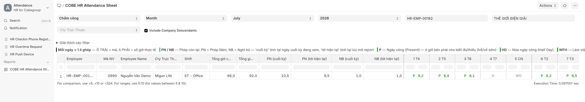
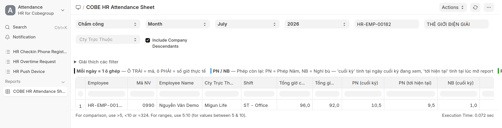
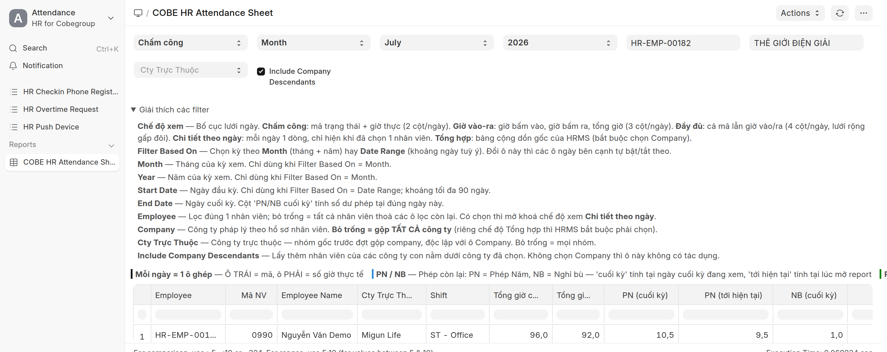
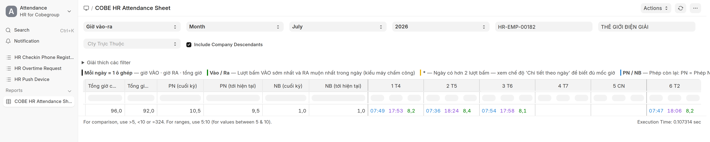
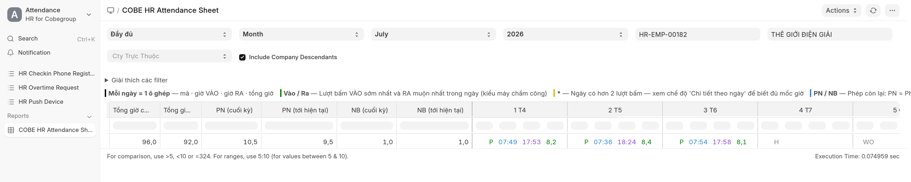
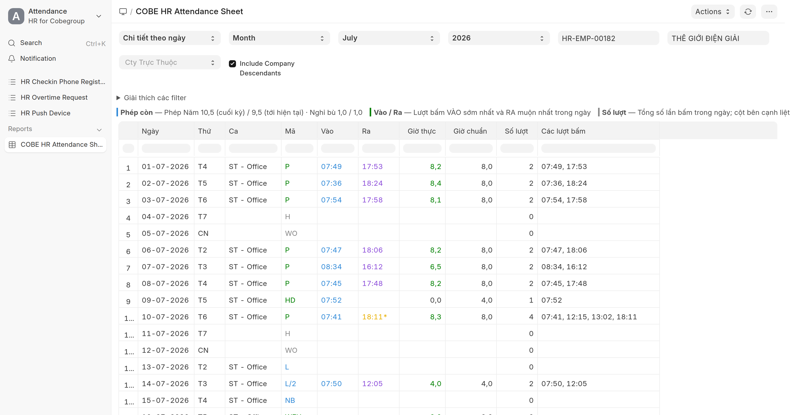
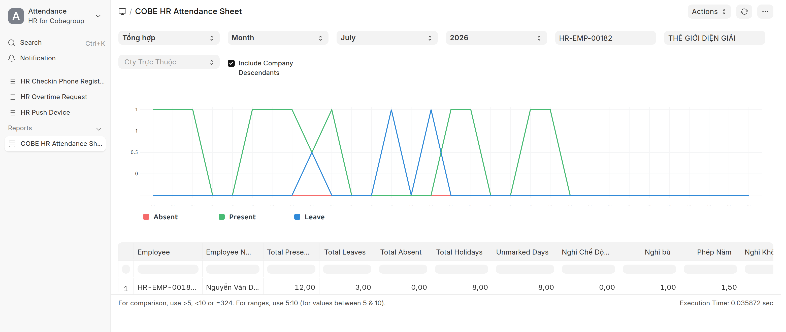

# Bảng công tháng — COBE HR Attendance Sheet
{: .no_toc }

**Dành cho:** HR Manager · Trưởng bộ phận · **Nơi xem:** Desk → Search **"COBE HR Attendance Sheet"**
{: .fs-3 .text-grey-dk-000 }

> Báo cáo **một bảng = cả tháng**: mỗi dòng là **một nhân viên**, mỗi cột là **một ngày**. Dùng để
> **đối chiếu công cuối tháng**, xuất Excel gửi kế toán.

> 🟢 **Dùng bản Cobe: `COBE HR Attendance Sheet`** (KHÔNG phải bản gốc HRMS "Monthly
> Attendance Sheet"). Bản Cobe thêm **Mã NV**, **Cty Trực Thuộc**, **Tổng giờ chuẩn** + **Tổng giờ
> thực**, **4 cột số dư phép**, **ký hiệu tiếng Việt theo loại phép**, và ô **"Chế độ xem"** để đổi
> bảng công thành **bảng giờ vào/ra kiểu máy chấm công** — xem [mục 0](#0-bản-cobe--khác-gì-bản-gốc).

  
Mục lục

{: .text-delta }
1. TOC
{:toc}

---

## 0. Bản Cobe — khác gì bản gốc

Có **hai** báo cáo trùng ý tưởng; HR Cobe **nên dùng bản Cobe**:

| | **COBE HR Attendance Sheet** *(khuyên dùng)* | Monthly Attendance Sheet *(gốc HRMS)* |
|---|---|---|
| Cột đầu | Employee · **Mã NV** · Tên · **Cty Trực Thuộc** · Shift · **Tổng giờ chuẩn** · **Tổng giờ thực** · **4 cột số dư phép** | Employee · Tên · Shift |
| **Chế độ xem** | **5 chế độ**: Chấm công · **Giờ vào-ra** · **Đầy đủ** · **Chi tiết theo ngày** · Tổng hợp | Chỉ 1 lưới + Summarized View |
| Ô mỗi ngày | **1 ô ghép/ngày** (`1 T4`), chia 2–4 phần tuỳ chế độ: **mã** (`P`/`HD`/`WFH`/`L`…/`-`) · **giờ vào** · **giờ ra** · **số giờ** | 1 ô: chỉ ký hiệu `P`, `HD` |
| Ký hiệu | Công `P` · nửa `HD` · WFH `WFH` · nghỉ `L`/`L/2`/`NB`/`KL`/`CĐ`/`BH`/`H` · `WO` · `-` không dữ liệu | Gộp chung `L` (On Leave) |
| **Số dư phép** | **Có** — Phép Năm & Nghỉ bù còn lại, tại **2 mốc** (cuối kỳ / tới hiện tại) | Không có |
| **Giờ vào/ra** | **Có** — lượt bấm thật, đỡ phải mở Employee Checkin | Không có |
| Lọc Company | **Bỏ trống = gộp MỌI công ty** | Bắt buộc chọn |
| Lọc **Cty Trực Thuộc** | **Có** — lọc theo nhóm gốc/công ty trực thuộc (trước gộp công ty), độc lập với Company | Không có |
| Cách chạy | **Chạy thẳng** (bấm là ra) | "Prepared report" — phải **Generate New Report** rồi chờ |

> 💡 **Mỗi ngày = 1 ô ghép** (tiêu đề `<ngày> <thứ>`, vd `1 T4`). Ở chế độ mặc định **Chấm công**, ô
> chia đôi: nửa **trái** là **mã** (`P` công đủ/thiếu · `HD` nửa ngày · `WFH` làm ở nhà ·
> `L`/`NB`/… nghỉ · `-` không-dữ-liệu), nửa **phải** là **số giờ công thực tế** (xanh, nếu có).
> Ngày **nghỉ/lễ/WO** để **trống** nửa giờ. Các chế độ khác chia ô thành 3–4 phần
> ([mục 3](#3-chế-độ-xem--5-cách-nhìn-cùng-một-kỳ)).
>
> 💡 **Xuất Excel** thì mỗi ngày ra **nhiều cột riêng** (`1 T4` = mã, `1·vào`, `1·ra`, `1·g` = số giờ)
> nên cộng/lọc theo cột giờ từng ngày được — trên màn gộp lại 1 ô cho gọn, nhưng dữ liệu vẫn tách.
>
> 💡 **Hai cột tổng giờ** — đừng nhầm:
> - **Tổng giờ chuẩn** = cộng theo **công chuẩn của CA**: mỗi ngày công đủ (P / WFH) = **giờ chuẩn của ca đó**, nửa ngày (HD) = **½ giờ chuẩn ca**; nghỉ/vắng không cộng. Giờ chuẩn ca = *(giờ ra − giờ vào) − nghỉ trưa*, **suy động từ cấu hình mỗi Shift Type** — ca khác nhau có giờ chuẩn khác nhau. Đổi giờ ca trong cấu hình thì cột này **tự đúng theo**.
>   **Ngày nghỉ nửa buổi** (Thứ 7 của khối văn phòng — xem dưới) chỉ tính **½ giờ chuẩn**, vì ngày đó ca chỉ có nửa buổi.
> - **Tổng giờ thực** = cộng **số giờ bấm máy** thực tế mọi ngày trong kỳ (đúng những gì check-in/out ghi lại).
>
> Dùng **Tổng giờ chuẩn** để tính công/lương theo trạng thái (không phụ thuộc NV bấm sớm/muộn); dùng **Tổng giờ thực** để soi giờ hiện diện thật.
>
> 💡 **Thứ 7 nghỉ nửa buổi** — áp dụng cho **các nhóm được xếp lịch nghỉ nửa buổi Thứ 7**
> (thường là **khối văn phòng**). Với những người này, ngày Thứ 7 chỉ có nửa buổi nên:
> - **Tổng giờ chuẩn** cộng **½ ca** (vd ca 8h → tính **4h** cho ngày Thứ 7)
> - **Ngưỡng giờ công cũng chia đôi** → NV làm buổi sáng vẫn là **`P`** (công đủ),
>   không bị rớt xuống `HD`
>
> Người **làm cả ngày Thứ 7** (thường là khối hiện trường/kho) thì Thứ 7 vẫn tính
> **nguyên ngày** như bình thường.
>
> Ai thuộc nhóm nào là do **[Holiday List Assignment](Desk-Admin-Holiday.html)** của **từng nhân
> viên** (thiếu thì lấy của **công ty**) quyết định — **không** phải ô Holiday List trên Shift Type
> (ô đó đã bỏ trống hẳn từ 29/07/2026, vì nhiều nhóm dùng chung một ca nhưng lịch nghỉ khác nhau).
> HR chỉnh ở Holiday List Assignment, báo cáo tự theo, không cần sửa báo cáo.

> 💡 **Cty Trực Thuộc** (công ty trực thuộc) chỉ có với NV đã **gộp công ty** (lưu công ty gốc); NV khác để trống là bình thường.

> ⚠️ Mở đúng tên **`COBE HR Attendance Sheet`**. Bản gốc "Monthly Attendance Sheet" **không**
> có Mã NV / Cty Trực Thuộc / Tổng giờ / số dư phép / giờ vào-ra, **bộ lọc & ký hiệu cũng khác**
> (bản gốc dùng `P`/`A`/`HD`, có *Group By*, bắt buộc chọn Company, phải Generate). Tài liệu này mô
> tả **bản Cobe**; chỉ phần **presence-based** ([mục 7](#7-đặc-thù-cobe--chấm-công-presence-based))
> và **xuất Excel** là chung cho cả hai.

---

## 1. Mở báo cáo

1. Vào Desk (`/app`) → bấm **Search** (Ctrl/⌘ + K) → gõ **COBE HR Attendance Sheet** → Enter.
   (Hoặc workspace **Shift & Attendance / People** → mục **Reports**.)
2. **Bản Cobe chạy thẳng** — đặt bộ lọc xong là bảng **hiện ngay**, KHÔNG cần bấm Generate.

> ⚙️ *Chỉ bản gốc HRMS "Monthly Attendance Sheet" mới là "prepared report" (phải bấm **Generate New
> Report** rồi chờ). Bản Cobe không cần — cứ đổi bộ lọc là bảng tự cập nhật.*

---

## 2. Bộ lọc (thanh trên)

| Bộ lọc | Ý nghĩa |
|---|---|
| **Chế độ xem** | Đổi **bố cục lưới ngày** — 5 chế độ, xem [mục 3](#3-chế-độ-xem--5-cách-nhìn-cùng-một-kỳ). Mặc định **Chấm công**. |
| **Filter Based On** | Lọc theo **Month** (tháng) hay **Date Range** (khoảng ngày). Mặc định **Month**. |
| **Month / Year** | Tháng & năm — hiện khi *Filter Based On = Month*. |
| **Start Date / End Date** | Khoảng ngày (≤ 90 ngày) — hiện khi *Filter Based On = Date Range*. **End Date** cũng là ngày mà cột **PN/NB (cuối kỳ)** lấy số dư phép. |
| **Employee** | Để trống = **tất cả** nhân viên; chọn 1 người = chỉ người đó **và mở khoá chế độ "Chi tiết theo ngày"**. |
| **Company** | Công ty pháp lý. **Bỏ trống = gộp TẤT CẢ công ty** (riêng chế độ *Tổng hợp* thì HRMS bắt buộc chọn). |
| **Cty Trực Thuộc** | Lọc theo **nhóm gốc / công ty trực thuộc** (công ty trước khi gộp), **độc lập** với Company. Bỏ trống = mọi nhóm. |
| **Include Company Descendants** | Gộp cả các công ty con (mặc định bật). Không chọn Company thì ô này không có tác dụng. |

> 💡 **Quên ô nào làm gì?** Bấm dòng **"Giải thích các filter"** ngay trên bảng — bung ra phần giải
> thích đủ 10 ô lọc. Hoặc **rê chuột** vào từng ô lọc, chú thích hiện ra dạng tooltip.

---

## 3. Chế độ xem — 5 cách nhìn cùng một kỳ

Cùng một bộ lọc, ô **Chế độ xem** đổi bố cục lưới ngày. Số liệu **không đổi**, chỉ đổi cách bày.

| Chế độ | Mỗi ngày gồm | Dùng khi |
|---|---|---|
| **Chấm công** *(mặc định)* | **mã** + **số giờ** (2 cột) | Chốt công cuối tháng — gọn nhất, một màn thấy được nhiều ngày |
| **Giờ vào-ra** | **giờ vào** + **giờ ra** + **số giờ** (3 cột) | Soi giờ hiện diện kiểu **máy chấm công**: ai vào muộn, ai về sớm |
| **Đầy đủ** | **mã** + **giờ vào** + **giờ ra** + **số giờ** (4 cột) | Cần cả trạng thái lẫn giờ bấm — **lưới rộng gấp đôi**, phải cuộn ngang nhiều |
| **Chi tiết theo ngày** | *(đổi hẳn bố cục)* **mỗi ngày 1 dòng** | Soi kỹ **1 nhân viên** — có thêm **số lượt bấm** và **đủ mốc giờ** trong ngày |
| **Tổng hợp** | *(không có lưới ngày)* | Đếm nhanh số ngày từng loại (bản gốc HRMS) |

> ⚠️ **"Chi tiết theo ngày" chỉ hiện trong danh sách khi đã chọn 1 nhân viên** ở ô *Employee*. Bỏ
> trống nhân viên thì chế độ này biến khỏi dropdown và bảng tự quay về **Chấm công**.

### Giờ vào-ra — đọc như máy chấm công

Mỗi ngày là cụm **giờ vào · giờ ra · tổng giờ**:

- **Giờ vào** = lượt bấm **VÀO sớm nhất**, **giờ ra** = lượt bấm **RA muộn nhất** trong ngày.
- **Dấu `*`** sau giờ ra (màu vàng) = ngày đó có **hơn 2 lượt bấm** (ra ngoài giữa ca). Muốn biết đủ
  các mốc thì đổi sang **Chi tiết theo ngày**.
- **Tổng giờ** lấy đúng con số **bảng công đang dùng** (`working_hours` của Attendance) — không tự
  tính lại, để không lệch với lương. Riêng ngày **có bấm giờ mà chưa có bản chấm công** (chấm công
  chưa chạy / lỗi) thì mới suy ra *giờ ra − giờ vào*.
- Nhân viên **có bấm giờ nhưng cả kỳ không có bản chấm công nào** vẫn được **1 dòng** ở các chế độ
  có giờ vào-ra (chế độ *Chấm công* không có dòng đó) — chính là những ca cần soi.

Chế độ **Đầy đủ** giống hệt, chỉ thêm **mã trạng thái** ở đầu cụm:

### Chi tiết theo ngày — 1 nhân viên, mỗi ngày 1 dòng

Chọn 1 nhân viên ở ô *Employee* rồi chọn chế độ này:

| Cột | Nghĩa |
|---|---|
| **Ca** | Ca chấm công của ngày đó (trống = ngày không có bản chấm công) |
| **Mã** | Y hệt mã ở lưới tháng (`P` / `HD` / `L` / `NB` / `H` / `WO` / `-`…) |
| **Vào · Ra** | Lượt bấm vào sớm nhất / ra muộn nhất |
| **Giờ thực** | Giờ công của ngày (theo bảng công) |
| **Giờ chuẩn** | Công chuẩn của ca ngày đó — nửa ngày & Thứ 7 nửa buổi thì bằng ½ |
| **Số lượt** | Số lần bấm trong ngày (`0` = không bấm lần nào, vd ngày nghỉ hoặc ngày công đến từ đơn duyệt) |
| **Các lượt bấm** | **Đủ mốc giờ** trong ngày, vd `07:41, 12:15, 13:02, 18:11` |

> 💡 **Số dư phép** ở chế độ này nằm ở **dòng chú thích trên đầu bảng** (`Phép còn — Phép Năm 10,5
> (cuối kỳ) / 9,5 (tới hiện tại) · Nghỉ bù …`), không thành cột, cho khỏi lặp lại giống nhau đủ 31 dòng.

### Tổng hợp

Mỗi nhân viên còn 1 dòng tổng: Total Present / Leaves / Absent / Holidays / Unmarked Days, và
**tách cột theo từng loại phép** (cột **Nghỉ bù**, **Phép Năm**, **Nghỉ Không Lương** riêng nhau):

> ⚠️ Chế độ **Tổng hợp** là bản gốc HRMS nên **bắt buộc chọn Company** — bỏ trống sẽ báo lỗi.

---

## 4. Bốn cột số dư phép (PN / NB)

Nằm ngay sau *Tổng giờ thực*, cho biết nhân viên **còn bao nhiêu phép** mà không phải mở báo cáo khác:

| Cột | Nghĩa |
|---|---|
| **PN (cuối kỳ)** | **Phép Năm** còn lại tính tại **ngày cuối của kỳ đang xem** (vd xem tháng 7 → tính tại 31/07) |
| **PN (tới hiện tại)** | **Phép Năm** còn lại tính tại **lúc mở báo cáo** |
| **NB (cuối kỳ)** · **NB (tới hiện tại)** | Y như trên nhưng cho **Nghỉ bù** |

> 💡 **Vì sao hai mốc?** Xem lại tháng đã qua thì phép vẫn tiếp tục bị tiêu ở các tháng sau — cột
> *cuối kỳ* cho biết **số dư đúng thời điểm của bảng công đó** (để đối chiếu kỳ lương), còn cột
> *tới hiện tại* cho biết **hiện giờ nhân viên còn bao nhiêu** (để duyệt đơn sắp tới).
> Trong ảnh ở [mục 0](#0-bản-cobe--khác-gì-bản-gốc): `PN 10,5` (cuối kỳ) nhưng chỉ còn `9,5`
> (tới hiện tại) vì sang đầu tháng 8 nhân viên nghỉ thêm 1 ngày phép.

> ⚠️ **"tới hiện tại" KHÔNG phải "nghỉ trong ngày hôm nay"** — đó là số dư luỹ kế tính đến hôm nay.

> 📘 Cần chi tiết cấp/nghỉ/còn theo **từng loại phép**, hoặc truy vết số dư sai → dùng
> **[Kiểm tra phép & báo cáo phép](Desk-HR-KiemTraPhep.html)** (Employee Leave Balance / Leave Ledger).

---

## 5. Đọc lưới ngày — các mã trạng thái

Mỗi ô (giao của **nhân viên × ngày**) hiển thị **một mã**:

> 🟢 **Bản Cobe dùng mã trạng thái kiểu HRMS** (`P` / `HD` / `WFH`) + **ký hiệu HR cho các loại nghỉ**
> (`L`/`NB`/`KL`…). Ở chế độ **Chấm công**, mỗi ngày là 1 ô ghép chia đôi: nửa **TRÁI** = **mã trạng
> thái**, nửa **PHẢI** = **số giờ công thực tế** (xanh, nếu có).

| Mã (ô trái) | Nghĩa | Ô giờ (phải) | HR |
|---|---|---|---|
| **P** | **Ngày công** (Present) — đủ hay thiếu (trễ/về sớm) đều `P`; **ô giờ bên phải** cho biết đủ/thiếu | số giờ thực (8,2 / 6,5) | mục 1,3 |
| **HD** | **Nửa ngày công** (Half Day) | số giờ thực (4,0) — nếu là **`0,0`** thì **quên bấm giờ RA**, xem ghi chú dưới bảng | mục 2 |
| **WFH** | **Làm việc ở nhà** — hưởng 70%/ngày thường | giờ thực (nếu có) | mục 4 |
| **NB** | Nghỉ bù | — | mục 5 |
| **L** | Phép năm (đã duyệt) | — | mục 6 |
| **L/2** | Phép năm nửa ngày | giờ nửa đã làm (nếu có) | mục 7 |
| **H** | Nghỉ lễ (theo Holiday List) | — | mục 8 |
| **KL** | Nghỉ không lương | — | mục 9 |
| **CĐ** | Nghỉ chế độ có lương (ma chay/cưới hỏi/sinh con…) | — | mục 10 |
| **BH** | Nghỉ chế độ BHXH | — | mục 11 |
| **-** | **Không có dữ liệu chấm công / vắng** (0 công) | — | mục 12 |
| **WO** | Nghỉ tuần (vd Chủ nhật) | — | — |

> ⚠️ **`HD` kèm ô giờ `0,0` = NV chỉ bấm giờ VÀO, không bấm giờ RA** — không phải nghỉ nửa ngày.
> Giờ công tính bằng *giờ ra − giờ vào*, thiếu vế RA thì bằng **0**; mà 0 giờ thì dưới ngưỡng
> công đủ của ca nên hệ thống hạ xuống **nửa ngày**. Nhân viên vì vậy **mất trắng giờ hôm đó
> và chỉ được tính ½ công** — thấy `HD 0,0` thì **đổi sang chế độ "Giờ vào-ra"** (hoặc *Chi tiết
> theo ngày*) để thấy ngay **có mỗi giờ vào, không có giờ ra**, rồi **bổ sung log RA / sửa
> Attendance tay** trước khi chốt công.
>
> Phân biệt: `HD` mà ô giờ **> 0** là đi làm thật nhưng **giờ công không đủ ngưỡng** của ca.
> Còn **nghỉ phép nửa ngày** hiện `L/2`, `NB`, `KL`… theo đúng loại phép, **không** hiện `HD`.
>
> Từ 30/07/2026 **đi trễ không còn tự hạ xuống `HD`** — chỉ thiếu giờ mới hạ. Tag *Đi trễ*
> vẫn hiện trên app để theo dõi.

> 📊 Xem **ảnh lưới Cobe thực tế** (đủ mã + số giờ) ở **[mục 0](#0-bản-cobe--khác-gì-bản-gốc)** phía trên.

> 🔢 Muốn **cộng nhanh số ngày từng loại** (Total Present / Leaves / Absent / Holidays + tách theo
> từng loại phép: Phép năm · **Nghỉ bù** · Không lương…) thì chọn **Chế độ xem = Tổng hợp**
> ([mục 3](#3-chế-độ-xem--5-cách-nhìn-cùng-một-kỳ)).
> Lưới chi tiết có 2 cột tổng: **Tổng giờ chuẩn** (theo công chuẩn của ca) và **Tổng giờ thực** (giờ bấm máy), không có cột đếm theo loại.

---

## 6. Các tính năng mới hiện ở đâu trên bảng?

Đây là cách 3 điều chỉnh chấm công mới **đổ vào** bảng công tháng:

| Việc nhân viên làm | Trạng thái Attendance | Ô trên bảng |
|---|---|---|
| **Đề xuất chấm công bù / Công tác** được duyệt | Present | **P** (đơn cấp công đủ ca) |
| **Check-in ngoài VP** hợp lệ (KTV/Sales whitelist, hoặc ngày có đơn duyệt) | Present | **P** (ô giờ cho biết đủ/thiếu) |
| **Đề xuất WFH** được duyệt | Work From Home | **WFH** |
| **Nghỉ bù** (Leave Application loại "Nghỉ bù") được duyệt | On Leave | **NB** |
| Nghỉ phép năm / không lương được duyệt | On Leave | **L** / **KL** |

> 💡 **Đơn chấm công bù** cấp **công đủ ca** (không có giờ check-in thực nên không tính trễ/sớm).
> Ở chế độ **Giờ vào-ra**, những ngày này hiện **giờ vào/ra trống nhưng vẫn có số giờ** — đúng, vì
> công đến từ đơn chứ không từ máy chấm công.

> 💰 **"Nghỉ bù" hiện là "NB"** trên bảng — đúng, vì đó là một đơn nghỉ. Nhưng **nghỉ bù KHÔNG
> trừ quỹ phép năm** và **không trừ lương** (xem [Loại phép](Desk-HR-LoaiPhep.html)). Trên phần chi
> tiết phép, ngày này nằm ở cột **"Nghỉ bù"** riêng, không lẫn với Phép năm.

---

## 7. Đặc thù cobe — chấm công "presence-based"

Hệ thống cobe **không tự đóng dấu Vắng**. Khác bản ERPNext mặc định, một ngày **không có
check-in và không có đơn** sẽ hiện **`-`** (0 công) chứ **không** tự thành vắng có bản ghi.

| Bạn thấy | Nghĩa thật |
|---|---|
| Ô **`-`** ở ngày làm việc | 0 công ngày đó. **Hầu hết là "chưa có dữ liệu"** (quên chấm / chưa có đơn) — Cobe không tự đánh vắng nên **đừng** mặc nhiên là vắng, cần **xác minh** |
| Ô **`-`** kèm bản ghi Absent thật | Trường hợp HR **tạo công Absent tay** (hoặc đơn xin công bị từ chối rồi đánh vắng). Nhìn giống hệt ô `-` trên bảng — muốn phân biệt phải mở Attendance ngày đó |

> ⚠️ **Vì sao quan trọng:** cuối tháng đừng đọc ô `-` = "đi làm đủ" hay "chắc chắn vắng". Ô `-` =
> **0 công / chưa xác minh**. Hãy soát các ô `-` ngày thường: nhắc nhân viên **tạo Đề xuất chấm công
> bù**, hoặc HR **thêm công tay** ([Theo dõi & sửa chấm công](Desk-HR-ChamCong.html)).
>
> 💡 Mẹo nhanh: đổi sang **Giờ vào-ra** — ô `-` mà **vẫn có giờ bấm** nghĩa là NV *có đi làm*, chỉ là
> chấm công chưa sinh ra bản ghi; ô `-` mà **không có giờ nào** mới là thật sự không có dấu vết.

> 📘 Vì sao cobe tắt auto-Vắng: xem [Tổng quan chấm công](Cham-Cong-Tong-Quan.html).

---

## 8. Xuất & đối chiếu

1. Đặt bộ lọc **Month / Year** (và Company / Cty Trực Thuộc nếu cần) — bảng **hiện ngay** (bản Cobe không cần Generate).
2. Chọn **Chế độ xem** hợp mục đích: *Chấm công* để chốt công, *Đầy đủ* nếu kế toán cần cả giờ bấm.
3. Soát các ô **`-`** ngày thường (0 công / chưa xác minh) → xử lý (nhắc NV / thêm công tay).
4. Bấm **⋮ (Menu)** → **Export** → chọn **Excel / CSV** để gửi kế toán / lưu hồ sơ.

> 📤 **File xuất ra theo đúng chế độ đang xem**: *Chấm công* 2 cột/ngày (`1 T4`, `1·g`),
> *Giờ vào-ra* 3 cột (`1 T4`, `1·ra`, `1·g`), *Đầy đủ* 4 cột (thêm `1·vào`). Cột số giờ luôn là
> **số**, cộng/lọc trong Excel được.

> 📬 Mẹo: **Setup Auto Email** (cùng menu ⋮) đặt lịch gửi bảng công tự động hằng tháng vào mail
> HR/kế toán — khỏi phải nhớ export tay.

---

## Liên quan
- 👩‍💼 [Báo cáo (HR) — danh mục đầy đủ](Desk-HR-BaoCao.html) · [Theo dõi & sửa chấm công](Desk-HR-ChamCong.html)
- ⚙️ [Loại phép & số dư (gồm Nghỉ bù)](Desk-HR-LoaiPhep.html) · [Duyệt nghỉ phép & nghỉ bù](Duyet-Nghi-Phep.html)
- 📅 [Ngày lễ & Holiday List Assignment](Desk-Admin-Holiday.html)
- 👤 [Nhân viên: Chấm công ngoài VP & Đề xuất chấm công bù](Guide-NhanVien-ChamCongNgoai.html)
- 📊 [Tổng quan chấm công (presence-based)](Cham-Cong-Tong-Quan.html)
