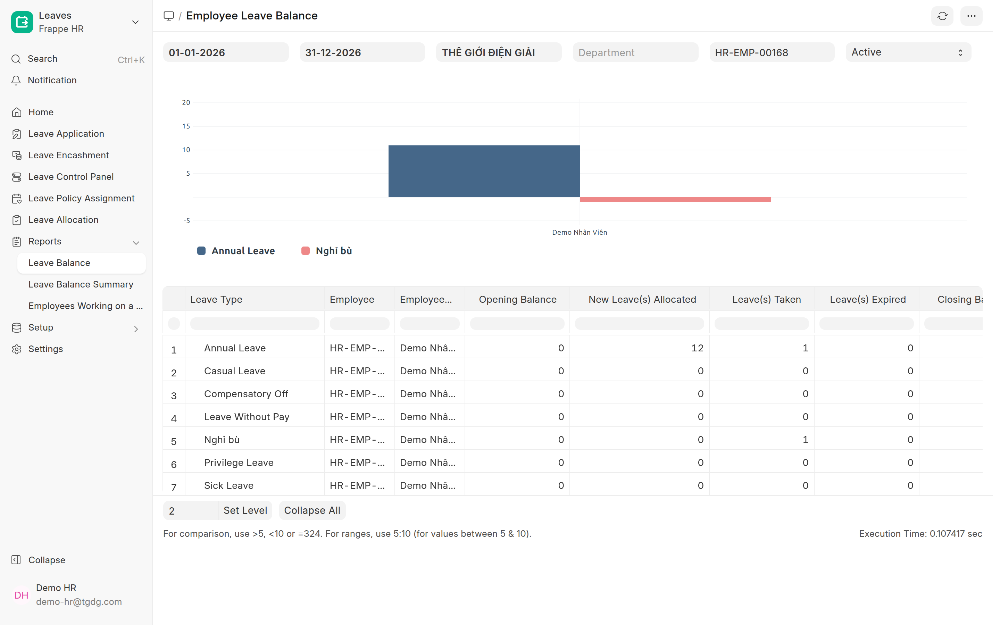
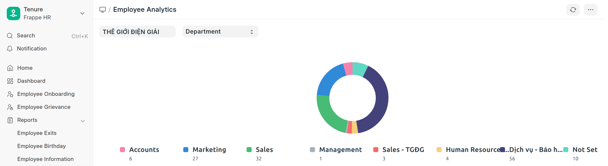
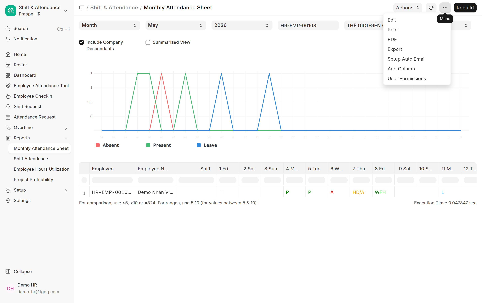

# Báo cáo (HR)
{: .no_toc }

**Dành cho:** HR Manager · **Nơi xem:** Desk → workspace **Shift & Attendance / People** → mục **Reports**
{: .fs-3 .text-grey-dk-000 }

> Hầu hết là báo cáo **HRMS chuẩn**; riêng **COBE HR Attendance Sheet** là bản Cobe tự làm (xem
> mục Chấm công bên dưới). Mở nhanh bằng cách gõ **tên báo cáo** vào ô **Search** (Ctrl/⌘ + K),
> hoặc vào menu **Reports** trong workspace HR.

---

## Chấm công

| Báo cáo | Cho biết |
|---|---|
| **[COBE HR Attendance Sheet](Desk-HR-BangCongThang.html)** *(dùng bản này)* | Bảng công **cả tháng** từng nhân viên, thêm **Mã NV · Công ty trực thuộc · Tổng giờ · 4 cột số dư phép** (Phép Năm & Nghỉ bù còn lại); ký hiệu theo loại phép (L/L2/NB/KL/CĐ/BH/WFH/H/WO). Ô **Chế độ xem** đổi được sang **Giờ vào-ra** (bảng giờ bấm kiểu máy chấm công), **Đầy đủ**, **Chi tiết theo ngày** (1 NV, mỗi ngày 1 dòng) hoặc **Tổng hợp**. **Bỏ trống Company = mọi công ty**; lọc thêm được theo **Cty Trực Thuộc** (công ty pháp lý của NV — nhóm gốc trước gộp cty). → **[Hướng dẫn chi tiết](Desk-HR-BangCongThang.html)** |
| Monthly Attendance Sheet *(bản gốc HRMS)* | Bản đơn giản: mỗi ngày **P / A / HD / L / WFH / H / WO**, bắt buộc chọn company, là "prepared report". Ưu tiên dùng **bản Cobe** ở trên. |
| **Shift Attendance** | Chấm công **theo ca** (giờ vào/ra thực tế vs ca), phát hiện đi trễ/về sớm. *(Chỉ cần xem giờ vào/ra thì bản Cobe ở trên, chế độ **Giờ vào-ra**, đủ dùng và gọn hơn.)* |
| **Employees working on a holiday** | Ai **đi làm vào ngày lễ** (để tính bù/OT). |

> ⚙️ **Monthly Attendance Sheet là "prepared report"** (chạy nền cho nhẹ): bấm **Generate New Report** rồi **chờ vài giây** kết quả hiện ra. Đổi filter thì generate lại.
>
> 📘 **Giải thích đầy đủ từng mã (P/A/HD/L/WFH…), cách chấm công bù & nghỉ bù hiện trên bảng, và đặc thù presence-based:** xem [Bảng công tháng — hướng dẫn chi tiết](Desk-HR-BangCongThang.html).

## Nghỉ phép

| Báo cáo | Cho biết |
|---|---|
| **Employee Leave Balance** | **Số dư phép** từng nhân viên theo từng loại phép (tới một ngày chọn). |
| **Employee Leave Balance Summary** | **Tổng hợp** số dư phép toàn phòng/công ty (1 dòng/nhân viên). |
| **Leave Ledger** | **Sổ cái phép**: từng giao dịch cấp (+) / trừ (−) phép, truy vết số dư. |

> 📘 **Hướng dẫn chi tiết cách dùng 3 báo cáo này** (kiểm số dư 1 NV, ai đang nghỉ hôm nay, truy vết
> số dư sai): xem **[Kiểm tra phép & báo cáo phép](Desk-HR-KiemTraPhep.html)**.

## Nhân sự

| Báo cáo | Cho biết |
|---|---|
| **Employee Information** | Danh sách thông tin nhân viên (lọc/chọn cột tuỳ ý — Report Builder). |
| **Employee Analytics** | Phân tích số lượng nhân sự theo **phòng / chức danh / giới / loại NV**. |
| **Employee Birthday** | Danh sách **sinh nhật** nhân viên theo tháng. |
| **Employee Exits** | Nhân viên **nghỉ việc** + thông tin exit interview. |

## Chi phí / Tạm ứng

| Báo cáo | Cho biết |
|---|---|
| **Employee Advance Summary** | Tổng hợp **tạm ứng** từng nhân viên (đã ứng / đã quyết toán / còn lại). |
| **Unpaid Expense Claim** | Các **claim chi phí chưa thanh toán**. |

> 💰 Báo cáo **lương** (Salary Register, Salary Slip…) nằm ở mục **Lương & Thưởng**, không thuộc nhóm này.

---

## Cách dùng chung

1. Mở báo cáo (Search tên, hoặc menu **Reports**).
2. Đặt **filter** ở thanh trên (tháng/năm, company, phòng, nhân viên…).
3. Báo cáo nặng → bấm **Generate New Report** rồi chờ.
4. **Xuất**: nút **⋮ (Menu)** → **Export** (Excel/CSV) để gửi/đối chiếu — cùng menu có
   **Setup Auto Email** để gửi báo cáo định kỳ tự động.

## Liên quan
- [Theo dõi & sửa chấm công](Desk-HR-ChamCong.html) · [Cấp phép & gán người duyệt](Desk-HR-CapPhep.html)
