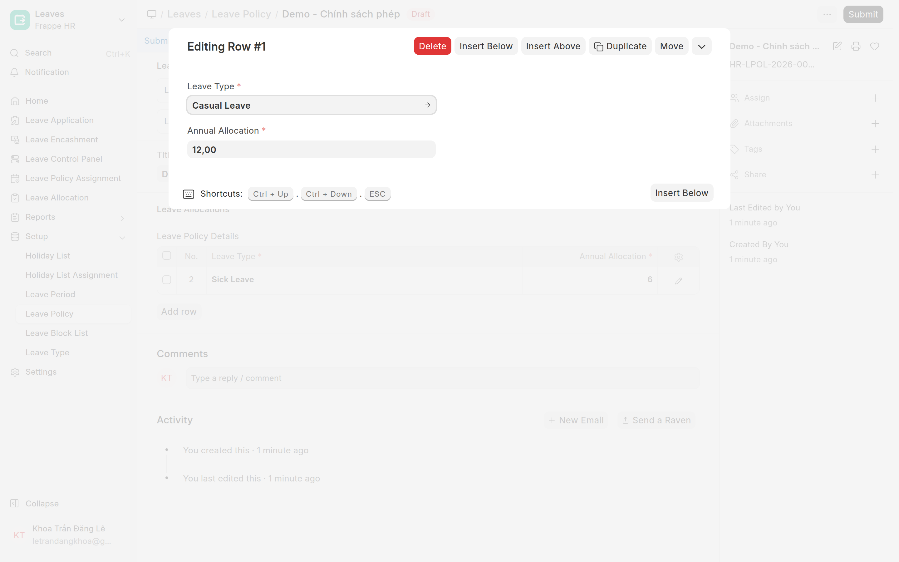
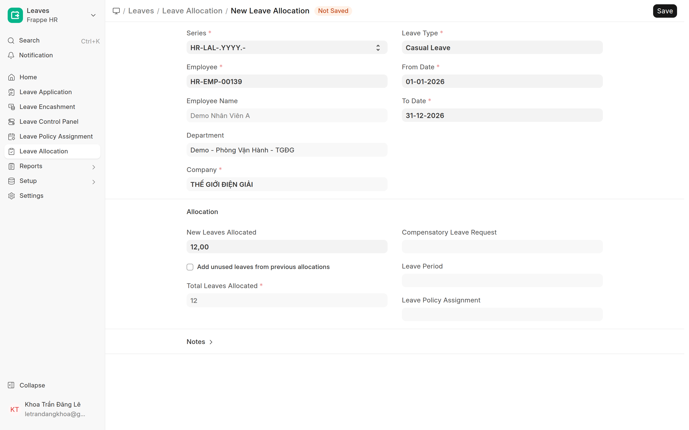

# Cấp phép & gán người duyệt
{: .no_toc }

**Dành cho:** HR Manager · **Doctype:** Leave Allocation, Leave Policy Assignment, Department
{: .fs-3 .text-grey-dk-000 }

> 2 việc tách biệt: **(A) cấp số dư phép** cho nhân viên, và **(B) gán người duyệt** đơn nghỉ. Không có B thì nhân viên gửi đơn sẽ báo *"Chưa có Manager duyệt phép"*.

---

## A. Cấp số dư phép (Leave Allocation)

Cobe dùng **Earned Leave native (HRMS)** — số dư **tự cộng theo lịch**, KHÔNG qua duyệt. Cách dựng:

1. **Leave Period** (`/app/leave-period`) — tạo kỳ phép cho năm (vd 01/01–31/12).
2. **Leave Type** (`/app/leave-type`) — loại phép (Annual Leave…), bật `is_earned_leave` nếu muốn cộng dần.
3. **Leave Policy** (`/app/leave-policy`) — gộp các loại phép + số ngày/năm. Trong bảng **Leave Policy Details** → **Add Row** → bấm vào dòng để mở chi tiết → chọn **Leave Type** + nhập **Annual Allocation** (số ngày/năm). Lặp cho từng loại phép → **Save**.
4. **Leave Policy Assignment** (`/app/leave-policy-assignment`) — gán policy cho nhân viên → **Submit** → hệ thống **tự tạo Leave Allocation** (số dư).

> 💡 Cấp gấp cho 1 người: tạo thẳng **Leave Allocation** (`/app/leave-allocation/new`) → chọn Employee + Leave Type + số ngày + khoảng ngày → Submit.

Sau khi cấp, nhân viên thấy **số dư** ngay trong app (tab Nghỉ phép).

## B. Gán người duyệt (Leave Approver)

Chuỗi ưu tiên: **Employee.leave_approver** (đặt riêng) → fallback **người duyệt mặc định của Department**.

**Cách chuẩn — gán theo phòng (1 lần cho cả phòng):**
1. Mở **Department** (`/app/department`) của phòng đó.
2. Mục **Leave Approvers** → thêm **dòng đầu tiên** = user Manager duyệt phép.
3. Lưu. Mọi nhân viên thuộc phòng này dùng người này làm Manager mặc định.

**Ngoại lệ — override 1 nhân viên:**
- Mở **Employee** → field **Leave Approver** → chọn user. Cái này **đè** Department.

> ⚠️ Hệ thống chỉ lấy **dòng ĐẦU TIÊN** trong Leave Approvers của phòng làm người duyệt mặc định. Thêm nhiều dòng chỉ là "danh sách approver hợp lệ", không tự luân phiên.

## B2. Gán người duyệt CHẤM CÔNG BÙ (Shift Request Approver)

Đơn **chấm công bù / công tác / WFH** (Attendance Request) **không dùng Leave Approver** — nó về khe
**Shift Request Approver**, gán tương tự nhưng luật hơi khác:

1. **Theo phòng:** Department → bảng **Shift Request Approver** → thêm user. Khác Leave: **mọi dòng
   trong bảng đều duyệt được** (không phải chỉ dòng đầu).
2. **Theo nhân viên:** Employee → field **Shift Request Approver**. Khác Leave: field này **cộng thêm**
   vào danh sách của phòng, không phải override.
3. Cấp role **Attendance Request Approver** cho user đó — bước này **BẮT BUỘC**, không bỏ được.
   Role này cấp quyền duyệt (submit/huỷ) trên đơn; gán khe approver mà quên cấp role thì người duyệt
   **vẫn thấy đơn nhưng bấm Duyệt là báo lỗi** *"does not have doctype access via role permission"*.
   Có sẵn role **Leave Approver** cũng **không thay được** — Leave Approver chỉ làm tab **Cần duyệt**
   hiện ra, không đủ quyền duyệt chấm công bù.

> ⚠️ Khác với Leave Approver (HRMS tự cấp role khi gán khe), khe Shift Request Approver **không
> tự cấp role** — phải nhớ làm tay bước 3. Quên bước này là lỗi phổ biến nhất khi thêm người duyệt mới.

> 💡 Muốn **cùng một người** duyệt cả nghỉ phép lẫn chấm công bù: gán user đó vào **cả hai khe**.
> Tách vai (vd nghỉ phép → trưởng phòng, chấm công bù → điều phối vận hành) thì mỗi khe một người.
> HR Manager luôn duyệt thay được cả hai loại.

---

## ⚠️ Lỗi thường gặp

| Hiện tượng | Cách xử |
|---|---|
| NV gửi đơn báo "Chưa có Manager duyệt phép" | Phòng chưa có Leave Approver → làm mục **B** |
| NV chỉ thấy "Leave Without Pay" | Chưa có Leave Allocation loại có lương → làm mục **A** |
| Đặt approver Department nhưng NV vẫn nhầm người | NV bị override ở Employee.leave_approver → kiểm field đó |
| Quản lý duyệt được nghỉ phép nhưng **không thấy đơn chấm công bù** | Chưa gán khe **Shift Request Approver** (tách khỏi Leave Approver) → làm mục **B2** |

## Liên quan
- [Leave — Setup & Workflow (kỹ thuật)](HR-Leave-Setup.html) · [Employee & Department (kỹ thuật)](HR-Employee-Department-Setup.html)
