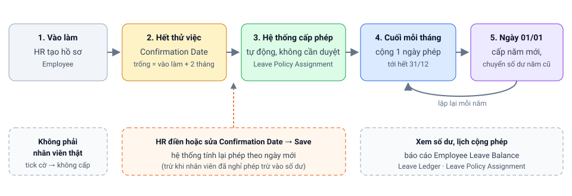
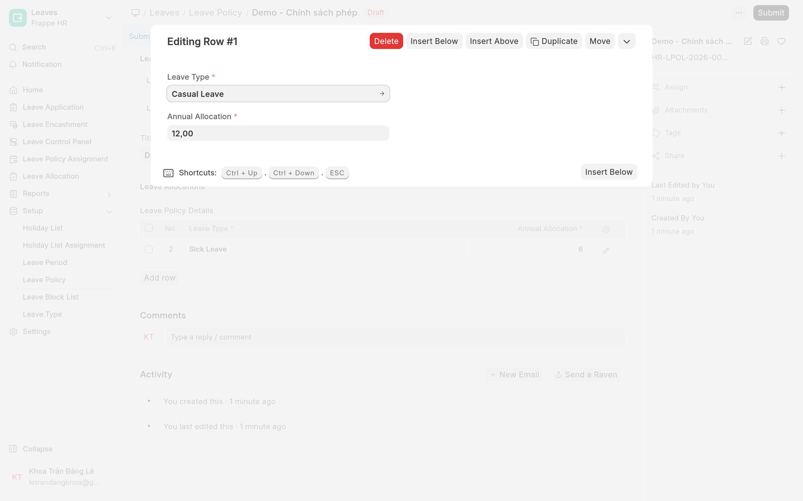
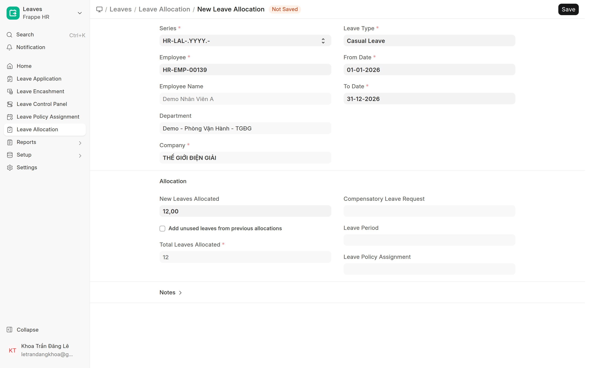
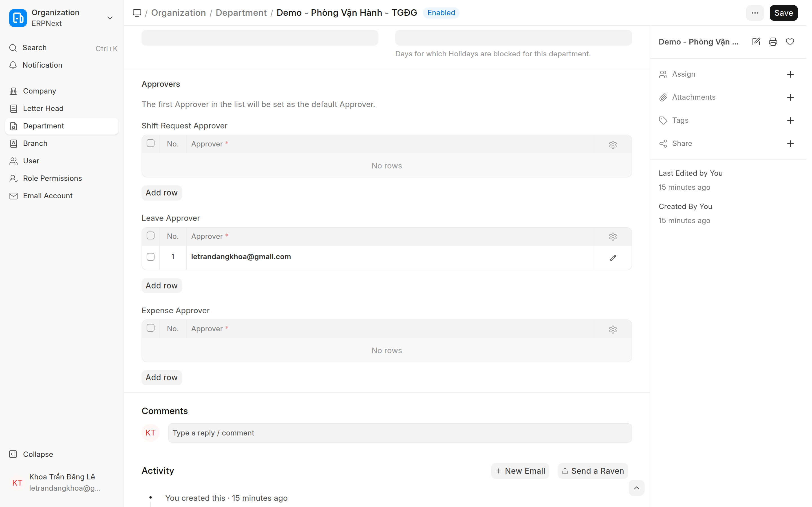

# Cấp phép & gán người duyệt
{: .no_toc }

**Dành cho:** HR Manager · **Doctype:** Leave Policy Assignment, Leave Allocation, Employee, Department
{: .fs-3 .text-grey-dk-000 }

> 2 việc tách biệt: **(A) cấp số dư phép** cho nhân viên (Phép Năm do hệ thống tự cấp — HR chỉ khai ngày hết thử việc), và **(B) gán người duyệt** đơn nghỉ. Không có B thì nhân viên gửi đơn sẽ báo *"Chưa có người duyệt phép"*.

---

## A. Cấp số dư phép
{: #cap-phep }

### Phép Năm được hệ thống tự cấp
{: #he-thong-cap }

**Phép Năm** không cần HR cấp thủ công. Mỗi nhân viên đang làm việc (Status = Active) tự động có
một **Phân bổ chính sách phép** (`Leave Policy Assignment`) cho năm hiện tại. Từ đó hệ thống sinh ra
**số dư phép** (`Leave Allocation`) và **cộng 1 ngày vào cuối mỗi tháng**. Việc của HR chỉ là khai
đúng **ngày hết thử việc**.

  <object type="image/svg+xml" data="images/svg/phep-nam/vong-doi-phep-nam.svg" style="position:absolute;inset:0;width:100%;height:100%;border:0">
    
  </object>

👆 **Bấm vào từng ô trong sơ đồ** để mở phần giải thích.
{: .fs-3 }

| Thời điểm | Hệ thống làm gì |
|---|---|
| Tạo hồ sơ nhân viên mới, hoặc Save hồ sơ | Cấp Phép Năm cho năm hiện tại nếu nhân viên chưa có |
| Hằng đêm (01:15) | Rà lại toàn bộ nhân viên đang làm việc, cấp cho người còn thiếu |
| Cuối mỗi tháng | Cộng 1 ngày phép (12 ngày/năm) |
| Ngày 01/01 | Cấp Phép Năm năm mới cho mọi người, **chuyển số dư còn lại** của năm cũ sang |

### Khai ngày hết thử việc
{: #het-thu-viec }

Phép Năm được tính **từ ngày hết thử việc**. Tháng hết thử việc được tính trọn tháng.

1. Mở hồ sơ **Employee** của nhân viên.
2. Chọn tab **Joining**.
3. Điền ô **Confirmation Date** (ngày hết thử việc). Không điền nhầm vào ô *Offer Date* ngay cạnh,
   hệ thống không đọc ô đó.
4. Bấm **Save**. Hệ thống xử lý ngay, không cần chờ tới đêm.

> 💡 Ô **Confirmation Date** để trống thì hệ thống coi ngày hết thử việc là **ngày vào làm + 2 tháng**.
> Nhân viên vẫn có phép; khi HR điền ngày thật, hệ thống tự tính lại.

Sau khi Save, góc màn hình hiện một trong các thông báo sau:

| Thông báo | Ý nghĩa | Việc cần làm |
|---|---|---|
| 🟢 **"Đã cấp Phép Năm từ …"** | Đã cấp hoặc đã tính lại theo ngày mới | Không cần làm gì |
| 🔵 **"Phép Năm năm nay của nhân viên này được cấp từ trước…"** | Phép năm nay đã được nạp từ trước (đợt nhập số dư, hoặc HR tạo thủ công) nên được **giữ nguyên**. Ngày mới áp dụng từ năm sau | Không cần làm gì |
| 🟠 **"Ngày hết thử việc đã đổi nhưng không tự tính lại được…"** | Nhân viên đã có đơn nghỉ trừ vào số dư cũ, hệ thống không huỷ để tính lại | Chỉnh phần chênh lệch bằng [Điều chỉnh số dư phép](Desk-HR-DieuChinhSoDuPhep.html) |
| Không có thông báo | Nhân viên đã có Phép Năm năm nay và ngày không đổi, hoặc đang được đánh dấu *Không tự cấp Phép Năm* | Không cần làm gì |

### Sửa ngày hết thử việc
{: #doi-ngay }

HR sửa **Confirmation Date** rồi Save, hệ thống tự huỷ phân bổ cũ và cấp lại theo ngày mới. Việc
tính lại chỉ áp dụng cho phân bổ **do hệ thống tự cấp** (ô *Hệ thống tự cấp* được tick trên
`Leave Policy Assignment`). Phân bổ từ đợt nhập số dư hoặc do HR tạo thủ công luôn được giữ nguyên.

### Tài khoản không phải nhân viên thật
{: #khong-cap }

Với tài khoản cộng tác viên, kho tạm, tài khoản kiểm thử…: mở **Employee** → tick
**Không tự cấp Phép Năm** (ngay dưới ô *Nghỉ phép gửi thẳng HR*) → Save. Hệ thống sẽ không cấp Phép Năm cho
hồ sơ này.

### Sang năm mới
{: #nam-moi }

Ngày 01/01 hệ thống tự cấp Phép Năm năm mới cho mọi nhân viên đang làm việc. Số dư còn lại của năm
cũ được **chuyển sang** năm mới. HR không cần tạo gì.

### Các loại phép khác và cấp thủ công
{: #cap-thu-cong }

Chính sách phép (`Leave Policy`) gộp các loại phép và số ngày/năm. Khi cần dựng chính sách cho
loại phép khác:

1. **Leave Type** (`/app/leave-type`) — loại phép, bật `is_earned_leave` nếu muốn cộng dần.
2. **Leave Policy** (`/app/leave-policy`) — trong bảng **Leave Policy Details** → **Add Row** →
   bấm vào dòng để mở chi tiết → chọn **Leave Type** + nhập **Annual Allocation** (số ngày/năm).
   Lặp cho từng loại phép → **Save**.
3. **Leave Policy Assignment** (`/app/leave-policy-assignment`) — gán chính sách cho nhân viên →
   **Submit** → hệ thống **tự tạo Leave Allocation** (số dư).

> ⚠️ **Không tạo thẳng `Leave Allocation` cho Phép Năm.** Số dư tạo thẳng không gắn chính sách nên
> **không bao giờ được cộng cuối tháng**, và còn chặn hệ thống tự cấp cho năm đó. Cần cộng hoặc trừ
> vài ngày cho một người thì dùng [Điều chỉnh số dư phép](Desk-HR-DieuChinhSoDuPhep.html).

Sau khi cấp, nhân viên thấy **số dư** ngay trong app (tab Nghỉ phép).

## B. Gán người duyệt (Leave Approver)

Chuỗi ưu tiên: **Employee.leave_approver** (đặt riêng) → fallback **người duyệt mặc định của Department**.

**Cách chuẩn — gán theo phòng (1 lần cho cả phòng):**
1. Mở **Department** (`/app/department`) của phòng đó.
2. Mục **Leave Approvers** → thêm **dòng đầu tiên** = user Manager duyệt phép.
3. Lưu. Mọi nhân viên thuộc phòng này dùng người này làm Manager mặc định.

**Ngoại lệ — override 1 nhân viên:**
- Mở **Employee** → field **Leave Approver** → chọn user. Cái này **đè** Department.

> ⚠️ Hệ thống chỉ lấy **dòng ĐẦU TIÊN** trong Leave Approvers của phòng làm người duyệt mặc định. Thêm nhiều dòng chỉ là "danh sách approver hợp lệ", không tự luân phiên.

## B2. Gán người duyệt CHẤM CÔNG BÙ (Shift Request Approver)

Đơn **chấm công bù / công tác / WFH** (Attendance Request) **không dùng Leave Approver** — nó về khe
**Shift Request Approver**, gán tương tự nhưng luật hơi khác:

1. **Theo phòng:** Department → bảng **Shift Request Approver** → thêm user. Khác Leave: **mọi dòng
   trong bảng đều duyệt được** (không phải chỉ dòng đầu).
2. **Theo nhân viên:** Employee → field **Shift Request Approver**. Khác Leave: field này **cộng thêm**
   vào danh sách của phòng, không phải override.
3. Cấp role **Attendance Request Approver** cho user đó — bước này **BẮT BUỘC**, không bỏ được.
   Role này cấp quyền duyệt (submit/huỷ) trên đơn; gán khe approver mà quên cấp role thì người duyệt
   **vẫn thấy đơn nhưng bấm Duyệt là báo lỗi** *"Bạn thiếu quyền duyệt xong đơn chấm công bù: cần role
   Attendance Request Approver…"* (đơn **làm thêm giờ** thì không cần role này).
   Có sẵn role **Leave Approver** cũng **không thay được** — Leave Approver chỉ làm tab **Cần duyệt**
   hiện ra, không đủ quyền duyệt chấm công bù.

> ⚠️ Khác với Leave Approver (HRMS tự cấp role khi gán khe), khe Shift Request Approver **không
> tự cấp role** — phải nhớ làm tay bước 3. Quên bước này là lỗi phổ biến nhất khi thêm người duyệt mới.

> 💡 Muốn **cùng một người** duyệt cả nghỉ phép lẫn chấm công bù: gán user đó vào **cả hai khe**.
> Tách vai (vd nghỉ phép → trưởng phòng, chấm công bù → điều phối vận hành) thì mỗi khe một người.
> HR Manager luôn duyệt thay được cả hai loại.

---

## ⚠️ Lỗi thường gặp

| Hiện tượng | Cách xử |
|---|---|
| NV gửi đơn báo "Chưa có người duyệt phép" | Phòng chưa có Leave Approver → làm mục **B** |
| NV chỉ thấy "Leave Without Pay" / không có Phép Năm | Chưa tới ngày hết thử việc, hoặc hồ sơ đang tick *Không tự cấp Phép Năm* → kiểm [ngày hết thử việc](#het-thu-viec) |
| NV mới vào làm chưa có số dư Phép Năm | **Bình thường** — phép tính từ ngày hết thử việc; cuối tháng hết thử việc mới có ngày đầu tiên |
| Điền Confirmation Date mà số dư không đổi | Phép năm nay được nạp từ trước nên giữ nguyên (thông báo 🔵) — xem [bảng thông báo](#het-thu-viec) |
| Save hồ sơ báo *"This document is currently locked…"* | Hệ thống đang cập nhật quyền của một nhóm tài khoản → đợi vài giây rồi **Save lại** |
| Đặt approver Department nhưng NV vẫn nhầm người | NV bị override ở Employee.leave_approver → kiểm field đó |
| Quản lý duyệt được nghỉ phép nhưng **không thấy đơn chấm công bù** | Chưa gán khe **Shift Request Approver** (tách khỏi Leave Approver) → làm mục **B2** |

## Câu hỏi thường gặp
{: #hoi-dap }

**Nhân viên vào làm giữa tháng thì tháng đó có được tính phép không?**

Phép Năm tính từ ngày hết thử việc, không tính từ ngày vào làm. Tháng hết thử việc được cộng trọn
1 ngày vào cuối tháng đó.

**Hết thử việc đúng ngày 31/12 thì sao?**

Nhân viên bắt đầu có Phép Năm từ phân bổ năm sau, cấp ngày 01/01.

**Phép chưa dùng hết trong năm có mất không?**

Không. Ngày 01/01, số dư còn lại được chuyển sang năm mới.

**Nhân viên nghỉ việc rồi quay lại làm, dùng lại hồ sơ cũ thì sao?**

Cập nhật **ngày vào làm** mới và đặt Status = Active. Hệ thống bỏ qua Confirmation Date của lần làm
trước (ngày cũ hơn ngày vào làm mới) và không chuyển số dư của lần làm trước sang.

**Có cần tự bấm gì để phép được cộng mỗi tháng không?**

Không. Việc cộng phép chạy tự động vào cuối mỗi tháng.

## Liên quan
- [Kiểm tra phép & báo cáo phép](Desk-HR-KiemTraPhep.html) · [Điều chỉnh số dư phép thủ công (± 0,5 ngày)](Desk-HR-DieuChinhSoDuPhep.html) · [Leave — Setup & Workflow (kỹ thuật)](HR-Leave-Setup.html) · [Employee & Department (kỹ thuật)](HR-Employee-Department-Setup.html)
