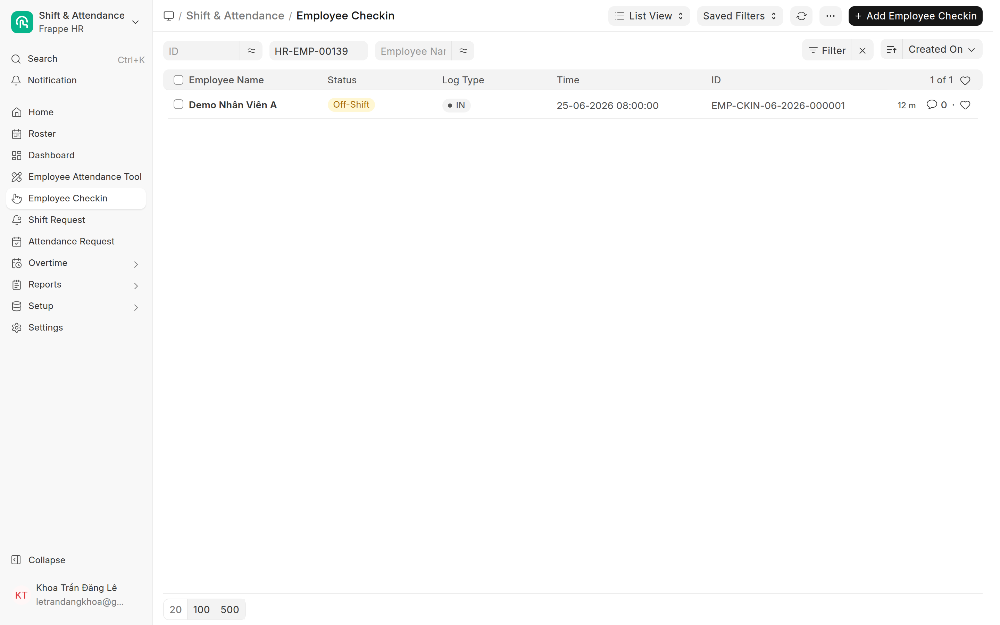
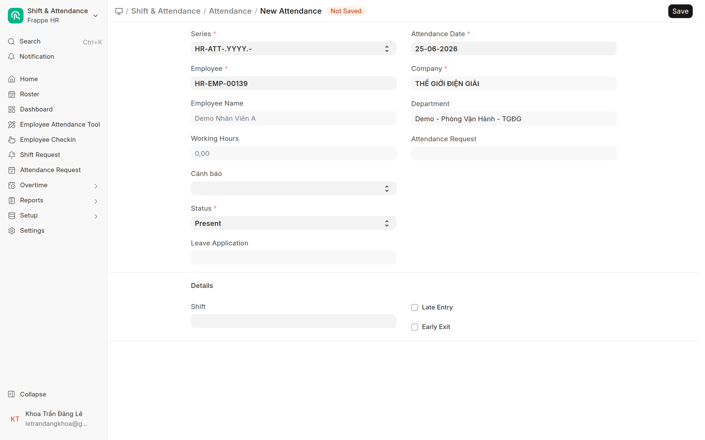

# Theo dõi & sửa chấm công
{: .no_toc }

**Dành cho:** HR Manager · **Doctype:** Employee Checkin, Attendance
{: .fs-3 .text-grey-dk-000 }

> Cobe chấm công **presence-based**: ngày có check-in → **Present/Half**; ngày trống = **nghỉ, KHÔNG tự chấm Vắng**. Vắng thật xử lý thủ công.

---

## 1. Xem nhân viên đã chấm (Employee Checkin)

- `/app/employee-checkin` — mỗi lần vào/ra là 1 bản ghi (có **GPS + ảnh selfie + thời gian**).
- Lọc theo **Employee** / **ngày** để soi 1 người.
- Nghi gian lận (GPS lạ, ảnh sai) → mở bản ghi xem toạ độ + ảnh để audit.

## 2. Xem bảng công (Attendance)

- `/app/attendance` — trạng thái từng ngày: **Present / Half Day / Work From Home / On Leave / Absent**.
- Báo cáo tổng: **Monthly Attendance Sheet** (Report) để xem cả tháng/phòng.
- Attendance **Present/Half tự sinh** từ check-in qua **Process Auto Attendance** (CobeShiftType — không tự chấm Vắng).

## 3. Sửa / bổ sung công

- **Quên chấm công:** nhân viên nên tự tạo đơn **Chấm công bù (Attendance Request)** → HR/Manager duyệt → Attendance tự sinh. Xem [Duyệt đơn](Desk-HR-DuyetDon.html).
- **Sửa tay 1 ngày:** mở/ tạo **Attendance** (`/app/attendance/new`) → chọn Employee + ngày + Status → Submit. Dùng khi cần ép trạng thái.
- **Vắng thật (trốn làm):** hệ thống không tự chấm Vắng. Job *"quên chấm công"* (21h) gom danh sách nghi vắng để HR rà; xác nhận thì tạo Attendance **Absent** hoặc yêu cầu NV xin phép.

> 💡 Nửa ngày T7 / half-day tự ra theo **ngưỡng half-day** trong Shift Type, không cần sửa tay.

---

## ⚠️ Lỗi thường gặp

| Hiện tượng | Cách xử |
|---|---|
| Có check-in nhưng không thấy Attendance | Chưa chạy **Process Auto Attendance**, hoặc chưa gán **Shift** cho NV |
| NV nghỉ nhưng bị tính Vắng | Hiếm (presence-based) — kiểm có Attendance Absent tạo tay/sai shift |
| Cả phòng thiếu công 1 ngày | Kiểm ngày đó có là **lễ trong Holiday List** / lỗi Shift Assignment |

## Liên quan
- [Tổng quan & vận hành (kỹ thuật)](Cham-Cong-Tong-Quan.html) · [Holiday & Shift (kỹ thuật)](HR-Holiday-Shift-Setup.html)
