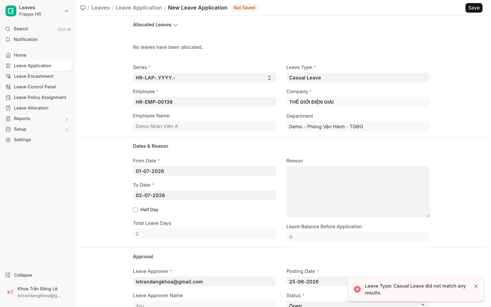
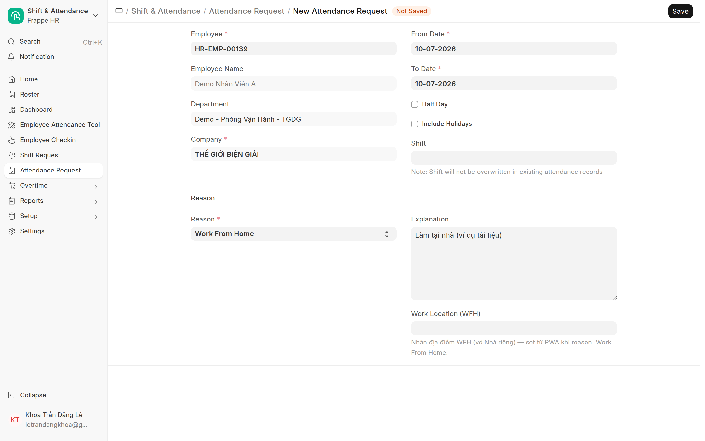

# Duyệt nghỉ phép / WFH (bước HR)
{: .no_toc }

**Dành cho:** HR Manager · **Doctype:** Leave Application, Attendance Request
{: .fs-3 .text-grey-dk-000 }

> Đơn nghỉ phép chạy **workflow 2 bước: Manager → HR**. HR là **bước cuối** mới khiến đơn chính thức. Có thể duyệt trên **app (tab Cần duyệt)** hoặc trên **Desk**.

---

## 1. Đơn nghỉ phép (Leave Application)

**Trên Desk:**
1. `/app/leave-application` → lọc trạng thái workflow đang ở **chờ HR** (sau khi Manager đã duyệt bước 1).
2. Mở đơn → kiểm loại phép, số ngày, số dư.
3. Bấm action workflow **Approve (HR)** → đơn **Approved + Submitted**, trừ số dư.
4. Không hợp lệ → **Reject**.

**Trên app:** tab **Cần duyệt** cũng hiện đơn ở bước của bạn — duyệt nhanh tại đó.

> 💡 **Chuyển duyệt (forward):** ca khó / đi vắng → mở đơn bấm **Chuyển duyệt** chọn người khác cùng quyền. Khi đơn lên cấp HR, thông tin forward được reset. Xem [Trưởng Bộ Phận → Phê duyệt](HD-TruongBoPhan.html).

## 2. WFH / Chấm công bù (Attendance Request)

WFH và "chấm công bù / On Duty" đều là **Attendance Request** (1 doctype).

1. `/app/attendance-request` → mở đơn chờ duyệt (`reason = Work From Home` hoặc On Duty).
2. Kiểm ngày + lý do (WFH có thêm **địa điểm làm việc**).
3. **Submit** đơn → HRMS **tự tạo Attendance** cho ngày đó (status **Work From Home** / Present / Half Day).
4. Từ chối → Cancel / để Draft.

> ⚠️ WFH **không** dùng doctype "HR WFH Approval" nữa (đã deprecated). Tất cả qua **Attendance Request**. Muốn nhân viên thấy lựa chọn WFH trong app, bật flag `enable_wfh_mode` ở [HR Policy](Desk-Admin-Policy.html).

---

## ⚠️ Lỗi thường gặp

| Hiện tượng | Cách xử |
|---|---|
| Đơn nghỉ "Manager đã duyệt" mà vẫn chưa xong | Đang chờ **bước HR** — vào duyệt bước 2 |
| Duyệt Attendance Request nhưng không thấy Attendance | Phải **Submit** (không phải chỉ Save); kiểm NV có Shift |
| NV không thấy nút WFH trong app | Bật `enable_wfh_mode` ở HR Policy của company |

## Liên quan
- [Leave Setup & Workflow (kỹ thuật)](HR-Leave-Setup.html) · [Attendance Request (kỹ thuật)](HR-Attendance-Request.html) · [WFH (kỹ thuật)](HR-WFH-Approval.html)
