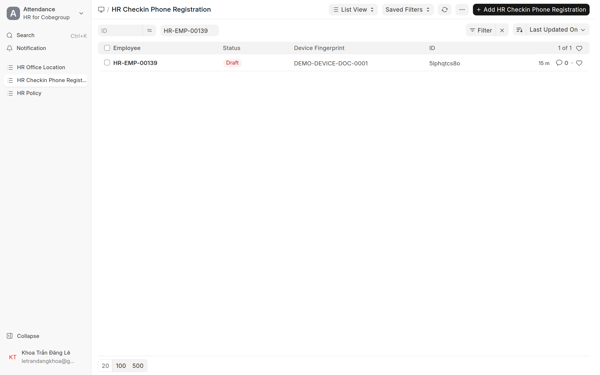
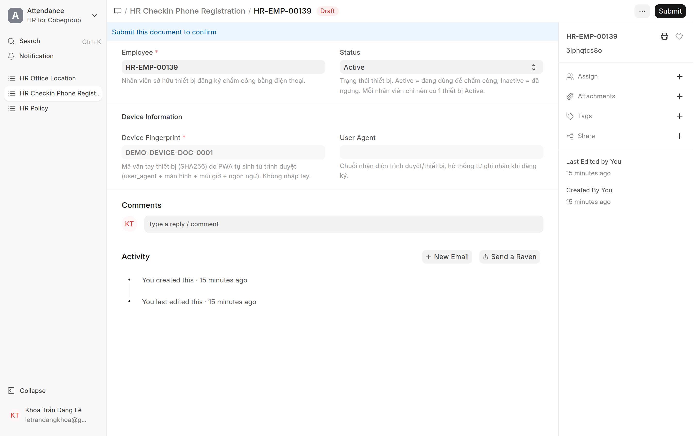

# Duyệt đăng ký thiết bị chấm công
{: .no_toc }

**Dành cho:** HR Manager · **Doctype:** HR Checkin Phone Registration
{: .fs-3 .text-grey-dk-000 }

> Mỗi nhân viên phải có **1 thiết bị (đúng máy đang dùng) được HR duyệt** mới chấm công được. Yêu cầu đăng ký **tự sinh** khi nhân viên mở PWA `/my-workspace` lần đầu trên máy chưa đăng ký.

---

## 1. Mở danh sách yêu cầu

- Desk → Search gõ **"HR Checkin Phone Registration"**, hoặc URL `/app/hr-checkin-phone-registration`.
- Lọc cột **Status = Pending** (hoặc Docstatus = Draft) để thấy yêu cầu **đang chờ duyệt**.

## 2. Duyệt

1. Mở 1 yêu cầu → kiểm **Employee** + thông tin máy (device fingerprint, user agent).
2. Bấm **Submit** (góc trên phải) → record thành **Active + Submitted**.
3. Nhân viên mở lại app là **chấm công được ngay**.

> 💡 **Device-aware:** "đã đăng ký" tính theo **đúng máy hiện tại**, không phải "nhân viên có máy nào đó đã duyệt". Đăng nhập máy mới chưa duyệt → vẫn bị đẩy sang trang đăng ký dù máy cũ còn Active.

## 3. Từ chối / Hủy

- Yêu cầu sai (không phải máy NV, trùng…) → mở record → **Cancel** (hoặc xoá Draft). Record thành **Inactive** → máy đó không chấm công được.

## 4. Nhân viên đổi điện thoại

1. NV đăng ký **máy mới** (tự sinh yêu cầu Pending mới).
2. HR chỉ cần **Submit máy mới** → hệ thống **TỰ thu hồi (cancel) máy cũ**. Không phải Cancel tay.

> ⚠️ Mỗi nhân viên chỉ giữ **1 thiết bị Active** — đảm bảo tự động khi duyệt máy mới.

---

## ⚠️ Lỗi thường gặp

| Hiện tượng | Cách xử |
|---|---|
| NV báo "Thiết bị chưa đăng ký" dù đã gửi | Yêu cầu còn **Pending** → vào duyệt (Submit) |
| NV đổi máy vẫn không chấm được | Duyệt (Submit) yêu cầu máy mới → máy cũ tự thu hồi |
| Không thấy yêu cầu nào | NV chưa mở app lần đầu trên máy đó, hoặc đã bị Cancel |

## Liên quan
- [HR Checkin Phone Registration (kỹ thuật)](HR-Checkin-Phone-Registration.html)
