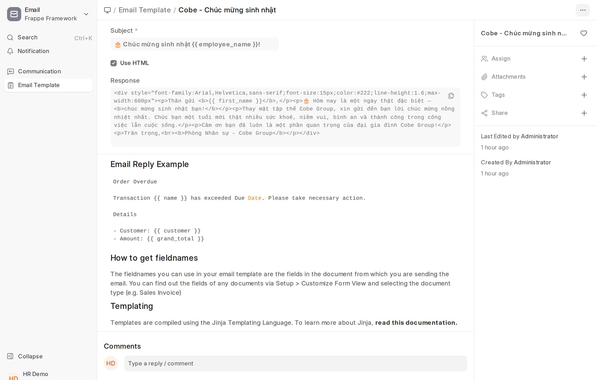
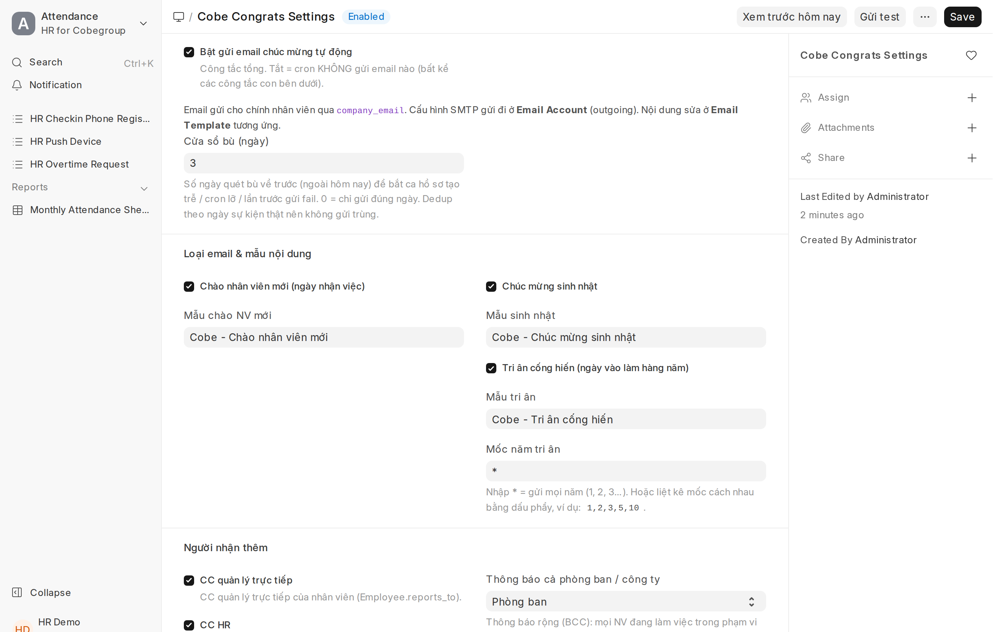
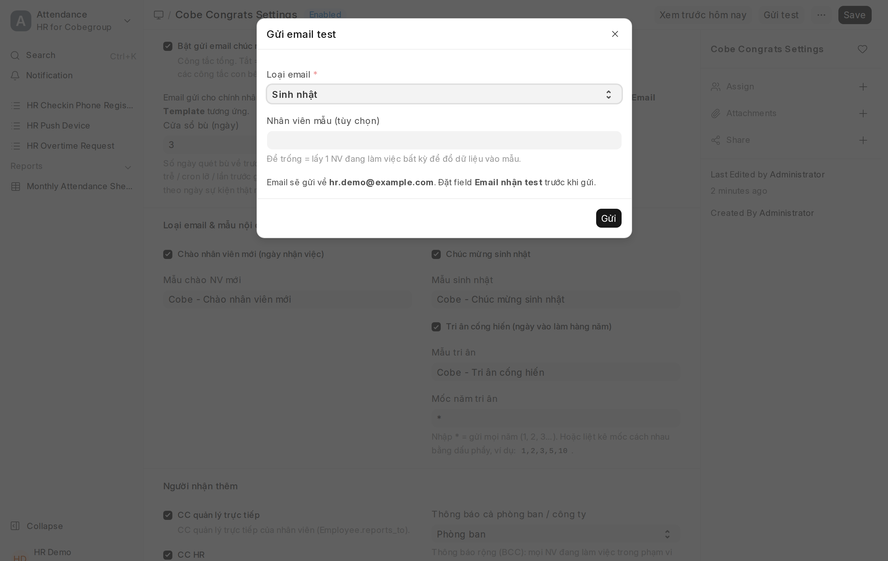
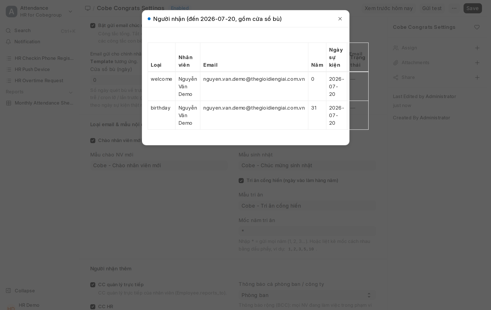
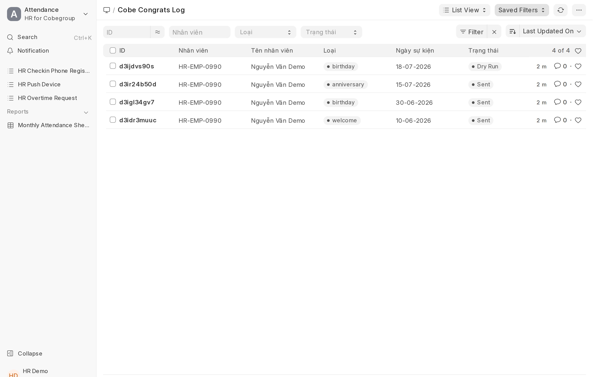

# Email chúc mừng tự động
{: .no_toc }

**Dành cho:** HR Manager · **Doctype:** Cobe Congrats Settings, Email Template, Email Account, Cobe Congrats Log
{: .fs-3 .text-grey-dk-000 }

> Hệ thống **tự gửi email** chúc mừng, HR **không phải lên lịch tay hàng tháng** nữa. 3 loại: **chào nhân viên mới** (ngày nhận việc), **sinh nhật**, **tri ân cống hiến** (mốc năm làm việc). Cron chạy **08:00 mỗi sáng**, tự tìm ai có sự kiện hôm nay rồi gửi.

Mục lục

{: .text-delta }
- TOC
{:toc}

---

## Cách hoạt động (tóm tắt)

- Email gửi cho **chính nhân viên** qua `company_email` (nếu trống thì lấy `personal_email`, rồi tới `user_id`).
- Nội dung lấy từ **Email Template** (sửa được trong Desk, không cần lập trình).
- Mỗi lần gửi ghi 1 dòng **Cobe Congrats Log** → chống gửi trùng + để tra cứu.
- **Cửa sổ bù**: cron không chỉ quét hôm nay mà cả **N ngày gần đây** (mặc định 3) → bắt được ca **hồ sơ tạo trễ**, **cron lỡ 1 ngày**, hoặc **lần trước gửi fail**. Dedup theo **ngày sự kiện thật** nên gửi trễ 1-2 ngày vẫn **không trùng**. Đặt `Cửa sổ bù = 0` nếu chỉ muốn gửi đúng ngày.
- Sinh nhật/tri ân so **ngày–tháng**. Ai sinh 29/02, năm không nhuận sẽ mừng vào 28/02.

---

## Thiết lập lần đầu (5 bước)

### 1. Cấu hình SMTP gửi đi — Email Account
Vào `/app/email-account` → tạo (hoặc mở) 1 **Email Account** loại **Outgoing (SMTP)** đúng của công ty (ví dụ hộp `@thegioidiengiai.com.vn`). Tick **Enable Outgoing**. Không có bước này thì không email nào gửi được.

### 2. Duyệt nội dung — Email Template
Vào `/app/email-template`, 3 mẫu đã tạo sẵn (sửa tuỳ ý):
- **Cobe - Chào nhân viên mới**
- **Cobe - Chúc mừng sinh nhật**
- **Cobe - Tri ân cống hiến**

Biến dùng được trong tiêu đề & nội dung (cú pháp `{{ ... }}`):

| Biến | Ý nghĩa |
|---|---|
| `{{ employee_name }}` | Tên đầy đủ nhân viên |
| `{{ first_name }}` | Tên gọi (để xưng hô) |
| `{{ years }}` | Số năm làm việc (chỉ dùng cho tri ân) |
| `{{ company }}` | Công ty |
| `{{ designation }}` · `{{ department }}` | Chức danh · phòng ban |
| `{{ date_of_joining }}` · `{{ date_of_birth }}` | Ngày vào làm · ngày sinh (dd/MM/yyyy) |

### 3. Cấu hình — Cobe Congrats Settings
Vào `/app/cobe-congrats-settings`:

- **Bật từng loại**: Chào NV mới / Sinh nhật / Tri ân — và chọn đúng mẫu cho mỗi loại.
- **Cửa sổ bù (ngày)**: mặc định 3 — quét bù các ngày gần đây để không bỏ sót (xem mục *Cách hoạt động*). 0 = chỉ gửi đúng ngày.
- **Mốc năm tri ân**: `*` = gửi **mọi năm** (1, 2, 3…). Hoặc liệt kê mốc: `1,2,3,5,10`.
- **Người nhận thêm**:
  - **CC quản lý trực tiếp** — CC email quản lý (Employee.reports_to).
  - **CC HR** — điền danh sách email HR (mỗi dòng/dấu phẩy 1 email).
  - **Thông báo cả phòng ban / công ty** — BCC mọi NV đang làm việc trong phạm vi để cùng chúc mừng. Chọn *Không* nếu chỉ gửi riêng.
- **Người gửi**: điền **Email người gửi** khớp Email Account ở bước 1 (để trống = tài khoản mặc định) + **Tên người gửi**.

### 4. Gửi test trước khi bật
Trong form Settings:
1. Điền **Email nhận test** (hộp của bạn).
2. Bấm nút **Gửi test** → chọn loại → gửi. Email sẽ về hộp test để duyệt nội dung.
3. Bấm **Xem trước hôm nay** để coi hôm nay ai sẽ được gửi gì.

> Khi **Email nhận test** còn giá trị, **mọi** email (kể cả cron thật) đều chuyển hướng về hộp test — dùng để chạy thử an toàn. **Xoá trống ô này** khi muốn chạy thật.

### 5. Bật chạy thật
Hệ thống ship với **2 lớp khoá an toàn**: công tắc tổng **TẮT** + **Chạy thử (dry-run) BẬT**. Để đi live:
1. Tick **Bật gửi email chúc mừng tự động** (công tắc tổng) → **Save**.
2. Bấm **Xem trước hôm nay** / xem `/app/cobe-congrats-log` (trạng thái *Dry Run*) để chắc danh sách đúng.
3. **BỎ tick Chạy thử (dry-run)** → **Save**. Từ giờ cron gửi thật, 08:00 mỗi sáng.

> Chừng nào còn tick **Chạy thử**, cron chỉ ghi log, **không gửi email thật** — kể cả khi công tắc tổng đã bật.

---

## Kiểm thử an toàn

- **Chạy thử (dry-run)**: tick ô này → cron vẫn quét nhưng **không gửi**, chỉ ghi Log trạng thái *Dry Run*. Coi kết quả ở `/app/cobe-congrats-log`.
- **Chạy tay bất cứ lúc nào**: nút **Xem trước hôm nay** (không gửi) trong form Settings.

## Tra cứu & xử lý sự cố

- **Đã gửi cho ai**: `/app/cobe-congrats-log` — lọc theo loại/ngày/trạng thái (Sent / Dry Run / Skipped / Failed).

- **Không nhận được email**:
  - Trạng thái *Skipped "Không có company_email"* → nhân viên thiếu email → điền `company_email` trong hồ sơ Employee.
  - Trạng thái *Failed* → xem cột lỗi. Thường do Email Account/SMTP chưa cấu hình đúng (bước 1) hoặc email người gửi không khớp tài khoản outgoing.
  - Không có dòng nào → kiểm tra công tắc tổng đã bật, đúng loại đã bật, và nhân viên có `date_of_birth`/`date_of_joining`.

> ⚠️ Email gửi theo `company_email`. Nếu công ty đã đổi domain sang `@thegioidiengiai.com.vn`, hãy cập nhật `company_email` của nhân viên cho đúng để không gửi nhầm hộp cũ.
