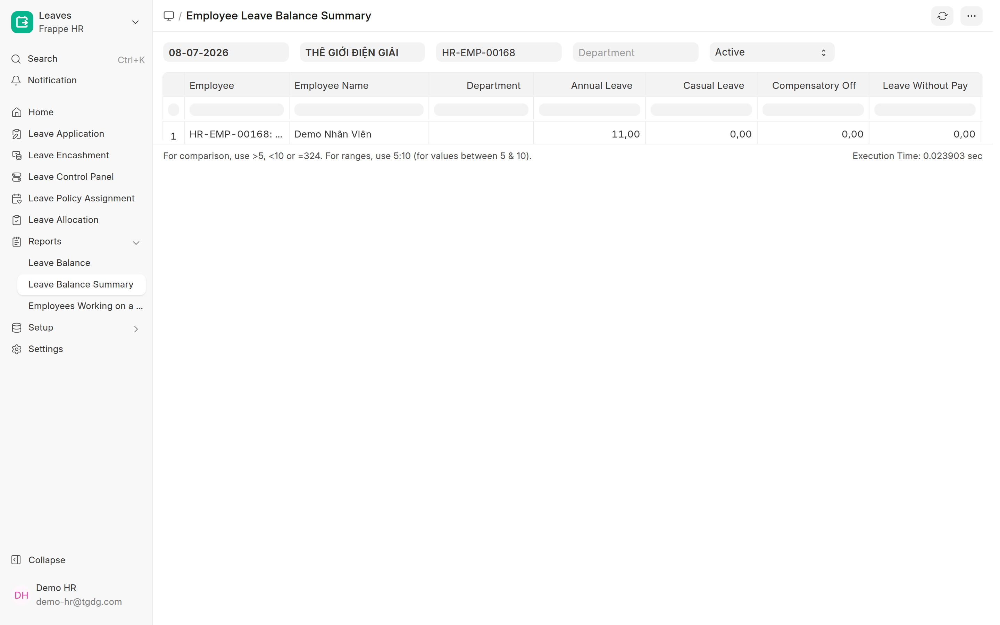
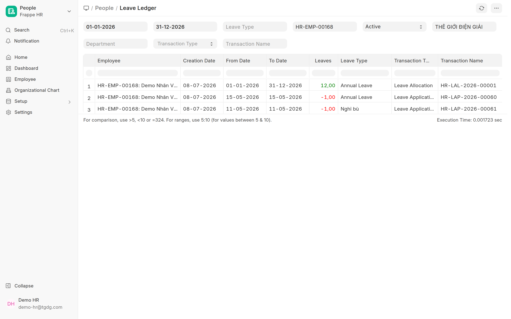

# Kiểm tra phép & báo cáo phép (Leave)
{: .no_toc }

**Dành cho:** HR Manager · **Nơi xem:** Desk → Leave Application list + 3 report HRMS chuẩn
{: .fs-3 .text-grey-dk-000 }

> Trả lời 4 câu hỏi HR gặp hằng ngày: **NV này còn bao nhiêu phép? · Đơn nào đang treo? · Hôm nay ai
> nghỉ? · Vì sao số dư lệch?** — tất cả bằng công cụ HRMS chuẩn, không cần cộng tay.

  
Mục lục

{: .text-delta }
1. TOC
{:toc}

---

## 1. Số dư phép của một nhân viên

**Nhanh nhất — bảo NV tự xem trên app:** tab **Nghỉ phép** hiện chip số dư từng loại, luôn realtime:

**HR xem trên Desk — report `Employee Leave Balance`** (Search gõ tên report, hoặc workspace
Leaves → Reports → Leave Balance):

1. Đặt filter **From/To Date** = kỳ phép (thường 01/01 → 31/12 năm nay) — *report tính theo kỳ,
   đặt sai kỳ là số sai*.
2. Chọn **Company**; muốn soi 1 người thì chọn thêm **Employee** (bỏ trống = cả công ty).

Đọc cột: **Opening Balance** (đầu kỳ) → **New Leave(s) Allocated** (cấp trong kỳ) → **Leave(s)
Taken** (đã nghỉ) → **Leave(s) Expired** (hết hạn) → **Closing Balance** (còn lại). Chart trên đầu
vẽ số dư theo loại — cột **đỏ dưới trục 0** chính là loại Nghỉ bù âm.

> 🔁 **Loại "Nghỉ bù" không có quỹ** — số dư **âm là bình thường**: âm N = đã nghỉ bù N ngày
> (thống kê), không phải lỗi. Đừng "cấp bù" cho hết âm. Xem [Loại phép & số dư](Desk-HR-LoaiPhep.html).

---

## 2. Soát đơn đang treo (Leave Application list)

Mở `/app/leave-application` — cột **Status** tô màu theo trạng thái workflow:

| Lọc Status = | Nghĩa | Việc cần làm |
|---|---|---|
| **Pending Manager** | Chờ Trưởng bộ phận (bước 1) | Treo lâu → nhắc TBP duyệt trên app |
| **Manager Approved** | Chờ HR (bước 2) | **Việc của bạn** — Submit từng đơn ([hướng dẫn](Duyet-Nghi-Phep.html#b-hr-duyệt-trên-desk-app)) |
| **Submitted** | Đã duyệt, đã trừ phép | — |
| **Rejected** | Đã từ chối | — |

> 💡 Đơn ở **Pending Manager / Manager Approved** **chưa trừ phép** — số dư chỉ giảm khi đơn
> **Submitted**. Đây là lý do report và "cảm giác" của NV đôi khi lệch nhau vài ngày.

---

## 3. Hôm nay / tuần này ai nghỉ?

**Cách 1 — lọc list:** `/app/leave-application` → thêm 2 filter: **From Date ≤ hôm nay** và
**To Date ≥ hôm nay**, Status = **Submitted** → ra đúng danh sách người đang nghỉ (đổi mốc ngày để
xem tuần/tháng).

**Cách 2 — nhìn cả tháng:** [Bảng công tháng (COBE HR Attendance Sheet)](Desk-HR-BangCongThang.html)
— ngày nghỉ phép hiện mã **L** (On Leave), nửa ngày hiện **HD**; quét dọc 1 cột là biết cả công ty
hôm đó ai nghỉ.

---

## 4. Ba báo cáo phép — dùng cái nào khi nào?

| Báo cáo | Cho biết | Dùng khi |
|---|---|---|
| **Employee Leave Balance** | Số dư **từng loại phép** của từng NV trong một **kỳ** (đầu kỳ / cấp / nghỉ / hết hạn / còn) | Trả lời NV "tôi còn bao nhiêu phép", chốt quỹ phép cuối kỳ |
| **Employee Leave Balance Summary** | Mỗi NV **1 dòng**, số dư các loại **tại 1 ngày** | Quét nhanh cả phòng/công ty; gửi sếp bảng tổng hợp |
| **Leave Ledger** | **Sổ cái**: từng giao dịch cấp (+) / trừ (−) / hết hạn, kèm chứng từ gốc (Allocation / Application) | **Truy vết** số dư sai — xem mục 5 |

Cách dùng chung: Search tên report → đặt filter (kỳ ngày, Company, Employee/Department) → nút
**⋮ → Export** ra Excel khi cần gửi/đối chiếu. (Danh mục report khác: [Báo cáo (HR)](Desk-HR-BaoCao.html).)

---

## 5. Số dư sai? Truy vết bằng Leave Ledger

Mở report **Leave Ledger** → filter **Employee** + kỳ ngày → dò từng dòng: khởi điểm là dòng
**Leave Allocation (+N)**, mỗi đơn nghỉ là một dòng **Leave Application (−n)** — cộng dồn xuống
tới dòng cuối phải ra đúng số dư hiện tại. Lệch ở đâu, chứng từ gốc nằm ngay cột Transaction.

Nguyên nhân hay gặp:

| Hiện tượng | Nguyên nhân thật |
|---|---|
| NV "còn phép" mà app không cho tạo đơn | **Allocation kỳ này chưa cấp** hoặc đã **hết hạn** (phép năm ngoái không tự chuyển) → [Cấp phép](Desk-HR-CapPhep.html) |
| Số dư "tự nhiên" tăng lại | Đơn đã duyệt bị **Cancel** → hệ thống **xoá dòng trừ trong ledger**, số dư hồi lại — đúng thiết kế |
| NV kêu đã xin nghỉ mà số dư chưa giảm | Đơn còn ở **Chờ Manager / Chờ HR** — chỉ trừ khi **Submitted** (mục 2) |
| Số dư lẻ 0,5 | Đơn **nửa ngày** trừ 0,5 — không phải lỗi làm tròn |
| Loại Nghỉ bù âm | **Bình thường** (mục 1) — không cần xử lý |

---

## ⚠️ Lỗi thường gặp

| Tình huống | Cách xử |
|---|---|
| Report **trống trơn** | Kiểm filter: kỳ **From/To Date** có phủ hôm nay không + đúng **Company** (nhân sự nằm ở pháp nhân nào) |
| Số dư trên report ≠ số trên app của NV | App tính **tới hôm nay**; report tính theo **kỳ đã chọn** — chỉnh From/To Date về kỳ hiện tại rồi so lại |
| Employee Leave Balance không có dòng loại "Nghỉ bù" | Loại chưa từng phát sinh giao dịch với NV đó — xem Leave Ledger thay vì Balance |
| Cần đối chiếu chi tiết với NV | Export Leave Ledger của riêng NV đó ra Excel, gửi kèm giải thích từng dòng |

---

## Liên quan
- ⚙️ [Loại phép & số dư (cấp / trừ)](Desk-HR-LoaiPhep.html) · [Cấp phép & gán người duyệt](Desk-HR-CapPhep.html)
- 🩹 [Điều chỉnh số dư phép thủ công (± 0,5 ngày)](Desk-HR-DieuChinhSoDuPhep.html) — soát ra số dư lệch thì nắn ở đây
- ✅ [Duyệt nghỉ phép & nghỉ bù (Manager + HR)](Duyet-Nghi-Phep.html) — xử các đơn đang treo
- 📊 [Báo cáo (HR)](Desk-HR-BaoCao.html) · [Bảng công tháng](Desk-HR-BangCongThang.html)
- 🔧 Kỹ thuật: [Leave Setup & Workflow](HR-Leave-Setup.html) · [Leave Type](HR-Leave-Type.html)
