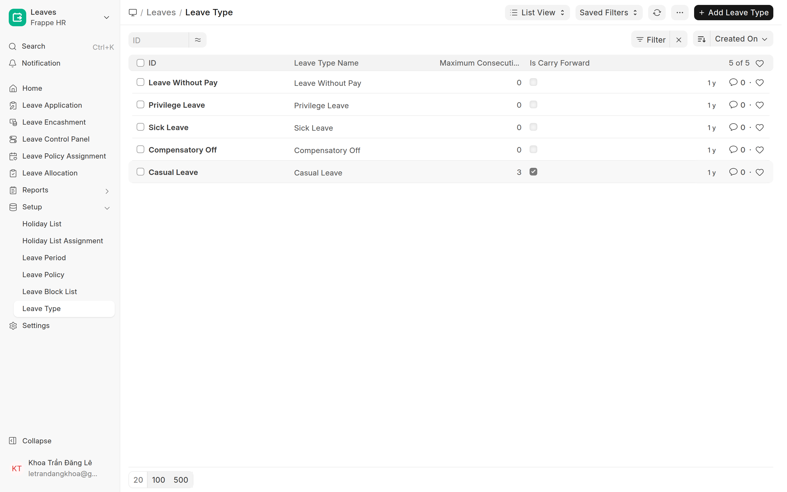
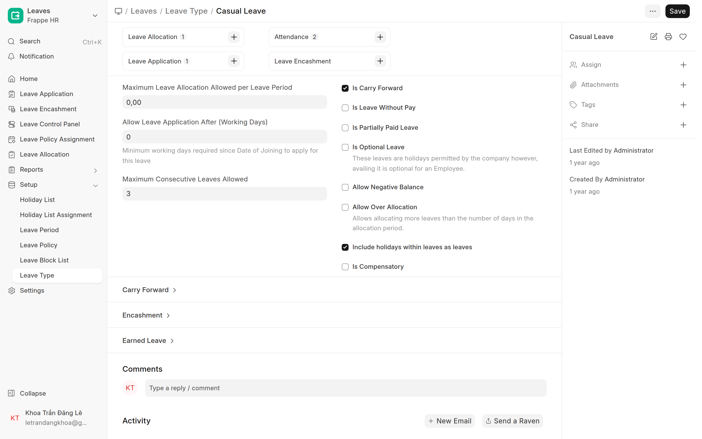
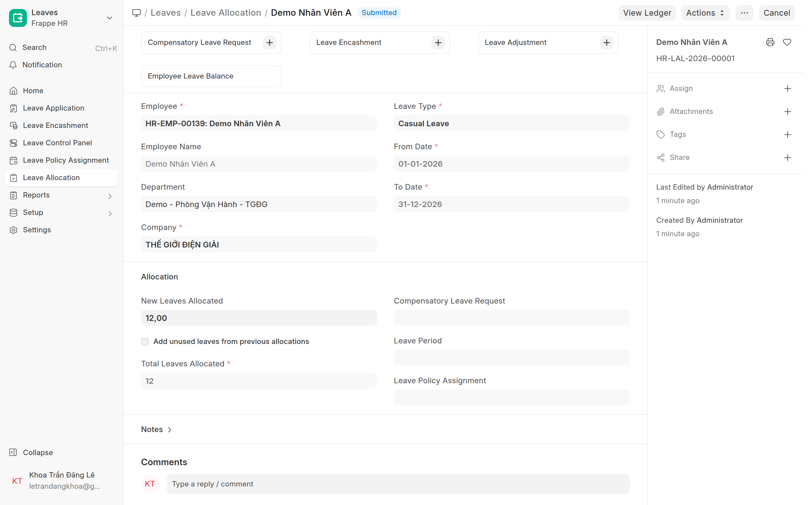
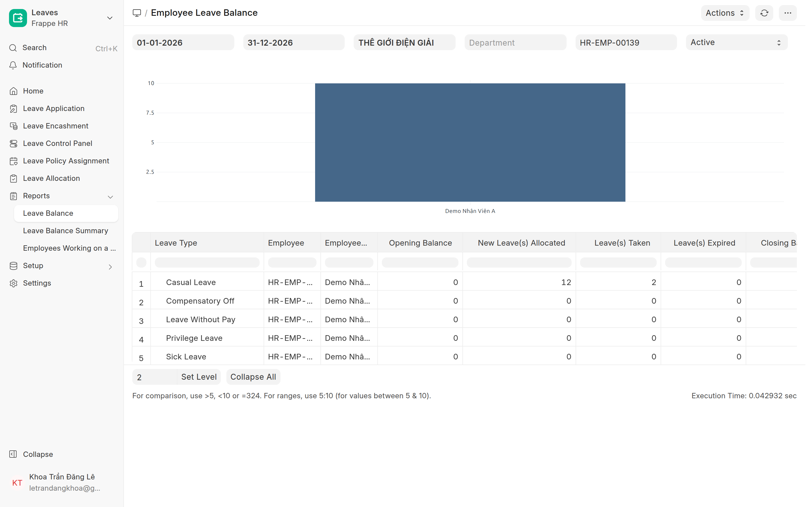

# Loại phép & số dư (cấp / trừ)
{: .no_toc }

**Dành cho:** HR Manager · **Doctype:** Leave Type, Leave Allocation
{: .fs-3 .text-grey-dk-000 }

> **Loại phép (Leave Type)** quyết định nhân viên được nghỉ những gì + tính lương ra sao. **Số dư** mỗi loại đến từ **Leave Allocation** (cấp), và **bị trừ** khi đơn nghỉ được duyệt.

---

## 1. Các loại phép (Leave Type)

Mở: Desk → Search **"Leave Type"** · URL `/app/leave-type`.

Các loại thường dùng:

| Loại | Có lương? | Số dư từ đâu |
|---|---|---|
| **Nghỉ việc riêng** / **Nghỉ ốm** | ✅ Có | Cấp qua **Leave Allocation** |
| **Annual Leave** *(nếu bật Earned)* | ✅ Có | Tự cộng **dần hàng tháng** (earned) |
| **Nghỉ bù** (`is_compensatory`) | ✅ Có | **Không** cấp qua Allocation — căn cứ là **HR Overtime Request** (quy đổi **Nghỉ bù**) đã duyệt; số dư **âm là bình thường** (`allow_negative`) |
| **Leave Without Pay** (`is_lwp`) | ❌ Không | **Không cần cấp** — luôn chọn được, duyệt thì trừ lương |

Mở 1 loại để xem/chỉnh **thông số**:

| Thông số | Ý nghĩa |
|---|---|
| **Maximum Leave Allocation Allowed** | Trần cấp tối đa mỗi kỳ |
| **Allow Leave Application After (Working Days)** | Chỉ cho xin nghỉ sau N ngày công (thử việc) |
| **Maximum Consecutive Leaves Allowed** | Số ngày nghỉ liên tục tối đa/đơn |
| **Is Carry Forward** | Số dư dư cuối kỳ **cộng dồn** sang kỳ sau |
| **Is Leave Without Pay** | Nghỉ **không lương**, không cần số dư |
| **Include holidays within leaves** | Ngày lễ trong kỳ nghỉ **bị tính** là ngày nghỉ |

> 📘 Giải thích đầy đủ mọi flag (earned, compensatory, encashment, optional…) xem **[Leave Type (kỹ thuật)](HR-Leave-Type.html)**.

---

## 2. Cấp phép — tạo Leave Allocation

Để nhân viên **có số dư** (và chọn được loại đó trong app), cấp **Leave Allocation**:

1. Mở: Search **"Leave Allocation"** · URL `/app/leave-allocation/new`.
2. Điền: **Employee** + **Leave Type** + **From/To Date** (kỳ phép, vd 01/01–31/12) + **New Leaves Allocated** (số ngày).
3. **Submit**.

Sau Submit → nhân viên thấy số dư trong app (tab Nghỉ phép) và chọn được loại phép đó.

> 💡 **Cấp hàng loạt** cả công ty: dùng **Leave Policy Assignment** (gán Leave Policy → tự sinh Leave Allocation cho nhiều NV). Xem [Cấp phép & gán người duyệt](Desk-HR-CapPhep.html).

---

## 3. Phép bị trừ thế nào?

1. Nhân viên gửi **đơn nghỉ** (Leave Application) → duyệt **2 bước Manager → HR**.
2. Khi đơn lên trạng thái cuối (**Submitted/Approved**) → hệ thống **tự trừ** số ngày nghỉ vào số dư của loại phép đó.
3. **Leave Without Pay** → **không** trừ số dư (vì không có quỹ; chỉ trừ lương).

Xem số dư + đã trừ: report **Employee Leave Balance** (Search → "Employee Leave Balance", lọc Company + kỳ + Employee):

| Cột | Nghĩa |
|---|---|
| **Opening Balance** | Số dư đầu kỳ (carry forward từ kỳ trước) |
| **New Leaves Allocated** | Đã cấp trong kỳ (vd **12**) |
| **Leaves Taken** | Đã nghỉ (đơn đã duyệt — vd **2**) |
| **Leaves Expired** | Hết hạn (carry forward quá hạn) |
| **Closing Balance** | **Còn lại** = Opening + Allocated − Taken − Expired (vd **10**) |

---

## ⚠️ Lỗi thường gặp

| Hiện tượng | Cách xử |
|---|---|
| NV **không chọn được loại phép nào** | Chưa có **Leave Allocation** + chưa có loại bật **`is_lwp`** → cấp Allocation và/hoặc bật 1 loại Leave Without Pay |
| Số dư sai | Kiểm **Leave Allocation** đúng kỳ + các **đơn đã duyệt** trong report Balance |
| Cần **cộng/trừ tay** vài phần ngày cho 1 NV | Dùng **Leave Adjustment**, đừng sửa phiếu Allocation đã Submit → [Điều chỉnh số dư phép thủ công](Desk-HR-DieuChinhSoDuPhep.html) |
| Cần cấp cho cả phòng/công ty | Dùng **Leave Policy Assignment** thay vì cấp tay từng người |

## Liên quan
- [Cấp phép & gán người duyệt](Desk-HR-CapPhep.html) · [Điều chỉnh số dư phép thủ công](Desk-HR-DieuChinhSoDuPhep.html) · [Kiểm tra phép & báo cáo phép](Desk-HR-KiemTraPhep.html) · [Leave Type (kỹ thuật)](HR-Leave-Type.html) · [Leave Setup & Workflow (kỹ thuật)](HR-Leave-Setup.html)
