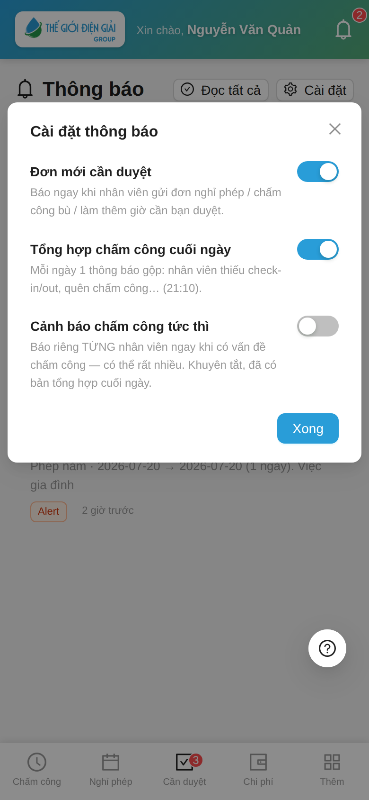

# Cài đặt thông báo cho người duyệt
{: .no_toc }

**Dành cho:** Trưởng Bộ Phận · HR (người có tab Cần duyệt) · **Thời lượng:** ~30 giây
{: .fs-3 .text-grey-dk-000 }

> Trước đây quản lý bị "dội bom" thông báo — mỗi nhân viên thiếu check-in/out là một
> push riêng, ngày nhận vài chục cái. Giờ mặc định đã gọn: **đơn cần duyệt báo ngay,
> vấn đề chấm công gộp 1 bản tin cuối ngày**. Muốn chỉnh khác đi? 3 công tắc dưới đây.

---

## 1. Mặc định bạn sẽ nhận gì?

| Loại thông báo | Khi nào | Mặc định |
|---|---|---|
| 📥 **Đơn mới cần duyệt** | Nhân viên gửi đơn nghỉ phép / chấm công bù / WFH / làm thêm giờ cần **bạn** duyệt — báo **ngay** | ✅ Bật |
| 🌙 **Tổng hợp chấm công cuối ngày** | **21:10 mỗi ngày**, MỘT thông báo gộp: *"Chấm công hôm nay: 5 nhân viên cần chú ý"* + danh sách ai thiếu check-in/out, ai quên chấm công | ✅ Bật |
| ⚡ **Cảnh báo chấm công tức thì** | Báo riêng **từng nhân viên** ngay khi phát hiện vấn đề — kiểu cũ, rất nhiều | ❌ Tắt |

Nhân viên **vẫn nhận** cảnh báo của chính mình như trước (quên check-out thì chính
họ được nhắc để đi tạo chấm công bù) — thay đổi này chỉ gọn hoá phía người duyệt.

---

## 2. Bật / tắt từng loại

Mở tab **Thông báo** (chuông) → bấm nút **Cài đặt** (chỉ người duyệt mới thấy nút này):

Gạt công tắc là lưu ngay, không cần bấm gì thêm:

- **Đơn mới cần duyệt** — nên giữ bật; tắt thì chỉ còn thấy đơn khi mở app (tab Cần duyệt vẫn có badge đỏ).
- **Tổng hợp chấm công cuối ngày** — bản tin 21:10. Tắt nếu bạn không muốn theo dõi chấm công của team qua thông báo.
- **Cảnh báo chấm công tức thì** — bật lại nếu bạn thích nhận từng cái ngay (chấp nhận nhiều thông báo).

---

## ⚠️ Lưu ý

| Tình huống | Cách xử |
|---|---|
| Không thấy nút **Cài đặt** | Bạn không phải người duyệt (không có tab Cần duyệt) — nhân viên thường không có gì để chỉnh |
| Không nhận được push nào cả | Kiểm tra đã bật **Thông báo đẩy** trong tab **Thêm** chưa ([hướng dẫn](Guide-NhanVien-Taikhoan.html)) — cài đặt ở đây chỉ chọn LOẠI, còn quyền nhận push là của thiết bị |
| Tắt hết 3 công tắc rồi vẫn thấy badge đỏ tab Cần duyệt | Đúng thiết kế — cài đặt chỉ tắt **thông báo đẩy**, đơn chờ duyệt vẫn nằm trong app |
| Muốn nhận bản tin cuối ngày sớm/muộn hơn 21:10 | Giờ chạy là cấu hình hệ thống — báo quản trị nếu cả công ty muốn đổi |

---

## Liên quan
- [Phê duyệt đề nghị trên app](Guide-TruongBoPhan-Duyet.html) · [Duyệt đơn làm thêm giờ](Duyet-Lam-Them.html)
- [Thông báo & tài khoản (nhân viên)](Guide-NhanVien-Taikhoan.html) — bật thông báo đẩy trên thiết bị
