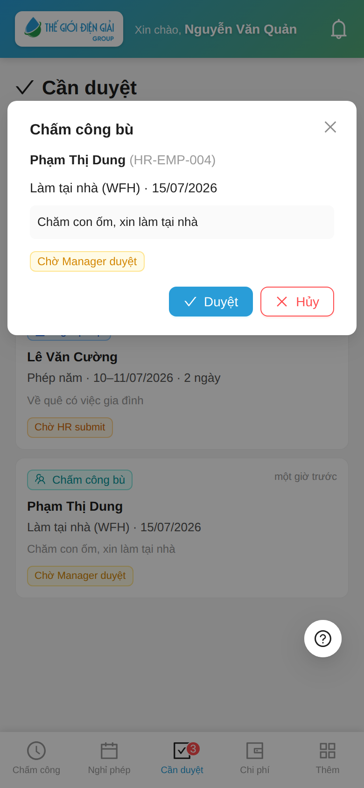
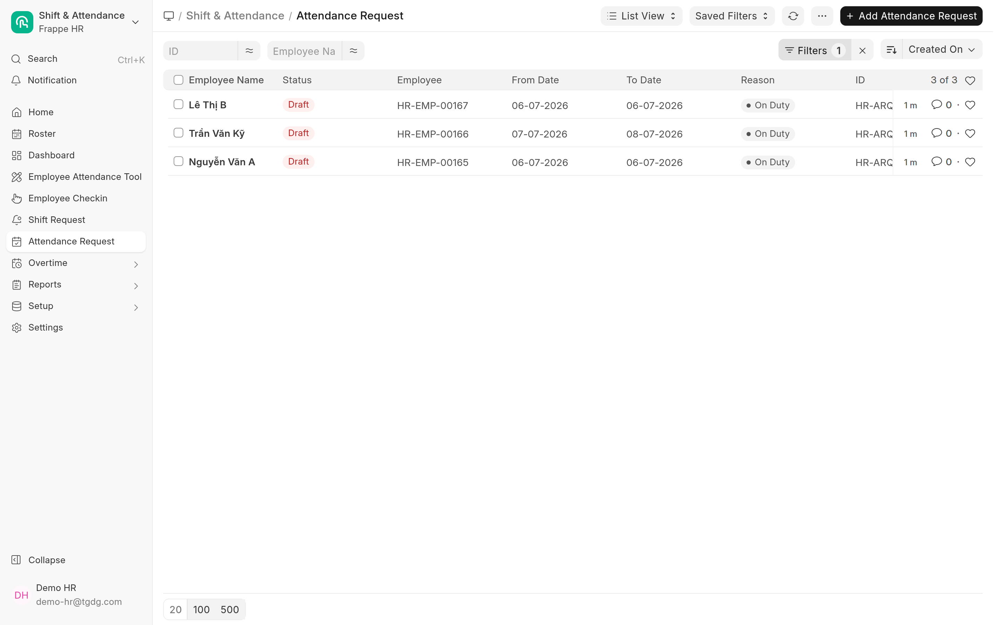
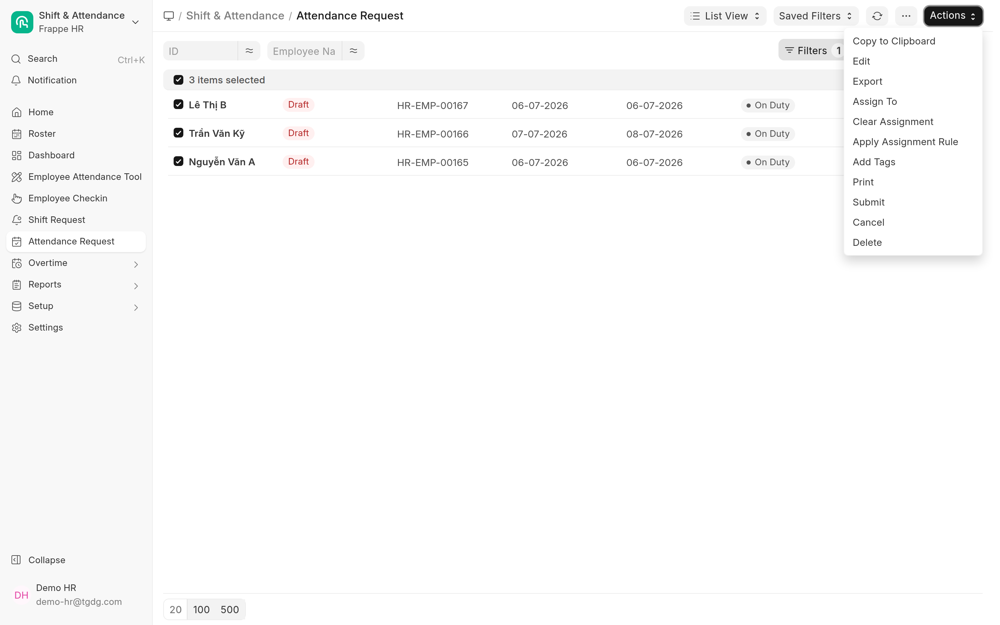
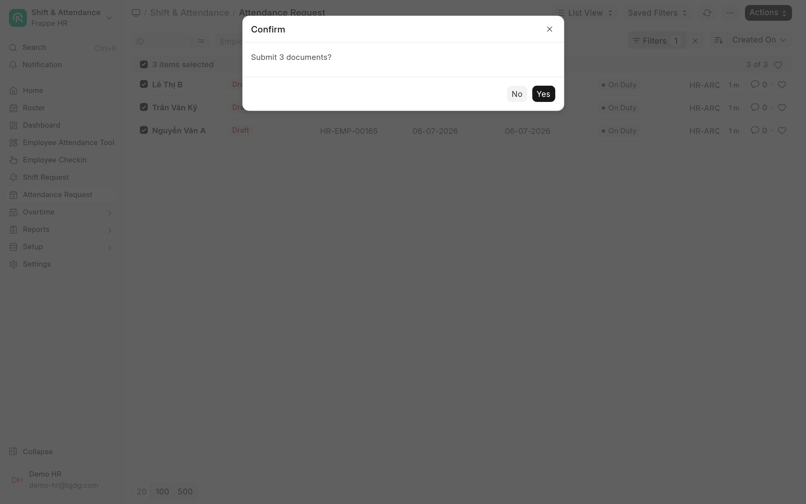

# Duyệt chấm công bù (Attendance Request) — từng phiếu & hàng loạt
{: .no_toc }

**Dành cho:** Quản lý bộ phận + HR · **Thời lượng:** ~3 phút
{: .fs-3 .text-grey-dk-000 }

> Đơn **"Đề xuất chấm công bù / Công tác"** (Attendance Request) của nhân viên và kỹ thuật viên
> **duyệt đúng 1 BƯỚC là xong** — không qua bước HR như nghỉ phép. Quản lý duyệt **từng phiếu trên
> app**; cần xử **nhiều phiếu một lúc** thì làm trên **Desk** (mục C).

  
Mục lục

{: .text-delta }
1. TOC
{:toc}

---

## A. Vì sao 1 bước là đủ?

| | **Nghỉ phép** (2 bước) | **Chấm công bù** (1 bước) |
|---|---|---|
| Tác động | Trừ **quỹ phép** + lương | Chỉ quyết định **công 1–vài ngày** |
| Người nắm thực tế | Manager + HR đối chiếu quỹ | **Quản lý trực tiếp** biết rõ hôm đó NV đi đâu |
| Duyệt xong | HR chốt bước cuối | Hệ thống **tự tạo công "Có mặt"** theo ca chuẩn |
| Lỡ duyệt sai | HR từ chối ở bước 2 | HR **Cancel** đơn trên Desk → công tự gỡ (đảo ngược sạch) |

Chốt chặn là **quản lý trực tiếp** (người được gán duyệt trong hồ sơ NV). HR Manager luôn có quyền
**can thiệp/duyệt thay/hủy** — nên 1 bước vẫn an toàn, đơn giản và nhanh cho hiện trường.

---

## B. Quản lý duyệt TỪNG PHIẾU trên app

Mở **my-workspace → tab Cần duyệt**. Bạn chỉ thấy đơn của **nhân viên do mình duyệt**; đơn chấm công
bù hiện loại "Chấm công bù / Công tác" kèm khoảng ngày + lý do:

- **Duyệt** → xong ngay: hệ thống tự tạo công **Có mặt** cho (các) ngày trong đơn.
- **Từ chối** → đơn đóng; ngày đó nhân viên **không có công** (kể cả khi đã check-in ngoài VP dựa
  trên đơn — với KTV hiện trường, xem [Guide KTV](Guide-KTV-ChamCong.html)).

> 📱 App duyệt **từng phiếu một** — phù hợp nhịp hằng ngày (1-2 đơn lẻ tẻ). Cuối tuần/cuối tháng dồn
> nhiều phiếu → dùng Desk bên dưới.

---

## C. Duyệt HÀNG LOẠT trên Desk (HR)

> 🔑 **Quyền:** bulk trên Desk cần role **HR User** / **HR Manager** (hoặc System Manager). Quản lý
> bộ phận không có role Desk thì vẫn duyệt từng phiếu trên app như mục B.

**Bước 1 —** Vào Desk → app **Frappe HR → Shift & Attendance → Attendance Request** (hoặc gõ
"Attendance Request" vào ô Search). Lọc **Status = Draft** — thêm lọc **From Date / Department** để
rà từng cụm:

**Bước 2 —** **Đọc lý do từng đơn trước khi chọn** (bulk = duyệt không mở chi tiết!). Tick chọn các
đơn muốn duyệt — tick ô đầu bảng để chọn cả trang. Nút **Actions** hiện ra góc phải → chọn **Submit**:

**Bước 3 —** Xác nhận **"Submit N documents?" → Yes**. Hệ thống submit lần lượt từng phiếu; phiếu
nào lỗi sẽ báo riêng, các phiếu còn lại vẫn được duyệt:

> ✅ Submit xong, mỗi ngày trong từng đơn được tạo bản ghi công (**Present** — hoặc **WFH** nếu đơn
> WFH) theo ca chuẩn của nhân viên. Nhân viên thấy ngày đó chuyển **"Có mặt"** trên Bảng công.

---

## D. Từ chối & thu hồi

| Tình huống | Thao tác | Kết quả phía nhân viên |
|---|---|---|
| Từ chối đơn **chưa duyệt** (từng phiếu) | App: nút **Từ chối** | Đơn đóng — ngày không có công |
| Từ chối **nhiều đơn** chưa duyệt | Desk: tick chọn → Actions → **Delete** | Đơn biến mất khỏi Bảng công của NV |
| Thu hồi đơn **đã duyệt nhầm** | Desk: mở đơn (hoặc tick chọn) → **Cancel** | Công "Có mặt" đã tạo **tự gỡ**, ngày trả về trạng thái chưa có công |

> ⚠️ Với KTV: đơn bị từ chối/hủy thì các lần **check-in ngoài VP dựa trên đơn đó mất chỗ dựa** —
> ngày đó vắng toàn bộ. Nếu NV thực tế có đi làm, yêu cầu gửi lại đơn kèm bằng chứng hoặc HR chỉnh
> công tay.

---

## ⚠️ Lỗi thường gặp

| Tình huống | Cách xử |
|---|---|
| Không thấy nút **Submit** trong Actions | Tài khoản thiếu role **HR User / HR Manager** — báo quản trị cấp role |
| Bulk submit báo lỗi vài phiếu | Mở từng phiếu lỗi xem message (vd ngày đã có công, trùng đơn) — các phiếu khác vẫn duyệt bình thường |
| Quản lý bộ phận không thấy đơn trên app | Kiểm tra hồ sơ NV đã gán đúng **người duyệt** chưa (Desk → Employee → Approvers) |
| Duyệt rồi mà NV chưa thấy "Có mặt" | Bảo NV kéo làm mới Bảng công; vẫn thiếu → xem đơn đã Submitted chưa |
| Duyệt nhầm người / nhầm ngày | Desk → mở đơn → **Cancel** — công tự gỡ, không cần sửa tay |

---

## Liên quan

- 👔 [Duyệt nghỉ phép & chấm công bù (Manager + HR)](Duyet-Nghi-Phep.html) — flow duyệt từng phiếu đầy đủ
- 🔧 [KTV hiện trường: Chấm công ngoài VP](Guide-KTV-ChamCong.html) — vì sao KTV tạo các đơn này
- 👤 [Chấm công ngoài VP & Đề xuất chấm công bù (NV)](Guide-NhanVien-ChamCongNgoai.html) — phía người gửi đơn
- 👩‍💼 [Bảng công tháng](Desk-HR-BangCongThang.html) — kiểm tra kết quả công sau duyệt
