# Huỷ đơn nghỉ đã duyệt & tra cứu đơn đã xử
{: .no_toc }

**Dành cho:** HR (HR Manager) · Trưởng Bộ Phận · **Thời lượng:** ~3 phút
{: .fs-3 .text-grey-dk-000 }

> **Từ chối** là chặn đơn *trước* khi nó có hiệu lực. **Huỷ** là rút lại một đơn **đã duyệt xong** —
> phép đã trừ, bảng công đã ghi, nhân viên đã sắp xếp việc riêng. Vì vậy huỷ **bắt buộc kèm lý do**
> và nhân viên **luôn được báo**.

  
Mục lục

{: .text-delta }
1. TOC
{:toc}

---

## 1. Từ chối hay huỷ?

| | **Từ chối** | **Huỷ** |
|---|---|---|
| Đơn đang ở đâu | Còn chờ duyệt | Đã duyệt xong |
| Làm ở đâu | App điện thoại (tab *Chờ duyệt*) | **Desk** (máy tính) |
| Phép đã trừ | Chưa trừ | Đã trừ → **hoàn lại** |
| Bảng công | Chưa ghi | Đã ghi → **gỡ ra** |
| Lý do | Bắt buộc | Bắt buộc |
| Nhân viên biết không | Có, kèm lý do | Có, kèm lý do |

Xem [Duyệt nghỉ phép & nghỉ bù](Duyet-Nghi-Phep.html) cho luồng duyệt/từ chối.

---

## 2. Huỷ một đơn đã duyệt (trên Desk)

Mở đơn cần huỷ: **Leaves → Leave Application →** chọn đơn (trạng thái **Submitted**).

### Bước 1 — Bấm **Cancel** ở góc trên phải

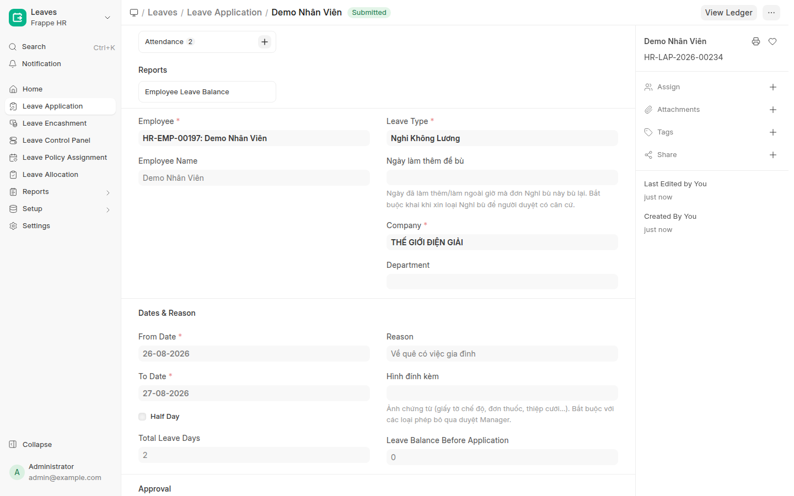

### Bước 2 — Nhập lý do huỷ

Hệ thống hỏi xác nhận, rồi mở ô nhập lý do. **Không nhập thì không huỷ được.**

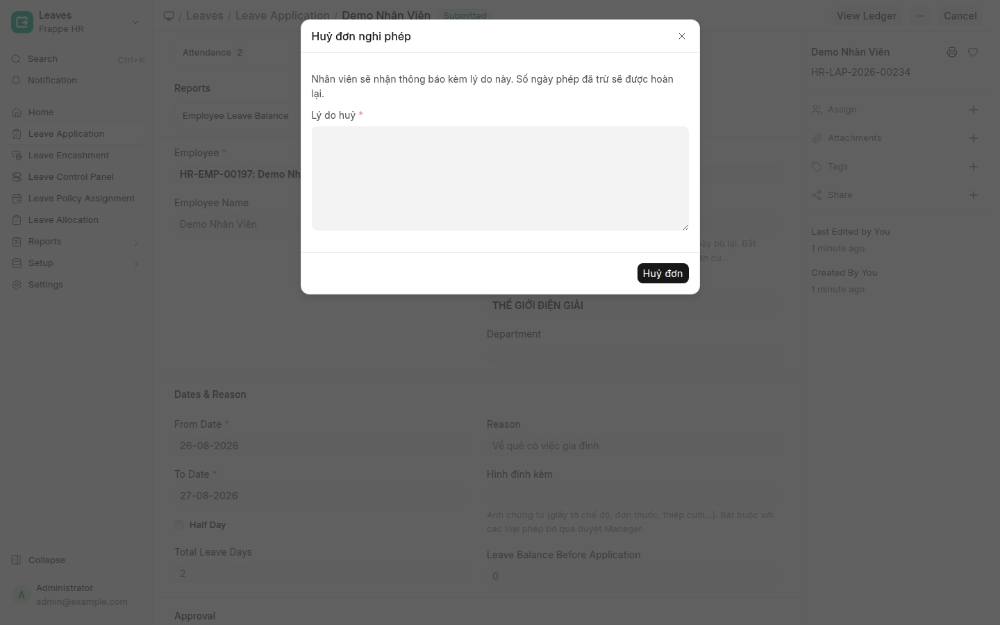

Lý do nên viết cho nhân viên đọc hiểu — chính câu này sẽ được gửi cho họ:

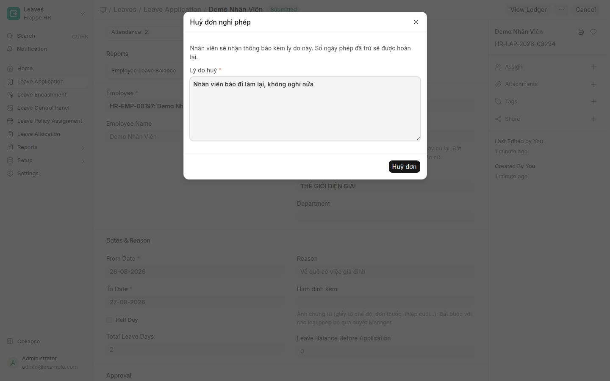

### Bước 3 — Xong

Đơn chuyển sang **Cancelled**, ô **Lý do huỷ** hiện ngay trên đơn:

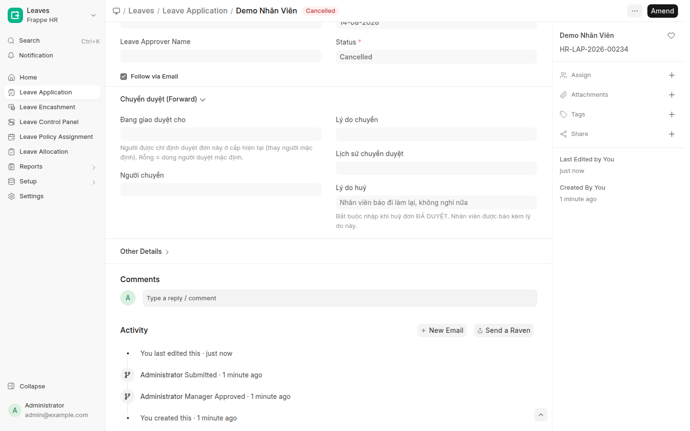

---

## 3. Huỷ đơn thì hệ thống làm những gì

Một cú bấm chạy trọn 5 việc, không cần làm tay việc nào:

| Việc | Chi tiết |
|---|---|
| **Hoàn phép** | Số ngày đã trừ được trả lại số dư ngay |
| **Gỡ bảng công** | Ngày "Nghỉ phép" trong bảng công được gỡ. Ngày nào nhân viên **có chấm công thật** (check-in, đơn chấm công bù, làm thêm) thì **khôi phục về đi làm** chứ không xoá trắng |
| **Trả kỹ thuật viên về lịch** | Ngày nghỉ được gỡ khỏi lịch điều phối, KTV nhận việc lại bình thường |
| **Báo nhân viên** | Thông báo trong app kèm **lý do huỷ** |
| **Ghi nhật ký** | Đơn vào tab **Đã hủy** của người huỷ (mục 4) |

> ⚠️ **Huỷ hàng loạt từ danh sách (chọn nhiều đơn → Cancel) sẽ KHÔNG có ô lý do.**
> Đường đó dành cho việc dọn dữ liệu, không phải cho nghiệp vụ hằng ngày. Huỷ đơn của nhân viên
> thì **mở từng đơn ra huỷ** để họ còn biết vì sao.

---

## 4. Tra cứu đơn mình đã xử (app điện thoại)

Tab **Cần duyệt** trước đây chỉ có đơn **đang chờ** — xử xong là đơn biến mất, không xem lại được.
Nay màn **Duyệt đơn** có **4 tab**:

| Tab | Chứa gì |
|---|---|
| **Chờ duyệt** | Đơn đang đợi bạn — bấm vào để duyệt / từ chối / chuyển duyệt |
| **Đã duyệt** | Đơn bạn đã duyệt và **hiện vẫn còn hiệu lực** |
| **Từ chối** | Đơn bạn đã từ chối, kèm lý do |
| **Đã hủy** | Đơn bạn từng xử, **nay đã bị huỷ**, kèm lý do huỷ |

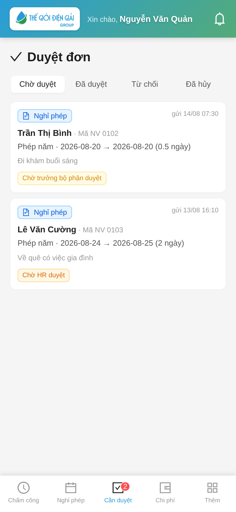
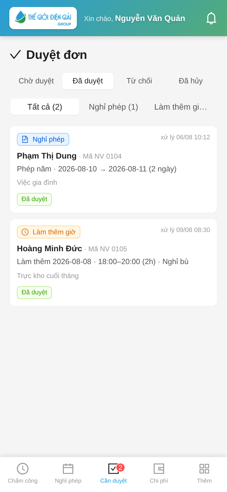

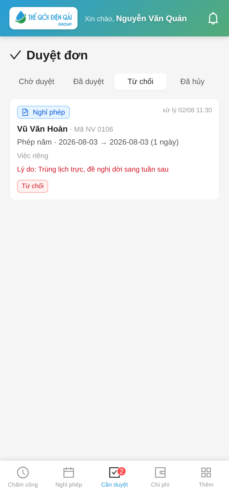
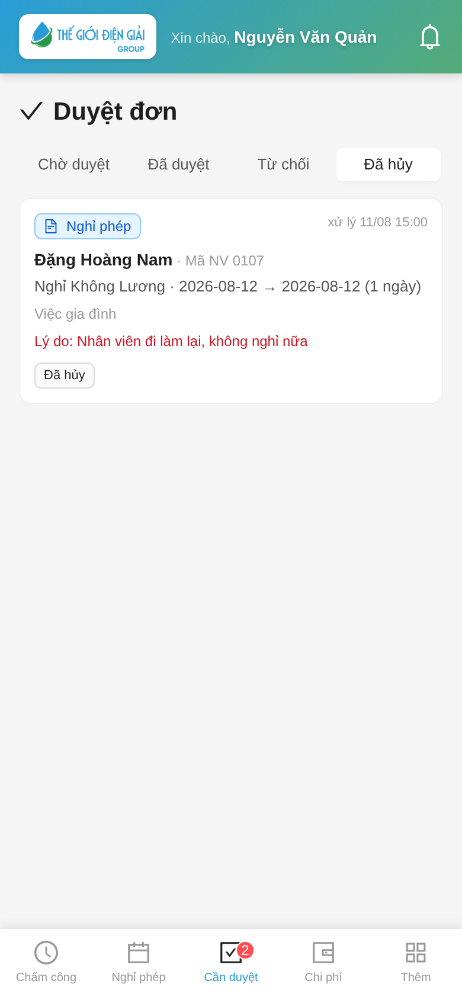

Ba tab sau là **nhật ký của riêng bạn**: chỉ hiện đơn **chính bạn** đã bấm duyệt/từ chối/huỷ,
không phải mọi đơn của công ty.

Đơn được xếp theo **trạng thái hiện tại**, không phải theo việc bạn đã bấm gì. Bạn duyệt một đơn,
sau đó HR huỷ đơn ấy → nó chuyển từ tab *Đã duyệt* sang tab **Đã hủy** của bạn, để bạn thấy đúng
tình trạng bây giờ.

Mở một đơn trong ba tab này chỉ để **xem lại** — không còn nút duyệt/từ chối, vì đơn đã xử xong:

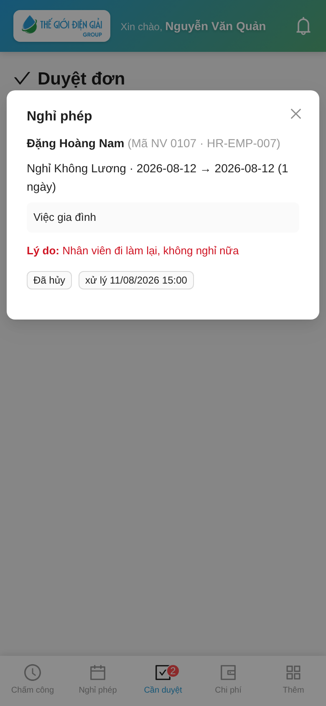

> 🕒 Mốc thời gian trên thẻ đơn ghi **ngày giờ thật** (`xử lý 11/08 15:00`), không phải "2 ngày trước" —
> để đối chiếu thẳng với lịch nghỉ, bảng công hay tin nhắn của nhân viên.

> 💡 **Huỷ duyệt đơn Làm thêm giờ** vẫn nằm ở tab **Đã duyệt** → lọc **Làm thêm giờ**.
> Xem [Duyệt làm thêm giờ](Duyet-Lam-Them.html).

---

## 5. Nhân viên nhìn thấy gì

Trong app, tab **Nghỉ phép** của nhân viên cũng chia đúng 4 nhóm đó:

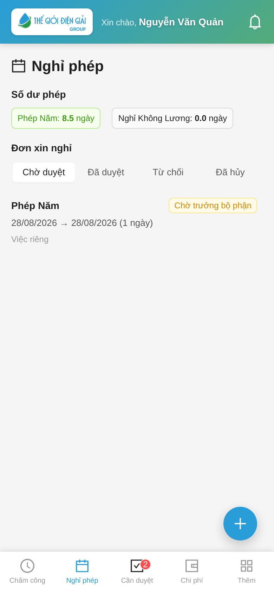
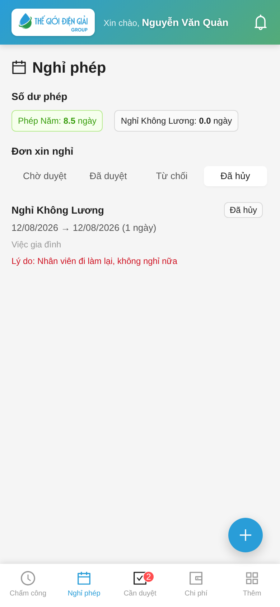

Đơn bị huỷ nằm ở tab **Đã hủy** kèm lý do, **không biến mất**. Trước đây đơn bị huỷ bị ẩn hẳn nên
nhân viên tưởng mất đơn — nay họ đọc được vì sao.

---

## 6. Vướng mắc thường gặp

**Không thấy nút Cancel trên đơn.**
Tài khoản của bạn thiếu quyền huỷ Leave Application. Nhờ quản trị cấp quyền `cancel` cho role của bạn.

**Bấm Cancel nhưng báo "You do not have permissions to cancel all linked documents".**
Lỗi cũ, đã xử lý. Nếu vẫn gặp: xoá cache trình duyệt (`Ctrl+Shift+R`) để nạp lại bản mới nhất.

**Huỷ nhầm đơn thì sao?**
Đơn đã huỷ không mở lại được. Bấm **Amend** trên đơn đã huỷ để tạo đơn mới cùng nội dung, rồi cho
chạy lại luồng duyệt.

**Nhân viên nói không nhận được thông báo.**
Kiểm tra tài khoản nhân viên đã gắn vào hồ sơ Employee chưa (ô *User ID*) — không có thì hệ thống
không biết gửi cho ai.

---

## Xem thêm

- [Duyệt nghỉ phép & nghỉ bù](Duyet-Nghi-Phep.html) — luồng duyệt 2 bước, từ chối, chuyển duyệt
- [Xin nghỉ phép & nghỉ bù](Guide-NhanVien-NghiPhep.html) — phía nhân viên
- [Kiểm tra số dư phép](Desk-HR-KiemTraPhep.html) — soi lại số dư sau khi hoàn phép
