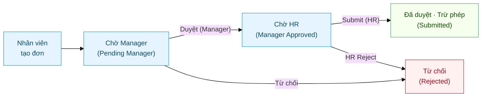
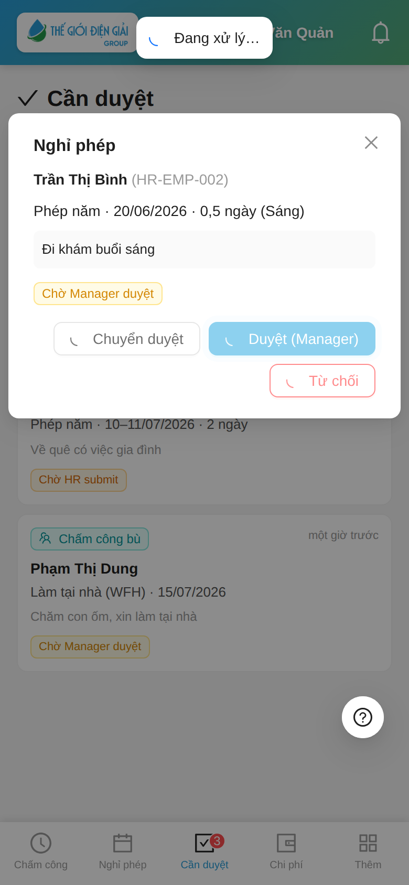
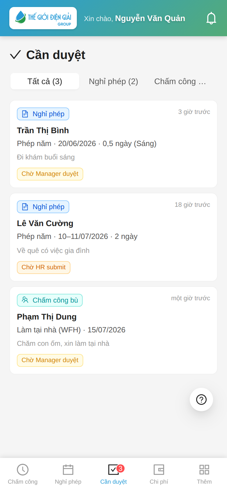
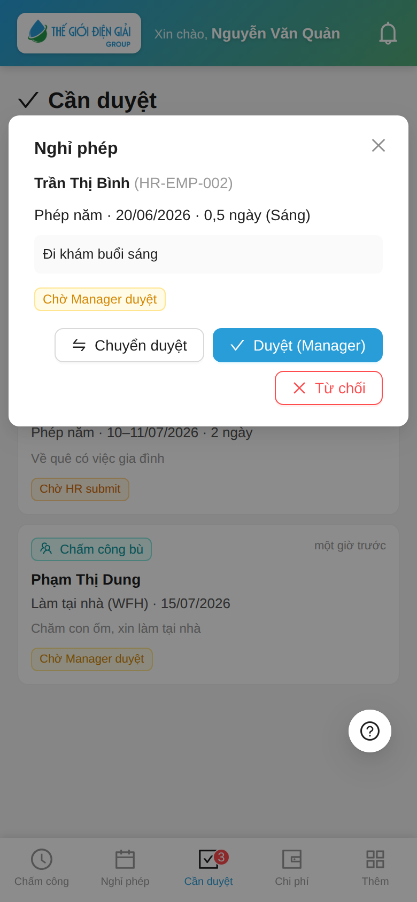
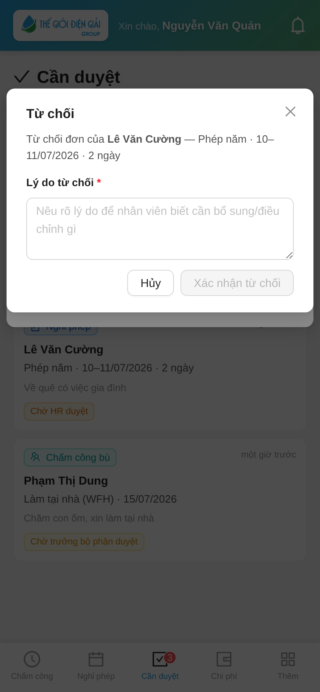
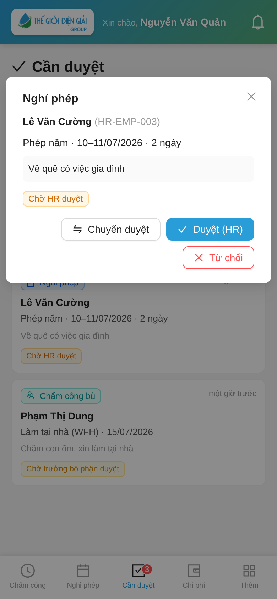
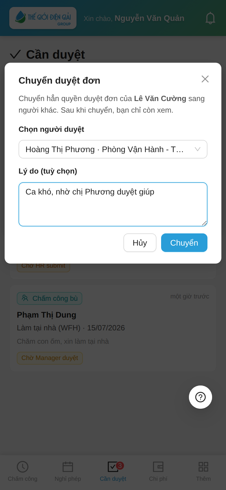
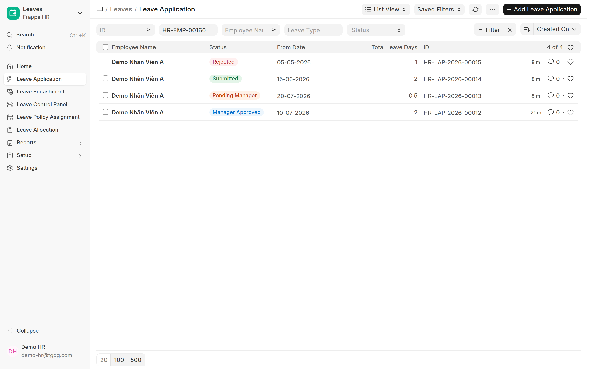

# Duyệt nghỉ phép & nghỉ bù
{: .no_toc }

**Dành cho:** Trưởng Bộ Phận (Leave Approver) · HR (HR Manager) · **Thời lượng:** ~4 phút
{: .fs-3 .text-grey-dk-000 }

> Đơn nghỉ phép chạy **workflow 2 bước: Manager → HR**. Cả hai bước đều duyệt được ngay trên
> **app điện thoại** (tab **Cần duyệt**); HR có thể duyệt thêm trên **Desk** khi cần xem chi tiết.
> Đơn **Chấm công bù / WFH** đi qua cùng inbox này nhưng chỉ **1 bước**.

  
Mục lục

{: .text-delta }
1. TOC
{:toc}

---

## 🎬 Video hướng dẫn (1 phút)

Xem nhanh cả 5 thao tác — inbox Cần duyệt, Manager duyệt bước 1, HR submit bước 2, duyệt chấm công
bù 1 bước, và chuyển duyệt ca khó (bật tiếng để nghe thuyết minh):

<video src="images/guide/duyet/duyet-don.mp4" width="260" controls playsinline poster="images/guide/duyet/duyet-don-poster.png"></video>

---

## Sơ đồ luồng duyệt

| Bước | Ai duyệt | Role | Trạng thái sau khi duyệt |
|---|---|---|---|
| **1** | Trưởng Bộ Phận / Người duyệt | `Leave Approver` | **Chờ HR** (Manager Approved) |
| **2** | HR | `HR Manager` | **Đã duyệt** (Submitted) → trừ số dư phép |

> ⚠️ Đơn **chỉ chính thức & trừ phép** sau khi **HR duyệt bước 2**. Manager duyệt xong, đơn vẫn còn "chờ".

---

## A. Duyệt trên app (tab "Cần duyệt")

Cả Manager lẫn HR đều dùng **chung một màn hình** này — nút bấm tự đổi theo bước của đơn.

> ⏳ **Bấm 1 lần rồi đợi.** Khi bấm **Duyệt / Từ chối / Chuyển duyệt**, màn hình hiện ngay
> **"Đang xử lý…"** rồi tự báo kết quả (✓ thành công). **Đừng bấm lại nhiều lần** — nếu lỡ bấm
> lại, hệ thống chỉ báo *"Đơn này đã được xử lý"* chứ **không** duyệt/từ chối hai lần.
>
> 

### A.1 — Mở tab "Cần duyệt"

Thanh dưới có tab **Cần duyệt** kèm **badge đỏ** = số đơn đang chờ bạn. Mở lên thấy danh sách
trộn **Nghỉ phép** + **Chấm công bù**, lọc nhanh bằng thanh **Tất cả / Nghỉ phép / Chấm công bù**.

> 🔔 Có đơn mới → bạn nhận **thông báo đẩy** (nếu đã bật) + badge đỏ trên tab.
> Mỗi thẻ ghi rõ **tên nhân viên · loại · ngày · số ngày · lý do** và nhãn trạng thái
> (**Chờ Manager duyệt** / **Chờ HR submit**).

### A.2 — Bước 1: Trưởng Bộ Phận duyệt

Bấm vào đơn đang **"Chờ Manager duyệt"** để xem chi tiết, rồi chọn:

- **Duyệt (Manager)** → đơn chuyển sang **Chờ HR submit** (bước 2).
- **Từ chối** → đơn bị **đóng** (Rejected).
- **Chuyển duyệt** → giao cho người khác duyệt (xem [mục A.4](#a4--chuyển-duyệt-ca-khó)).

Bấm **Từ chối** sẽ hiện hộp nhập **lý do từ chối** (kèm tên nhân viên + nội dung đơn). **Bắt buộc
nhập lý do** mới từ chối được — bỏ trống, hệ thống báo *"Vui lòng nhập lý do từ chối."* và không cho
chốt. Nhập xong bấm **Xác nhận** để chốt, hoặc **Hủy** để thôi. **Lý do được gửi cho nhân viên** kèm
thông báo (dòng *"Lý do: …"*). *(HR từ chối ở bước 2 cũng bắt buộc nhập lý do y như vậy.)*

### A.3 — Bước 2: HR duyệt

Đơn đã qua Manager hiện ở trạng thái **"Chờ HR submit"**. HR mở đơn → chọn:

- **Submit (HR)** → đơn **chính thức được duyệt** (Submitted) và **trừ số dư phép** của nhân viên.
- **Từ chối** → đơn bị đóng (Rejected) — **bắt buộc nhập lý do** như [bước Manager](#a2--bước-1-trưởng-bộ-phận-duyệt); lý do gửi cho nhân viên.
- **Chuyển duyệt** → giao cho HR khác.

> ✅ Đây là **bước cuối**. Sau khi Submit, nhân viên thấy đơn ở trạng thái "Đã duyệt" và số dư phép giảm tương ứng.

### A.4 — Chuyển duyệt (ca khó)

Đi vắng / không thuộc thẩm quyền? Mở đơn bấm **Chuyển duyệt** → chọn **người duyệt khác** (cùng quyền,
cùng phòng) + nhập **lý do** (tuỳ chọn) → **Chuyển**.

> ⚠️ **Chuyển hẳn quyền**: sau khi chuyển, bạn **chỉ còn xem**; chỉ người nhận mới duyệt được.
> Người nhận thấy đơn trong inbox của họ kèm nhãn **"Chuyển từ …"**. Khi đơn lên cấp tiếp theo
> (Manager → HR), thông tin chuyển duyệt được **reset**.

### A.5 — Chấm công bù / WFH (chỉ 1 bước)

Đơn **Làm tại nhà (WFH)** và **chấm công bù / On Duty** là **Attendance Request**, hiện chung inbox
với nhãn **"Chấm công bù"**. Khác nghỉ phép, loại này **duyệt 1 bước**:

- **Duyệt** → hệ thống **tự tạo Attendance** cho ngày đó (Work From Home / Present / Half Day).
- **Hủy** → từ chối đơn; **bắt buộc nhập lý do** (bỏ trống bị chặn) và **lý do gửi cho nhân viên** kèm thông báo.

> 👥 **Người duyệt loại này KHÁC người duyệt nghỉ phép.** Đơn chấm công bù/WFH về
> **Shift Request Approver** (gán trên Employee hoặc Department) — tách khỏi **Leave Approver**.
> Cùng một người kiêm cả hai vai thì thấy cả hai loại đơn chung inbox; tách vai thì mỗi người chỉ
> thấy loại đơn của mình. Chi tiết gán: [Cấp phép & gán người duyệt](Desk-HR-CapPhep.html).

> 💡 Muốn nhân viên thấy lựa chọn **WFH** trong app: bật `enable_wfh_mode` ở
> [HR Policy](Desk-Admin-Policy.html). Chi tiết: [WFH (kỹ thuật)](HR-WFH-Approval.html).

### A.6 — Đơn "Nghỉ bù" (sau ngày làm thêm / làm khuya)

Đơn **Nghỉ bù** là **Leave Application bình thường** (duyệt **2 bước** Quản lý → HR như phép năm),
nhưng khi duyệt cần để ý mấy điểm riêng:

- **Căn cứ duyệt = đơn Làm thêm giờ đã duyệt.** Hệ thống **tự kiểm tra**: ngày khai
  trong ô **"Ngày làm thêm để bù"** phải có [HR Overtime Request](Duyet-Lam-Them.html)
  (quy đổi **Nghỉ bù**) đã được duyệt, và mỗi ngày làm thêm chỉ bù **1 lần** — nhân viên
  không gửi được đơn "khống". Bạn chỉ cần cân nhắc **ngày nghỉ có hợp lý** không.
- **Trên app chỉ thấy Lý do**, không thấy ô ngày làm thêm — cần đối chiếu chính xác: mở đơn
  trên **Desk**, xem field **"Ngày làm thêm để bù"** (hoặc mở HR Overtime Request tương ứng).
- **Không trừ quỹ phép, không trừ lương** — số dư loại "Nghỉ bù" âm là **bình thường** (âm bao nhiêu
  = đã nghỉ bù bấy nhiêu ngày, mang tính thống kê). Đừng từ chối đơn chỉ vì "hết số dư".
- **Từ chối đơn Nghỉ bù** cũng **bắt buộc nhập lý do** (bỏ trống bị chặn) và **lý do gửi cho nhân
  viên** kèm thông báo — như mọi đơn nghỉ phép.
- **Duyệt nhầm?** HR **Cancel** đơn trên Desk — ngày công "On Leave" tự gỡ, đảo ngược sạch.

---

## B. HR duyệt trên Desk (`/app`)

Khi cần **xem chi tiết, lọc theo trạng thái, hoặc xử lý hàng loạt**, HR có thể duyệt trên Desk.
Đăng nhập `working.thegioidiengiai.com/app` bằng tài khoản role **HR Manager**.

### B.1 — Lọc đơn chờ HR

Mở `/app/leave-application` → cột **Status** hiện màu theo trạng thái workflow. Lọc **Status = Manager
Approved** để chỉ thấy đơn **đang chờ bạn duyệt**.

| Màu nhãn | Trạng thái | Ý nghĩa |
|---|---|---|
| 🟠 Pending Manager | Chờ Manager | Đang chờ Trưởng bộ phận duyệt bước 1 |
| 🔵 Manager Approved | Chờ HR | **Việc của HR** — chờ Submit bước 2 |
| 🟢 Submitted | Đã duyệt | Đã trừ phép, hoàn tất |
| 🔴 Rejected | Từ chối | Đơn bị đóng |

### B.2 — Mở đơn → duyệt

Mở đơn cần duyệt (đang **Manager Approved**) → bấm nút **Actions** (góc phải) → chọn:

- **Submit** → duyệt chính thức (= "Submit (HR)" trên app) → trừ phép.
- **HR Reject** → từ chối.

> 💡 Trạng thái workflow hiển thị ngay cạnh tên đơn ở đầu trang (vd **Manager Approved**).

---

## ⚠️ Lỗi thường gặp

| Tình huống | Cách xử |
|---|---|
| Bấm Duyệt/Từ chối **lâu không thấy gì** | Mạng chậm — màn đang hiện **"Đang xử lý…"**, **chờ vài giây**, đừng bấm lại |
| Bấm lại thấy báo **"Đơn này đã được xử lý"** | Bình thường — lần bấm trước **đã xong rồi**; kéo làm mới danh sách là đơn biến mất khỏi inbox |
| Không thấy tab **Cần duyệt** trên app | Bạn chưa được cấp quyền duyệt — báo HR thêm role/cấu hình ở **HR Approval Inbox Settings** |
| Duyệt xong (Manager) đơn **vẫn "chờ"** | Đúng — đó là **bước 1**; đơn còn chờ **HR Submit bước 2** mới trừ phép |
| Trên Desk không thấy nút **Submit / HR Reject** | Tài khoản thiếu role **HR Manager**, hoặc đơn chưa ở trạng thái **Manager Approved** |
| **Chuyển duyệt** không thấy ai để chọn | Người nhận phải có quyền duyệt **cùng cấp + cùng phòng** với nhân viên |
| Đã Submit nhưng số dư phép **không giảm** | Kiểm nhân viên đã được **cấp phép (Leave Allocation)** chưa — xem [Cấp phép](Desk-HR-CapPhep.html) |

---

## Liên quan
- 🗺️ [Hành trình một đơn nghỉ phép (NV → Manager → HR)](Hanh-Trinh-Nghi-Phep.html) — toàn cảnh, theo chân 1 đơn
- ✅ [Duyệt chấm công bù — từng phiếu & hàng loạt](Duyet-Cham-Cong-Bu.html) — Attendance Request 1 bước + bulk trên Desk
- 👤 [Nhân viên: Xin nghỉ phép](Guide-NhanVien-NghiPhep.html)
- 👔 [Trưởng Bộ Phận: Phê duyệt](Guide-TruongBoPhan-Duyet.html) · 👩‍💼 [HR: Duyệt bước HR](Desk-HR-DuyetDon.html)
- ⚙️ [Cấp phép & gán người duyệt](Desk-HR-CapPhep.html) · [Loại phép & số dư](Desk-HR-LoaiPhep.html)
- 🔧 Kỹ thuật: [Leave Setup & Workflow](HR-Leave-Setup.html) · [Attendance Request](HR-Attendance-Request.html)
