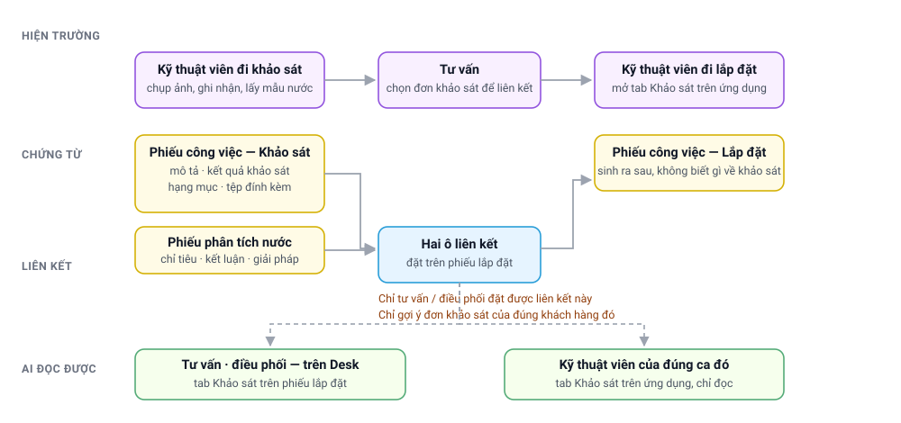
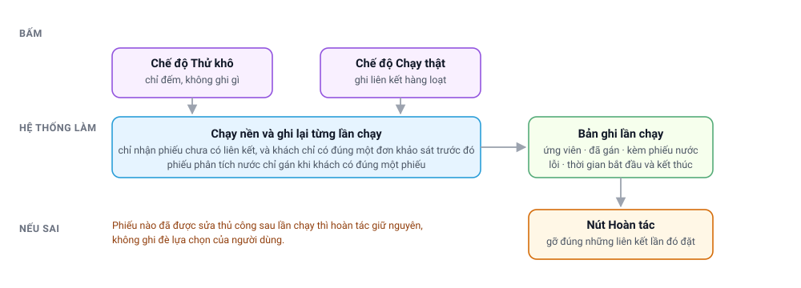

# Liên kết đơn khảo sát với đơn lắp đặt

> Đối tượng: **tư vấn**, **điều phối**, **kỹ thuật viên (KTV)**, **quản lý dịch vụ**.
> Tài liệu mô tả cách gắn một đơn khảo sát đã thực hiện trước đó vào đơn lắp đặt phát sinh sau,
> để kỹ thuật viên đi lắp xem lại được tệp đính kèm, ghi nhận hiện trường và phiếu phân tích
> nước của lần khảo sát.
>
> Tài liệu này mở rộng **[Quy trình dịch vụ hiện trường](FSMNext-Quy-Trinh-Dich-Vu.html)**.

---

## Bảng đối chiếu tên

| Trong tài liệu | Tên hệ thống |
|---|---|
| Phiếu công việc | `FS Work Order` |
| Lịch hẹn | `FS Service Appointment` |
| Loại công việc | `FS Work Type` — ở đây là `Khảo sát` và `Lắp đặt` |
| Hạng mục khảo sát | `FS WO Reference Item` |
| Phiếu phân tích nước | `Water Analysis Report` |
| Cấu hình FSMNext của Cobe | `COBE FSM Settings` |
| Nhật ký gán hàng loạt | `COBE Survey Backfill Run` |

---

## Toàn cảnh

Điều cần nắm trước tiên: **phiếu lắp đặt không tự biết đơn khảo sát nào đi trước nó.** Hệ thống
không suy ra được mối liên hệ này, vì phiếu phân tích nước lẫn đơn yêu cầu phân tích đều không
lưu số phiếu công việc. Vì vậy liên kết do **con người đặt**, và chỉ tư vấn hoặc điều phối mới
đặt được.

---

## 1. Tư vấn gắn đơn khảo sát

Trên phiếu công việc lắp đặt, ở góc phải phía trên có nhóm nút **Khảo sát**:

| Mục | Tác dụng |
|---|---|
| **Chọn WO khảo sát** | Mở hộp thoại chọn đơn khảo sát và phiếu phân tích nước |
| **Gỡ liên kết khảo sát** | Xoá liên kết hiện có; chỉ hiện khi phiếu đang có liên kết |

Hộp thoại chỉ liệt kê những đơn khảo sát **của đúng khách hàng trên phiếu lắp đặt**, chưa bị
huỷ, xếp mới nhất lên đầu, kèm ngày khảo sát và trạng thái để phân biệt.

Hệ thống gợi ý sẵn một lựa chọn, tư vấn vẫn đổi được:

| Ô | Được điền sẵn khi |
|---|---|
| Đơn khảo sát | Phiếu đã có liên kết cũ; hoặc ô **Đơn cha** đang trỏ về một đơn khảo sát; hoặc khách hàng chỉ có đúng một đơn khảo sát |
| Phiếu phân tích nước | Khách hàng chỉ có đúng một phiếu |

Khách có nhiều đơn khảo sát hoặc nhiều phiếu phân tích nước thì ô để trống, tư vấn tự chọn.

Sau khi lưu, phiếu lắp đặt có thêm tab **Khảo sát**.

### Phiếu gắn bằng ô Đơn cha từ trước

Trước khi có nút này, một số phiếu lắp đặt đã được gắn đơn khảo sát qua ô **Đơn cha**
(`Parent Work Order`). Những phiếu đó **vẫn xem được tab Khảo sát**, không cần gắn lại; tab ghi
thêm dòng *Nguồn liên kết: suy ra từ ô Đơn cha* để người đọc biết đây không phải lựa chọn của tư
vấn.

Hai ô này khác nhau về mục đích, đừng dùng lẫn:

| Ô | Dùng để làm gì |
|---|---|
| **Đơn cha** (`Parent Work Order`) | Quan hệ vận hành: gom ca cho điều phối, phạm vi đóng phiếu, quy nghĩa vụ vật tư |
| **WO khảo sát** (nút *Khảo sát*) | Chỉ để đọc lại hồ sơ khảo sát; cố ý không tác động tới điều phối hay kho |

Cần đọc lại hồ sơ khảo sát thì dùng nút **Khảo sát**. Đừng điền ô **Đơn cha** chỉ vì mục đích
đó — ô ấy kéo theo cách hệ thống gom ca và tính nghĩa vụ vật tư của phiếu.

### Hệ thống từ chối trong những trường hợp nào

| Tình huống | Hệ thống báo |
|---|---|
| Chọn phiếu không thuộc loại `Khảo sát` | Nêu rõ loại công việc thật của phiếu đó |
| Chọn đơn khảo sát của khách hàng khác | Nêu tên khách hàng của đơn khảo sát |
| Chọn phiếu phân tích nước của khách hàng khác | Tương tự |
| Phiếu lắp đặt đã huỷ | Không cho đổi liên kết |
| Người bấm không phải tư vấn / điều phối | Từ chối, kể cả khi gọi thẳng qua API |

Ô liên kết để ở chế độ chỉ đọc trên giao diện, nhưng các luật trên được kiểm ở máy chủ chứ không
dựa vào giao diện — sửa bằng đường khác cũng không lọt.

---

## 2. Tab Khảo sát hiển thị gì

Cùng một nội dung trên Desk và trên ứng dụng kỹ thuật viên:

| Khối | Nội dung |
|---|---|
| **Đơn khảo sát** | Số phiếu, ngày khảo sát, trạng thái. Nếu phiếu khảo sát đã bị huỷ sau khi liên kết, có thêm dòng *Chứng từ: ĐÃ HUỶ* |
| **Mô tả** | Phần mô tả của đơn khảo sát |
| **Kết quả khảo sát** | Phần tổng kết sau khi làm việc của đơn khảo sát |
| **Hạng mục khảo sát** | Bảng mã hàng và tên hàng đã ghi nhận khi khảo sát |
| **Đính kèm khi khảo sát** | Ảnh và tệp gắn trên đơn khảo sát và các dòng của nó; bấm vào ảnh để phóng to |
| **Phiếu phân tích nước** | Số phiếu, tình trạng phiếu, ngày báo cáo, ngày nhận mẫu, loại nước, mô tả mẫu |
| **Kết quả phân tích** | Bảng chỉ tiêu · kết quả · đơn vị · định mức cho phép |
| **Vấn đề · Kết luận · Giải pháp** | Phần nhận định trên phiếu phân tích nước |
| **Sản phẩm gợi ý** | Bảng sản phẩm đề xuất kèm theo phiếu |

Khối nào không có dữ liệu thì không hiện, nên tab luôn gọn.

**Tình trạng phiếu phân tích nước** được ghi rõ khi phiếu chưa được duyệt (*Nháp*) hoặc đã bị huỷ
(*ĐÃ HUỶ*). Đây là điểm cần chú ý khi đọc: một phiếu còn nháp là số liệu chưa chốt.

---

## 3. Kỹ thuật viên xem ở đâu

Trên ứng dụng kỹ thuật viên, mở lịch hẹn của công việc lắp đặt, tab **Khảo sát** nằm cạnh các
tab sẵn có. Tab chỉ xuất hiện khi phiếu công việc đã được liên kết, và nội dung là **chỉ đọc** —
kỹ thuật viên không đổi được liên kết.

Về quyền xem: nội dung khảo sát bao gồm cả phiếu phân tích nước của khách hàng, nên hệ thống chỉ
mở cho tư vấn, điều phối, và **kỹ thuật viên được phân vào đúng lịch hẹn đó**. Kỹ thuật viên
khác mở phiếu công việc không phải của mình sẽ không đọc được nội dung khảo sát.

---

## 4. Gán hàng loạt cho phiếu cũ

Những phiếu lắp đặt đã tạo từ trước không có liên kết. Thay vì bắt tư vấn mở từng phiếu, có công
cụ gán hàng loạt ở **COBE FSM Settings → nhóm nút Khảo sát**:

| Mục | Tác dụng |
|---|---|
| **Gán liên kết WO khảo sát** | Mở hộp thoại chọn loại công việc và chế độ chạy |
| **Các lần đã chạy** | Mở danh sách nhật ký các lần chạy |

Công cụ chỉ nhận những phiếu **chưa có liên kết** và khách hàng chỉ có **đúng một** đơn khảo sát
tạo trước đó — trường hợp không thể nhầm. Khách có nhiều đơn khảo sát thì công cụ bỏ qua, để tư
vấn tự chọn. Phiếu phân tích nước cũng chỉ được gán khi khách hàng có đúng một phiếu còn hiệu
lực.

**Trình tự nên làm:**

1. Chạy chế độ **Thử khô** trước. Hệ thống chỉ đếm, không ghi gì.
2. Mở bản ghi lần chạy để xem số ứng viên và số kèm được phiếu nước.
3. Ưng ý thì chạy lại ở chế độ **Chạy thật**.
4. Nếu kết quả không như mong muốn: mở đúng bản ghi lần chạy đó, bấm **Hoàn tác**.

Việc chạy ở chế độ nền, nên bấm xong có thể đóng trang; kết quả nằm ở bản ghi lần chạy. Hoàn tác
chỉ gỡ những liên kết do chính lần chạy đó đặt, và **giữ nguyên** phiếu nào đã được người dùng
sửa thủ công sau đó.

Công cụ này dành cho quản trị FSM. Tư vấn vẫn gắn được từng phiếu như mục 1, nhưng không chạy
được hàng loạt.

---

## 5. Vì sao nhiều phiếu lắp đặt không có tab Khảo sát

Phần lớn đơn lắp đặt không đi qua bước khảo sát, nên không có gì để liên kết. Đây là đặc thù
nghiệp vụ chứ không phải lỗi. Tab chỉ xuất hiện ở những phiếu đã được liên kết.

Khi khách hàng của đơn lắp đặt có đơn khảo sát nhưng hộp thoại vẫn không liệt kê, hãy kiểm tra
theo thứ tự:

| Kiểm tra | Vì sao |
|---|---|
| Phiếu lắp đặt đã điền khách hàng chưa | Không có khách hàng thì không đối chiếu được |
| Đơn khảo sát có đúng khách hàng đó không | Khách được tạo lại thì hai phiếu thuộc hai mã khách khác nhau |
| Đơn khảo sát có bị huỷ không | Phiếu đã huỷ không được gợi ý |
| Loại công việc của đơn khảo sát | Phải đúng loại `Khảo sát` |
| Phiếu có sẵn ô **Đơn cha** trỏ về đơn khảo sát | Tab đã hiện sẵn rồi, không cần gắn thêm |

---

## Câu hỏi thường gặp

**Một đơn lắp đặt gắn được mấy đơn khảo sát?**
Một. Nếu khách có nhiều lần khảo sát, tư vấn chọn lần đúng với công trình đang lắp.

**Một đơn khảo sát dùng cho nhiều đơn lắp đặt được không?**
Được. Nhiều phiếu lắp đặt cùng trỏ về một đơn khảo sát là bình thường.

**Kỹ thuật viên gắn liên kết được không?**
Không. Kỹ thuật viên chỉ đọc. Việc gắn thuộc tư vấn và điều phối.

**Gỡ liên kết có mất dữ liệu khảo sát không?**
Không. Gỡ liên kết chỉ xoá mối nối; đơn khảo sát và phiếu phân tích nước vẫn nguyên.

**Phiếu phân tích nước đang nháp có gắn được không?**
Được, nhưng tab sẽ ghi rõ *Tình trạng phiếu: Nháp* để người đọc biết số liệu chưa chốt.

**Phiếu của tôi đã có ô Đơn cha là đơn khảo sát, có phải gắn lại không?**
Không. Tab Khảo sát tự đọc luôn ô đó. Chỉ gắn bằng nút **Khảo sát** khi muốn trỏ sang một đơn
khảo sát khác với ô Đơn cha, hoặc muốn gắn thêm phiếu phân tích nước.

**Đang xem tab Khảo sát thì tư vấn gỡ liên kết, ứng dụng có lỗi không?**
Không. Lần mở sau tab biến mất và ứng dụng quay về tab Work Order.

---

## Liên quan

- **[Quy trình dịch vụ hiện trường (FSMNext)](FSMNext-Quy-Trinh-Dich-Vu.html)** — vòng đời phiếu công việc và lịch hẹn.
- **[Trả vật tư về kho (FSMNext)](FSMNext-Tra-Vat-Tu.html)** — nghĩa vụ trả hàng sau khi lắp đặt.
- **[Tự xử lý sự cố dịch vụ (FSMNext)](FSMNext-Xu-Ly-Su-Co.html)** — khi phiếu công việc không lên đúng trạng thái.
