# Quy trình dịch vụ hiện trường — Phiếu công việc & Lịch hẹn (FSMNext)

> Đối tượng: **kỹ thuật viên (KTV)**, **điều phối / CSKH**, **kho**, **kế toán**, **quản lý dịch vụ**.
> Tài liệu mô tả vòng đời và thao tác của các phiếu FSMNext: **Phiếu công việc (Work Order)**,
> **Lịch hẹn dịch vụ (Service Appointment)** và mối liên hệ với **Đơn bán hàng (Sales Order)** —
> gồm cả **trả vật tư, thu tiền hiện trường, huỷ phiếu, tạo lại phiếu**.
>
> 🔧 Khi phiếu "kẹt" không hoàn thành / không huỷ được, xem tài liệu song hành
> **[Tự xử lý sự cố dịch vụ](FSMNext-Xu-Ly-Su-Co.html)** (mở đầu bằng đúng tình huống *"WO vẫn New dù SO/SA đã Completed"*).

---

## Ba loại phiếu & vai trò

| Phiếu | Tên hệ thống | Ai dùng | Vai trò |
|---|---|---|---|
| **Đơn bán hàng** | Sales Order (SO) | Sales / CSKH | Đơn hàng hoá + dịch vụ đã bán; nguồn công nợ & xuất kho |
| **Phiếu công việc** | FS Work Order (WO) | Điều phối / KTV | Hồ sơ trung tâm của một vụ việc kỹ thuật (lắp đặt, bảo trì, sự cố) |
| **Lịch hẹn dịch vụ** | FS Service Appointment (SA) | Điều phối / KTV | Một buổi KTV tới hiện trường (check-in → làm việc → check-out) |

> ⚠️ **Điểm cốt lõi cần nhớ:** **WO và SA có trạng thái ĐỘC LẬP với nhau, và độc lập với SO.**
> Hoàn thành SA **không** tự đẩy WO sang bước tiếp; SO Completed **không** tự hoàn thành WO.
> Đây là thiết kế cố ý — hiểu điều này giải thích hầu hết các ca "phiếu không tự chạy".

---

## Sơ đồ tổng quan một vụ việc

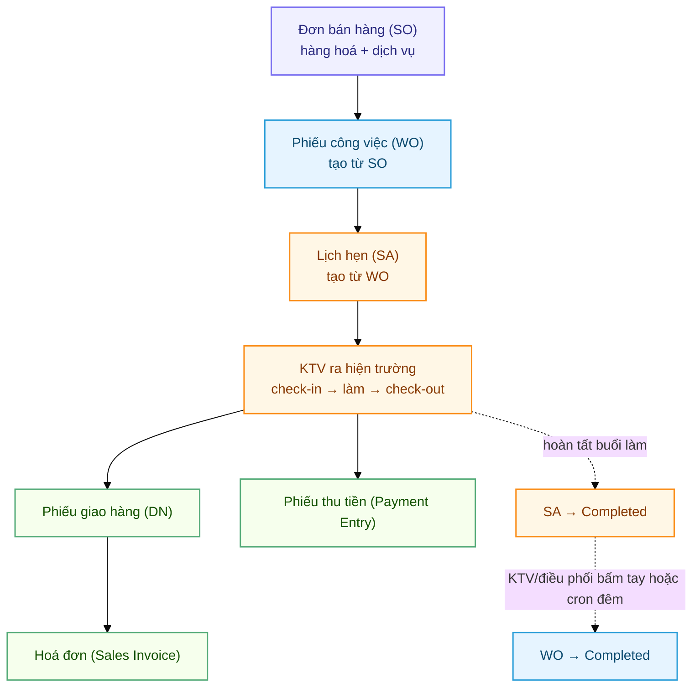

---

## Mục lục

1. [Vòng đời Phiếu công việc (WO)](#1-vòng-đời-phiếu-công-việc-wo)
2. [Vòng đời Lịch hẹn dịch vụ (SA)](#2-vòng-đời-lịch-hẹn-dịch-vụ-sa)
3. [Tạo phiếu: WO từ SO, SA từ WO](#3-tạo-phiếu-wo-từ-so-sa-từ-wo)
4. [Hoàn thành SA](#4-hoàn-thành-sa)
5. [Hoàn thành WO — 6 điều kiện](#5-hoàn-thành-wo--6-điều-kiện)
6. [Trả vật tư / hoàn hàng](#6-trả-vật-tư--hoàn-hàng)
7. [Thu tiền tại hiện trường](#7-thu-tiền-tại-hiện-trường)
8. [Huỷ phiếu — đúng thứ tự](#8-huỷ-phiếu--đúng-thứ-tự)
9. [Tạo lại / mở lại phiếu](#9-tạo-lại--mở-lại-phiếu)
10. [Cấu hình quyết định hành vi (FS Settings)](#10-cấu-hình-quyết-định-hành-vi-fs-settings)

---

## 1. Vòng đời Phiếu công việc (WO)

Danh sách Phiếu công việc — cột **Status** cho biết phiếu đang ở đâu:

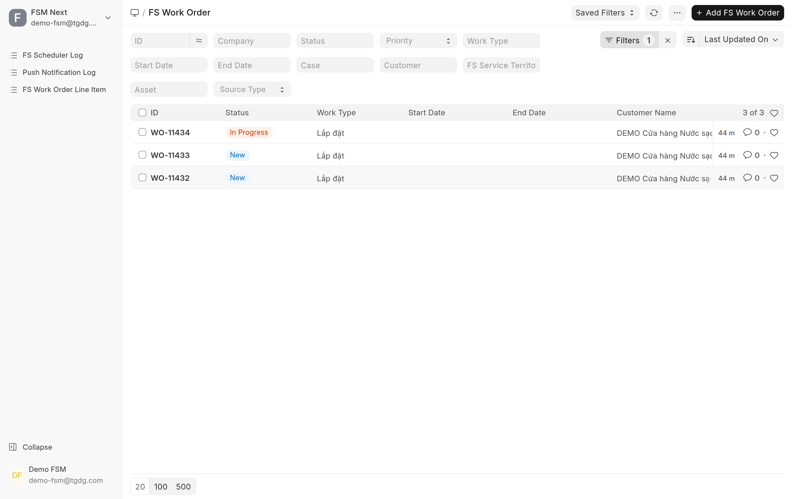

Mở một phiếu ra, trạng thái nằm ở ô **Status** và **Status Category**; các nút thao tác nằm góc trên bên phải (**Status**, **Create**, **Actions**):

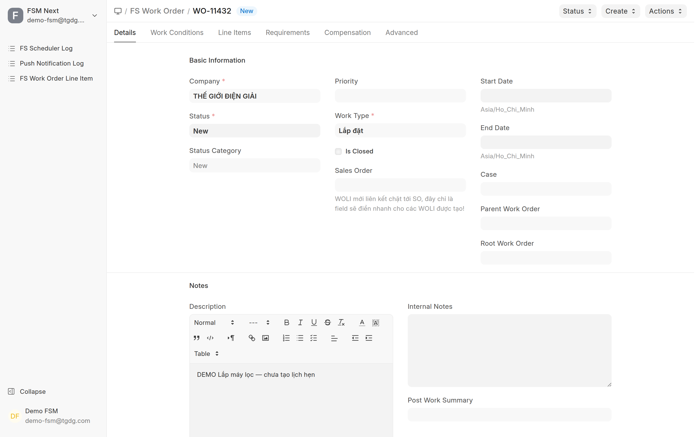

WO có **7 nhóm trạng thái** (status category). Chuyển giữa các nhóm phải theo đúng luồng cho phép (hệ thống chặn bước nhảy sai).

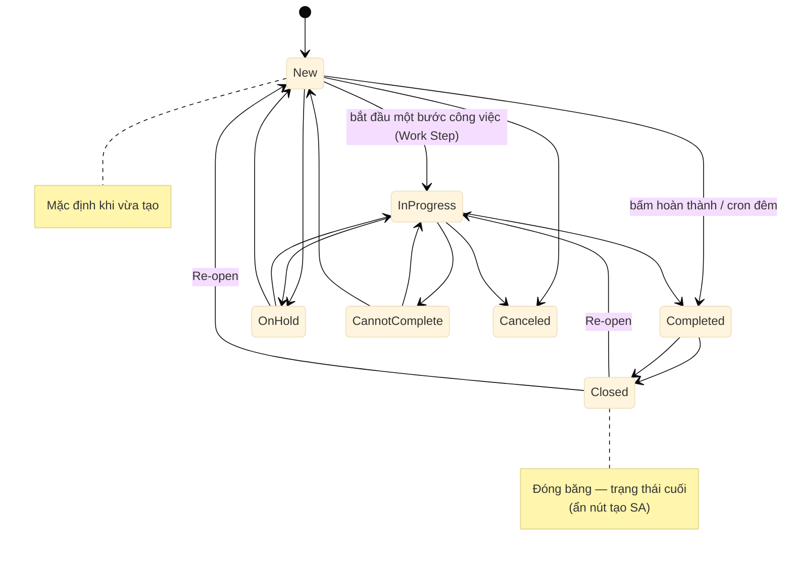

| Nhóm trạng thái | Ý nghĩa | Ghi chú vận hành |
|---|---|---|
| **New** | Vừa tạo, chưa bắt đầu | Mặc định. Tự lên **In Progress** khi KTV **bắt đầu một bước công việc (Work Step)** — *không phải* khi làm SA |
| **In Progress** | Đang thực hiện | Ghi nhận thời điểm bắt đầu thực tế |
| **On Hold** | Tạm dừng | ⚠️ Cron đêm **bỏ qua** On Hold — muốn hoàn thành phải chuyển về In Progress trước |
| **Completed** | Hoàn thành | Ghi nhận thời điểm kết thúc; từ đây chỉ đi tiếp được sang Closed |
| **Cannot Complete** | Không thể hoàn thành (lý do hiện trường) | Có thể mở lại về New/In Progress |
| **Closed** | Đóng băng | Trạng thái cuối; ẩn nút tạo SA. Dùng nút **Re-open** để mở lại |
| **Canceled** | Đã huỷ (docstatus 2) | Xem [§8](#8-huỷ-phiếu--đúng-thứ-tự) |

**Nút trên Desk** (mở một WO):
- **Close** (nhóm *Status*) — đóng WO. Không đóng được nếu đang Closed/Canceled.
- **Re-open** (nhóm *Status*) — chỉ hiện khi WO đang **Closed**; khôi phục lại đúng trạng thái trước khi đóng.
- **Service Appointment** (nhóm *Create*) — tạo SA mới gắn vào WO này (ẩn khi WO đã Closed).
- Đổi trạng thái khác: sửa trực tiếp trường **Work Order Status** rồi **Save** (hệ thống chạy kiểm tra điều kiện).

**Phía KTV (app mobile):** nút **Hoàn thành** gọi kiểm tra điều kiện; nếu chưa đủ, app hiện **danh sách lý do** ngay trên màn hình (cùng nội dung với lỗi trên Desk).

---

## 2. Vòng đời Lịch hẹn dịch vụ (SA)

Một Lịch hẹn đã hoàn thành. Chú ý ô **Parent Record** — Lịch hẹn luôn gắn về một Phiếu công việc cha:

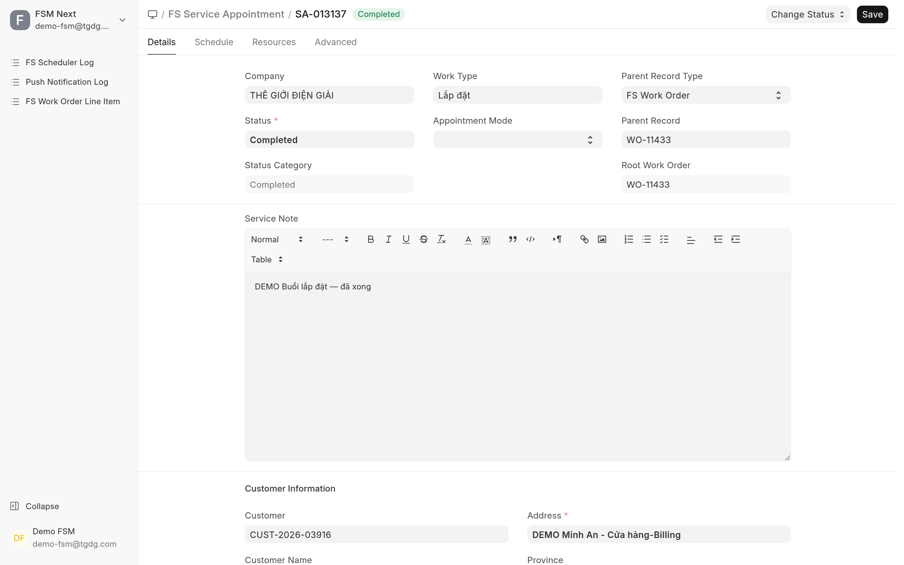

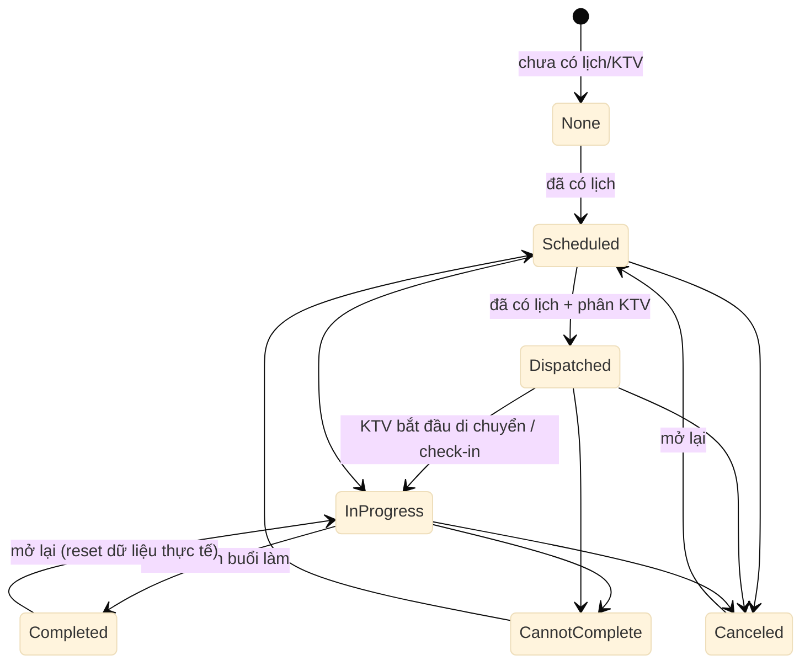

- SA **tự động** nhảy trạng thái sớm: có lịch → **Scheduled**; có lịch + phân KTV → **Dispatched**.
- KTV **bắt đầu di chuyển** hoặc **check-in** → SA tự lên **In Progress** (ghi *Actual Start*).
- SA chỉ **Completed** khi: đã có *Actual Start*, **mọi KTV đã Check-out** (hoặc bị huỷ khỏi lịch), và đủ yêu cầu theo *Work Type* (ví dụ **bắt buộc có ảnh**).
- Huỷ SA (đổi sang **Canceled**) **bắt buộc nhập Lý do huỷ**.

**Chuỗi thao tác của KTV tại hiện trường:**

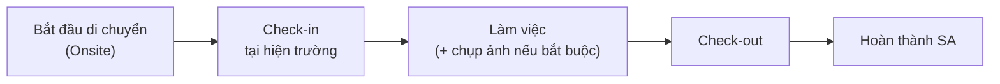

**Nút trên Desk (một SA):**
- Nhóm **Change Status** — hệ thống hiện đúng các trạng thái được phép đi tiếp; chọn *Canceled* sẽ hỏi **Lý do huỷ**.

  Ví dụ Lịch hẹn đã **Completed** thì lựa chọn duy nhất là quay về *In Progress*. Để ý 2 ô **Parent Record Type / Parent Record** — đây là chỗ Lịch hẹn gắn về Phiếu công việc cha:

  

- Bảng KTV (Assigned Resource): action **Cancel** một KTV → mở hộp thoại phân bổ lại **% đóng góp** (tổng phải đúng **100%**) và thêm KTV thay thế.

> 🔒 **Khoá theo trạng thái:** khi SA ở **Completed / Cannot Complete / Canceled** thì không đổi được KTV; khi ở **In Progress** trở đi thì không đổi được lịch. (Ngưỡng khoá cấu hình trong FS Settings — xem [§10](#10-cấu-hình-quyết-định-hành-vi-fs-settings).)

---

## 3. Tạo phiếu: WO từ SO, SA từ WO

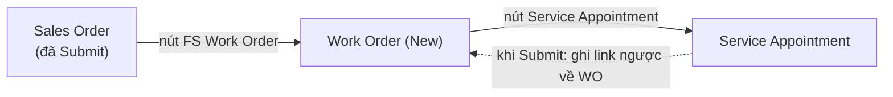

- **Tạo WO từ SO:** mở SO (đã Submit) → nút **FS Work Order** (nhóm *Create*). Hệ thống tự điền công ty, khách hàng, địa chỉ, liên hệ, ngày bắt đầu/kết thúc; WO ở trạng thái **New**.
- **Tạo SA từ WO:** mở WO (chưa Closed) → nút **Service Appointment**. SA mới tự gắn về WO qua trường liên kết cha (*parent_record*). Khi SA được **Submit**, hệ thống ghi tên SA vào trường **service_appointment** của WO.
- **WO không tự sinh từ SO**, và **SA không tự sinh từ WO** — đều do người dùng bấm tạo. Vì vậy một SO có thể có 0, 1 hay nhiều WO; một WO có thể có nhiều SA.

> ℹ️ FSMNext **không có** nút "Nhân bản/Duplicate" riêng cho WO/SA. Để "tạo lại" một phiếu đã huỷ, xem [§9](#9-tạo-lại--mở-lại-phiếu).

---

## 4. Hoàn thành SA

Hệ thống chặn **Completed** nếu còn một trong các vướng mắc sau (hiện nguyên văn trên cả Desk lẫn app KTV):

| Điều kiện | Thông báo khi thiếu |
|---|---|
| SA phải đang **In Progress** | *"...must transition to In Progress before completing"* |
| Đã có **Actual Start** (đã bắt đầu) | *"Cannot complete: no Actual Start (SA not started)"* |
| **Mọi KTV đã Check-out** hoặc bị huỷ khỏi lịch | *"...all resources must be Checked-out or Canceled. Pending: ..."* |
| Đủ yêu cầu theo Work Type (vd **ảnh**) | *"...no photo attached (Work Type requires Photo)"* |

> Huỷ SA thì bắt buộc **Cancellation Reason** — nếu bỏ trống: *"Cancellation Reason is required before canceling"*.

---

## 5. Hoàn thành WO — 6 điều kiện

WO chuyển sang **Completed** qua **một trong hai đường**, và **cả hai** đều phải vượt qua **cùng một bộ điều kiện** dưới đây:

- **Đường 1 — thủ công:** người dùng đổi trạng thái WO sang Completed (Desk) hoặc KTV bấm **Hoàn thành** (app).
- **Đường 2 — tự động (cron chạy đêm):** job **Auto Complete Work Orders** quét WO đang **New/In Progress**, đủ điều kiện thì hoàn thành, và **ghi kết quả vào FS Scheduler Log** (`Completed` / `Skipped` + lý do / `Failed`).

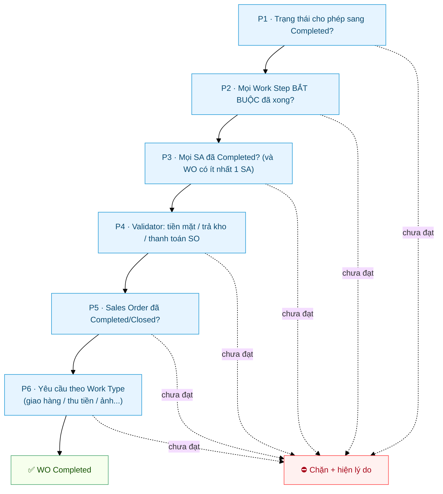

| # | Điều kiện | Bật/tắt (mặc định) |
|---|---|---|
| **P1** | Trạng thái hiện tại phải cho phép chuyển sang Completed | Luôn kiểm tra |
| **P2** | Mọi **Work Step bắt buộc** đã Completed / N.A / Cannot Complete | Luôn kiểm tra (nếu WO có Work Step) |
| **P3** | Mọi **SA** đã Completed/Cannot Complete/Canceled; **WO phải có ít nhất 1 SA** | `wo_require_sa_complete` — **BẬT** |
| **P4** | Thu-trả **tiền mặt** khớp / **trả kho** đủ / **SO thanh toán** đủ | 3 cờ riêng (xem [§10](#10-cấu-hình-quyết-định-hành-vi-fs-settings)) |
| **P5** | Mọi **Sales Order** liên kết ở Completed/Closed | `wo_require_so_complete` — **TẮT** |
| **P6** | Yêu cầu riêng theo **Work Type** (giao hàng / thu tiền / ảnh...) | Theo cấu hình từng Work Type |

Chính màn hình cấu hình cũng liệt kê đúng bộ điều kiện này (**FSM Settings → tab Operations**):

> ⏳ **Cron còn có "thời gian ân hạn" (grace period)** tính từ SA cuối cùng — WO chưa đủ số ngày này thì cron **bỏ qua** (ghi *"Grace period: x/n days"* vào Scheduler Log), kể cả khi đã đủ mọi điều kiện khác. Mặc định gốc là 3 ngày; **hệ thống hiện đặt 2 ngày** — số thật xem ở ô *Grace Days* trong ảnh trên.

**Nếu bị chặn, hệ thống nói rõ thiếu gì:**

> 🔧 Gặp cảnh "SA/SO xong rồi mà WO vẫn New"? Xem **[Tự xử lý sự cố §1](FSMNext-Xu-Ly-Su-Co.html#1--wo-vẫn-new-dù-đơn-hàng-và-lịch-hẹn-đã-xong)** — có quy trình 6 bước kèm ảnh.

---

## 6. Trả vật tư / hoàn hàng

Vật tư KTV mang đi được quản lý qua **kho riêng của từng KTV**. Hàng dư / hàng thu hồi phải **trả về kho** bằng **Phiếu chuyển kho (Stock Entry — Material Transfer)**.

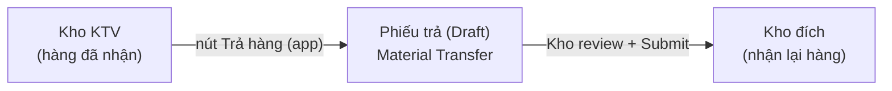

- **KTV tạo phiếu trả** trên app (*Trả hàng / Return Materials*): tạo Phiếu chuyển kho **ở trạng thái Draft** — **kho** kiểm tra rồi mới **Submit**.
- Chỉ trả được **từ kho của chính mình**, **kho đích cùng công ty**, và **không vượt số lượng cần trả**.
- Phiếu trả còn **Draft** thì KTV **xoá được**; đã Submit thì phải huỷ theo quy trình kho.
- **Xuất tiêu hao** vật tư (dùng hẳn tại hiện trường) dùng **Phiếu xuất vật tư (Material Issue)** — hệ thống kiểm tra tồn kho và danh mục vật tư được phép.

> 🔧 Nếu bật cờ **kiểm tra trả kho khi hoàn thành WO** (`validate_stock_return_on_wo_complete`), WO sẽ **bị chặn** cho tới khi trả đủ, kèm thông báo *"Không thể hoàn thành WO - Chưa trả kho đủ: SO ... thiếu ..."*.
>
> ⚠️ **Huỷ WO KHÔNG tự trả kho.** Hàng đã nhận vẫn phải trả tay bằng Phiếu chuyển kho.

---

## 7. Thu tiền tại hiện trường

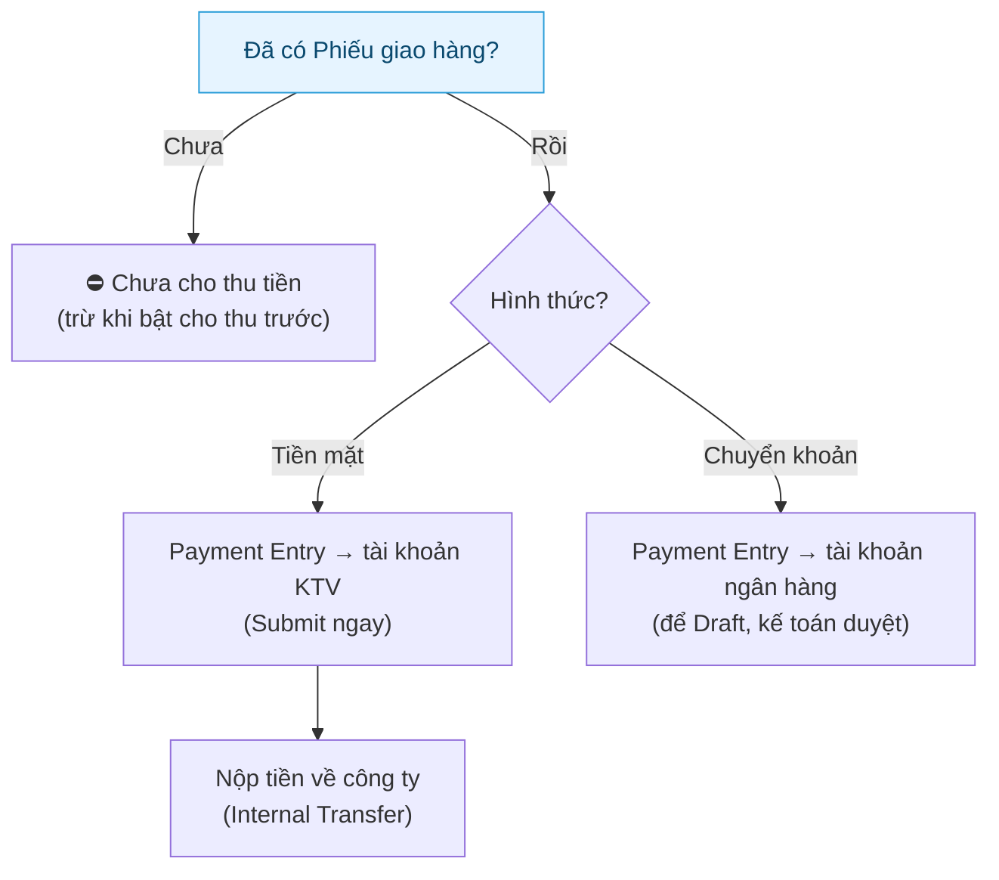

- **Bắt buộc có Phiếu giao hàng trước khi thu tiền** (trừ khi bật `allow_advance_payment`): *"Chưa tạo phiếu giao hàng cho ... Vui lòng tạo phiếu giao hàng trước khi thanh toán."*
- **Tiền mặt:** ghi vào **tài khoản thanh toán của KTV** và Submit ngay. Sau đó KTV phải **nộp về công ty** bằng phiếu **Internal Transfer** (hệ thống chặn nộp trùng).
- **Chuyển khoản:** ghi vào tài khoản ngân hàng, để **Draft** cho kế toán duyệt.
- **Ràng buộc hoàn thành WO liên quan tiền:**
  - `validate_so_payment_on_wo_complete` (**BẬT mặc định**): SO còn công nợ thì chặn — *"Không thể hoàn thành WO - SO chưa thanh toán đủ: SO ... còn nợ ..."*.
  - `validate_cash_payment_on_wo_complete` (tắt mặc định): thu tiền mặt mà chưa nộp về công ty thì chặn.

---

## 8. Huỷ phiếu — đúng thứ tự

Các phiếu **khoá lẫn nhau** để tránh huỷ nhầm gây lệch dữ liệu. Luôn huỷ **từ trong ra ngoài**:

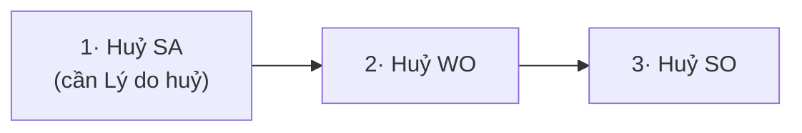

| Huỷ | Bị chặn khi | Thông báo |
|---|---|---|
| **SO** | Còn WO hoặc WO Line Item liên kết (chưa huỷ) | *"Cannot cancel this Sales Order because it is linked to FS Work Order ..."* |
| **WO** | Còn SA liên kết (chưa huỷ) | *"Cannot cancel this Work Order because it is linked to Service Appointment ..."* |
| **SA** | Đang ở **Completed / Cannot Complete / Canceled** | *"Cannot hủy Service Appointment when in status ... Change status first."* |

- Huỷ **SA** đang ở trạng thái khoá: đưa về trạng thái không khoá trước (ví dụ In Progress → rồi Cancel), hoặc đổi Change Status sang Canceled kèm lý do.
- Huỷ **WO**: mọi dòng vật tư (WOLI) chưa Closed/Canceled sẽ tự chuyển Canceled — nhưng **kho không tự hoàn**, phải trả tay ([§6](#6-trả-vật-tư--hoàn-hàng)).
- **Phiếu thu (PE)** và **Phiếu xuất vật tư (MI)** trên app chỉ huỷ được **trong ít phút đầu** (mặc định 3 phút); PE đã có phiếu nộp tiền đối ứng thì không huỷ được.

---

## 9. Tạo lại / mở lại phiếu

FSMNext **không có nút "Nhân bản"** riêng. Có 3 cách xử lý tuỳ tình huống:

| Tình huống | Cách làm |
|---|---|
| WO đã **Closed** nhưng cần làm tiếp | Mở WO → nút **Re-open** (khôi phục đúng trạng thái trước khi đóng) |
| SA đã **Completed** nhưng cần sửa | Change Status **Completed → In Progress** (dữ liệu thực tế được giữ) |
| SA đã **Canceled / Cannot Complete** cần làm lại | Change Status về **Scheduled/Dispatched** → **reset** toàn bộ dữ liệu thực tế (check-in/out, giờ) và KTV về "Assigned" để làm lại từ đầu |
| SA cũ đã huỷ, cần **lịch mới** cho cùng WO | Mở WO → nút **Service Appointment** tạo SA mới (tự gắn về WO cũ) |
| Phiếu đã **Cancel (docstatus 2)** cần bản mới | Dùng cơ chế **Amend** chuẩn của hệ thống (mở bản đã huỷ → *Amend* → tạo bản nháp mới) |

> ⚠️ Mở lại SA từ Canceled/Cannot Complete sẽ **xoá sạch dữ liệu check-in/check-out cũ** — KTV phải check-in lại. Cân nhắc trước khi mở lại thay vì tạo SA mới.

---

## 10. Cấu hình quyết định hành vi (FS Settings)

Các cờ trong **FSM Settings** (Single doctype) quyết định phiếu "chặt" hay "lỏng". Quản trị viên chỉnh ở đây; KTV/điều phối chỉ cần biết để hiểu vì sao hệ thống chặn.

| Cờ | Mặc định | Tác dụng |
|---|---|---|
| `wo_auto_complete_enabled` | **BẬT** | Cho cron đêm tự hoàn thành WO đủ điều kiện |
| `wo_auto_complete_grace_days` | **3** | Số ngày chờ (từ SA cuối) trước khi cron đụng tới WO |
| `wo_require_sa_complete` | **BẬT** | Bắt mọi SA hoàn tất mới cho hoàn thành WO (và WO phải có ≥1 SA) |
| `wo_require_so_complete` | **TẮT** | Bắt SO Completed/Closed mới cho hoàn thành WO |
| `validate_so_payment_on_wo_complete` | **BẬT** | Bắt SO hết công nợ mới cho hoàn thành WO |
| `validate_cash_payment_on_wo_complete` | **TẮT** | Bắt thu-trả tiền mặt khớp mới cho hoàn thành WO |
| `validate_stock_return_on_wo_complete` | **TẮT** | Bắt trả kho đủ mới cho hoàn thành WO |
| `sa_auto_complete_enabled` | **TẮT** | Cron tự hoàn thành SA |
| `sa_locked_status_categories` | Completed, Cannot Complete, Canceled | Trạng thái SA khoá đổi KTV / chặn huỷ-xoá |
| `sa_schedule_locked_categories` | In Progress, Completed, Cannot Complete, Canceled | Trạng thái SA khoá đổi lịch |
| `allow_advance_payment` | **TẮT** | Cho thu tiền trước khi có Phiếu giao hàng |
| `allow_si_without_full_payment` | **TẮT** | Cho tạo Hoá đơn khi chưa thu đủ 100% |
| `pe_cancel_max_minutes` / `se_cancel_max_minutes` | **3** | Số phút cho phép KTV huỷ phiếu thu / phiếu xuất vật tư |
| `enable_material_consumption` | **BẬT** | Cho xuất tiêu hao vật tư (Material Issue) |

---

## Liên quan

- **[Tự xử lý sự cố dịch vụ (FSMNext)](FSMNext-Xu-Ly-Su-Co.html)** — cây quyết định "WO kẹt New", tra lỗi theo triệu chứng, cách đọc FS Scheduler Log
- [Auto-Assign Ticket & SIM](Service_Reminder_Auto_Assign.html) — tự động phân bổ ticket bảo dưỡng
- [Quy tắc phân bổ bảo dưỡng](QUY_TAC_PHAN_BO_BAO_DUONG.html) — thuật toán chọn KTV
