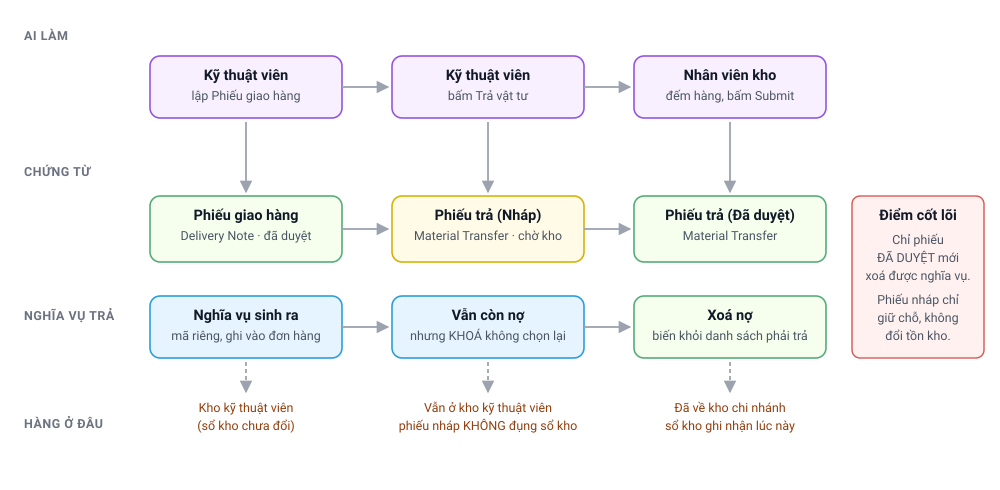
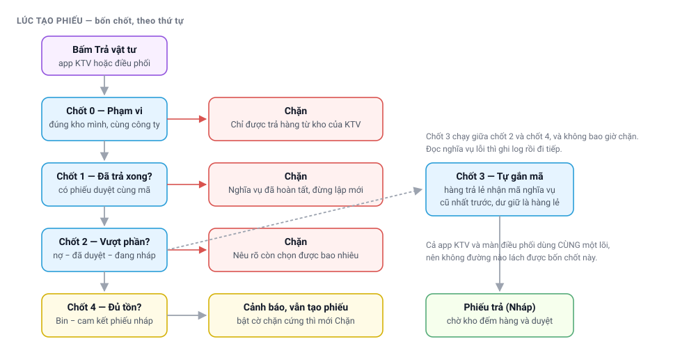

# Trả vật tư về kho — nghĩa vụ trả hàng và phiếu chuyển kho

> Đối tượng: **kỹ thuật viên (KTV)**, **nhân viên kho**, **điều phối**, **quản lý dịch vụ**.
> Tài liệu mô tả toàn bộ vòng đời việc trả vật tư: nghĩa vụ trả hàng sinh ra khi nào, kỹ thuật
> viên thấy gì trên ứng dụng, hệ thống chặn hoặc cảnh báo trong tình huống nào, và cách xử lý
> các trường hợp ngoại lệ.
>
> Tài liệu này mở rộng mục *Trả vật tư* của
> **[Quy trình dịch vụ hiện trường](FSMNext-Quy-Trinh-Dich-Vu.html#6-trả-vật-tư--hoàn-hàng)**.

---

## Bảng đối chiếu tên

| Trong tài liệu | Tên hệ thống |
|---|---|
| Đơn bán hàng | `Sales Order` |
| Phiếu giao hàng | `Delivery Note` |
| Phiếu chuyển kho (phiếu trả) | `Stock Entry` — loại `Material Transfer` |
| Phiếu xuất vật tư | `Stock Entry` — loại `Material Issue` |
| Phiếu yêu cầu vật tư | `Material Request` |
| Kho kỹ thuật viên | `Warehouse` khai trong `Service Resource Warehouse` |
| Bộ sản phẩm | `Product Bundle` |
| Cấu hình FSMNext | `FSM Settings` |

---

## Toàn cảnh

Hai điểm cốt lõi của toàn bộ quy trình:

1. **Chỉ phiếu chuyển kho đã duyệt mới xoá được nghĩa vụ trả hàng.** Phiếu ở trạng thái nháp
   không làm thay đổi sổ kho và không xoá nợ — nó chỉ *giữ chỗ*.
2. **Không giữ hàng thì không bị đòi.** Hệ thống chỉ đòi trả phần vật tư **còn thực sự nằm trong
   kho kỹ thuật viên**. Hàng đã rời kho bằng chứng từ khác (giao cho đơn khác, chỉ nhận một phần
   từ kho công ty, phiếu giao hàng được lập lại…) không còn là nợ, dù giấy tờ của đơn hàng vẫn
   ghi số chênh lệch.

Hiểu hai điều này giải thích gần như toàn bộ các tình huống mô tả bên dưới.

---

## 1. Nghĩa vụ trả hàng sinh ra khi nào

Nghĩa vụ **không** sinh ra lúc trả hàng, mà sinh ra lúc **kỹ thuật viên lập phiếu giao hàng**.

Với mỗi dòng của đơn bán hàng, hệ thống tính:

> **Số cần trả = số kỹ thuật viên mang đi − số thực giao cho khách**

Phần chênh lệch là hàng đã lấy khỏi kho công ty nhưng khách không nhận, nên phải mang về. Mỗi
phần chênh lệch được cấp một **mã nghĩa vụ** riêng và ghi vào đơn bán hàng, kèm các thông tin:
số cần trả, thời điểm khai, kỹ thuật viên khai, kho của kỹ thuật viên lúc đó, phiếu giao hàng
nào sinh ra nghĩa vụ, và số lượng gốc của dòng đơn để hoàn lại nếu sau này phiếu giao bị huỷ.

Đồng thời số lượng trên dòng đơn bán hàng được giảm xuống bằng số thực giao. Ngoại lệ: đơn đã
xuất hoá đơn thì số lượng giữ nguyên, và hệ thống ghi nhớ điều đó để lúc huỷ phiếu giao không
khôi phục sai.

> 💡 Vì nghĩa vụ được ghi vào đơn bán hàng dưới dạng **ảnh chụp văn bản** tại thời điểm giao
> hàng, việc đổi tên mã vật tư về sau **không** cập nhật được ảnh chụp này. Xem
> [§7 Tình huống ngoại lệ](#7-tình-huống-ngoại-lệ).

### Khi nào nghĩa vụ thực sự bị đòi

Số ghi trên đơn hàng chỉ là **số khai**. Mỗi lần có người mở màn hình, hệ thống tính lại phần
**bị đòi** từ ba điều kiện, cả ba cùng đúng mới đòi:

| Điều kiện | Nguồn đối chiếu |
|---|---|
| 1. Kỹ thuật viên đã khai *không giao* phần này | Phiếu giao hàng (`Delivery Note`) |
| 2. Kỹ thuật viên có nhận vật tư này cho đơn hàng, qua phiếu yêu cầu vật tư | Phiếu yêu cầu vật tư (`Material Request`) gắn phiếu công việc của đơn |
| 3. Kho kỹ thuật viên **đang còn** vật tư này | Tồn kho thực tế của kho kỹ thuật viên |

Điều kiện 3 là điểm mới. Khi nhiều nghĩa vụ cùng một vật tư cùng nhìn vào một kho, tồn kho được
chia cho **nghĩa vụ khai gần đây nhất trước**; phần không còn hàng để chia rơi vào trạng thái
**không giữ hàng** — vẫn hiện để giải thích, nhưng không bị đòi, không chặn hoàn thành phiếu
công việc, không tính vào báo cáo thiếu hàng.

Ví dụ thường gặp: đơn hàng ghi 3 lõi lọc, kỹ thuật viên chỉ yêu cầu và nhận 2, lắp 2, giao 2.
Giấy tờ chênh 1 nhưng kho kỹ thuật viên không có lõi nào — nghĩa vụ hiện là *không giữ hàng*,
kỹ thuật viên không bị đòi cái không có.

### Nghĩa vụ không giữ hàng được đóng tự động

Mỗi đêm hệ thống đánh dấu ngày đầu tiên một nghĩa vụ rơi vào trạng thái không giữ hàng. Qua số
ngày cấu hình (mặc định **14 ngày**) mà kho vẫn không có hàng, nghĩa vụ được **đóng hẳn**: biến
khỏi mọi danh sách phải trả, số khai gốc vẫn được lưu để tra cứu. Trong khoảng chờ, nếu vật tư
quay lại kho (kỹ thuật viên lấy lại hàng, hoặc nhận cùng vật tư cho ca khác) thì nghĩa vụ **bị
đòi trở lại** và việc đóng được hoãn, nhưng ngày đánh dấu không bị xoá — hàng rời kho lần nữa
là đóng ngay khi đủ ngày. Nghĩa vụ đang có phiếu trả nháp chờ kho duyệt thì không bị đóng.

---

## 2. Kỹ thuật viên thấy gì trên ứng dụng

Màn hình *Trả vật tư* dựng từ hai danh sách.

**Danh sách nghĩa vụ phải trả** — mỗi dòng có ba con số:

| Con số | Ý nghĩa |
|---|---|
| **Cần trả** | Phần còn nợ sau khi trừ các phiếu **đã duyệt**, **và kho kỹ thuật viên đang còn hàng** |
| **Đang chờ kho** | Phần đang nằm trong phiếu **nháp**, kho chưa duyệt |
| **Còn chọn được** | Cần trả − Đang chờ kho — đây là phần kỹ thuật viên được chọn |

Danh sách này chỉ liệt kê nghĩa vụ **bị đòi**. Nghĩa vụ không giữ hàng không hiện ở đây; nó hiện
ở **tab Đơn hàng** của lịch hẹn, cột **Trả kho**, với một trong các nhãn:

| Nhãn | Ý nghĩa |
|---|---|
| **Còn phải trả n** | Kho kỹ thuật viên đang giữ n đơn vị, cần trả |
| **Không giữ hàng** | Khai không giao nhưng kho không còn vật tư — không đòi |
| **Không nhận cho đơn này** | Khai không giao nhưng không có phiếu yêu cầu vật tư nào cho đơn — không đòi |
| **Đã trả** | Đã trả đủ bằng phiếu đã duyệt |

Cùng bộ nhãn này xuất hiện trên phiếu đơn bán hàng ở Desk (cột *Return Status* trong bảng *Sản
phẩm trả lại*) và trên màn điều phối (ghi chú *không giữ hàng n, không đòi*).

**Danh sách hàng còn trong kho** (hàng lẻ, không gắn nghĩa vụ) = tồn kho thực tế, trừ đi phần
đã giữ chỗ cho các nghĩa vụ cùng vật tư, trừ tiếp phần đang nằm trong phiếu nháp mà danh sách
nghĩa vụ chưa che.

Hai danh sách trừ chéo nhau như trên để cùng một món hàng không bị đếm hai lần, và để phần đã
hứa trả trong phiếu nháp không hiện ra như hàng còn rảnh.

### Hành xử theo từng tình huống

| Tình huống | Ứng dụng thể hiện thế nào |
|---|---|
| Nghĩa vụ 1 đơn vị, chưa ai trả | Chọn được 1 đơn vị |
| Nghĩa vụ 1 đơn vị, đã có phiếu nháp | Dòng **mờ đi và khoá**, ghi rõ *"Đang chờ kho xác nhận: 1 · phiếu MAT-STE-…"* |
| Nghĩa vụ 2 đơn vị, phiếu nháp đã phủ 1 | Dòng **vẫn mở**, ghi *"Cần trả: 1 · đang chờ kho: 1"* |
| Nghĩa vụ đã trả xong bằng phiếu đã duyệt | Không còn hiện trong danh sách |
| Nghĩa vụ 1 đơn vị nhưng kho kỹ thuật viên không còn vật tư | Không hiện trong danh sách phải trả; tab Đơn hàng ghi **Không giữ hàng** |
| Hai nghĩa vụ cùng vật tư, kho chỉ còn 1 | Nghĩa vụ **khai sau** được đòi 1; nghĩa vụ khai trước ghi *Không giữ hàng* |
| Nghĩa vụ là bộ sản phẩm | Nở ra từng vật tư thành phần; mỗi thành phần khoá hoặc mở độc lập |
| Nghĩa vụ không ghi kho nguồn | Hiện ở mọi kho của kỹ thuật viên — hạn chế của dữ liệu cũ |

> ✅ Màn **điều phối** hiển thị đúng như ứng dụng kỹ thuật viên: khoá dòng đang chờ kho, nêu số
> còn chọn được, trừ tồn theo phần đã cam kết. Hai màn hình dùng chung một bộ quy tắc.

---

## 3. Bốn chốt chặn khi tạo phiếu trả

| # | Chốt | Kiểm tra gì | Hành xử khi không đạt |
|---|---|---|---|
| 0 | **Phạm vi** | Kho nguồn là kho của chính kỹ thuật viên; kho đích cùng công ty; có ít nhất một dòng số lượng lớn hơn 0 | **Chặn** |
| 1 | **Đã trả xong** | Nghĩa vụ đã có phiếu đã duyệt phủ đủ | **Chặn** — *"đã được trả về kho rồi, vào tab Phiếu trả để xem lại"* |
| 2 | **Vượt phần còn lại** | Số trả không vượt *nợ − đã duyệt − đang chờ kho* | **Chặn**, nêu rõ con số: *"còn phải trả 2, trong đó 1 đang nằm ở phiếu MAT-STE-… — chỉ còn chọn được 1"* |
| 3 | **Tự gắn mã nghĩa vụ** | Hàng trả lẻ có khớp nghĩa vụ đang nợ tại kho này không | **Không chặn** — gắn được bao nhiêu thì gắn |
| 4 | **Đủ tồn khả dụng** | Tồn kho trừ phần đã cam kết trong các phiếu nháp khác | **Cảnh báo** (mặc định) hoặc **chặn** nếu bật cờ chặn cứng |

Ứng dụng kỹ thuật viên và màn điều phối đi qua **cùng một lõi xử lý**, nên không có đường nào
lách được bốn chốt này.

### Chốt 3 — tự gắn mã nghĩa vụ cho hàng trả lẻ

Trước đây khoảng một nửa lượng hàng trả về kho không mang mã nghĩa vụ, nên nợ treo mãi dù hàng
đã về tới kho. Chốt 3 xử lý việc đó: khi kỹ thuật viên trả một món đang còn nợ tại kho của mình,
hệ thống tự gắn **mã nghĩa vụ khai sớm nhất trước** (nguyên tắc vào trước ra trước), tách dòng
nếu số lượng trả phủ nhiều nghĩa vụ, phần dư còn lại vẫn giữ nguyên là hàng trả lẻ.

**Việc gắn mã được hiển thị trước khi xác nhận.** Khi kỹ thuật viên chọn hàng lẻ mà hệ thống
tìm thấy nghĩa vụ khớp, ứng dụng mở một bảng xem trước liệt kê từng dòng sẽ được tính vào đơn
hàng nào, kèm hai lựa chọn:

| Nút | Kết quả |
|---|---|
| **Đồng ý tính vào nợ** | Tạo phiếu với các dòng đã gắn mã như bảng xem trước |
| **Trả lẻ, không tính** | Tạo phiếu hàng lẻ thuần, không gắn mã nào — dùng khi món này thật ra là hàng của ca khác (ví dụ ca đã huỷ) và không muốn nó bị tính vào nợ của đơn đang hiện |

Màn điều phối có cùng bảng xem trước và hai nút này. Chốt 3 không bao giờ chặn kỹ thuật viên:
nếu đọc nghĩa vụ gặp lỗi, hệ thống ghi log rồi tạo phiếu như hàng lẻ bình thường.

---

## 4. Kho xử lý phiếu

Phiếu trả ở trạng thái **nháp không làm thay đổi sổ kho**. Hàng vẫn đứng tên kho kỹ thuật viên
cho tới khi nhân viên kho bấm duyệt.

Khi duyệt, hệ thống kiểm tra lần nữa: gộp số lượng theo từng cặp (kho, vật tư) rồi so với tồn
kho thực tế; thiếu thì chặn duyệt kèm thông báo *"Không đủ tồn kho … tại kho KTV …"*.

> 📌 Chốt tồn kho **lúc tạo phiếu** chặt hơn chốt **lúc duyệt**, vì nó còn trừ thêm phần đã cam
> kết ở các phiếu nháp khác. Nhờ vậy kỹ thuật viên được nhắc trước, và nhân viên kho không còn
> phát hiện thiếu hàng vào phút cuối.

**Tab Phiếu trả** trên ứng dụng: phiếu **nháp luôn hiện, bất kể khoảng ngày đang lọc**, và được
xếp lên đầu danh sách, vì đó là phiếu cần xử lý. Kỹ thuật viên xoá được phiếu nháp **do chính
mình lập**; xoá xong nghĩa vụ mở lại ngay, vì hệ thống đếm trực tiếp trên chứng từ.

---

## 5. Huỷ phiếu giao hàng sau khi đã trả hàng

Khi huỷ phiếu giao hàng, các nghĩa vụ do phiếu đó sinh ra được xử lý theo hai hướng:

| Nghĩa vụ | Hành xử |
|---|---|
| Chưa ai trả | Gỡ khỏi đơn bán hàng, hoàn lại số lượng dòng đơn |
| **Đã trả bằng phiếu đã duyệt** | **Giữ lại làm dấu vết**: không đòi trả nữa, đồng thời ghi số đã trả và tên phiếu chuyển kho; số lượng dòng đơn vẫn được hoàn lại |

Người thực hiện huỷ nhận cảnh báo liệt kê từng món: *"đã trả 1 về kho bằng phiếu MAT-STE-… —
hàng đang nằm ở kho công ty, cần lấy lại trước khi giao lại"*.

Dấu vết này hiện trong tab đơn hàng của kỹ thuật viên thành một khối riêng **"Đã trả về kho
trước khi huỷ phiếu giao"**, tách khỏi bảng *Sản phẩm trả lại*. Các báo cáo và chốt chặn khác
đều bỏ qua dấu vết này, nên không ai bị đòi trả lần thứ hai.

Nghĩa vụ **đang có phiếu trả nháp** lúc huỷ cũng được giữ lại theo cách tương tự, để phiếu nháp
đó không trở thành phiếu trỏ vào nghĩa vụ đã biến mất.

### Lập lại phiếu giao hàng sau khi huỷ

Huỷ rồi lập lại phiếu giao hàng là thao tác **sửa giấy tờ**: hàng không đi đâu cả. Khi phiếu
giao mới sinh nghĩa vụ cho cùng vật tư, cùng kho, hệ thống **chuyển phần đã trả** của phiếu
giao cũ sang nghĩa vụ mới:

| Trạng thái phần trả của phiếu cũ | Hành xử |
|---|---|
| Đã trả bằng phiếu đã duyệt | Chuyển sang nghĩa vụ mới; nghĩa vụ mới coi như đã trả tới đó |
| Đã trả một dòng phiếu nhiều đơn vị, phủ sang nghĩa vụ mới có số ít hơn | Phần thừa được **cấn** vào nghĩa vụ mới của cùng vật tư trong cùng đơn hàng |
| Đang nằm trong phiếu nháp | Dòng nháp được chuyển mã sang nghĩa vụ mới; kho duyệt là xoá nợ |

Nhờ vậy kỹ thuật viên đã trả đủ hàng trước khi phiếu giao bị huỷ **không bị đòi lần thứ hai**
khi phiếu được lập lại.

> ⚠️ **Huỷ phiếu công việc không tự trả kho.** Hàng đã nhận vẫn phải trả về bằng phiếu chuyển
> kho như thường.

---

## 6. Ba cấu hình liên quan

Ba mục trong **cấu hình FSMNext** (`FSM Settings`), nhóm *WO Validators*:

| Mục | Mặc định | Tác dụng |
|---|---|---|
| **Tự gắn mã nghĩa vụ khi KTV trả hàng lẻ** | **BẬT** | Chốt 3 ở §3. Tắt thì hàng trả lẻ không được gắn mã, nợ tiếp tục treo dù hàng đã về |
| **Chặn tạo phiếu trả khi kho KTV không đủ hàng** | **TẮT** | Tắt: chốt 4 chỉ cảnh báo, phiếu vẫn được tạo. Bật: chặn hẳn |
| **Số ngày không giữ hàng thì đóng nghĩa vụ** | **14** | Nghĩa vụ không giữ hàng liên tục quá số ngày này được đóng tự động (§1). Đặt **0** để tắt việc đóng; nghĩa vụ khi đó vẫn không bị đòi nhưng cũng không biến mất |

> ⚠️ Chỉ bật cờ **chặn cứng** sau khi đã dọn tồn đọng và cân lại các kho đang âm. Bật sớm sẽ
> khiến kỹ thuật viên ở những kho đang âm không trả được hàng, tức là chặn đúng việc cần làm.

---

## 7. Tình huống ngoại lệ

| Tình huống | Vì sao xảy ra | Cách xử lý |
|---|---|---|
| Nghĩa vụ trỏ tới mã vật tư không còn tồn tại | Nghĩa vụ là ảnh chụp văn bản; đổi tên hoặc xoá mã vật tư không cập nhật ảnh chụp | Cần tác vụ dữ liệu ánh xạ mã cũ sang mã mới; không tự xử lý trên ứng dụng |
| Nghĩa vụ là bộ sản phẩm nhưng cấu hình bộ đã thay đổi | Hệ thống nở bộ theo **cấu hình hiện tại**, không theo cấu hình lúc giao hàng | Đối chiếu thủ công với phiếu giao hàng gốc |
| Nghĩa vụ không ghi kho nguồn | Dữ liệu cũ, trước khi trường này được ghi | Nghĩa vụ hiện ở mọi kho của kỹ thuật viên; chọn đúng kho đang giữ hàng |
| Nghĩa vụ ghi **Không nhận cho đơn này** dù kỹ thuật viên đang giữ hàng | Hệ thống chỉ đòi phần nhận qua phiếu yêu cầu vật tư gắn phiếu công việc của đơn đó. Hàng lấy dưới ca khác mà dùng cho ca này thì không có phiếu yêu cầu nào trỏ về đơn | Đây là luật, không phải lỗi: việc theo dõi vật tư đi theo phiếu yêu cầu. Kỹ thuật viên trả món đó như **hàng lẻ**; nếu còn nợ ở đơn có phiếu yêu cầu, chốt 3 sẽ gắn mã về đúng đơn đó |
| Nghĩa vụ ghi **Không giữ hàng** dù kỹ thuật viên đang cầm hàng trên tay | Hàng chưa được nhập vào kho kỹ thuật viên trên hệ thống, hoặc đang đứng tên kho khác của cùng kỹ thuật viên | Nhập đúng kho trước; nghĩa vụ sẽ được đòi trở lại ở lần mở màn hình kế tiếp |
| Nghĩa vụ bị đòi dù vật tư trong kho là của ca khác | Kho kỹ thuật viên đang có vật tư cùng mã, hệ thống không phân biệt được món nào của ca nào | Về vật lý thì món đó vẫn phải trả. Nếu không muốn tính vào đơn đang hiện, dùng nút **Trả lẻ, không tính** ở bảng xem trước |
| Một phiếu trộn dòng có mã nghĩa vụ và dòng hàng lẻ | Kỹ thuật viên chọn cả hai danh sách trong một lần | Bình thường. Khi cần xoá phiếu, lưu ý phiếu chứa cả hai loại dòng |
| Kỹ thuật viên bị chặn nhưng không tìm ra phiếu nháp | Trước đây tab Phiếu trả lọc theo ngày | Đã sửa: phiếu nháp luôn hiện và xếp đầu danh sách |
| Kỹ thuật viên không xoá được phiếu nháp | Phiếu do người khác lập | Nhờ người lập phiếu hoặc quản trị viên xoá |

---

## 8. Phiếu nháp tồn đọng từ trước

Các chốt chặn ở §3 chỉ áp dụng cho phiếu **tạo mới**. Phiếu nháp đã tồn tại từ trước vẫn nằm
nguyên, trong đó có những phiếu trỏ vào nghĩa vụ **đã được trả xong** bằng phiếu khác. Duyệt
những phiếu này sẽ trừ kho lần thứ hai.

Cách nhận biết trên tab Phiếu trả: phiếu nháp cũ, và nghĩa vụ tương ứng **không còn hiện** trong
danh sách phải trả. Những phiếu này cần được **xoá**, không phải duyệt. Việc rà soát và dọn danh
sách này do quản trị viên thực hiện tập trung.

---

## Liên quan

- **[Quy trình dịch vụ hiện trường (FSMNext)](FSMNext-Quy-Trinh-Dich-Vu.html)** — vòng đời phiếu công việc và lịch hẹn, thu tiền hiện trường, huỷ và tạo lại phiếu
- 🔧 **[Tự xử lý sự cố dịch vụ (FSMNext)](FSMNext-Xu-Ly-Su-Co.html)** — tra lỗi theo triệu chứng
- 🛠️ **[Cơ chế nghĩa vụ trả hàng (kỹ thuật)](../tech/FSMNext-Return-Flow-Tech.html)** — mô hình dữ liệu, các điểm chốt trong mã nguồn, lưu ý triển khai
