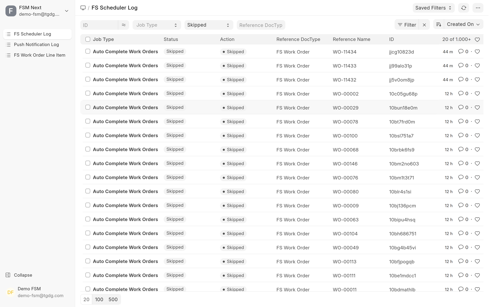
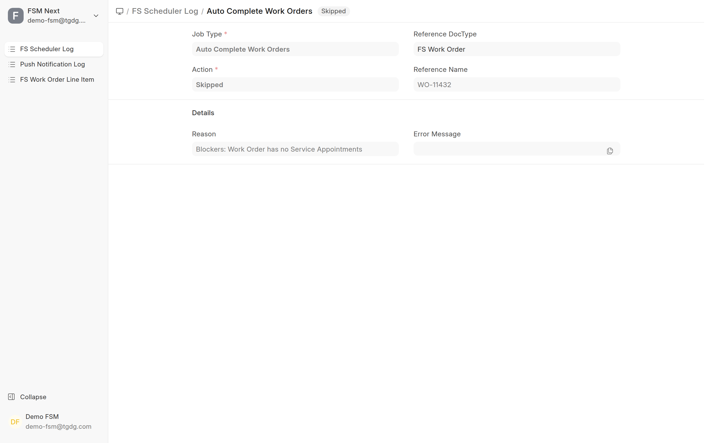
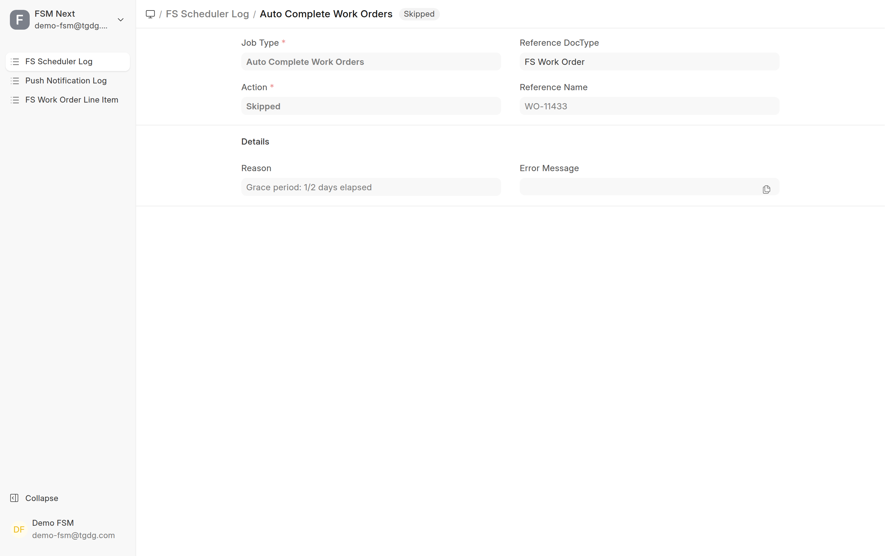
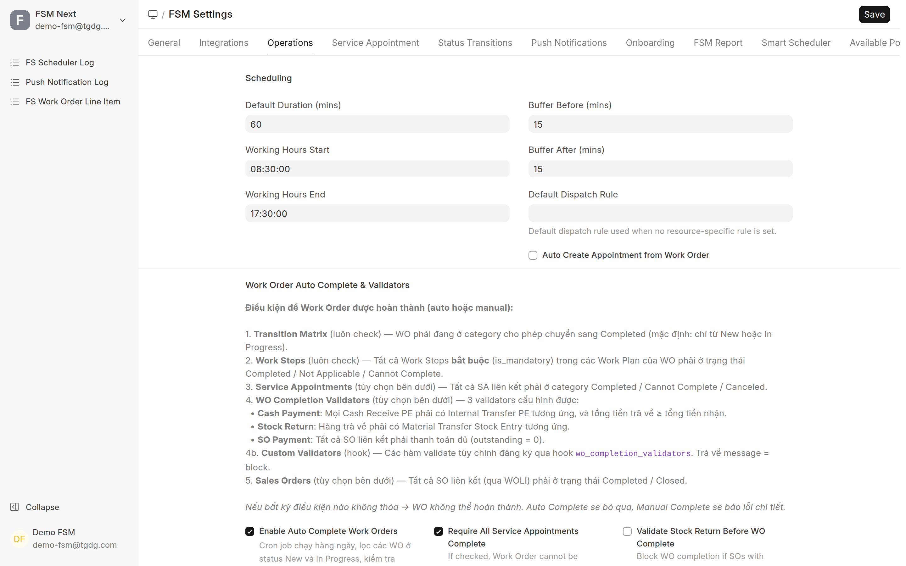
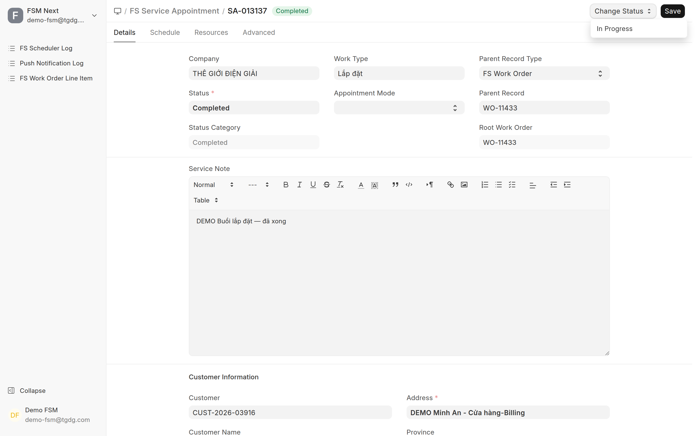
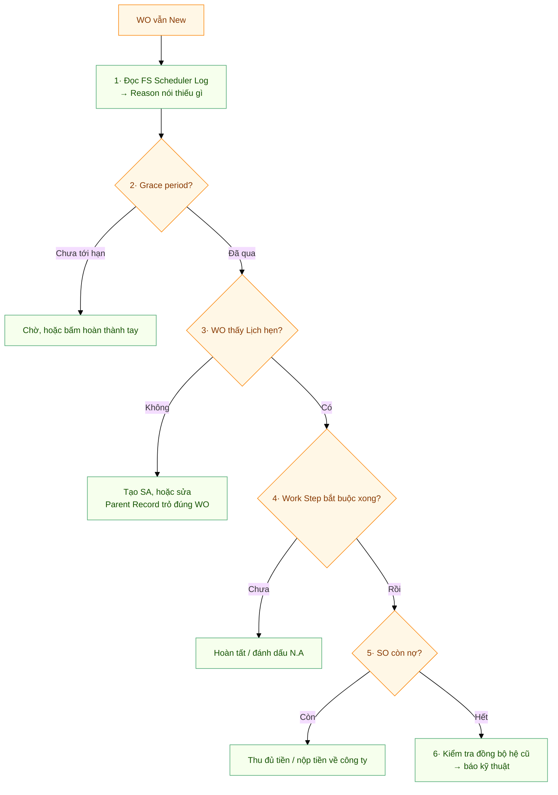
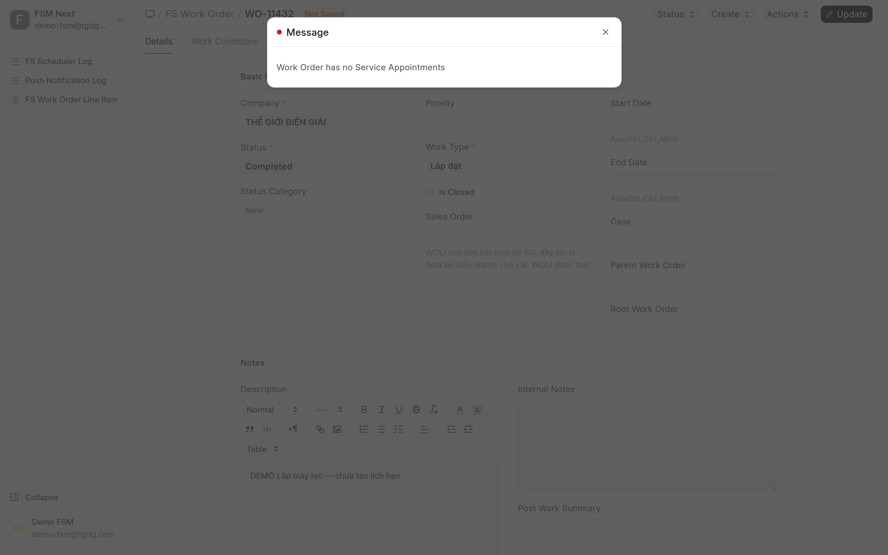

# Tự xử lý sự cố dịch vụ — FSMNext

> Đối tượng: **điều phối / CSKH**, **kỹ thuật viên (KTV)**, **quản lý dịch vụ**.
> Cẩm nang tra nhanh khi phiếu "không chịu chạy". Mỗi tình huống trình bày theo
> **làm gì trước — làm gì sau**, kèm ảnh màn hình thật.
>
> 📘 Chưa nắm vòng đời phiếu? Đọc trước **[Quy trình dịch vụ hiện trường](FSMNext-Quy-Trinh-Dich-Vu.html)**.

---

## Điều quan trọng nhất, đọc 30 giây

Rất nhiều ca báo "hệ thống lỗi" thực ra **không phải lỗi**. Lý do:

> **Phiếu công việc (WO), Lịch hẹn (SA) và Đơn hàng (SO) chạy độc lập nhau.**
> Làm xong Lịch hẹn **không** tự làm xong Phiếu công việc.
> Đơn hàng Completed **không** tự làm xong Phiếu công việc.

Phiếu công việc chỉ hoàn thành theo **2 cách**:

1. **Người bấm hoàn thành** (trên Desk hoặc app KTV), hoặc
2. **Máy tự chạy ban đêm** — nhưng chỉ khi **đủ mọi điều kiện** và **đã qua thời gian chờ**.

Nếu chưa đủ điều kiện, hệ thống **luôn nói rõ thiếu cái gì**. Việc của bạn là đi đọc câu đó — xem [Bước 1](#bước-1--hỏi-hệ-thống-trước-đừng-đoán).

---

## Mục lục

1. [🔴 WO vẫn "New" dù Đơn hàng và Lịch hẹn đã xong](#1--wo-vẫn-new-dù-đơn-hàng-và-lịch-hẹn-đã-xong)
2. [Bấm hoàn thành WO nhưng bị chặn](#2-bấm-hoàn-thành-wo-nhưng-bị-chặn)
3. [Lịch hẹn (SA) không Complete được](#3-lịch-hẹn-sa-không-complete-được)
4. [Không huỷ được phiếu](#4-không-huỷ-được-phiếu)
5. [Trả hàng / vật tư bị chặn](#5-trả-hàng--vật-tư-bị-chặn)
6. [Thu tiền / xuất hoá đơn bị chặn](#6-thu-tiền--xuất-hoá-đơn-bị-chặn)
7. [Tra lỗi theo nguyên văn thông báo](#7-tra-lỗi-theo-nguyên-văn-thông-báo)

---

## 1. 🔴 WO vẫn "New" dù Đơn hàng và Lịch hẹn đã xong

Đây là ca **hay gặp nhất**. Làm lần lượt các bước dưới đây, dừng lại ngay khi tìm ra nguyên nhân.

### Bước 1 — Hỏi hệ thống trước, đừng đoán

Máy chạy tự động mỗi đêm và **ghi lại lý do vì sao nó bỏ qua từng phiếu**. Đọc chỗ này là nhanh nhất.

**Cách làm:** gõ vào ô tìm kiếm **`FS Scheduler Log`** → mở danh sách → lọc cột **Action = `Skipped`**, và điền **Reference Name** = mã WO của bạn.

Mở một dòng ra, đọc ô **Reason** — đó chính là câu trả lời:

Ví dụ trên: *"Blockers: Work Order has no Service Appointments"* → **WO này chưa có Lịch hẹn nào** → nhảy tới [Bước 3](#bước-3--wo-có-thấy-lịch-hẹn-không).

Một ví dụ khác rất phổ biến — **chưa tới hạn**:

> 💡 **Không thấy dòng log nào cho WO đó?** Nghĩa là máy chưa từng xét phiếu này. Thường do:
> máy chạy vào ban đêm (phiếu mới tạo hôm nay thì sáng mai mới có log), hoặc chức năng tự
> hoàn thành đang tắt, hoặc WO đang ở **On Hold / Closed** (máy chỉ xét *New* và *In Progress*).

---

### Bước 2 — Kiểm tra "chưa tới hạn" (hay gặp: 4.407 lần)

Máy **cố ý chờ vài ngày** sau buổi làm cuối cùng rồi mới tự hoàn thành, phòng khi còn phát sinh.

- Log ghi *"Grace period: 1/2 days elapsed"* → nghĩa là **mới qua 1 ngày trên tổng số ngày phải chờ**.
- **Cách xử lý:** chờ đủ ngày, hoặc nếu cần xong ngay thì **bấm hoàn thành bằng tay** (xem [mục 2](#2-bấm-hoàn-thành-wo-nhưng-bị-chặn)).

Xem/đổi số ngày chờ ở: tìm **`FSM Settings`** → tab **Operations** → mục **Work Order Auto Complete & Validators**.

Ở màn hình này bạn cũng thấy ngay:
- **Enable Auto Complete Work Orders** — nếu ô này **không tick**, máy sẽ **không bao giờ** tự hoàn thành phiếu nào.
- **Require All Service Appointments Complete** — đang bật thì WO bắt buộc phải có Lịch hẹn và Lịch hẹn phải xong.

> ⚙️ Hệ thống hiện đang đặt thời gian chờ là **2 ngày** (mặc định gốc của phần mềm là 3). Con số thật luôn nằm ở ô **Grace Days** trong màn hình trên.

---

### Bước 3 — WO có "thấy" Lịch hẹn không? (hay gặp nhất: 9.420 lần)

Đây là nguyên nhân **số 1**. Có hai trường hợp:

**(a) WO thật sự chưa có Lịch hẹn nào.**
→ Tạo Lịch hẹn: mở WO → nút **Create** → **Service Appointment**. Làm xong buổi hẹn, chuyển Lịch hẹn sang **Completed**.

**(b) Có Lịch hẹn, đã Completed, nhưng WO vẫn báo "không có Lịch hẹn nào".**
→ Lịch hẹn bị **gắn nhầm chỗ**. Mở Lịch hẹn, nhìn 2 ô **Parent Record Type** và **Parent Record**:

- **Parent Record Type** phải là **`FS Work Order`**
- **Parent Record** phải là **đúng mã WO** bạn đang xử lý

Nếu hai ô này trỏ sai (ví dụ trỏ vào dòng vật tư *FS Work Order Line Item*), WO sẽ coi như **không có Lịch hẹn nào** dù Lịch hẹn đã Completed.
→ **Cách xử lý:** sửa lại cho trỏ đúng WO, hoặc tạo Lịch hẹn mới từ chính nút **Create → Service Appointment** trên WO đó (cách này luôn gắn đúng).

---

### Bước 4 — Còn bước công việc bắt buộc chưa xong?

Mở WO → tab **Line Items** / các **Work Step**. Mọi bước **bắt buộc** phải ở một trong ba trạng thái: **Completed**, **Not Applicable**, hoặc **Cannot Complete**.

→ Hoàn tất chúng, hoặc đánh dấu *Not Applicable* nếu thực tế không cần làm.

> ℹ️ Đây cũng là lý do WO còn nằm ở **New**: WO chỉ tự chuyển sang **In Progress** khi có người **bắt đầu một bước công việc**. KTV chỉ làm trên Lịch hẹn (check-in/check-out) thì WO vẫn đứng ở New — **bình thường**, không phải lỗi.

---

### Bước 5 — Đơn hàng còn nợ tiền? (hay gặp: 7.822 lần)

Hệ thống **mặc định bật** kiểm tra công nợ: đơn hàng liên kết còn nợ thì **không cho hoàn thành** WO.

Log/thông báo sẽ ghi: *"Không thể hoàn thành WO - SO chưa thanh toán đủ: SO ... còn nợ ..."*

→ **Cách xử lý:** thu đủ tiền / tạo phiếu thu cho đơn hàng đó. Xem thêm [mục 6](#6-thu-tiền--xuất-hoá-đơn-bị-chặn).

Một biến thể (1.906 lần): *"thu tiền mặt nhưng chưa có Internal Transfer về công ty"* → **KTV đã thu tiền nhưng chưa nộp về công ty**. Tạo phiếu nộp tiền là xong.

---

### Bước 6 — Phiếu có bị hệ thống cũ kéo về "New" không?

Nếu WO có ghi chú **"Synced from Work Orders: ..."** (ô *Internal Notes*), nghĩa là phiếu này được **đồng bộ từ hệ thống cũ**. Khi bản ghi bên hệ cũ vẫn ở trạng thái "New", mỗi lần nó cập nhật sẽ **kéo phiếu bên này về New**, xoá sạch tiến triển.

→ **Cách xử lý:** báo bộ phận kỹ thuật kiểm tra trạng thái bên hệ thống cũ. Đây là ca duy nhất trong danh sách mà người dùng **không tự xử lý được**.

---

### Tóm tắt bằng sơ đồ

Bấm để xem sơ đồ tóm tắt 6 bước

---

## 2. Bấm hoàn thành WO nhưng bị chặn

Khi bạn đổi trạng thái WO sang **Completed** mà chưa đủ điều kiện, hệ thống hiện **đúng lý do** ngay trên màn hình:

Đối chiếu câu thông báo với bảng sau:

| Thông báo | Nghĩa là gì | Làm gì |
|---|---|---|
| *"Work Order has no Service Appointments"* | WO chưa có Lịch hẹn nào (hoặc Lịch hẹn gắn sai chỗ) | [Bước 3](#bước-3--wo-có-thấy-lịch-hẹn-không) |
| *"{n} Service Appointments not yet completed: ..."* | Còn Lịch hẹn chưa xong | Hoàn tất hoặc huỷ các Lịch hẹn đó |
| *"...must transition to In Progress before completing"* | WO chưa vào trạng thái *In Progress* | Bắt đầu một bước công việc, hoặc đổi trạng thái sang In Progress trước |
| *"{n}/{m} required Work Steps not yet completed"* | Còn bước công việc bắt buộc | [Bước 4](#bước-4--còn-bước-công-việc-bắt-buộc-chưa-xong) |
| *"Không thể hoàn thành WO - SO chưa thanh toán đủ"* | Đơn hàng còn công nợ | [Bước 5](#bước-5--đơn-hàng-còn-nợ-tiền-hay-gặp-7822-lần) |
| *"Không thể hoàn thành WO - Chưa trả kho đủ"* | Vật tư chưa trả về kho đủ | [mục 5](#5-trả-hàng--vật-tư-bị-chặn) |
| *"...chưa có Internal Transfer về công ty"* | Đã thu tiền mặt nhưng chưa nộp về công ty | Tạo phiếu nộp tiền |
| *"Cannot transition from category '...' to '...'"* | Nhảy trạng thái sai luồng | Đi đúng thứ tự (vd: On Hold → In Progress → Completed) |

> ✅ **Yên tâm:** câu thông báo bạn thấy trên app KTV, trên Desk, và trong FS Scheduler Log là **giống hệt nhau**. Đọc được một chỗ là hiểu cả ba.

---

## 3. Lịch hẹn (SA) không Complete được

| Thông báo | Nghĩa là gì | Làm gì |
|---|---|---|
| *"Cannot complete: no Actual Start (SA not started)"* | Lịch hẹn chưa được bắt đầu | KTV **check-in** (hoặc bấm bắt đầu di chuyển) để Lịch hẹn vào *In Progress* |
| *"...all resources must be Checked-out or Canceled. Pending: ..."* | Còn KTV chưa check-out | Cho các KTV còn lại check-out, hoặc huỷ họ khỏi lịch |
| *"...no photo attached (Work Type requires Photo)"* | Loại công việc này bắt buộc có ảnh | Đính kèm ảnh hiện trường |
| *"Cancellation Reason is required before canceling"* | Huỷ lịch mà chưa ghi lý do | Nhập **Lý do huỷ** |
| *"Total Contribution ... must be exactly 100%"* | Tổng % đóng góp của các KTV ≠ 100% | Chỉnh lại cho tổng đúng 100% |
| *"Cannot start traveling when SA status is ..."* | Sai trạng thái để bắt đầu di chuyển | Lịch hẹn phải đang *Dispatched* hoặc *In Progress* |
| *"You are not assigned to this appointment"* | KTV không có tên trong lịch | Điều phối thêm KTV vào Lịch hẹn |

### Muốn sửa lại Lịch hẹn đã Completed?

Dùng nút **Change Status** ở góc trên bên phải. Hệ thống **chỉ cho đi những nước hợp lệ** — Lịch hẹn đã *Completed* thì lựa chọn duy nhất là quay về *In Progress*:

> ⚠️ Mở lại Lịch hẹn từ **Canceled / Cannot Complete** sẽ **xoá sạch dữ liệu check-in/check-out cũ** — KTV phải làm lại từ đầu. Cân nhắc tạo Lịch hẹn mới thay vì mở lại.

---

## 4. Không huỷ được phiếu

**Quy tắc: huỷ từ trong ra ngoài — Lịch hẹn → Phiếu công việc → Đơn hàng.**

Các phiếu khoá lẫn nhau để tránh huỷ nhầm làm lệch số liệu.

| Thông báo | Nghĩa là gì | Làm gì |
|---|---|---|
| *"Cannot cancel this Sales Order because it is linked to FS Work Order ..."* | Đơn hàng còn Phiếu công việc | Huỷ Phiếu công việc trước (mà muốn vậy phải huỷ Lịch hẹn trước nữa) |
| *"Cannot cancel this Work Order because it is linked to Service Appointment ..."* | Phiếu công việc còn Lịch hẹn | Huỷ hết Lịch hẹn trước |
| *"Cannot hủy Service Appointment when in status ... Change status first."* | Lịch hẹn đang ở trạng thái bị khoá (*Completed / Cannot Complete / Canceled*) | Đổi trạng thái sang trạng thái không khoá rồi mới huỷ |
| *"Đã quá thời gian cho phép hủy (n phút)"* | Quá hạn KTV tự huỷ phiếu thu / phiếu xuất vật tư trên app | Nhờ kế toán / kho huỷ trên Desk |
| *"Không thể hủy vì đã có phiếu trả tiền: ..."* | Phiếu thu đã có phiếu nộp tiền đối ứng | Huỷ phiếu nộp tiền trước |

> ⚠️ **Huỷ Phiếu công việc KHÔNG tự hoàn kho.** Vật tư KTV đã nhận vẫn phải trả về kho bằng phiếu chuyển kho — xem [mục 5](#5-trả-hàng--vật-tư-bị-chặn).

---

## 5. Trả hàng / vật tư bị chặn

| Thông báo | Nghĩa là gì | Làm gì |
|---|---|---|
| *"You can only return materials from your own warehouse"* | Đang trả từ kho không phải của mình | Chọn đúng kho của KTV đang thao tác |
| *"Target warehouse must be in the same company"* | Kho đích khác công ty | Chọn kho đích cùng công ty |
| *"Số lượng trả vượt quá yêu cầu: ..."* | Trả nhiều hơn số cần trả | Giảm về đúng phần còn phải trả |
| *"Không thể submit: kho KTV sẽ bị âm ..."* | Xuất/chuyển làm kho KTV âm | Kiểm tra tồn thực tế, chỉ xuất trong phạm vi đang có |
| *"Insufficient stock for ... Required/Available"* | Không đủ tồn để xuất tiêu hao | Nhận thêm hàng về kho trước, hoặc giảm số lượng |
| *"The following items are not allowed for Material Issue: ..."* | Vật tư không nằm trong danh mục được phép xuất | Dùng đúng danh mục, hoặc nhờ quản trị bổ sung quy tắc |
| *"Chỉ có thể xóa phiếu ở trạng thái Draft"* | Phiếu trả đã được Submit | Nhờ kho xử lý theo quy trình |
| *"Warehouse not configured for you in company ..."* | KTV chưa được gán kho ở công ty đó | Nhờ quản trị cấu hình kho cho KTV |

**Nhắc lại luồng trả hàng:** KTV tạo phiếu trả trên app → phiếu ở trạng thái **Draft** → **kho kiểm tra rồi Submit**. Còn Draft thì KTV tự xoá được; đã Submit thì phải qua kho.

---

## 6. Thu tiền / xuất hoá đơn bị chặn

| Thông báo | Nghĩa là gì | Làm gì |
|---|---|---|
| *"Chưa tạo phiếu giao hàng cho ... trước khi thanh toán."* | Thu tiền khi chưa giao hàng | Tạo Phiếu giao hàng trước (hoặc quản trị bật *cho thu tiền trước*) |
| *"Chưa thanh toán đủ 100% cho đơn hàng: ..."* | Xuất hoá đơn khi chưa thu đủ | Thu đủ tiền trước khi tạo hoá đơn |
| *"Số dư tài khoản KTV ... không đủ ..."* | Nộp về công ty nhiều hơn số đang giữ | Đối chiếu lại số đã thu thực tế |
| *"Công nợ ... đã được trả qua ..."* | Nộp tiền trùng | Không nộp lại — đã có phiếu nộp trước đó |
| *"Cannot return all items ... Each SO must deliver at least 1 item ..."* | Trả toàn bộ hàng của đơn qua phiếu giao | Muốn huỷ đơn: trả hết vật tư đã nhận rồi nhờ CSKH **Close** đơn hàng |
| *"Customer signature is required"* | Phiếu giao thiếu chữ ký khách | Lấy chữ ký khách trên app |

---

## 7. Tra lỗi theo nguyên văn thông báo

Bảng gộp để **Ctrl+F** theo đúng chữ bạn nhìn thấy trên màn hình:

| Nguyên văn (một phần) | Xem mục |
|---|---|
| `Work Order has no Service Appointments` | [1 – Bước 3](#bước-3--wo-có-thấy-lịch-hẹn-không) · [2](#2-bấm-hoàn-thành-wo-nhưng-bị-chặn) |
| `Grace period` | [1 – Bước 2](#bước-2--kiểm-tra-chưa-tới-hạn-hay-gặp-4407-lần) |
| `Service Appointments not yet completed` | [2](#2-bấm-hoàn-thành-wo-nhưng-bị-chặn) |
| `must transition to In Progress before completing` | [2](#2-bấm-hoàn-thành-wo-nhưng-bị-chặn) |
| `required Work Steps not yet completed` | [1 – Bước 4](#bước-4--còn-bước-công-việc-bắt-buộc-chưa-xong) |
| `SO chưa thanh toán đủ` · `còn nợ` | [1 – Bước 5](#bước-5--đơn-hàng-còn-nợ-tiền-hay-gặp-7822-lần) · [6](#6-thu-tiền--xuất-hoá-đơn-bị-chặn) |
| `chưa có Internal Transfer về công ty` | [1 – Bước 5](#bước-5--đơn-hàng-còn-nợ-tiền-hay-gặp-7822-lần) |
| `Chưa trả kho đủ` · `Số lượng trả vượt quá yêu cầu` | [5](#5-trả-hàng--vật-tư-bị-chặn) |
| `no Actual Start` · `all resources must be Checked-out` · `no photo attached` | [3](#3-lịch-hẹn-sa-không-complete-được) |
| `Cancellation Reason is required` | [3](#3-lịch-hẹn-sa-không-complete-được) |
| `linked to FS Work Order` · `linked to Service Appointment` · `Change status first` | [4](#4-không-huỷ-được-phiếu) |
| `Đã quá thời gian cho phép hủy` | [4](#4-không-huỷ-được-phiếu) |
| `kho KTV sẽ bị âm` · `Insufficient stock` · `Warehouse not configured for you` | [5](#5-trả-hàng--vật-tư-bị-chặn) |
| `Chưa tạo phiếu giao hàng` · `Chưa thanh toán đủ 100%` · `đã được trả qua` | [6](#6-thu-tiền--xuất-hoá-đơn-bị-chặn) |

---

## Khi nào cần báo kỹ thuật

Tự xử lý được hầu hết các ca trên. Chỉ cần báo kỹ thuật khi:

- FS Scheduler Log ghi **Action = `Failed`** (kèm lỗi hệ thống), hoặc
- WO có ghi chú **"Synced from Work Orders: ..."** và bị kéo về New liên tục, hoặc
- Thông báo lỗi **không có trong các bảng trên**.

Khi báo, gửi kèm: **mã WO / SA**, **ảnh chụp thông báo lỗi**, và **dòng Reason trong FS Scheduler Log**.

---

## Liên quan

- **[Quy trình dịch vụ hiện trường (FSMNext)](FSMNext-Quy-Trinh-Dich-Vu.html)** — vòng đời phiếu, tạo & hoàn thành, trả hàng, thu tiền, huỷ & tạo lại phiếu
- [Auto-Assign Ticket & SIM](Service_Reminder_Auto_Assign.html)
- [Quy tắc phân bổ bảo dưỡng](QUY_TAC_PHAN_BO_BAO_DUONG.html)
