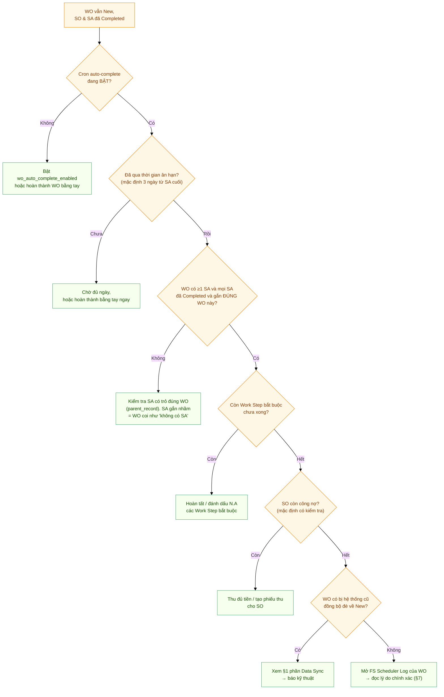
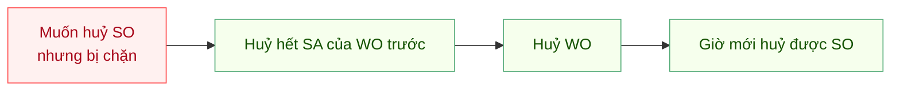

# Tự xử lý sự cố dịch vụ — FSMNext

> Đối tượng: **điều phối / CSKH**, **KTV**, **quản lý dịch vụ**.
> Cẩm nang tra nhanh khi phiếu "không chịu chạy": WO không hoàn thành, SA không complete được,
> không huỷ được phiếu, thu tiền / trả hàng bị chặn... Mỗi mục nêu **triệu chứng → nguyên nhân → cách xử lý**.
>
> 📘 Hiểu vòng đời phiếu trước ở **[Quy trình dịch vụ hiện trường](FSMNext-Quy-Trinh-Dich-Vu.html)**.

---

## Nguyên tắc vàng phải nhớ

> **WO, SA, SO có trạng thái ĐỘC LẬP.** Hoàn thành SA **không** tự đẩy WO; SO Completed **không** tự hoàn thành WO.
> Không có phiếu nào "tự chạy" theo phiếu khác — trừ **cron đêm** tự hoàn thành WO **khi đã đủ điều kiện + qua thời gian ân hạn**.

---

## Mục lục

1. [🔴 WO vẫn "New" dù SO và SA đã Completed](#1--wo-vẫn-new-dù-so-và-sa-đã-completed)
2. [WO không hoàn thành được (bấm tay báo lỗi)](#2-wo-không-hoàn-thành-được-bấm-tay-báo-lỗi)
3. [SA không Complete được](#3-sa-không-complete-được)
4. [Không huỷ được phiếu](#4-không-huỷ-được-phiếu)
5. [Trả hàng / vật tư bị chặn](#5-trả-hàng--vật-tư-bị-chặn)
6. [Thu tiền / hoá đơn bị chặn](#6-thu-tiền--hoá-đơn-bị-chặn)
7. [Cách đọc FS Scheduler Log](#7-cách-đọc-fs-scheduler-log)
8. [Tra nhanh thông báo lỗi theo nguyên văn](#8-tra-nhanh-thông-báo-lỗi-theo-nguyên-văn)

---

## 1. 🔴 WO vẫn "New" dù SO và SA đã Completed

Đây là tình huống **hay gặp nhất** và thường **không phải lỗi** — mà do hiểu nhầm rằng SA/SO xong thì WO tự xong. **Không.** WO chỉ rời "New" theo đúng 2 cách, cả hai **không** phụ thuộc SA/SO Completed:

- **New → In Progress:** chỉ khi KTV **bắt đầu một bước công việc (Work Step)** — *không phải* khi làm SA.
- **→ Completed:** **bấm tay** hoặc **cron đêm** (khi đủ điều kiện + qua thời gian ân hạn).

### Cây chẩn đoán

### Bảng nguyên nhân & cách xử lý

| # | Nguyên nhân | Dấu hiệu | Cách xử lý |
|---|---|---|---|
| 1 | **Chưa qua thời gian ân hạn** (grace, mặc định 3 ngày) | SA vừa xong < 3 ngày | Chờ đủ ngày, hoặc **hoàn thành WO bằng tay** ngay nếu cần gấp |
| 2 | **Cron auto-complete đang tắt** | Nhiều WO cũ cũng kẹt New | Quản trị bật `wo_auto_complete_enabled`, hoặc hoàn thành tay |
| 3 | **WO "không thấy" SA** | SA Completed nhưng gắn **nhầm** (vào dòng vật tư/WOLI thay vì chính WO) | Kiểm tra trường liên kết cha (*parent_record*) của SA phải là **chính WO này**; nếu sai, tạo lại SA từ nút trên WO |
| 4 | **Còn Work Step bắt buộc chưa xong** | Có bước công việc chưa Completed | Hoàn tất hoặc đánh dấu *Not Applicable* / *Cannot Complete* |
| 5 | **SO còn công nợ** (mặc định có kiểm tra) | SO chưa thu đủ tiền | Tạo phiếu thu cho SO cho tới khi hết nợ |
| 6 | **Hệ thống cũ đồng bộ đè** | WO có ghi chú *"Synced from Work Orders: ..."* | Bản ghi cũ vẫn ở "New" → mỗi lần cập nhật kéo WO về New. **Báo kỹ thuật** kiểm tra trạng thái bên hệ cũ |

> ✅ **Cách nhanh nhất để biết chính xác:** mở **FS Scheduler Log** lọc theo WO đó — job *Auto Complete Work Orders* ghi rõ *Skipped / Grace period / Blockers: ...* hoặc *Failed*. Xem [§7](#7-cách-đọc-fs-scheduler-log).

---

## 2. WO không hoàn thành được (bấm tay báo lỗi)

Khi bấm hoàn thành mà bị chặn, hệ thống **liệt kê đúng lý do**. Đối chiếu:

| Thông báo | Nghĩa | Cách xử lý |
|---|---|---|
| *"...must transition to In Progress before completing"* | WO chưa vào In Progress | Bắt đầu một Work Step, hoặc đổi trạng thái sang In Progress trước |
| *"{n}/{m} required Work Steps not yet completed"* | Còn bước bắt buộc chưa xong | Hoàn tất / đánh dấu N.A các bước đó |
| *"Work Order has no Service Appointments"* | WO chưa có SA nào | Tạo SA và hoàn tất, hoặc (nếu vụ việc không cần SA) tắt `wo_require_sa_complete` |
| *"{n} Service Appointments not yet completed: ..."* | Còn SA chưa xong | Hoàn tất hoặc huỷ các SA đó |
| *"Không thể hoàn thành WO - SO chưa thanh toán đủ: ... còn nợ ..."* | SO còn công nợ | Thu đủ tiền / tạo phiếu thu |
| *"Không thể hoàn thành WO - Chưa trả kho đủ: ... thiếu ..."* | Chưa trả vật tư đủ | Trả kho phần còn thiếu ([Quy trình §6](FSMNext-Quy-Trinh-Dich-Vu.html#6-trả-vật-tư--hoàn-hàng)) |
| *"Không thể hoàn thành WO - Vấn đề thanh toán: ... chưa có Internal Transfer về công ty"* | Thu tiền mặt chưa nộp về công ty | Tạo phiếu nộp tiền (Internal Transfer) |
| *"Sales Order not completed: ..."* | Bật kiểm tra SO Completed | Hoàn thành SO trước, hoặc tắt `wo_require_so_complete` |
| *"Cannot transition from category '...' to '...'"* | Bước nhảy trạng thái sai luồng | Đi đúng luồng (vd On Hold → In Progress → Completed) |

> Cùng bộ lý do này hiện trên **app KTV**, **Desk**, và **FS Scheduler Log** — nội dung y hệt nhau.

---

## 3. SA không Complete được

| Thông báo | Nghĩa | Cách xử lý |
|---|---|---|
| *"Cannot complete: no Actual Start (SA not started)"* | SA chưa được bắt đầu | KTV **check-in** hoặc bắt đầu di chuyển để SA vào In Progress |
| *"...all resources must be Checked-out or Canceled. Pending: ..."* | Còn KTV chưa check-out | Cho các KTV còn lại check-out, hoặc huỷ họ khỏi lịch |
| *"...no photo attached (Work Type requires Photo)"* | Work Type bắt buộc ảnh | Đính kèm ảnh hiện trường |
| *"Cancellation Reason is required before canceling"* | Huỷ SA thiếu lý do | Nhập Lý do huỷ |
| *"Total Contribution ... must be exactly 100%"* | Tổng % đóng góp KTV ≠ 100% | Chỉnh % các KTV cho tổng đúng 100% |
| *"Cannot start traveling when SA status is ..."* | Sai trạng thái để bắt đầu di chuyển | SA phải đang Dispatched hoặc In Progress |
| *"You are not assigned to this appointment"* | KTV không nằm trong lịch | Điều phối thêm KTV vào SA |

---

## 4. Không huỷ được phiếu

**Luôn huỷ từ trong ra ngoài: SA → WO → SO.**

| Thông báo | Nghĩa | Cách xử lý |
|---|---|---|
| *"Cannot cancel this Sales Order because it is linked to FS Work Order ..."* | SO còn WO liên kết | Huỷ WO trước (sau khi huỷ SA của nó) |
| *"Cannot cancel this Work Order because it is linked to Service Appointment ..."* | WO còn SA liên kết | Huỷ hết SA trước |
| *"Cannot hủy Service Appointment when in status ... Change status first."* | SA đang ở trạng thái khoá (Completed/Cannot Complete/Canceled) | Đổi trạng thái SA sang trạng thái không khoá rồi mới huỷ |
| *"Đã quá thời gian cho phép hủy (n phút)"* | Quá hạn huỷ phiếu thu / phiếu xuất vật tư trên app | Nhờ kế toán/kho huỷ trên Desk |
| *"Không thể hủy vì đã có phiếu trả tiền: ..."* | PE đã có phiếu nộp tiền đối ứng | Huỷ phiếu nộp tiền trước |

> ⚠️ Huỷ **WO không tự hoàn kho** — hàng đã nhận vẫn phải trả tay bằng Phiếu chuyển kho.

---

## 5. Trả hàng / vật tư bị chặn

| Thông báo | Nghĩa | Cách xử lý |
|---|---|---|
| *"You can only return materials from your own warehouse"* | Trả từ kho không phải của mình | Chọn đúng kho của KTV đang thao tác |
| *"Target warehouse must be in the same company"* | Kho đích khác công ty | Chọn kho đích cùng công ty |
| *"Số lượng trả vượt quá yêu cầu: ..."* | Trả nhiều hơn số cần trả | Giảm số lượng về đúng phần còn phải trả |
| *"Không thể submit: kho KTV sẽ bị âm ..."* | Xuất/chuyển làm kho KTV âm | Kiểm tra tồn thực tế; chỉ xuất trong phạm vi đang có |
| *"Insufficient stock for ... Required/Available"* | Không đủ tồn để xuất tiêu hao | Nhận thêm hàng về kho trước, hoặc giảm số lượng |
| *"The following items are not allowed for Material Issue: ..."* | Vật tư không nằm trong danh mục được phép xuất | Dùng đúng danh mục, hoặc nhờ quản trị bổ sung quy tắc |
| *"Chỉ có thể xóa phiếu ở trạng thái Draft"* | Phiếu trả đã Submit | Nhờ kho huỷ theo quy trình |
| *"Warehouse not configured for you in company ..."* | KTV chưa được gán kho ở công ty đó | Nhờ quản trị cấu hình kho cho KTV (Service Resource Warehouse) |

---

## 6. Thu tiền / hoá đơn bị chặn

| Thông báo | Nghĩa | Cách xử lý |
|---|---|---|
| *"Chưa tạo phiếu giao hàng cho ... Vui lòng tạo phiếu giao hàng trước khi thanh toán."* | Thu tiền trước khi giao hàng | Tạo Phiếu giao hàng trước, hoặc bật `allow_advance_payment` (quản trị) |
| *"Chưa thanh toán đủ 100% cho đơn hàng: ... trước khi tạo hóa đơn."* | Tạo hoá đơn khi chưa thu đủ | Thu đủ tiền, hoặc bật `allow_si_without_full_payment` |
| *"Số dư tài khoản KTV ... không đủ ..."* | Nộp tiền vượt số dư đang giữ | Kiểm tra số đã thu thực tế |
| *"Công nợ ... đã được trả qua ..."* | Nộp tiền trùng | Không nộp lại; đã có phiếu nộp trước đó |
| *"Cannot return all items ... Each SO must deliver at least 1 item ..."* | Trả toàn bộ hàng của SO qua phiếu giao | Nếu muốn huỷ đơn: trả vật tư đã nhận rồi nhờ CSKH **Close** SO |
| *"Customer signature is required"* | Phiếu giao thiếu chữ ký khách | Lấy chữ ký khách trên app |

---

## 7. Cách đọc FS Scheduler Log

Đây là "hộp đen" để biết **vì sao cron không hoàn thành một WO**. Vào danh sách **FS Scheduler Log**, lọc:

- **Reference Type** = *FS Work Order*, **Reference Name** = mã WO cần tra.
- Xem cột **Action** và **Reason**:

| Action | Reason ví dụ | Nghĩa |
|---|---|---|
| **Skipped** | *"Grace period: 1/3 days elapsed"* | Chưa đủ thời gian ân hạn — chờ hoặc hoàn thành tay |
| **Skipped** | *"Blockers: Work Order has no Service Appointments; ..."* | Còn vướng điều kiện — xử lý theo [§2](#2-wo-không-hoàn-thành-được-bấm-tay-báo-lỗi) |
| **Completed** | (trống) | Cron đã hoàn thành thành công |
| **Failed** | (nội dung lỗi kỹ thuật) | Lỗi hệ thống — báo kỹ thuật |

> Nếu **không có dòng log nào** cho WO đó: có thể cron chưa chạy (chờ tới đêm), hoặc `wo_auto_complete_enabled` đang tắt, hoặc WO không ở nhóm New/In Progress (cron chỉ xét 2 nhóm này — On Hold/Closed bị bỏ qua).

---

## 8. Tra nhanh thông báo lỗi theo nguyên văn

Bảng gộp để **Ctrl+F** theo chữ trong thông báo:

| Nguyên văn (một phần) | Xử lý ở mục |
|---|---|
| `must transition to In Progress before completing` | [§2](#2-wo-không-hoàn-thành-được-bấm-tay-báo-lỗi) |
| `required Work Steps not yet completed` | [§2](#2-wo-không-hoàn-thành-được-bấm-tay-báo-lỗi) |
| `Work Order has no Service Appointments` | [§1](#1--wo-vẫn-new-dù-so-và-sa-đã-completed) / [§2](#2-wo-không-hoàn-thành-được-bấm-tay-báo-lỗi) |
| `SO chưa thanh toán đủ` / `SO ... còn nợ` | [§2](#2-wo-không-hoàn-thành-được-bấm-tay-báo-lỗi) / [§6](#6-thu-tiền--hoá-đơn-bị-chặn) |
| `Chưa trả kho đủ` | [§5](#5-trả-hàng--vật-tư-bị-chặn) |
| `no Actual Start` | [§3](#3-sa-không-complete-được) |
| `all resources must be Checked-out` | [§3](#3-sa-không-complete-được) |
| `no photo attached` | [§3](#3-sa-không-complete-được) |
| `Cancellation Reason is required` | [§3](#3-sa-không-complete-được) |
| `linked to FS Work Order` / `linked to Service Appointment` | [§4](#4-không-huỷ-được-phiếu) |
| `Change status first` | [§4](#4-không-huỷ-được-phiếu) |
| `Đã quá thời gian cho phép hủy` | [§4](#4-không-huỷ-được-phiếu) |
| `kho KTV sẽ bị âm` / `Insufficient stock` | [§5](#5-trả-hàng--vật-tư-bị-chặn) |
| `Số lượng trả vượt quá yêu cầu` | [§5](#5-trả-hàng--vật-tư-bị-chặn) |
| `Chưa tạo phiếu giao hàng` | [§6](#6-thu-tiền--hoá-đơn-bị-chặn) |
| `Chưa thanh toán đủ 100%` | [§6](#6-thu-tiền--hoá-đơn-bị-chặn) |
| `đã được trả qua` (nộp tiền trùng) | [§6](#6-thu-tiền--hoá-đơn-bị-chặn) |
| `Warehouse not configured for you` | [§5](#5-trả-hàng--vật-tư-bị-chặn) |

---

## Liên quan

- **[Quy trình dịch vụ hiện trường (FSMNext)](FSMNext-Quy-Trinh-Dich-Vu.html)** — vòng đời WO/SA/SO, tạo & hoàn thành phiếu, trả hàng, thu tiền, huỷ & tạo lại phiếu
- [Auto-Assign Ticket & SIM](Service_Reminder_Auto_Assign.html)
- [Quy tắc phân bổ bảo dưỡng](QUY_TAC_PHAN_BO_BAO_DUONG.html)
