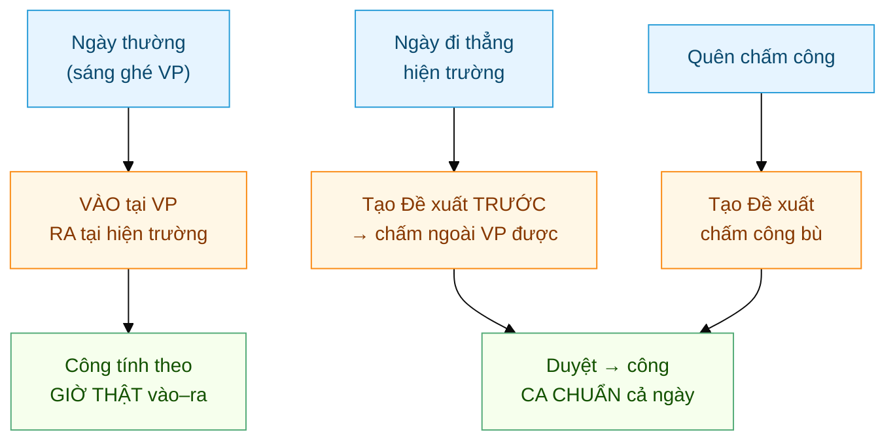
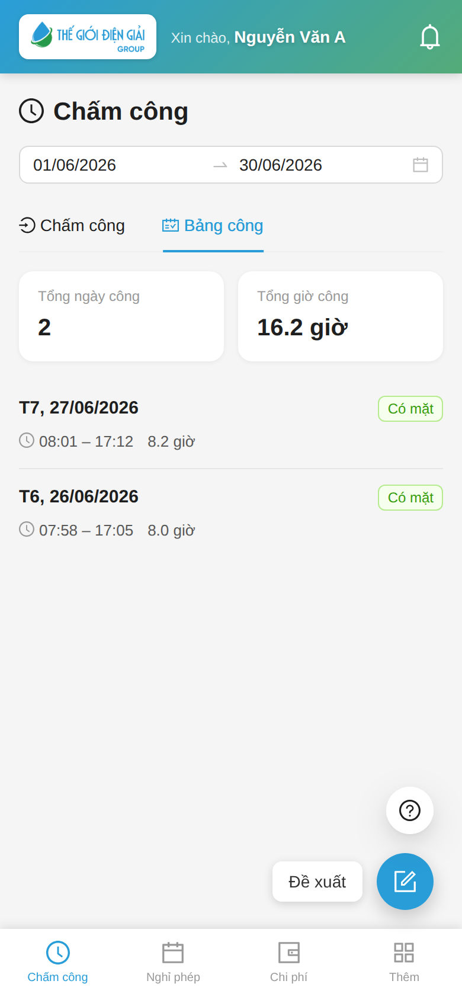
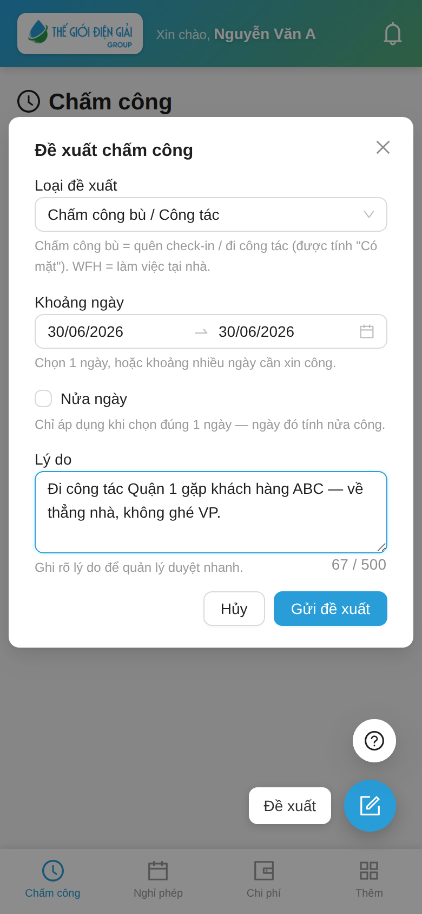
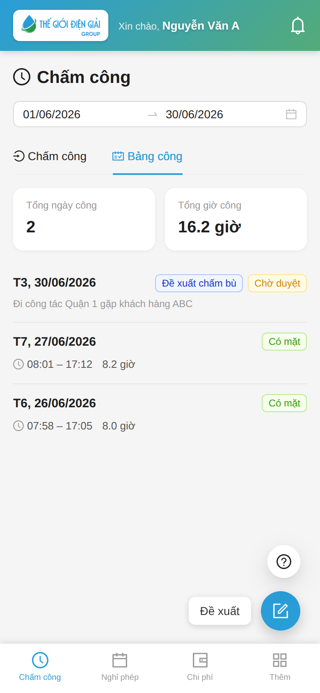
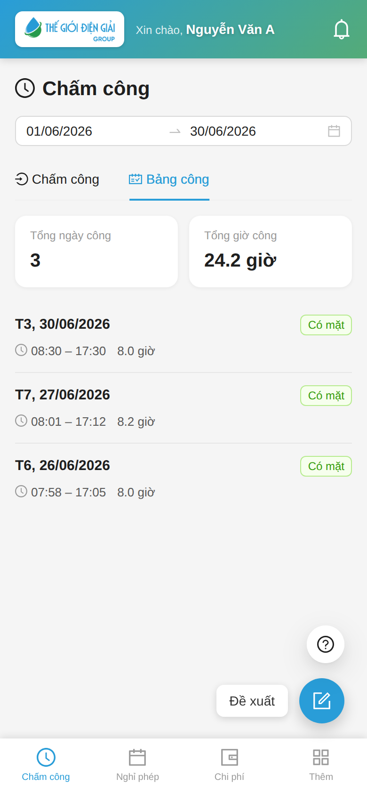
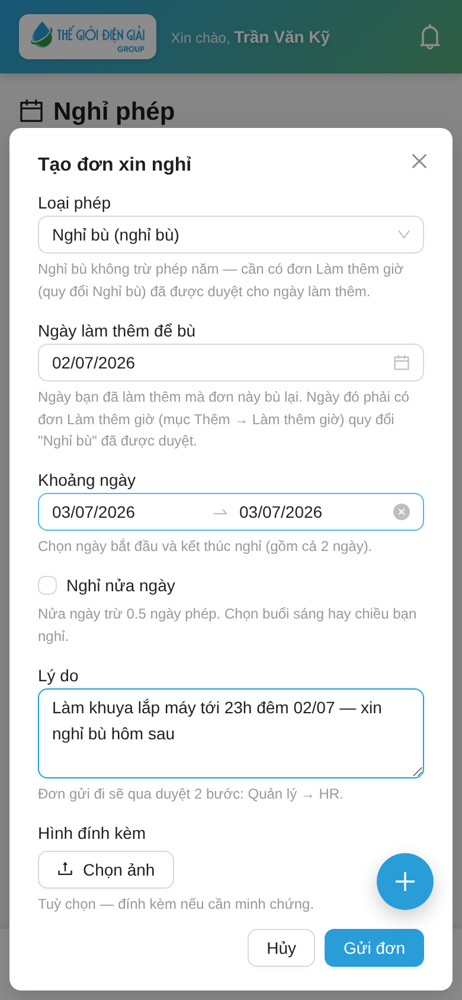

# KTV hiện trường: Chấm công ngoài văn phòng & Đề xuất công tác
{: .no_toc }

**Dành cho:** Kỹ thuật viên đi hiện trường (bảo dưỡng, lắp đặt, sửa chữa tại khách) · **Thời lượng:** ~5 phút
{: .fs-3 .text-grey-dk-000 }

> KTV không ngồi văn phòng cả ngày, nên chấm công của KTV **khác nhân viên thường**:
> **RA (check-out) ở đâu cũng được** — làm xong ở khách thì check-out tại chỗ, không cần quay về VP.
> Riêng **VÀO (check-in)** vẫn phải **đúng tại VP**; ngày nào **đi thẳng hiện trường từ sáng**
> (job xa, đi sớm) thì tạo **Đề xuất chấm công bù / Công tác** trước — có đơn là chấm ngoài VP được ngay.

  
Mục lục

{: .text-delta }
1. TOC
{:toc}

---

## 🎬 Video hướng dẫn (1 phút)

Xem nhanh cả 5 tình huống — check-in tại VP, check-out ở hiện trường, bị chặn khi vào ngoài VP,
tạo Đề xuất, và ngày được duyệt (bật tiếng để nghe thuyết minh):

<video src="images/guide/ktv/cham-cong-ktv.mp4" width="260" controls playsinline poster="images/guide/ktv/video-poster.png"></video>

---

## Toàn cảnh — 3 tình huống của KTV

| Tình huống | Việc cần làm | Công được tính |
|---|---|---|
| **Ngày thường** — sáng ghé VP lấy đồ/nhận việc, chiều làm xong ở khách | Check-in **tại VP**, check-out **tại hiện trường** (app tự cho qua) | Theo **giờ thật** từ lúc vào đến lúc ra |
| **Ngày đi thẳng hiện trường** — job xa, đi sớm, không ghé VP | Tạo **Đề xuất chấm công bù / Công tác** cho ngày đó (trước hoặc trong ngày) | Đơn duyệt → **ca chuẩn** cả ngày (Có mặt) |
| **Quên check-in / check-out** | Tạo **Đề xuất chấm công bù** cho ngày quên | Đơn duyệt → **ca chuẩn** (Có mặt) |
| **Làm khuya hôm trước** — muốn nghỉ hôm sau | Tạo đơn **Nghỉ bù** (tab Nghỉ phép — xem mục E) | Ngày nghỉ tính **On Leave**, không trừ phép năm |

---

## A. Điều kiện cần có (làm 1 lần, phần lớn do HR lo)

1. **Điện thoại đã đăng ký chấm công** — lần đầu mở app `my-workspace` sẽ có bước đăng ký thiết bị,
   HR duyệt là xong (xem [Cài app & Chấm công](Guide-NhanVien-ChamCong.html)).
2. **HR đã đưa bạn vào Whitelist KTV** — trong **HR Policy → Check-in Whitelist**, HR thêm bạn với
   **Phạm vi = OUT_ONLY** (VÀO đúng VP, RA tự do). KTV full-remote (không bao giờ ghé VP) thì HR để
   **ALL**. Bạn **không tự bật được** — chưa được thêm thì báo HR (xem [HR Policy & Whitelist](HR-Policy.html)).
3. **Có ca làm việc** — KTV vẫn cần Default Shift / Shift Assignment thì hệ thống mới tính công
   (HR đã gán sẵn khi tạo hồ sơ; xem [Vận hành theo phòng ban §3](Cham-Cong-Van-Hanh-Theo-Phong-Ban.html)).

> 💡 **Phân biệt 2 app:** app **`/technician`** (FSM) dùng cho **công việc** (lịch hẹn, work order,
> báo cáo dịch vụ). **Chấm công HR** làm trên app **`/my-workspace`** — tab **Chấm công**.

---

## B. Ngày thường: VÀO tại VP — RA tại hiện trường

**Bước 1 —** Sáng đến VP, mở **my-workspace → Chấm công** → bấm **Check-in** như bình thường
(bước này **phải đứng tại VP** — ngoài VP app sẽ báo *"Ngoài vùng văn phòng"*).

**Bước 2 —** Đi hiện trường làm việc cả ngày — không cần thao tác gì thêm.

**Bước 3 —** Làm xong ở khách, **check-out ngay tại chỗ**: mở app → **Check-out**. App **không**
kiểm tra vị trí cho chiều RA của KTV — đứng ở nhà khách, trên đường, hay ở nhà đều ghi nhận được.

> ✅ Công ngày này tính theo **giờ thật** (từ check-in đến check-out), như nhân viên bình thường.

> ⚠️ **Chỉ chiều RA được tự do.** Nếu sáng bạn đứng ngoài VP bấm **Check-in** (vào), app vẫn chặn
> *"Ngoài vùng văn phòng (cách … m)"* — đó là ngày "đi thẳng hiện trường", làm theo mục C.

---

## C. Ngày đi thẳng hiện trường: tạo Đề xuất trước, rồi chấm tại chỗ

Ngày có job xa / đi sớm / không ghé VP → cần **"giấy phép" cho ngày đó** = 1 đơn
**Đề xuất chấm công bù / Công tác** (Attendance Request). Tạo **trước ngày đi** hoặc **ngay trong ngày**.

### Bước 1 — Tạo Đề xuất trên app

Có **2 lối vào** cùng mở 1 form:

- **Ngay tab Chấm công** (nhanh nhất): dưới nút chấm công có dòng
  **"Đi công tác / làm ngoài? Đề xuất chấm công bù"** — bấm là mở thẳng form. Ngoài ra khi bạn
  **bấm Check-in mà bị chặn *"Ngoài vùng văn phòng"***, app hỏi luôn *"Tạo đề xuất?"* → bấm
  **Tạo đề xuất** để mở form tại chỗ.
- **Tab Bảng công:** chuyển sang tab **Bảng công** → bấm nút tròn **➕ Đề xuất** ở góc dưới phải.

   

3. Điền form **Đề xuất chấm công**:

   

   - **Loại đề xuất:** chọn **Chấm công bù / Công tác**.
   - **Khoảng ngày:** ngày đi hiện trường (chọn được nhiều ngày liên tục nếu job kéo dài).
   - **Nửa ngày:** chỉ tích khi xin nửa công cho đúng 1 ngày (vd sáng hiện trường, chiều về VP).
   - **Lý do:** ghi rõ job — vd *"Bảo dưỡng máy nén khách ABC, Long An — đi thẳng từ nhà"*.

4. Bấm **Gửi đề xuất** → app báo *"Đã gửi đề xuất, chờ quản lý duyệt"*. Đơn hiện trên **Bảng công**
   với nhãn **Đề xuất chấm bù · Chờ duyệt** (vàng).

   

### Bước 2 — Chấm công tại hiện trường (được ngay, không cần chờ duyệt)

Ngày đã có đơn (kể cả **đang Chờ duyệt**), app **cho check-in lẫn check-out ngoài VP** — không hiện
nhãn gì đặc biệt, cứ chấm như bình thường, hệ thống tự cho qua kiểm tra vị trí.

> 💡 Việc chấm công ngày này mang tính **ghi nhận có mặt tại hiện trường** (giờ, vị trí, ảnh) để quản
> lý đối chiếu. **Công không tính theo giờ chấm** — xem bước 3.

### Bước 3 — Quản lý duyệt → ngày được tính công ca chuẩn

- **Duyệt** → hệ thống **tự tạo công "Có mặt" theo ca chuẩn** của bạn cho (các) ngày trong đơn.
  Đơn biến mất khỏi danh sách chờ, thay bằng dòng công **Có mặt** trên Bảng công. Không có cảnh báo
  *đi trễ / về sớm / quên ra* cho ngày này.

- **Từ chối** → đơn chuyển nhãn **Từ chối** (đỏ) và ngày đó **không có công** (vắng) — kể cả khi bạn
  đã check-in/out ngoài VP, vì các lần chấm đó dựa trên đơn. Nếu thực tế có đi làm: hỏi quản lý lý do,
  **gửi lại đơn mới** với lý do rõ hơn, hoặc nhờ HR chỉnh tay.

> ⚠️ **Đừng ỷ lại đơn nháp.** Chấm ngoài VP bằng đơn *chưa duyệt* là "ứng trước lòng tin" — đơn bị
> từ chối thì ngày đó **vắng toàn bộ**. Job đột xuất thì tạo đơn ngay trong ngày và nhắn quản lý duyệt sớm.

---

## D. App quyết định cho / chặn thế nào? (thứ tự ưu tiên)

Mỗi lần bấm chấm công, hệ thống xét theo thứ tự — khớp dòng nào dừng ở dòng đó:

| Ưu tiên | Điều kiện | Kết quả |
|---|---|---|
| 1 | Ngày hôm nay **có Đề xuất** (chờ duyệt hoặc đã duyệt) phủ ngày | VÀO + RA **tự do mọi nơi**; công tính theo **đơn** (ca chuẩn khi duyệt) |
| 2 | Bạn trong Whitelist, phạm vi **ALL** | VÀO + RA tự do; công theo **giờ thật** |
| 3 | Bạn trong Whitelist, phạm vi **OUT_ONLY** và đang bấm **RA** | RA tự do; công theo **giờ thật** |
| 4 | Còn lại | **Ép đúng vị trí VP** (GPS/WiFi) |

> 🔒 Dù được bỏ kiểm tra vị trí, các lớp khác **vẫn giữ nguyên**: điện thoại phải là máy đã đăng ký,
> chống chấm trùng, chụp selfie (nếu công ty bật).

> ℹ️ Ngày whitelist check-in mà **không có lịch hẹn dịch vụ** (FS Service Appointment), bảng công có thể
> gắn cảnh báo **"Không có ca"** để HR rà soát — không ảnh hưởng nếu bạn làm việc thật, nhưng nên giữ
> lịch hẹn trên app technician đầy đủ.

---

## E. Làm khuya hôm trước → xin Nghỉ bù hôm sau

Lắp máy / sửa chữa tới khuya thì hôm sau được **nghỉ bù**. Đây là **đơn nghỉ phép** (không phải
Đề xuất chấm công), tạo ở tab **Nghỉ phép**:

1. Tab **Nghỉ phép** → bấm **+** → **Loại phép** chọn **"Nghỉ bù"**.
2. **Ngày làm thêm để bù** = hôm làm khuya (vd 02/07). **Khoảng ngày** = hôm muốn nghỉ (vd 03/07).
3. **Lý do** ghi rõ *làm gì, tới mấy giờ* — quản lý duyệt trên app chỉ nhìn thấy lý do.
4. Gửi → duyệt **2 bước** (Quản lý → HR) như nghỉ phép thường.

> 💡 **Nghỉ bù không trừ phép năm, không trừ lương** và không cần số dư. Chốt chặn duy nhất là
> **quản lý xác nhận hôm đó có làm khuya thật** — nên khai ngày + giờ cho chuẩn.
> Chi tiết: [Xin nghỉ phép §4](Guide-NhanVien-NghiPhep.html).

---

## F. Quản lý duyệt ở đâu?

Đơn của bạn đến **người duyệt chấm công** (Shift Request Approver — HR gán trong hồ sơ nhân viên
hoặc theo phòng ban; **có thể khác** người duyệt nghỉ phép). Người duyệt nhận **thông báo đẩy**,
mở tab **Cần duyệt** trên my-workspace, bấm **Duyệt** hoặc **Từ chối** — đơn chấm công bù
**duyệt 1 bước** (không qua bước HR như nghỉ phép).

> 📘 Chi tiết phía người duyệt: [Duyệt nghỉ phép & nghỉ bù (Manager + HR)](Duyet-Nghi-Phep.html).

---

## ⚠️ Lỗi thường gặp (KTV)

| Tình huống | Cách xử |
|---|---|
| Sáng ở hiện trường, **check-in bị chặn** "Ngoài vùng văn phòng" | Đúng cơ chế (VÀO phải tại VP). App hỏi luôn *"Tạo đề xuất?"* — bấm **Tạo đề xuất** ngay tại chỗ (hoặc dùng dòng "Đề xuất chấm công bù" dưới nút chấm công), làm theo mục C rồi chấm lại |
| **Check-out ở khách cũng bị chặn** | Bạn chưa được HR đưa vào Whitelist (hoặc phạm vi sai) — báo HR kiểm tra **HR Policy → Check-in Whitelist** |
| Đã chấm ngoài VP cả ngày nhưng đơn **bị từ chối** | Ngày đó vắng. Gửi lại đơn mới kèm bằng chứng (lịch hẹn, ảnh nghiệm thu) hoặc nhờ HR chỉnh tay |
| App báo **"No registered device found"** / lỗi thiết bị | Điện thoại chưa đăng ký hoặc bị đổi máy — đăng ký lại thiết bị, HR duyệt (xem [Cài app & Chấm công](Guide-NhanVien-ChamCong.html)) |
| Bảng công gắn cảnh báo **"Không có ca"** | Hôm đó không có lịch hẹn dịch vụ trên hệ thống — báo điều phối tạo lịch hẹn, hoặc giải trình với HR |
| Job kéo dài **nhiều ngày** ở tỉnh | Tạo **1 đơn** chọn khoảng ngày từ–đến là đủ, không cần mỗi ngày một đơn |
| Đơn duyệt rồi mà Bảng công chưa thấy dòng **Có mặt** | Kéo làm mới danh sách; nếu vẫn thiếu sau vài phút → báo HR |

---

## Liên quan

- 👤 [Cài app & Chấm công](Guide-NhanVien-ChamCong.html) — đăng ký thiết bị, chấm công hằng ngày
- 👤 [Chấm công ngoài VP & Đề xuất chấm công bù](Guide-NhanVien-ChamCongNgoai.html) — bản đầy đủ cho mọi nhân viên
- 👔 [Duyệt nghỉ phép & nghỉ bù (Manager + HR)](Duyet-Nghi-Phep.html)
- 👩‍💼 HR: [HR Policy & Whitelist](HR-Policy.html) · [Vận hành theo phòng ban (Sales / KTV)](Cham-Cong-Van-Hanh-Theo-Phong-Ban.html)
- 🔧 Kỹ thuật: [Attendance Request](HR-Attendance-Request.html)
