# Nhân viên: Cài app & Chấm công
{: .no_toc }

**Dành cho:** Nhân viên · **Thời lượng:** ~3 phút
{: .fs-3 .text-grey-dk-000 }

> Cài my-workspace lên điện thoại và chấm công vào/ra hằng ngày.

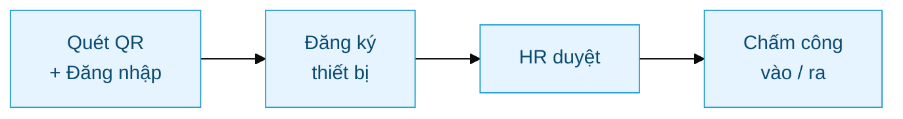

---

## A. Cài & mở app (làm 1 lần)

**Bước 1 — Quét QR** bằng camera điện thoại (hoặc mở link **[working.thegioidiengiai.com/my-workspace](https://working.thegioidiengiai.com/my-workspace)**), rồi **đăng nhập** bằng tài khoản công ty.

**Bước 2 — Thêm vào màn hình chính** để mở nhanh như app thật:

**📱 iPhone (Safari):** bấm nút **Chia sẻ** (ô vuông có mũi tên ↑, ở thanh dưới) → cuộn xuống bấm **"Thêm vào MH chính"**.

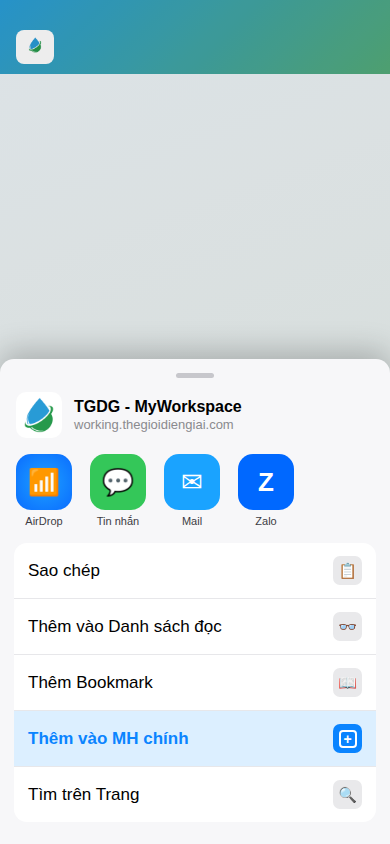

**🤖 Android (Chrome):** bấm menu **⋮** (góc trên phải) → bấm **"Cài đặt ứng dụng"** (hoặc "Thêm vào Màn hình chính").

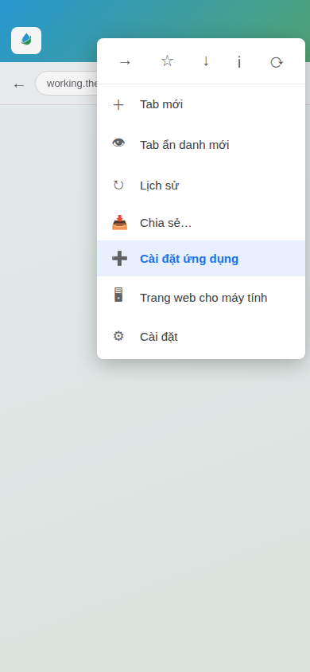

*Hình trên là minh hoạ giao diện iOS/Android (có thể khác chút theo phiên bản máy).*

> 📎 **Hướng dẫn chính thức:** [Google Chrome — cài app lên màn hình chính](https://support.google.com/chrome/answer/9658361) · [Apple — dùng web app trên iPhone](https://support.apple.com/vi-vn/guide/iphone/iph42ab2f3a7/ios)

> 💡 Sau khi cài, trên màn hình chính sẽ có icon **"TGDG - MyWorkspace"** — mở như app thường, khỏi vào trình duyệt.

---

## B. Đăng ký thiết bị (lần đầu)

**Bước 3** — Lần đầu mở app, bấm **Gửi yêu cầu đăng ký**. Mỗi nhân viên dùng **1 điện thoại** đã duyệt.

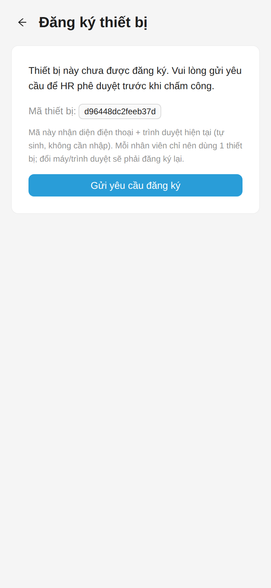

**Bước 4** — Chờ **HR duyệt**. Khi duyệt xong, mở lại app là chấm công được.

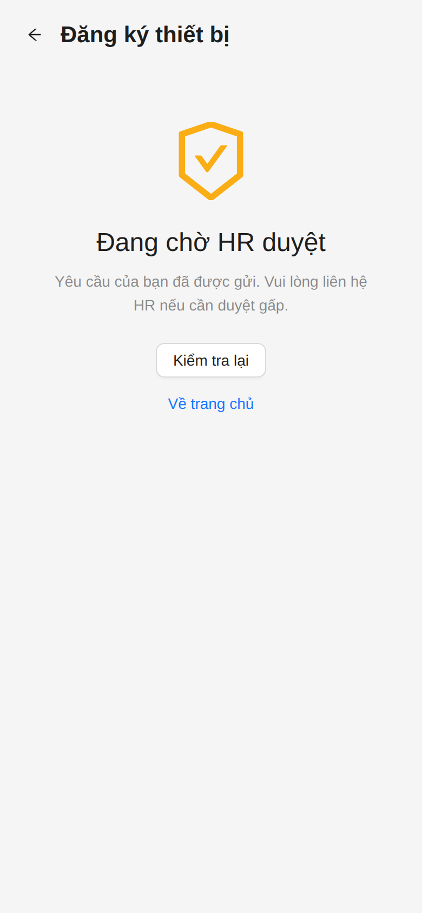

---

## C. Chấm công vào / ra (mỗi ngày)

🎬 **Video hướng dẫn** (có giọng đọc):

<video src="images/guide/nhanvien/checkin-flow.mp4" width="260" controls muted playsinline poster="images/guide/nhanvien/03-checkin-ready.png"></video>

**Bước 5** — Mở tab **Chấm công** → bấm nút **Chấm công (Vào)** (màu xanh lá).

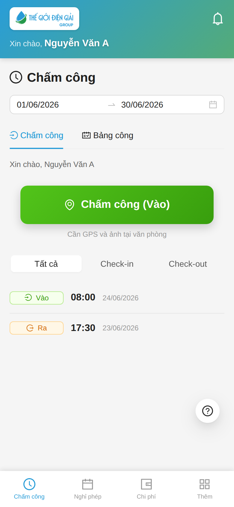

**Bước 6** — App lấy **vị trí** trên bản đồ → bấm **Chụp ảnh** để tự sướng (selfie) → rồi bấm **Check-in**.

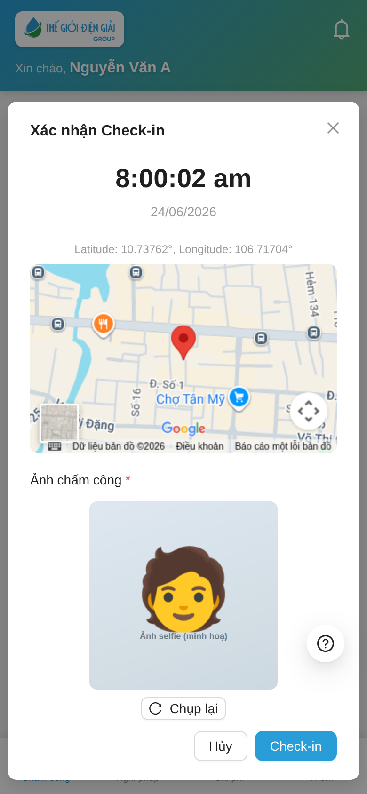

> 💡 Ảnh selfie là **bắt buộc** — chưa chụp thì nút **Check-in** chưa bấm được.

**Bước 7** — Thành công ✅ — hiện thông báo **"Check-in thành công lúc 08:00"**.

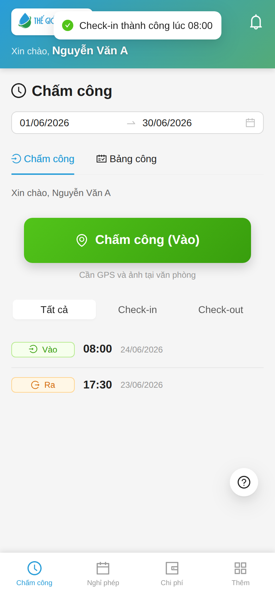

**Bước 8** — Cuối ca (vd 17:30), bấm nút **Chấm công (Ra)** (màu cam) → xác nhận **Check-out**.

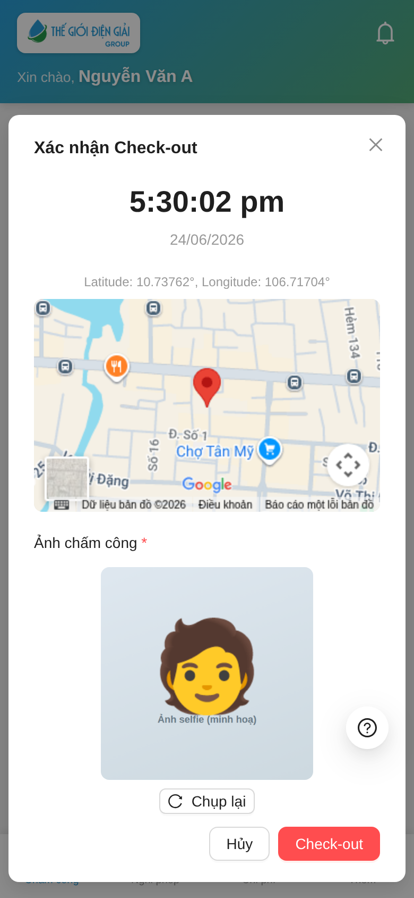

---

## D. Nếu bạn là Kỹ thuật viên (KTV)

KTV có thêm **tab FSM** ở thanh dưới — bấm để vào phần **công việc kỹ thuật** (lịch, work order, kho, thanh toán... — app technician).

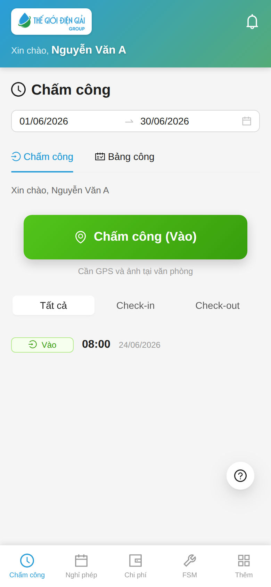

> 💡 Chấm công vẫn làm như mục C ở trên. Tab **FSM** chỉ hiện với KTV, để truy cập công việc hiện trường.

---

## ⚠️ Lỗi thường gặp

Ví dụ báo lỗi khi đứng **ngoài vùng văn phòng**:

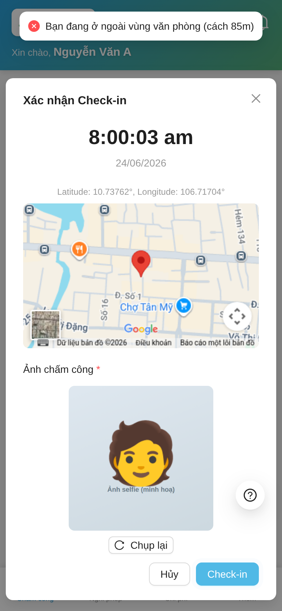

| Hiện tượng | Cách xử |
|---|---|
| "Thiết bị chưa đăng ký" | Chờ HR duyệt, hoặc báo HR nếu đã lâu |
| "Ngoài vùng văn phòng (cách Nm)" | Đứng trong khu vực VP rồi chấm lại; làm ngoài → cần đơn WFH/On Duty đã duyệt |
| Không bấm được nút | Kiểm mạng + bật quyền **Vị trí** cho trình duyệt |
| Đổi điện thoại | Đăng ký máy mới + báo HR duyệt lại |

---

## Liên quan
- [Xin nghỉ phép](HR-Leave-Setup.html) · [Đăng ký thiết bị (chi tiết)](HR-Checkin-Phone-Registration.html)
