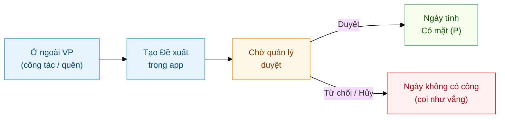
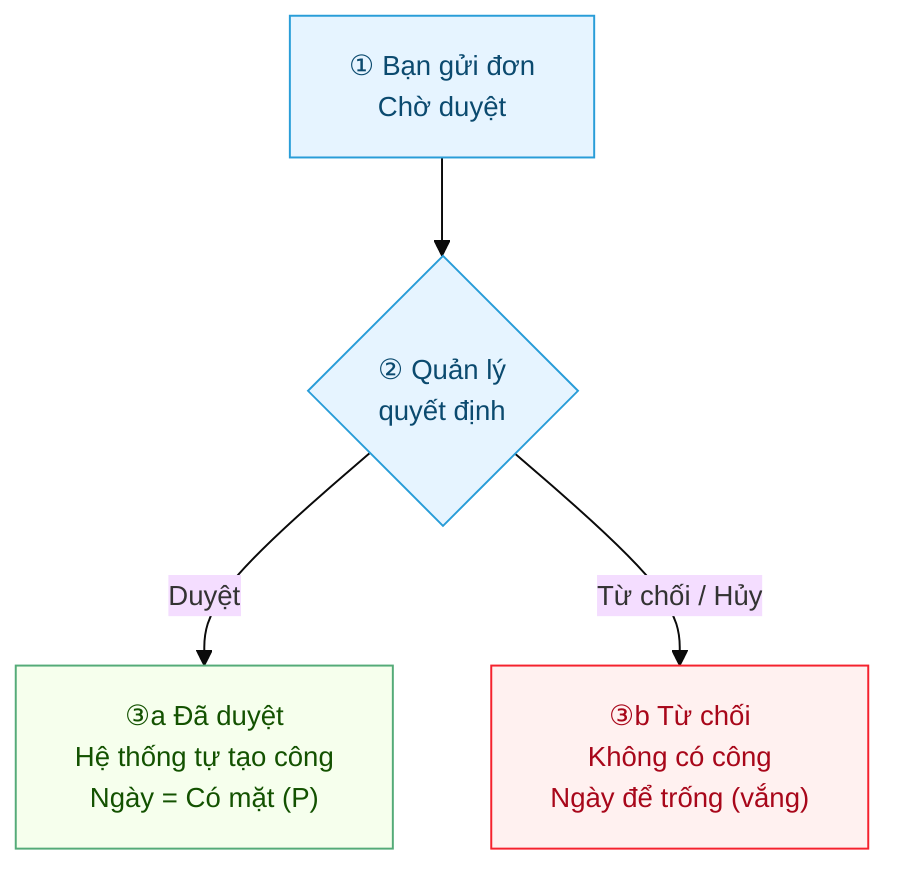

# Nhân viên: Chấm công ngoài văn phòng & Đề xuất chấm công bù
{: .no_toc }

**Dành cho:** Nhân viên đi công tác / làm ngoài / quên check-in · **Thời lượng:** ~4 phút
{: .fs-3 .text-grey-dk-000 }

> Bình thường app **bắt chấm công đúng tại văn phòng**. Khi bạn **đi công tác, làm ngoài, hoặc quên
> check-in**, hãy tạo **Đề xuất chấm công bù** ngay trong app — quản lý duyệt 1 lần là ngày đó được
> tính **Có mặt**.

  
Mục lục

{: .text-delta }
1. TOC
{:toc}

---

## Toàn cảnh

| Bạn gặp tình huống | Việc cần làm |
|---|---|
| Quên check-in / check-out một ngày | Tạo **Đề xuất chấm công bù** cho ngày đó |
| Đi công tác, gặp khách ở xa cả ngày | Tạo **Đề xuất chấm công bù** (Công tác) |
| Được duyệt làm việc tại nhà | Tạo **Đề xuất WFH** (nếu công ty bật WFH) |
| Bạn là KTV / Sales được phép ra-vào ngoài VP | Đã được HR mở quyền sẵn — xem [mục A](#a-khi-nào-được-chấm-công-ngoài-văn-phòng) |

---

## A. Khi nào được chấm công ngoài văn phòng?

App so vị trí GPS của bạn với **địa điểm văn phòng**. Có **3 trường hợp**:

| Trường hợp | Vào (IN) | Ra (OUT) |
|---|---|---|
| **Nhân viên thường** (mặc định) | Phải **đúng tại VP** | Phải **đúng tại VP** |
| **Được HR mở quyền "ra ngoài"** (vd KTV, Sales) | Tuỳ cấu hình: đúng VP **hoặc** ngoài VP | **Ngoài VP** thoải mái |
| **Ngày có Đề xuất chấm công bù / Công tác** | **Ngoài VP** được (cho ngày đó) | **Ngoài VP** được (cho ngày đó) |

Nếu bạn **không thuộc 2 nhóm sau** mà đứng ngoài VP bấm chấm công, app báo lỗi
**"Ngoài vùng văn phòng (cách … m)"** và **không** ghi nhận:

> 💡 Đây **không phải** lỗi máy — chỉ là bạn đang đứng **ngoài địa điểm được phép**. Nếu hôm đó bạn
> **đi công tác / làm ngoài**, hãy tạo **Đề xuất chấm công bù** (mục B) → ngày đó app sẽ cho bạn chấm
> công ngoài VP **và** tính công.

> 🔑 Quyền "ra ngoài cố định" (KTV/Sales) do **HR cấu hình** trong **HR Policy → Whitelist**
> (xem [HR: Whitelist chấm công](HR-Policy.html)). Bạn **không tự bật** được — cần báo HR.

---

## B. Tạo Đề xuất chấm công bù (trên app)

**Bước 1 —** Mở app **my-workspace** → tab **Bảng công** (lịch sử công của bạn) → bấm nút tròn
**➕ Đề xuất** ở góc dưới phải.

**Bước 2 —** Điền form **Đề xuất chấm công**:

- **Loại đề xuất:**
  - **Chấm công bù / Công tác** — quên check-in hoặc đi làm ngoài → ngày tính **Có mặt**.
  - **Làm việc tại nhà (WFH)** — chỉ hiện nếu công ty bật WFH; cần nhập thêm **địa điểm**.
- **Khoảng ngày:** chọn **1 ngày** (vd hôm nay) hoặc **nhiều ngày** liên tục cần xin công.
- **Nửa ngày:** tích nếu chỉ xin **nửa công** (chỉ áp dụng khi chọn đúng 1 ngày).
- **Lý do:** ghi rõ để quản lý duyệt nhanh — vd *"Đi công tác HCM gặp khách ABC"*, *"Quên check-out chiều"*.

**Bước 3 —** Bấm **Gửi đề xuất**. App báo **"Đã gửi đề xuất, chờ quản lý duyệt"**. Đơn xuất hiện
trên **Bảng công** với nhãn **"Đề xuất chấm bù"** + trạng thái **Chờ duyệt** (màu vàng):

> ⚠️ Nên tạo đơn **trong cùng tháng** với ngày cần bù. Ngoài tháng (đã chốt công) → báo **HR** xử lý tay.

> 💡 **Mẹo:** Tạo đơn **trước hoặc ngay trong ngày** đi công tác. Khi đã có đơn (dù **chưa duyệt**),
> app **cho phép bạn chấm công ngoài VP** cho ngày đó — tiện nếu bạn vẫn muốn chụp ảnh/ghi nhận giờ.

---

## C. Vòng đời một Đề xuất & tác động lên bạn

Đơn đề xuất đi qua các trạng thái sau. **Quản lý trực tiếp** của bạn là người duyệt
(xem [Duyệt nghỉ phép & chấm công bù](Duyet-Nghi-Phep.html)).

| Trạng thái | Bạn thấy gì trên **Bảng công** | Tác động lên công của bạn |
|---|---|---|
| **Chờ duyệt** (vàng) | Đơn nằm trong danh sách, nhãn *Chờ duyệt* | **Chưa** tính công; ngày đó tạm thời chưa có kết quả |
| **Đã duyệt** (xanh) | Đơn **biến mất**, thay bằng dòng công **Có mặt** (hoặc **WFH** / **Nửa ngày**) | Ngày được tính **Có mặt (P)**. Nếu bạn có check-in ngoài VP, các cảnh báo *"ngoài vùng / quên ra"* được **bỏ** |
| **Từ chối** (đỏ) | Đơn còn đó với nhãn *Từ chối* | **Không** có công → ngày đó **để trống** trên bảng công (coi như **vắng**), trừ khi ngày đó có công hợp lệ khác. Hỏi quản lý lý do, sửa & gửi lại nếu cần |

> ✅ **Đã duyệt = xong.** Hệ thống **tự tạo bảng công "Có mặt"** cho đúng ca làm của bạn — bạn **không
> cần** làm thêm gì. Ngày này sẽ hiện **P** (hoặc **WFH**) trên báo cáo
> [Bảng công tháng (Monthly Attendance Sheet)](Desk-HR-BangCongThang.html).

> ❌ **Bị từ chối thì sao?** Ngày đó **không được tính công** — trên bảng công ô ngày để **trống**
> (coi như vắng). Nếu thực tế bạn **có đi làm** mà bị từ chối nhầm, báo **quản lý / HR** — HR có thể
> chỉnh tay hoặc bạn **gửi lại đơn** với lý do rõ hơn.

> 🔁 **Đơn bị từ chối có gửi lại được không?** Được — tạo **đơn mới** cho ngày đó với lý do/bằng chứng
> rõ hơn (vd ảnh, lịch hẹn khách). Đơn cũ giữ nguyên trạng thái *Từ chối* để lưu vết.

---

## D. Người quản lý duyệt như thế nào?

Quản lý nhận **thông báo đẩy** + thấy đơn trong tab **Cần duyệt**. Đơn chấm công bù **duyệt 1 bước**
(khác nghỉ phép 2 bước):

- **Duyệt** → hệ thống tự tạo công **Có mặt** cho bạn.
- **Hủy / Từ chối** → đơn bị đóng, bạn không có công ngày đó.

> 📘 Chi tiết phía người duyệt: [Duyệt nghỉ phép & chấm công bù (Manager + HR)](Duyet-Nghi-Phep.html).

---

## ⚠️ Lỗi thường gặp

| Tình huống | Cách xử |
|---|---|
| Đứng ngoài VP, app báo **"Ngoài vùng văn phòng"** | Đúng cơ chế. Đi công tác → tạo **Đề xuất chấm công bù** cho ngày đó |
| Đã gửi đơn nhưng **chưa thấy duyệt** | Quản lý có thể chưa mở app — chờ chút hoặc nhắc quản lý; đơn vẫn nằm ở *Chờ duyệt* |
| Đơn **Đã duyệt** mà Bảng công vẫn trống | Kéo **làm mới** danh sách; đơn duyệt xong sẽ chuyển thành dòng công **Có mặt** |
| Quên **cả check-in lẫn check-out** | Tạo **1 đơn** cho cả ngày là đủ — không cần check-in nữa, duyệt là có công |
| Làm **nửa ngày ngoài**, nửa ngày ở VP | Tạo đơn **tích "Nửa ngày"**, ghi rõ lý do — quản lý duyệt sẽ tính nửa công |
| Không thấy mục **WFH** trong "Loại đề xuất" | Công ty **chưa bật WFH** — báo HR bật `enable_wfh_mode` ([HR Policy](HR-Policy.html)) |
| Cần xin bù **tháng trước** (đã chốt công) | Ngoài tháng → app có thể chặn; **báo HR** chỉnh tay trên Desk |

---

## Liên quan
- 🔧 [KTV hiện trường: Chấm công ngoài VP](Guide-KTV-ChamCong.html) — bản riêng cho kỹ thuật viên (OUT tự do + đề xuất ngày đi thẳng hiện trường)
- 👤 [Cài app & Chấm công](Guide-NhanVien-ChamCong.html) — chấm công vào/ra hằng ngày
- 👤 [Xin nghỉ phép](Guide-NhanVien-NghiPhep.html) · 🗺️ [Hành trình một đơn nghỉ phép](Hanh-Trinh-Nghi-Phep.html)
- 👔 [Duyệt nghỉ phép & chấm công bù (Manager + HR)](Duyet-Nghi-Phep.html)
- 👩‍💼 HR: [Bảng công tháng (Monthly Attendance Sheet)](Desk-HR-BangCongThang.html) · [Theo dõi & sửa chấm công](Desk-HR-ChamCong.html)
- 🔧 Kỹ thuật: [Attendance Request](HR-Attendance-Request.html) · [HR Policy & Whitelist](HR-Policy.html)
