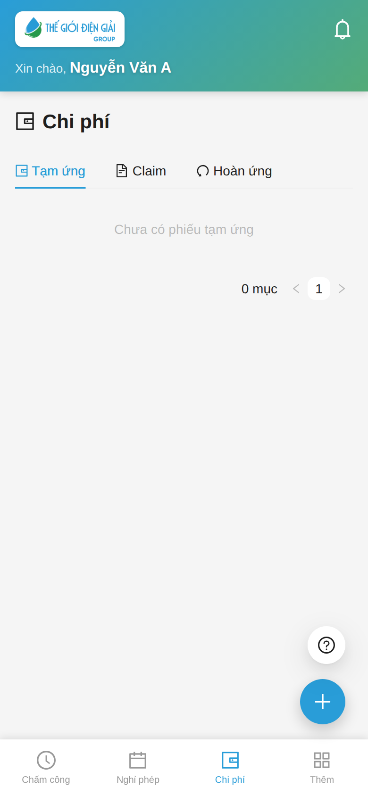

# Chi phí: tạm ứng / hoàn ứng / claim
{: .no_toc }

**Dành cho:** Nhân viên · **Thời lượng:** ~3 phút
{: .fs-3 .text-grey-dk-000 }

> Đề nghị **tạm ứng**, kê **claim** (chi phí đã chi, có hoá đơn) và **hoàn ứng** phần tiền dư — tất cả
> tạo ngay trên app. **Duyệt và chi/nhận tiền do quản lý + kế toán làm trên Desk** (phiếu chi phí
> **không** hiện trong tab "Cần duyệt" của app).
>
> 🗺️ Muốn hiểu cả vòng đời tiền đi đâu về đâu, ai duyệt bước nào: xem
> **[Hành trình một yêu cầu chi phí](Hanh-Trinh-Chi-Phi.html)**.

  
Mục lục

{: .text-delta }
1. TOC
{:toc}

---

## Tab Chi phí — 3 mục

Mở tab **Chi phí** ở thanh dưới:

| Mục | Dùng khi | Phiếu đi đâu sau khi gửi |
|---|---|---|
| **Tạm ứng** | Xin ứng trước một khoản (đi công tác, mua vật tư) | Quản lý duyệt → kế toán chi tiền → nhãn `Paid` + *"Đã nhận"* |
| **Claim** | Kê chi phí **đã chi** (có hoá đơn) — tự trừ vào tiền ứng | Người duyệt chi phí Approve → phần vượt ứng được trả thêm |
| **Hoàn ứng** | Trả lại phần tạm ứng còn dư | Kế toán nhận tiền + xác nhận → khoản ứng tất toán |

Nút **➕** góc dưới phải mở nhanh cả 3 loại: **Tạm ứng / Claim / Hoàn ứng**.

---

## A. Tạo Tạm ứng

**➕ → Tạm ứng** → form **"Tạo yêu cầu tạm ứng"**:

- **Số tiền đề nghị (đ)** — vd 500.000.
- **Mục đích** — ghi rõ, vd *"Mua vật tư sửa chữa máy lạnh"*.
- **Work Order / Service Appointment** *(tuỳ chọn — KTV nên chọn)* — gắn phiếu vào đúng job/công
  trình để kế toán đối chiếu.

Gửi xong phiếu hiện ở tab **Tạm ứng**, nhãn `Draft`. Theo dõi nhãn để biết đến đâu:

| Nhãn | Nghĩa |
|---|---|
| `Draft` | Chờ quản lý duyệt (trên Desk) |
| `Unpaid` | Duyệt rồi, kế toán chưa chi tiền |
| `Paid` | **Đã nhận tiền** — dòng phiếu hiện *"Đã nhận: …đ"* |
| `Claimed` / `Returned` / `Partly Claimed and Returned` | Đã quyết toán (claim hết / hoàn hết / nửa nọ nửa kia) |

> 💡 Số duyệt có thể **thấp hơn số xin** — nhìn *"Đã nhận"* là số thật.

---

## B. Tạo Claim (kê chi phí đã chi)

2 lối vào:

- Tab **Tạm ứng** → dòng khoản ứng `Paid` có nút **Claim** + số *"Có thể claim: …đ"* — dùng lối này
  khi quyết toán một khoản ứng cụ thể;
- hoặc **➕ → Claim**.

Form **"Tạo yêu cầu chi phí"**:

1. **Thêm từng dòng chi phí**: chọn **Loại chi phí** → nhập **Số tiền (đ)** → mô tả (tuỳ chọn).
   Nhiều hoá đơn = nhiều dòng.
2. **Chụp / tải ảnh hoá đơn** đính kèm — đủ chứng từ thì duyệt mới nhanh.
3. *(Tuỳ chọn)* gắn **Work Order / Service Appointment**.
4. Gửi. App **tự trừ vào các khoản ứng còn dư** (khoản cũ trừ trước) và hiện phần phân bổ — không
   phải chọn tay.

| Nhãn trên tab Claim | Nghĩa |
|---|---|
| `Draft` | Chờ người duyệt chi phí xử lý trên Desk |
| `Unpaid` | Đã duyệt — chờ kế toán trả phần vượt ứng |
| `Paid` | Xong — đã duyệt + thanh toán đủ |
| `Từ chối` (đỏ) | Bị reject — xem lại hoá đơn/loại chi phí, tạo claim mới |

---

## C. Tạo Hoàn ứng (trả tiền dư)

Khi khoản ứng còn dư sau claim, dòng phiếu hiện **"Cần hoàn: …đ"** (cam):

1. Bấm **Hoàn ứng** ngay trên dòng đó (hoặc **➕ → Hoàn ứng** rồi chọn khoản ứng trong danh sách).
2. Nhập **Số tiền hoàn** — không vượt được số dư.
3. Chọn **Hình thức hoàn**: **Tiền mặt** / **Chuyển khoản**.
4. Gửi → phiếu Draft nằm ở tab **Hoàn ứng**. **Đưa tiền/chuyển khoản cho công ty** → kế toán xác
   nhận trên Desk thì khoản ứng mới hết treo "Cần hoàn".

---

## ⚠️ Lưu ý & lỗi thường gặp

| Tình huống | Cách xử |
|---|---|
| Tab Chi phí báo **"chưa cấu hình"** | Công ty chưa set tài khoản tạm ứng / phải trả / loại chi phí → báo Kế toán/HR |
| Phiếu nằm `Draft` lâu | Người duyệt xử lý trên **Desk**, không thấy trong tab Cần duyệt của app — nhắc trực tiếp quản lý/kế toán |
| `Unpaid` mãi chưa có tiền | Kế toán chưa làm lệnh chi — hỏi kế toán |
| Không claim được | Khoản ứng phải đang `Paid` và còn *"Có thể claim"*; không có khoản ứng nào thì claim vẫn tạo được — toàn bộ thành khoản công ty trả thêm |
| Claim bị **Từ chối** | Bổ sung hoá đơn / sửa loại chi phí rồi gửi claim mới |
| Hoàn rồi vẫn hiện "Cần hoàn" | Kế toán chưa xác nhận nhận tiền — nhắc kế toán Submit phiếu |

---

## Liên quan
- 🗺️ [Hành trình một yêu cầu chi phí (NV → Duyệt → Kế toán)](Hanh-Trinh-Chi-Phi.html) — toàn cảnh + phía Desk
- [Xin nghỉ phép](Guide-NhanVien-NghiPhep.html) · [Thông báo & Tài khoản](Guide-NhanVien-Taikhoan.html)
