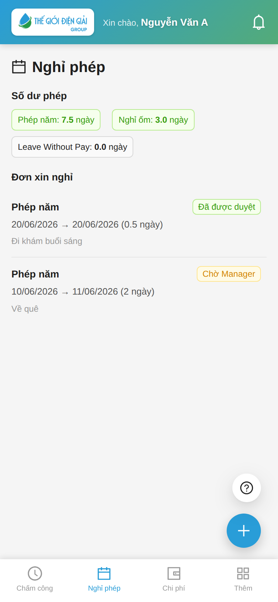
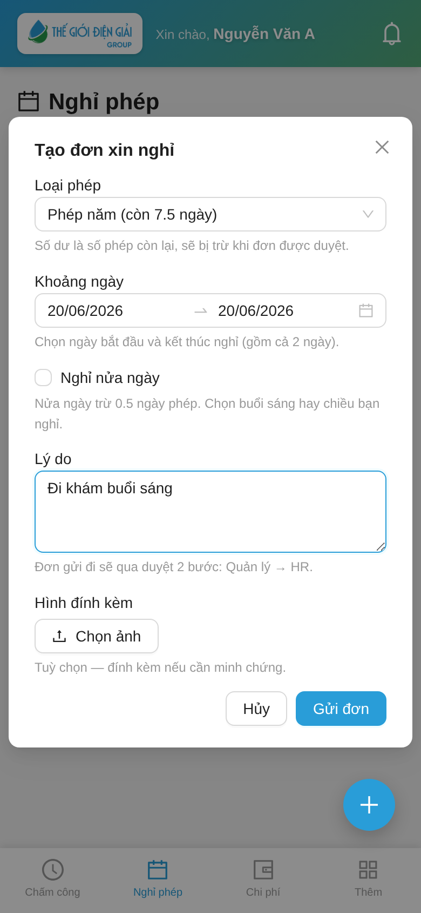
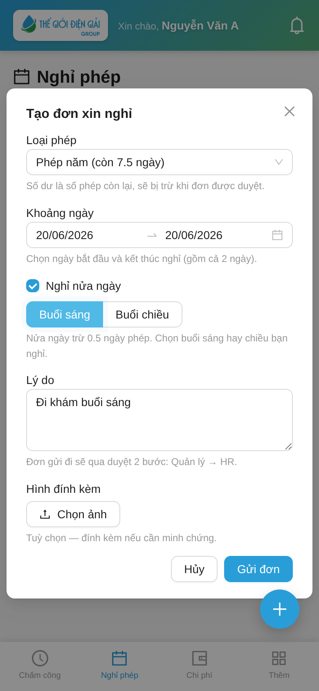
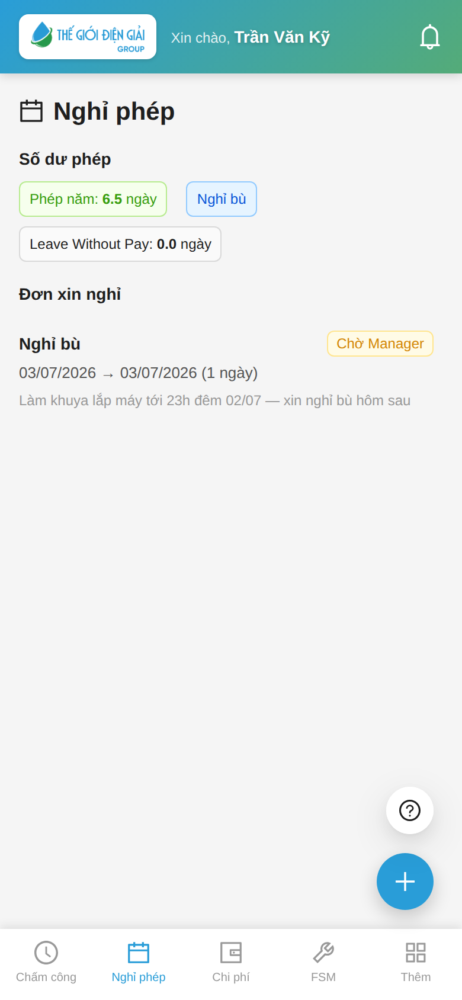
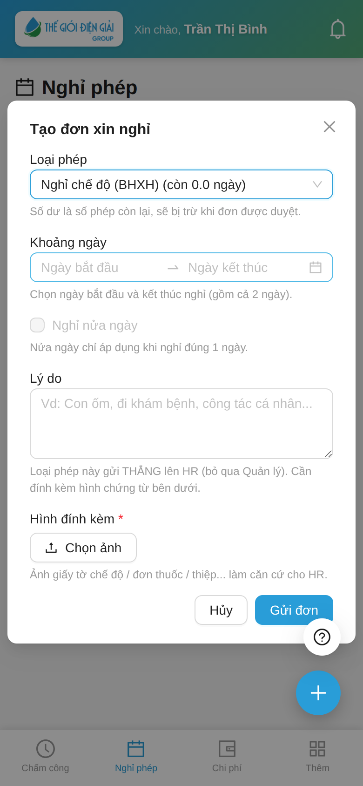

# Xin nghỉ phép & nghỉ bù
{: .no_toc }

**Dành cho:** Nhân viên · **Thời lượng:** ~1 phút
{: .fs-3 .text-grey-dk-000 }

> Xem số ngày phép còn lại và gửi đơn xin nghỉ ngay trên điện thoại.

---

## 🎬 Video hướng dẫn (1 phút)

Xem nhanh cả 4 thao tác — xem số dư, tạo đơn thường, nghỉ nửa ngày, và xin Nghỉ bù sau ngày làm
thêm (bật tiếng để nghe thuyết minh):

<video src="images/guide/nhanvien/nghi-phep.mp4" width="260" controls playsinline poster="images/guide/nhanvien/nghi-phep-poster.png"></video>

---

## 1. Xem số dư & đơn đã gửi

Mở tab **Nghỉ phép**:
- **Số dư phép**: ngay đầu trang, mỗi loại phép là **một chip riêng** hiện số ngày **còn lại theo từng loại** (vd `Phép năm: 6,0 ngày`). Chip **xanh** = còn phép, **xám** = đã hết (0).
- **Đơn xin nghỉ**: danh sách đơn đã gửi, chia **4 tab** — **Chờ duyệt** · **Đã duyệt** · **Từ chối** · **Đã hủy**.
  Mở app lên, nếu không còn đơn nào đang chờ thì app tự nhảy sang tab có đơn, khỏi phải bấm tìm.

> 🚫 **Đơn bị huỷ không biến mất.** Đơn đã duyệt mà HR rút lại nằm ở tab **Đã hủy**, kèm **lý do huỷ**
> — số ngày phép đã trừ cũng được hoàn lại. Đơn bị **Từ chối** cũng vậy: nằm ở tab *Từ chối* kèm lý do.

> 💡 **Số dư trên chip là số THỰC còn dùng được** — đã tự trừ: phép đã nghỉ + **đơn đang chờ duyệt** + phép chuyển kỳ đã hết hạn. Không cần tính tay.
>
> Lưu ý theo loại:
> - Chỉ loại **được HR cấp** (có quỹ phép, vd Phép năm) mới hiện **con số**.
> - **Nghỉ bù** hiện chip **không có số** — vì nó không dùng quỹ phép cố định; số ngày bù thật nằm ở [phiếu làm thêm đã duyệt](Guide-NhanVien-LamThem.html), không phải ở đây.
> - **Nghỉ không lương** hiện `0,0` (không có quỹ; nghỉ loại này bị trừ lương).
>
> Chip chỉ hiện **số còn lại**, chưa tách riêng "đã dùng / đang chờ duyệt". Muốn xem chi tiết đã nghỉ bao nhiêu thì mở **danh sách đơn** bên dưới.

---

### Các loại phép trong danh sách nghĩa là gì?

Khi bấm tạo đơn, ô **Loại phép** có thể hiện mấy loại sau — khác nhau ở chỗ *trừ vào đâu*:

| Loại | Khi nào dùng | Cần HR cấp phép trước? | Trừ gì |
|---|---|---|---|
| **Phép năm** (Annual Leave), Nghỉ ốm… | Nghỉ có lương thông thường | **Có** — HR phải cấp số ngày phép | Trừ **quỹ phép** của bạn |
| **Nghỉ không lương** (Leave Without Pay) | Hết phép / chưa được cấp phép mà vẫn cần nghỉ | Không | **Trừ lương** ngày nghỉ đó |
| **Nghỉ bù** | Bù lại ngày đã làm thêm giờ | Không | **Không trừ gì** — nhưng phải có [phiếu làm thêm đã duyệt](Guide-NhanVien-LamThem.html) |

> ❓ **Chỉ thấy "Nghỉ không lương" và "Nghỉ bù", không thấy Phép năm?**
> Nghĩa là bạn **chưa được cấp phép năm** (chưa có Leave Allocation). Hai loại kia luôn
> hiện vì không cần cấp trước. Báo HR cấp phép năm cho bạn.

---

## 2. Tạo đơn xin nghỉ

Bấm nút **+** (góc dưới phải) → điền:

1. **Loại phép** — chọn loại (hiện số dư còn lại).
2. **Khoảng ngày** — ngày bắt đầu → kết thúc (gồm cả 2 ngày).
3. **Lý do** — ghi ngắn gọn.
4. Bấm **Gửi đơn**.

> 💡 Đơn đi qua **2 bước duyệt: Quản lý → HR**. Theo dõi trạng thái ở danh sách mục 1.
> *(Riêng phép **chế độ / BHXH / WFH** và đơn của **quản lý** đi thẳng HR — xem mục 5.)*

### Trừ bao nhiêu ngày phép?

Bạn chọn **khoảng ngày**, nhưng hệ thống **không trừ hết** mọi ngày trong khoảng đó —
ngày nghỉ sẵn thì **không tính là phép**:

| Ngày trong khoảng | Có bị trừ phép? |
|---|---|
| Ngày làm bình thường | ✅ trừ 1 ngày |
| **Chủ Nhật** | ❌ không trừ |
| **Ngày lễ** (Tết, 30/4, Quốc khánh…) | ❌ không trừ |
| **Thứ 7** — nếu ca của bạn **làm nửa buổi Thứ 7** (khối văn phòng) | ✅ trừ **0.5 ngày** |
| **Thứ 7** — nếu ca của bạn **làm cả ngày Thứ 7** | ✅ trừ 1 ngày |

> Thứ 7 nửa buổi **vẫn là ngày làm** (làm 4 giờ buổi sáng), nên nghỉ hôm đó vẫn trừ
> phép — chỉ trừ **nửa ngày** thôi. 0.5 ngày phép ở đây luôn có nghĩa **4 giờ làm
> việc**, không phải "một nửa của ngày hôm đó".

> Ca của bạn có làm nửa buổi Thứ 7 hay không là do **cấu hình ca** — không chắc thì
> cứ nhìn con số ngày thực trừ (xem ô 💡 bên dưới) hoặc hỏi HR.

**Ví dụ** — xin nghỉ **Thứ 6 24/07 → Thứ 2 27/07** (4 ngày lịch):

- NV **làm nửa buổi Thứ 7**: trừ **2.5 ngày** (Thứ 6 + Thứ 2 = 2, Thứ 7 = 0.5, Chủ Nhật = 0)
- NV **làm cả ngày Thứ 7**: trừ **3 ngày** (chỉ Chủ Nhật không tính)

> 💡 Form tạo đơn **chưa hiện** con số này. Gửi xong, mở **danh sách đơn** (mục 1) là thấy
> `… (2 ngày)` bên cạnh khoảng ngày — đó mới là số ngày thực trừ. Thấy ít hơn số ngày
> bạn chọn là **đúng**, không phải lỗi.

---

> ✏️ **Điền sai vẫn sửa được** khi đơn còn **"Chờ trưởng bộ phận"**: mở đơn → **Sửa đơn** → gửi lại.
> Qua bước trưởng bộ phận duyệt rồi thì không sửa nữa.
>
> ✍️ **Bị từ chối** thì mở đơn ra là thấy **Lý do từ chối** (người duyệt bắt buộc ghi) — biết
> đường chỉnh rồi gửi đơn mới.

---

## 3. Nghỉ nửa ngày (sáng / chiều)

Khi chỉ cần nghỉ **một buổi** (vd sáng đi khám, chiều đi làm):

1. Ở **Khoảng ngày**, chọn **đúng 1 ngày** (ngày bắt đầu = ngày kết thúc).
2. Tích ô **Nghỉ nửa ngày**.
3. Chọn **Buổi sáng** hoặc **Buổi chiều** — đúng buổi bạn nghỉ.
4. Bấm **Gửi đơn** như thường.

> 💡 **Hệ thống trừ 0.5 ngày phép** cho đơn nửa ngày (không phải 1 ngày). Buổi
> bạn chọn (sáng/chiều) để Quản lý & HR biết bạn nghỉ buổi nào — **buổi còn lại
> bạn vẫn đi làm và chấm công bình thường**.

> ✅ **Đi làm buổi sáng rồi trưa mới xin nghỉ buổi chiều — được.** Dù sáng bạn
> đã chấm công (ngày đó đã có công), đơn **nửa ngày** vẫn gửi được như thường.
> Buổi đã làm **vẫn được tính công**, buổi nghỉ trừ 0.5 ngày phép.

**Lưu ý:**
- Ô **Nghỉ nửa ngày** chỉ bật được khi bạn chọn **đúng 1 ngày**. Chọn khoảng
  nhiều ngày thì ô này mờ đi (nửa ngày không áp dụng cho nhiều ngày).
- Buổi sáng hay chiều **trừ phép như nhau** (đều 0.5 ngày) — chọn cho đúng buổi
  để Quản lý nắm lịch, không ảnh hưởng số phép.
- Ngày bạn **đã đi làm** thì chỉ xin được **nửa ngày**. Xin **nghỉ cả ngày** cho
  hôm đó app sẽ chặn (đã có công rồi mà lại nghỉ trọn ngày là mâu thuẫn) — cần
  sửa thì báo HR.
- **Ngày nghỉ (Chủ Nhật / lễ) không xin nửa ngày được** — hôm đó vốn đã nghỉ,
  và nếu bạn có đi làm thì đó là **làm thêm**, khai [đơn Làm thêm giờ](Guide-NhanVien-LamThem.html)
  chứ không phải đơn nghỉ.
- **Thứ 7 nửa buổi** thì ô này đổi thành **"Nghỉ ca trực buổi chiều"**:
  - **Không tích** = nghỉ buổi làm chính (sáng) → trừ **0.5 ngày**.
  - **Tích** = nghỉ **ca trực buổi chiều** (13:30–17:30) → cũng trừ **0.5 ngày**.
    Dùng khi bạn **đã đi làm buổi sáng** rồi mới xin nghỉ ca trực — trường hợp này
    app cho gửi đơn bình thường dù sáng đã có chấm công.
- Mỗi ngày chỉ **1 đơn nửa ngày**. Cần nghỉ nốt buổi còn lại thì báo HR, đừng gửi đơn thứ hai.

---

## 4. Nghỉ bù (sau ngày làm thêm / làm khuya)

Hôm trước **làm thêm giờ / làm khuya** (hay gặp ở kỹ thuật viên đi lắp máy đêm)? Bạn được xin
**Nghỉ bù** — nhưng nhớ điều kiện tiên quyết:

> ⚠️ **Bước 0 (khai SAU khi đã làm thêm):** khai đơn **Làm thêm giờ** với quy đổi
> **"Nghỉ bù"** cho **ngày đã làm** (trong hạn khai của công ty) và được Quản lý duyệt — xem
> [Xin làm thêm giờ](Guide-NhanVien-LamThem.html). Không có đơn này, hệ thống sẽ
> **từ chối đơn Nghỉ bù ngay khi gửi**.

Có đơn làm thêm đã duyệt rồi thì tạo đơn nghỉ y như nghỉ phép thường, chỉ khác **Loại phép**:

1. Bấm **+** → **Loại phép** chọn **"Nghỉ bù"**.
2. Form hiện thêm ô **"Ngày làm thêm để bù"** (bắt buộc) — chọn **đúng ngày trong đơn
   Làm thêm giờ đã duyệt**.
3. **Khoảng ngày** = ngày muốn nghỉ (thường là hôm sau).
4. **Lý do:** ghi rõ **làm gì, tới mấy giờ** — vd *"Làm khuya lắp máy tới 23h đêm 02/07"*.
5. **Gửi đơn** → duyệt **2 bước như nghỉ phép thường** (Quản lý → HR).

Điểm khác nghỉ phép thường:

| | Phép năm | **Nghỉ bù** |
|---|---|---|
| Trừ quỹ phép? | Có (hết quỹ là không xin được) | **Không** — không cần số dư |
| Trừ lương? | Không | **Không** |
| Cần khai gì thêm? | — | **Ngày làm thêm để bù** |
| Ai xác nhận làm thêm là có thật? | — | **Hệ thống tự kiểm**: phải có đơn Làm thêm giờ đã duyệt cho đúng ngày đó |
| Dùng lại được không? | — | Mỗi ngày làm thêm chỉ bù **1 lần** |

---

## 5. Phép chế độ / BHXH / WFH — gửi thẳng HR

Vài loại phép **không qua Quản lý** mà vào **thẳng HR** (nhanh hơn, nhưng cần chứng từ). Bạn không
phải chọn gì — **chọn đúng loại phép là form tự đổi**:

- Form báo **"gửi THẲNG lên HR (bỏ qua Quản lý)"**.
- Xuất hiện ô **Hình đính kèm** có dấu **\*** (bắt buộc) — chụp **giấy chế độ / đơn thuốc / xác nhận**
  làm căn cứ cho HR. Chưa đính kèm thì **không gửi được**.
- Gửi xong hiện **"Đã gửi đơn. Chờ HR duyệt."** — chỉ còn **1 bước** (HR).

> 💡 Nếu bạn **là quản lý** (đang duyệt đơn cho người khác), **mọi đơn** của bạn cũng đi thẳng HR —
> nhưng **không cần đính kèm**.

---

## ⚠️ Lưu ý

| Tình huống | Cách xử |
|---|---|
| Chỉ thấy "Leave Without Pay" | Bạn chưa được cấp loại phép nào có lương → báo HR cấp **Leave Allocation** |
| "Chưa có người duyệt phép" | HR chưa gán người duyệt cho phòng bạn → báo HR |
| Đơn vẫn "Chờ" sau khi Quản lý duyệt | Còn chờ **HR duyệt bước 2** mới chính thức |
| Không thấy loại **"Nghỉ bù"** | Công ty chưa bật Leave Type Nghỉ bù → báo HR |
| Xin Nghỉ bù mà app đòi "Ngày làm thêm để bù" | Ô này **bắt buộc** với Nghỉ bù — chọn đúng hôm đã làm thêm |
| "Ngày … không có đơn Làm thêm giờ đã duyệt…" | Ngày đó thiếu đơn Làm thêm (quy đổi Nghỉ bù) đã duyệt → [khai đơn làm thêm](Guide-NhanVien-LamThem.html) cho ngày đã làm (trong hạn khai của công ty) |
| "Đơn nghỉ từ ngày … đã quá hạn nộp" | Công ty đặt hạn nộp đơn sau khi đã nghỉ — quá hạn thì liên hệ HR tạo thủ công. Riêng Nghỉ bù: hạn tính từ ngày nghỉ **hoặc** ngày đơn làm thêm được duyệt, mốc nào muộn hơn |
| "Ngày làm thêm … đã được dùng cho đơn Nghỉ bù …" | Ngày làm thêm đó đã bù rồi — mỗi ngày chỉ bù 1 lần |
| Đơn trừ **ít ngày hơn** số ngày mình chọn | **Đúng, không phải lỗi** — Chủ Nhật và ngày lễ không trừ phép, Thứ 7 nửa buổi chỉ trừ 0.5. Xem bảng ở mục 2 |
| *"The day(s) on which you are applying for leave are holidays…"* khi xin nghỉ **Thứ 7** | Lỗi cũ, đã sửa. Từ bản 03/08/2026 nghỉ Thứ 7 nửa buổi gửi được bình thường và trừ 0.5 ngày. Còn gặp thì báo HR (bản vá chưa lên) |
| *"Attendance … is already marked for the following dates …"* | Hôm đó bạn **đã chấm công** rồi. Muốn nghỉ một buổi thì tích **Nghỉ nửa ngày** (được, kể cả khi sáng đã đi làm). Còn nếu bạn định nghỉ **cả ngày** — hoặc ngày đó là **Chủ Nhật / lễ** — thì app chặn, báo HR xử |

---

## Liên quan
- ⏱️ [Xin làm thêm giờ (OT)](Guide-NhanVien-LamThem.html) — điều kiện tiên quyết của Nghỉ bù
- 🗺️ [Hành trình một đơn nghỉ phép (NV → Manager → HR)](Hanh-Trinh-Nghi-Phep.html) — đơn của bạn được duyệt thế nào
- 🔁 [Hành trình một ngày Nghỉ bù](Hanh-Trinh-Nghi-Bu.html) — kiếm giờ làm thêm → đổi ngày nghỉ
- 🚫 [Huỷ đơn nghỉ đã duyệt](Duyet-Huy-Don-Nghi-Phep.html) — đơn của bạn bị rút lại thì xem ở đâu, vì sao
- [Cài app & Chấm công](Guide-NhanVien-ChamCong.html) · [Chi phí](Guide-NhanVien-ChiPhi.html)
