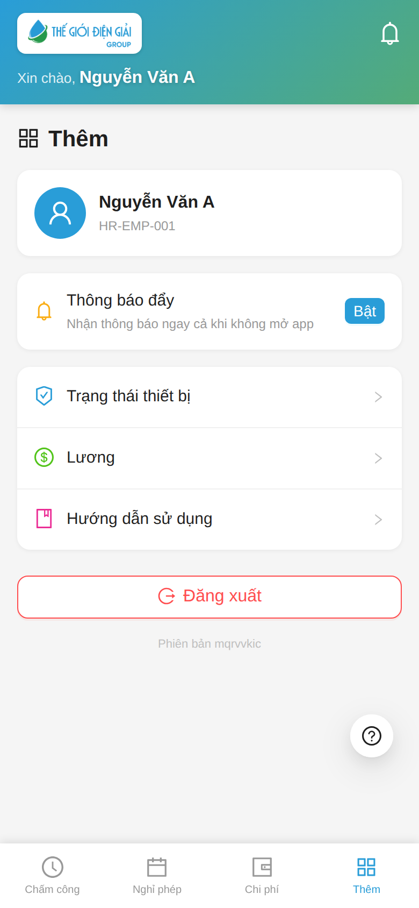

# Thông báo & Tài khoản (tab Thêm)
{: .no_toc }

**Dành cho:** Nhân viên · **Thời lượng:** ~1 phút
{: .fs-3 .text-grey-dk-000 }

> Bật thông báo đẩy, xem trạng thái thiết bị, lương, hướng dẫn, và đăng xuất.

---

## Tab "Thêm"

| Mục | Để làm gì |
|---|---|
| **Thông báo đẩy** → bấm **Bật** | Nhận thông báo (đơn cần duyệt, đơn được duyệt…) **ngay cả khi không mở app** |
| **Trạng thái thiết bị** | Xem/đăng ký lại thiết bị chấm công |
| **Lương** | Xem phiếu lương (khi mở) |
| **Hướng dẫn sử dụng** | Mở tài liệu hướng dẫn |
| **Đăng xuất** | Thoát tài khoản |

---

## Bật thông báo đẩy

1. Bấm **Bật** ở thẻ "Thông báo đẩy".
2. Trình duyệt hỏi quyền → chọn **Cho phép / Allow**.
3. Thành công → hiện **Đã bật** (xanh).

> 💡 iPhone: phải **Thêm vào màn hình chính** trước (xem [Cài app](Guide-NhanVien-ChamCong.html)) rồi mở app từ màn hình chính mới bật được thông báo.

---

## ⚠️ Lưu ý

| Hiện tượng | Cách xử |
|---|---|
| Bấm Bật nhưng "Đã bị chặn" | Trình duyệt đã chặn quyền → vào Cài đặt site bật lại Thông báo |
| "Không hỗ trợ" | Trình duyệt/thiết bị không hỗ trợ (vd webview Zalo) → mở bằng Safari/Chrome |

---

## Liên quan
- [Cài app & Chấm công](Guide-NhanVien-ChamCong.html) · [HR Push Notification (kỹ thuật)](HR-Push-Notification.html)
