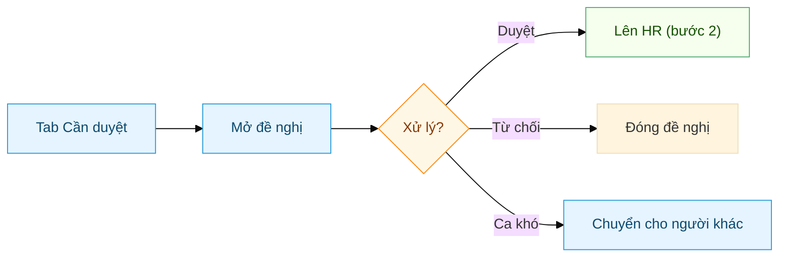
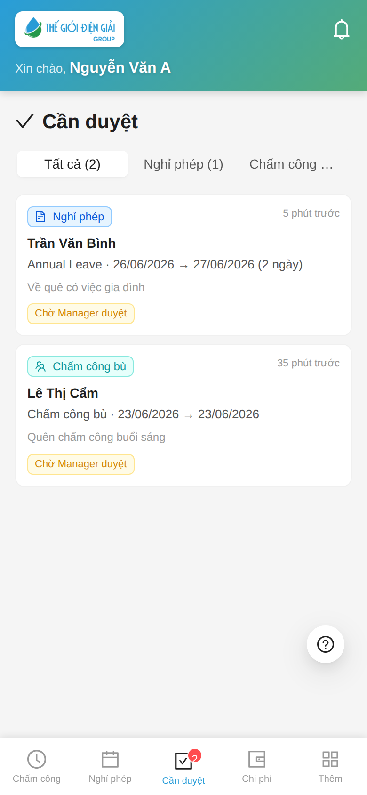
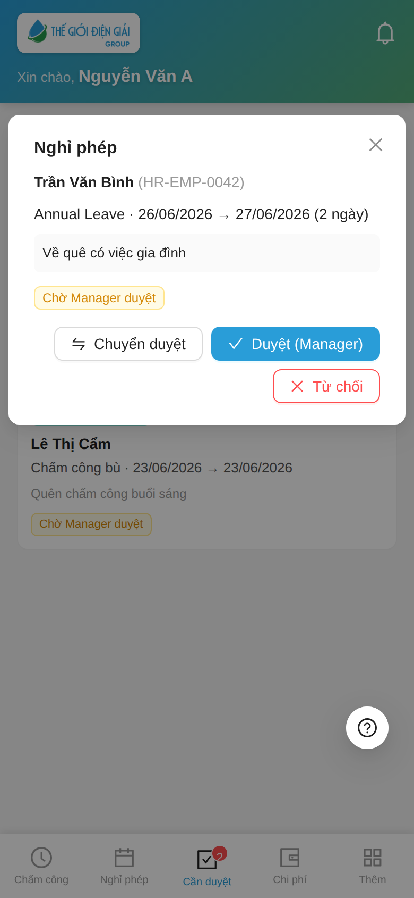
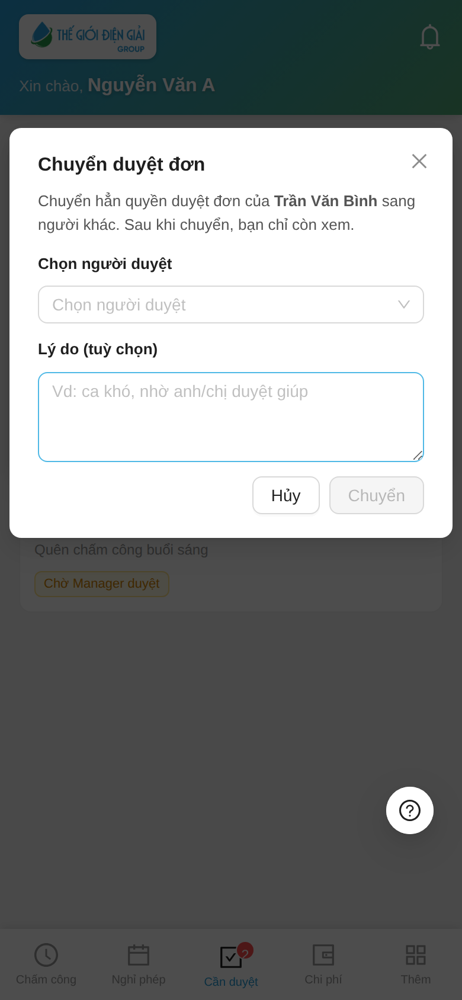

# Trưởng Bộ Phận: Phê duyệt đề nghị
{: .no_toc }

**Dành cho:** Trưởng Bộ Phận / Người duyệt (Leave Approver) · **Thời lượng:** ~2 phút
{: .fs-3 .text-grey-dk-000 }

> Duyệt **đơn nghỉ phép** và **đề xuất chấm công bù** của nhân viên trong phòng, ngay trên điện thoại. Ca khó có thể **chuyển** cho người khác duyệt.

> 📘 Cần **quy trình đầy đủ 2 bước (Manager → HR)** kèm bước HR và duyệt trên Desk? Xem **[Duyệt nghỉ phép & chấm công bù (Manager + HR)](Duyet-Nghi-Phep.html)**.

---

## 1. Mở tab "Cần duyệt"

Thanh dưới có tab **Cần duyệt** (kèm số đề nghị đang chờ). Mở lên thấy danh sách đề nghị của nhân viên trong phòng — lọc theo **Nghỉ phép** / **Chấm công bù**.

> 🔔 Có đề nghị mới → bạn nhận **thông báo đẩy** (nếu đã bật) + badge đỏ trên tab.

---

## 2. Duyệt / Từ chối

Bấm vào 1 đề nghị để xem chi tiết (nhân viên, loại, ngày, lý do) → chọn:

- **Duyệt (Manager)** → đề nghị lên **HR duyệt bước 2**.
- **Từ chối** → đóng đề nghị.
- **Chuyển duyệt** → giao cho người khác (xem mục 3).

---

## 3. Chuyển duyệt (ca khó)

Gặp ca khó / không thuộc thẩm quyền? Bấm **Chuyển duyệt** → chọn **người duyệt khác** (cùng phòng) + nhập lý do → **Chuyển**.

> ⚠️ **Chuyển hẳn quyền**: sau khi chuyển, bạn **chỉ còn xem**; chỉ người nhận mới duyệt được. Người nhận thấy đề nghị trong inbox của họ kèm nhãn **"Chuyển từ …"**.

---

## ⚠️ Lưu ý

| Tình huống | Cách xử |
|---|---|
| Không thấy tab "Cần duyệt" | Bạn chưa có quyền duyệt — báo HR cấp role **Leave Approver** + đúng phòng |
| Forward không thấy ai để chọn | Người nhận phải có role **Leave Approver** + **cùng phòng** với nhân viên |
| Duyệt xong đề nghị vẫn "chờ" | Đó là **bước 1**; đề nghị còn chờ **HR duyệt bước 2** mới chính thức trừ phép |

---

## Liên quan
- [Nhân viên: Cài app & Chấm công](Guide-NhanVien-ChamCong.html) · [Leave Setup (chi tiết workflow + Forward)](HR-Leave-Setup.html)
