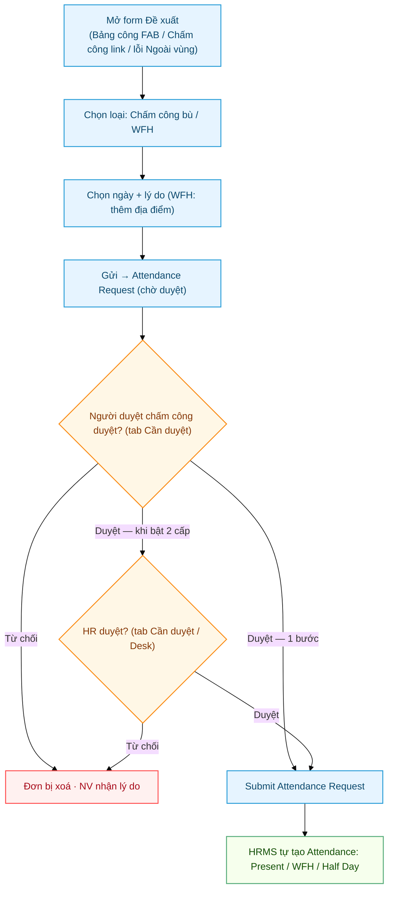

# Attendance Request — Xin chấm công bù (On Duty)

> Doctype HRMS chuẩn. Nhân viên tạo đơn **"Chấm công bù"** qua form **"Đề xuất"** (chọn loại: Chấm công bù / WFH). Form mở từ **3 lối** — cùng component `AttendanceRequestModal`: (1) FAB **"Đề xuất"** trong tab **"Bảng công"**; (2) link **"Đi công tác / làm ngoài? Đề xuất chấm công bù"** dưới nút chấm công ở tab **"Chấm công"**; (3) hộp thoại **"Ngoài vùng văn phòng"** khi check-in bị chặn `OUT_OF_RANGE` (nút **"Tạo đề xuất"**). Người duyệt chấm công duyệt qua tab **"Cần duyệt"** (api.approval.act → submit Attendance Request → HRMS tự tạo Attendance) — **1 bước** theo cấu hình hiện tại; bật được **duyệt 2 cấp** (trưởng bộ phận → HR) ở HR Approval Inbox Settings. Tài liệu này giải thích cách dùng + working_hours được tính ra sao sau khi approve.
>
> **WFH cũng nằm trong form Đề xuất này**: khi feature flag `enable_wfh_mode` (HR Policy)
> được BẬT, mục **"Loại đề xuất"** có thêm lựa chọn **"Làm việc tại nhà (WFH)"** (chọn xong
> nhập thêm địa điểm làm việc). Không còn trang "Đăng ký WFH" riêng. Tắt flag → form chỉ có
> "Chấm công bù / Công tác". Chi tiết flow WFH: xem [Làm việc từ xa (WFH)](HR-WFH-Approval.html).

---

## Sơ đồ quy trình đề xuất



---

## Mục lục

1. [Khi nào dùng](#1-khi-nào-dùng)
2. [Duyệt: 1 bước hoặc 2 cấp](#2-duyệt-1-bước-hoặc-2-cấp)
3. [Working hours được tính ra sao sau approve](#3-working-hours-được-tính-ra-sao-sau-approve)
4. [Cảnh báo `hr_warning_type` trên Attendance](#4-cảnh-báo-hr_warning_type-trên-attendance)
5. [Các case thực tế](#5-các-case-thực-tế)

---

## 1. Khi nào dùng

Attendance Request (đơn "Chấm công bù") dùng cho các tình huống NV **không có / thiếu Employee Checkin log** nhưng cần Attendance hợp lệ:

| Case | reason field |
|---|---|
| NV quên check-in/out | `On Duty` (mặc định) + ghi `explanation` |
| NV đi gặp khách hàng / công tác cả ngày | `On Duty` |
| NV bù chấm công vì sự cố hệ thống | `On Duty` + `explanation` |

> ⚠️ **NGÀY CHỌN quyết định đơn làm gì** (từ 18/09/2026). Đơn có `from_date` từ **hôm nay trở đi**
> là **giấy phép chấm công ngoài văn phòng**: nó tắt kiểm tra vị trí cho ngày đó, và ngày đó
> **chỉ có công khi nhân viên chấm công ít nhất một lần**. Từ 23/09/2026 loại đơn này **cũng tiêu
> hạn mức tháng** như đơn khai bù. Hết ngày không có
> lần chấm nào thì bản Attendance do đơn tạo bị **thu hồi** và nhân viên nhận thông báo ghi rõ ngày
> (`attendance.require_checkin`: job 02:20 quét 7 ngày + kiểm ngay lúc duyệt cho ngày đã qua).
> Đơn khai bù cho **ngày đã qua** thì giữ nguyên cách cũ — duyệt là có công — và đó là đơn duy nhất
> bị **hạn mức tháng** đếm. Luật chỉ áp từ ngày migrate trở đi (patch `v0_045` ghi mốc), không hồi tố.

Khi NV tạo qua PWA (`api.attendance_request.create_attendance_request`), `reason` mặc định = **`On Duty`** → khi manager duyệt, HRMS đánh status **`Present`**. Nếu đơn đánh dấu `half_day` → status `Half Day`.

> **WFH dùng CHUNG đơn này** với `reason = "Work From Home"` (hiện trong form Đề xuất khi
> `enable_wfh_mode` bật). `create_attendance_request` cho phép cả `On Duty` lẫn `Work From Home`;
> `get_my_attendance_requests` trả về mọi reason (kèm `custom_work_location_label`). Flow check-in
> GPS của ngày WFH: xem [Làm việc từ xa (WFH)](HR-WFH-Approval.html).

Ràng buộc khi tạo đơn: một đơn phủ tối đa **31 ngày**, mỗi NV tối đa **10 đơn nháp** chờ
duyệt, đơn **thừa** (mọi ngày đã có Attendance đúng trạng thái) bị chặn từ lúc tạo, và từ
**14/09/2026** có thêm **hạn mức số NGÀY khai bù mỗi tháng**, tính riêng cho **từng loại đơn**
(kể cả WFH, từ 19/09/2026), khai trong `HR Policy` → tab *Hạn mức khai bù* theo **nhân viên /
bộ phận / cả công ty** (trống = tất cả, hẹp thắng rộng, có ngày hiệu lực; loại chưa có dòng nào =
loại đó không giới hạn). Đếm NGÀY chứ không đếm đơn — một đơn phủ tới 31 ngày — và từ 23/09/2026 đếm
**mọi** ngày trong đơn, đã qua hay chưa — xem [Hạn nộp phiếu & ràng buộc §7](HR-Filing-Deadline.html#7-hạn-mức-số-ngày-khai-bù-mỗi-tháng).

> 📅 **Ngày nghỉ trong khoảng đơn CÓ được đánh công** (từ bản cập nhật 09/2026): đơn tạo qua
> app luôn bật `include_holidays`, nên duyệt đơn phủ Chủ nhật/ngày lễ sẽ tạo Attendance
> `Present` cho cả ngày đó — KTV đi làm ngày nghỉ chính là trường hợp cần đơn này nhất.
> Trước đây HRMS lặng lẽ bỏ qua ngày nghỉ lúc duyệt: đơn duyệt xong mà ngày Chủ nhật vẫn
> trắng công, hoặc kẹt `Half Day` 0 giờ nếu nhân viên có check-in nhưng quên check-out.
> Ngày quên một lần chấm trên đơn đã duyệt giữ **giờ ca chuẩn**; check đủ vào/ra thì tiến
> trình nền điền **giờ thật**. Bản chấm công giờ thật do hệ thống tự dựng không bị đơn đè. Đơn cho
**ngày quá khứ** chịu hạn nộp riêng — cột *Hạn nộp đơn chấm công* của bảng **Hạn khai theo
ngày hiệu lực** trong `HR Policy`, xét theo **ngày đầu của đơn**; 0 = không giới hạn (mặc
định). Hạn này áp ở `validate()` của doctype nên PWA, Desk hay API đều chịu chung; role HR
không bị hạn để còn tạo thủ công thay NV. Xem
[Hạn nộp phiếu & ràng buộc](HR-Filing-Deadline.html).

---

## 2. Duyệt: 1 bước hoặc 2 cấp

Chế độ đặt ở **HR Approval Inbox Settings** → dòng *Attendance Request* → cột **Duyệt 2 cấp**
(`two_level_approval`). **Hiện đang tắt = 1 bước** (chốt 17/09/2026).

**1 bước** — như trước 09/2026:

```
NV tạo "Chấm công bù" / WFH → docstatus = 0
  ↓
Người duyệt chấm công → tab "Cần duyệt" → Duyệt (state "Pending", action "Submit") → docstatus = 1
  ↓
HRMS tự tạo / update Attendance records cho khoảng ngày
```

Không có bước HR, không chặn tự duyệt, không chốt submit trên Desk (chỉ còn quyền `submit` của
doctype). Mọi tên action — kể cả `Manager Approve` từ bundle PWA bản 2 cấp — đều là duyệt cuối.

**2 cấp** — khi bật, cùng khuôn với đơn nghỉ phép:

```
NV tạo "Chấm công bù" / WFH (Bảng công FAB / Chấm công link / hộp thoại "Ngoài vùng")
  → docstatus = 0, custom_approval_state = "Pending Manager"
  ↓
Trưởng bộ phận → tab "Cần duyệt" → Duyệt (action="Manager Approve")
  → VẪN docstatus = 0, custom_approval_state = "Manager Approved"
  → ghi custom_manager_approved_by / _on, báo HR
  ↓
HR (người duyệt cuối) → tab "Cần duyệt" → Duyệt (action="HR Approve") → docstatus = 1
  ↓
HRMS tự tạo / update Attendance records cho khoảng ngày
```

Từ chối ở bước nào cũng **xoá đơn nháp** (giữ như trước) và báo nhân viên kèm lý do.

**Không dùng Frappe Workflow** như Leave Application, vì Attendance Request là doctype submittable
của HRMS — submit là tạo Attendance ngay. Workflow của Leave đặt "Rejected" ở docstatus 1; chép
sang đây là từ chối xong lại đi chấm công. Workflow còn chặn mọi `doc.submit()` không đi qua
`apply_workflow`, làm gãy đường HR nhập thay trên Desk. Nên trạng thái bước duyệt nằm ở custom field
`custom_approval_state` (chỉ có nghĩa khi đơn còn là nháp), còn luật ai được bấm thì dùng chung với
đơn làm thêm giờ (`api/approval.py` — `_can_act_two_level`).

| Trường | Ý nghĩa |
|---|---|
| `custom_approval_state` | *Pending Manager* / *Manager Approved*. Đơn nộp trước 09/2026 để trống = *Pending Manager*. Khi thêm cột, migrate điền *Pending Manager* cho **mọi** đơn cũ, kể cả đơn đã duyệt — nên ô này không hiện thành cột trên danh sách và chỉ hiện trên form khi đơn còn nháp |
| `custom_manager_approved_by` / `_on` | Ai duyệt bước 1, lúc nào. HR submit thẳng thì ghi tên HR |

**Lên thẳng bước HR:** ngoài chính nhân viên không còn Shift Request Approver nào dùng được hộp duyệt
(trên Employee lẫn Department; tài khoản đang bật, có role trong `viewer_roles` và `approver_roles`) —
kể cả chưa khai ai — thì đơn được xử như đang ở bước HR dù ô vẫn ghi *Pending Manager*: hiện trong hộp
HR, HR được báo lúc gửi (trừ khi người nộp chính là người duyệt cuối duy nhất), `before_submit` không
hỏi bước 1. Không có nhánh này thì đơn kẹt: người đó không được
tự duyệt bước 1, HR thì không thấy đơn bước 1. Tính lúc đọc (`api.approval._manager_stage_skipped`),
không ghi vào đơn — khai thêm người duyệt là đơn quay về bước 1.

**Chốt ô bước duyệt (hook `validate`, luôn chạy):** Frappe không chặn ô read-only ở server, nên nhân
viên — có quyền ghi đơn của mình — gọi `/api/resource` là tự đặt được *Manager Approved*. Mỗi lần lưu
qua form/REST, ba ô bước duyệt được trả về giá trị trong DB (đơn mới: *Pending Manager*, hai ô kia
trống); chỉ hộp duyệt (`db_set`) và `before_submit` đổi được chúng. Đơn đang *Manager Approved* mà bị
sửa nội dung (`employee`, `company`, ngày, nửa ngày, `reason`, `explanation`, `shift`,
`include_holidays`, `custom_work_location_label`) thì quay về *Pending Manager* — HR chỉ duyệt đúng
nội dung trưởng bộ phận đã xem.

**Chốt ở controller (chỉ khi bật 2 cấp):** hook `before_submit` chỉ cho **người duyệt cuối** (HR Manager có tên trong
danh sách người duyệt cuối của `HR Policy`, hoặc System Manager) submit — đường nào vào cũng dính:
PWA, Desk, bulk. Role *Attendance Request Approver* vẫn có quyền `submit` ở Custom DocPerm từ thời
duyệt một bước, nhưng bấm sẽ bị chặn. Người duyệt cuối submit thẳng một đơn chưa qua bước 1 = làm
luôn bước đó, và bước đó vẫn phải qua luật không tự duyệt đơn của chính mình.

### Cách NV tạo đơn

1. Mở form **"Đề xuất"** (FAB tab Bảng công / link tab Chấm công / hộp thoại "Ngoài vùng văn phòng") → chọn loại
2. Chọn khoảng ngày (`from_date` → `to_date`), nhập lý do (`explanation`)
3. (Tùy chọn) đánh dấu nửa ngày → `half_day`
4. Submit → tạo Attendance Request `docstatus = 0` (`reason = On Duty`)

### Cách duyệt

1. Mở my-workspace → tab **"Cần duyệt"** (đơn hiện qua `api.approval.get_my_pending_approvals`) —
   mỗi người chỉ thấy đơn ở đúng bước của mình
2. Review reason + explanation
3. **1 bước:** bấm **Duyệt** → `action = "Submit"` → `doc.submit()` → HRMS tạo Attendance (status
   `Present`, hoặc `Half Day` nếu đánh dấu nửa ngày)
4. **2 cấp:** trưởng bộ phận bấm **Duyệt (Trưởng bộ phận)** (`action = "Manager Approve"`) → đơn lên
   HR; HR bấm **Duyệt (HR)** (`action = "HR Approve"` — chỉ hợp lệ ở bước HR) → `doc.submit()`. Tên
   cũ `Submit` (bundle PWA cũ) nghĩa là "duyệt ở bước hiện tại", không bao giờ nhảy qua bước HR.

> Phân quyền (từ 07/2026 — commit `6010839`): nếu config `restrict_to_leave_approver = 1`, người
> duyệt AR = **`shift_request_approver`** — helper `_ar_approver_users()` hợp `Employee.shift_request_approver`
> với mọi dòng child table `Department Approver` (`parentfield = shift_request_approver`) của phòng.
> **TÁCH hẳn khỏi `leave_approver`** (nghỉ phép không đổi). HR Manager / System Manager được hàm kiểm
> quyền cho qua, nhưng hộp duyệt chỉ hiện đơn cho đúng người duyệt — HR duyệt thay trên Desk. Khi bật 2
> cấp, đó là người duyệt **bước 1**; bước cuối là người duyệt cuối của `HR Policy`, và Desk submit chỉ
> còn dành cho người duyệt cuối.
> Tab "Cần duyệt" hiện theo role trong **HR Approval Inbox Settings** (`viewer_roles` /
> `approver_roles` của dòng AR, mặc định *Leave Approver, HR Manager, System Manager*). Người duyệt
> còn cần role **`Attendance Request Approver`** (Custom DocPerm: submit, cancel, delete — không có
> write; từ chối trên app là xoá đơn nên cần delete).

### Reject

Người duyệt bấm **Từ chối** (`api.approval.act`): PWA gửi `action = "Manager Reject"` (1 bước và
bước 1 của 2 cấp) hoặc `"HR Reject"` (bước HR). Bundle cũ còn gửi `"Cancel"` / `"Reject"`. Xử lý tuỳ
docstatus của đơn:
- Đơn **Draft** (`docstatus == 0`, đơn còn chờ duyệt) → code gọi **`doc.delete()`** → **XOÁ hẳn** đơn
  (không set docstatus = 2; `cancel()` một draft sẽ lỗi *"Cannot cancel a draft"*).
- Đơn **đã submit** (`docstatus == 1`) → chỉ tên cũ `Cancel` / `Reject` mới thành **`doc.cancel()`**
  (native revert Attendance). `Manager Reject` / `HR Reject` bị từ chối với *"Đơn đã được duyệt xong"* —
  nên người duyệt bấm Từ chối trên màn hình cũ, khi người khác vừa duyệt xong, không huỷ nhầm đơn.
  Thu hồi đơn duyệt nhầm làm trên Desk (**Cancel**).

**Reject bắt buộc kèm lý do** (mục 13): mọi tên từ chối nằm trong `REJECT_ACTIONS` → thiếu `reason`
thì `frappe.throw("Vui lòng nhập lý do từ chối.")`. Lý do được **báo cho nhân viên** kèm thông báo
(dòng *"Lý do: …"*). NV phải tạo đơn Chấm công bù mới nếu muốn lại.

---

## 3. Working hours được tính ra sao sau approve

Khi Attendance Request approve → HRMS tạo/update Attendance records (theo `from_date` đến `to_date`). Tiếp theo hook `Attendance.before_save` của Cobe chạy.

### Sequence chi tiết

```
1. NV check-in chỉ có 1 IN (8:00) hôm nay → forget OUT
2. Process Auto Attendance chạy (15 phút/lần)
   → Tạo Attendance docstatus=1 với:
     - working_hours = 0 (vì thiếu cặp IN+OUT)
     - status = Absent (vì < threshold)
3. NV nhận thấy → submit Attendance Request:
   - from_date = hôm nay, to_date = hôm nay
   - reason = (empty), explanation = "Quên check-out"
4. Manager Submit Attendance Request
5. HRMS update Attendance:
   - status = Present (reason `On Duty` → Present; `half_day` → Half Day)
   - working_hours vẫn = 0 (HRMS không tự re-compute)
6. Hook `Attendance.before_save` của Cobe chạy:
   - _fill_default_working_hours → working_hours = giờ ca chuẩn (vd 9h cho 8:00-17:00)
   - _apply_lunch_break → trừ 60 phút break → working_hours = 8h
   - _set_no_shift_warning → check whitelist / shift
7. Attendance save → working_hours = 8h
```

### Logic ngắn gọn

| Case | working_hours sau approve |
|---|---|
| Đủ IN + OUT (đã đủ log từ trước) | working_hours từ HRMS (logs thực tế) — trừ break nếu first IN trước lunch |
| Chỉ IN, không OUT | working_hours = standard shift hours - lunch break (vd 8h) |
| Chỉ OUT, không IN | working_hours = standard shift hours - lunch break (vd 8h) |
| Không IN + không OUT (quên hoàn toàn) | working_hours = standard shift hours - lunch break (vd 8h) |

→ **Mặc định = standard shift hours** trừ break. Manager có thể edit `working_hours` trên Attendance form nếu muốn override (vd NV chỉ làm half day → set 4h).

### Khi nào hook KHÔNG fill

- `working_hours > 0` từ HRMS (đã có log đủ) → KHÔNG override (giữ giá trị thực tế)
- Status = Absent / On Leave / Half Day → giữ nguyên 0
- Không có Shift Type gắn → không biết giờ chuẩn → giữ 0

---

## 4. Cảnh báo `hr_warning_type` trên Attendance

Khi Attendance được tạo / save, hook `_set_attendance_warning` set `hr_warning_type` theo priority chain (loại trừ nhau):

| Priority | Value | Khi nào set |
|---|---|---|
| 1 (cao nhất) | `Không có ca` | Whitelist KTV không SA / Office không Shift |
| 2 | `Quên check-in` | Có log nhưng chỉ có OUT |
| 2 | `Quên check-out` | Có log nhưng chỉ có IN |
| 3 | `Làm thêm sau giờ` | Có đủ IN+OUT, OUT > shift_end + `notify_overtime_threshold_minutes` |
| — | (clear) | Mọi thứ OK / On Leave / WFH/On Duty từ AR (không log) / no log entire day |

**Tự loại trừ**: 1 Attendance record = 1 warning value. Priority cao thắng. Vd có cả OT lẫn thiếu IN → flag = "Quên check-in".

**Trùng phục hồi**: Hook re-evaluate mỗi lần Attendance save → khi AR approved cập nhật log thiếu → warning tự clear.

### Notification Log đi kèm

Đồng thời với set flag, hook `after_insert` gửi Notification Log (bell icon) cho NV + Manager (`Employee.leave_approver`) — message khác nhau theo warning type:

| Warning | Notification text |
|---|---|
| Không có ca | "Attendance ngày X không có Shift Assignment / Service Appointment. HR cần kiểm tra." |
| Quên check-in | "Bạn quên check-in ngày X. Vui lòng tạo Attendance Request bù." |
| Quên check-out | "Bạn quên check-out ngày X. Vui lòng tạo Attendance Request bù." |
| Làm thêm sau giờ | "Bạn check OUT lúc HH:MM (sau giờ tan ca N phút) ngày X. ... Tạo HR Overtime Request nếu cần tính OT." |

Idempotent: 1 Notification / Attendance / type.

### Scheduled job bổ sung

`notify_forgot_checkin.py` chạy 21:00 mỗi ngày chỉ cover **case "no log entire day"** (NV có Shift Assignment hôm đó nhưng KHÔNG check-in chút nào — hook không thể detect vì Attendance có thể không tồn tại). Hook xử lý mọi case khác real-time.

### Audit nhanh cho HR

Desk → Attendance list → filter `hr_warning_type` để thấy:
- "Quên check-out" → nhân viên cần tạo Attendance Request bù
- "Làm thêm sau giờ" → nhân viên có thể cần tạo OT Request
- "Không có ca" → HR cần config Shift Assignment / FS Service Appointment

---

## 5. Các case thực tế

### Case A: NV đi công tác 3 ngày liên tục (T2-T4)

1. NV tạo "Chấm công bù" (tab Bảng công → nút "Đề xuất"):
   - from_date = T2, to_date = T4
   - reason = `On Duty`
   - explanation = "Công tác Hà Nội gặp khách hàng"
2. Người duyệt chấm công duyệt qua tab "Cần duyệt" (khi bật 2 cấp: thêm bước HR)
3. HRMS tạo 3 Attendance records (T2, T3, T4) với status = Present
4. Hook fill working_hours = 9h (ca 8-17h) - 1h break = 8h cho mỗi ngày
5. Salary Slip kỳ này tính bình thường — 3 ngày Present tương đương

> ⚠️ Đơn này nộp **trước chuyến đi** nên là **giấy phép**: mỗi ngày T2/T3/T4 vẫn phải có **ít nhất một
> lần chấm công** (ở Hà Nội cũng được — đơn đã tắt kiểm tra vị trí). Ngày nào không chấm lần nào thì
> ngày đó bị thu hồi công, muốn tính lại phải gửi **đơn khai bù** cho đúng ngày đó.

> **WFH** (làm tại nhà): chọn loại **"Làm việc tại nhà (WFH)"** ngay trong form Đề xuất này (khi `enable_wfh_mode` bật) — xem [Làm việc từ xa (WFH)](HR-WFH-Approval.html).

### Case B: NV quên check-out

NV tạo "Chấm công bù" cho đúng ngày quên (`from_date = to_date`), `reason = On Duty`, ghi `explanation = "Quên check-out"`. Người duyệt duyệt qua "Cần duyệt" → Attendance status = Present, hook fill working_hours = giờ ca chuẩn - break.

### Case C: NV làm ca chiều (14:00-22:00) — không bị trừ break trưa

1. NV check IN 14:00 + OUT 22:00 → working_hours từ HRMS = 8h
2. Hook `_apply_lunch_break`:
   - first_in_seconds = 14×3600 = 50400
   - lunch_start_seconds = 12×3600 = 43200
   - first_in > lunch_start → KHÔNG trừ
3. working_hours cuối = 8h (giữ nguyên)

### Case D: NV làm 10h liên tục (8:00-18:00) — check OUT muộn 1h sau shift end

Shift: 8:00-17:00 (9h standard).

1. NV check IN 8:00 + OUT 18:00 → HRMS combo First/Last tính raw = 10h
2. Hook `_cap_working_hours_to_shift`:
   - out 18:00 > shift_end 17:00 → cap
   - capped = (17:00 - 8:00) / 3600 = 9h
   - working_hours = 9h (giảm từ 10h)
3. Hook `_apply_lunch_break`: first_in 8:00 < lunch_start 12:00 → trừ 1h
4. working_hours cuối = **8h** (đúng giờ ca chuẩn 8 tiếng)
5. Sau Attendance insert → hook `after_insert._notify_potential_overtime`:
   - out (18:00) - shift_end (17:00) = 60 phút > 30 phút threshold
   - Tạo Notification Log cho NV: "Bạn đã check OUT lúc 18:00 (sau giờ tan ca 60 phút) ngày X. working_hours chỉ tính đến hết giờ ca chuẩn. Nếu cần tính OT, vui lòng tạo HR Overtime Request hoặc liên hệ Manager."
6. NV xem Notification (bell icon) → submit OT Request nếu muốn được tính lương OT

→ working_hours **không bao giờ vượt standard shift hours**. OT auto của HRMS không kick in (intentional).

### Case E: NV check IN/OUT 4 lần (8:00 IN, 12:00 OUT, 13:00 IN, 18:00 OUT)

Cảnh báo: phụ thuộc Shift Type config.

**Nếu Shift combo = `First Check-in and Last Check-out`** (recommended):
- HRMS working_hours = 18-8 = 10h
- Hook trừ break = 9h
- KẾT QUẢ: 9h ✓

**Nếu Shift combo = `Every Valid Check-in and Check-out`**:
- HRMS working_hours = (12-8) + (18-13) = 9h (đã tự trừ break giữa)
- Hook lại trừ break = 8h
- KẾT QUẢ: 8h ✗ DOUBLE-TRỪ

→ Khi bật auto-trừ break trong HR Policy, **PHẢI set Shift Type combo = `First/Last`**.

### Case F: NV làm chỉ 30 phút (đến công tác xong về)

1. NV check IN 9:00 + OUT 9:30 → HRMS = 0.5h
2. Hook trừ break = -0.5h → `max(0, -0.5)` = 0h
3. Threshold absent 1h → status = Absent

→ Nếu Manager thấy bất hợp lý, edit `working_hours` thẳng + edit `status` trên Attendance form.

---

## Liên quan

- [HR Policy — Lunch Break](HR-Policy.html#33-lunch-break)
- [Holiday & Shift Setup](HR-Holiday-Shift-Setup.html)
- [HR Leave Setup](HR-Leave-Setup.html) — workflow 2 bước cho Leave Application (khác AR)
